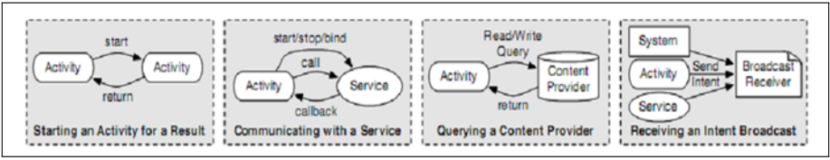

# Android

Trong chương này, các cơ chế và khái niệm cơ bản của hệ thống vận hành di động được trình bày. Android được phát triển bởi Liên minh điện thoại mở và Google và có sẵn từ năm 2008.

## 3.1 Kernel

Android dựa trên hạt nhân tiêu chuẩn Linux 2.6 nhưng được tăng cường với các tiện ích mở rộng mới cho nhu cầu di động.Đây là báo động mô -đun kernel, ASHMEM, chất kết dính, quản lý năng lượng, kẻ giết người có bộ nhớ thấp, trình gỡ lỗi kernel và logger.Chúng tôi sẽ phân tích trình điều khiển Binder trong công việc này, cung cấp một cơ chế IPC mới cho Linux.

## 3.2. Programming Languages

Bốn ngôn ngữ lập trình được sử dụng để phát triển hệ thống: trình biên dịch, C, C ++ và Java.

Kernel có một lượng nhỏ trình biên dịch nhưng chủ yếu được viết bằng C. Một số ứng dụng và thư viện gốc được viết bằng C ++.Tất cả các ứng dụng khác, đặc biệt là các ứng dụng tùy chỉnh, được viết bằng Java.

## 3.3. Java Native Interface

Một sự khác biệt được thực hiện giữa các chương trình được biên dịch cho máy ảo và các chương trình được biên dịch để chạy trên một nền tảng tính toán cụ thể, như Intel X86 hoặc ARM. Các chương trình được biên dịch cho một nền tảng cụ thể được gọi là bản địa. Bởi vì Java được thực thi trong một máy ảo với mã byte của riêng mình, nên không có mã gốc nào có thể được thực thi trực tiếp.Do nhu cầu truy cập cơ chế HĐH cấp thấp như các cuộc gọi kernel, Java phải vượt qua trở ngại này. Điều này được thực hiện bởi giao diện gốc Java (JNI), cho phép Java thực thi mã được biên dịch từ các thư viện được viết bằng các ngôn ngữ khác, ví dụ:C ++.Đây là sự đánh đổi giữa việc đạt được khả năng truy cập hệ thống và giảm mức độ bảo mật trong Java.

## 3.4. Dalvik Virtual Machine

Máy ảo Dalvik (DVM) chạy các ứng dụng được lập trình Java. DVM không tự xưng là máy ảo Java (JVM) vì lý do cấp phép, nhưng đáp ứng cùng một mục đích. Các chương trình Java 5 có thể chạy trong môi trường đó. Mặt trời JVM dựa trên ngăn xếp, bởi vì một máy xếp chồng có thể được chạy trên mọi phần cứng. Độc lập phần cứng và nền tảng là các nguyên tắc thiết kế chính của Java. DVM được đăng ký dựa trên lý do hiệu suất và thích nghi tốt với phần cứng. Đây là một nguyên tắc thiết kế khác nhau, tận dụng sự độc lập của phần cứng đối với hiệu suất cao và mức tiêu thụ năng lượng ít hơn, điều này rất cần thiết cho mục đích di động với khả năng pin hạn chế.Khả năng sử dụng giao diện gốc Java làm suy yếu thuộc tính đảm bảo bảo mật của Java để kiểm tra ngầm giới hạn của các biến và gói gọn các cuộc gọi hệ thống và lực sử dụng các giao diện được xác định của JVM cho hệ thống. Việc sử dụng các thư viện gốc có thể cho phép bỏ qua việc kiểm tra loại và đường viền của máy ảo và mở cửa cho các cuộc tấn công dòng chảy.

Thậm chí đó là một vấn đề bảo mật, JNI rất cần thiết cho cơ chế giao tiếp giữa các phương tiện vì phần mềm trung gian của chất kết dính là thư viện C ++ và phải được truy cập với JNI.

## 3.5. Zygote

Do lý do hiệu suất, DVM chỉ được bắt đầu một lần. Mỗi ví dụ mới của nó được nhân bản. Điều này được thực hiện bởi một dịch vụ hệ thống có tên Zygote. Đầu tiên, nó preinitialize và tải trước các lớp Android phổ biến trong đống của nó. Sau đó, nó lắng nghe trên ổ cắm để các lệnh bắt đầu một ứng dụng Android mới. Khi nhận được lệnh bắt đầu, nó tạo ra một quy trình mới với ứng dụng được tải. Quá trình này trở thành ứng dụng đã bắt đầu và chia sẻ đống với quy trình Zygote ban đầu bằng cách sao chép bản đồ trên các tác phẩm và do đó các trang bộ nhớ của heap Zygote được liên kết với quy trình mới này. Trong khi ứng dụng chỉ đọc từ đống, nó vẫn được chia sẻ. Nhưng khi ứng dụng thực hiện các hoạt động ghi trên đống của nó, trang bộ nhớ tương ứng được sao chép và liên kết được thay đổi thành trang mới. Bây giờ đống có thể được thao tác, mà không điều khiển dữ liệu gốc từ quy trình Zygote cha mẹ.

Khi một ứng dụng Android, nó sử dụng bố cục bộ nhớ của Zygote và ở đó trước bố cục là giống nhau cho mỗi ứng dụng.

## Application Concept

Mỗi ứng dụng Android được sáng tác từ tối đa 4 thành phần khác nhau. Mỗi thành phần có một chủ đề đặc biệt. __Hình 3.1__ trình bày các thành phần dưới dạng sơ đồ lớp phân cấp vì chúng thực sự là các lớp Java.

<figure markdown="span">
    
    <figcaption>Hình 3.1.: Hệ thống thành phần ứng dụng</figcaption>
</figure>


Hoạt động đại diện cho giao diện người dùng của một ứng dụng. Nó chịu trách nhiệm thực hiện màn hình và nhận tương tác được tạo bởi người dùng. Nó không có ý định giữ dữ liệu liên tục vì nó có thể được gửi đến giấc ngủ bởi hệ điều hành nếu một hoạt động khác được đưa ra phía trước.

Đối với mục đích thời gian dài, Android cung cấp thành phần dịch vụ. Tất cả các tác vụ đang chạy trong nền của ứng dụng phải được thực hiện ở đây, vì dịch vụ tiền cảnh chỉ bị dừng nếu hệ thống hết bộ nhớ và các ứng dụng phải được chấm dứt thành bộ nhớ tự do.

Ngay cả khi dịch vụ vẫn tồn tại trong việc thực hiện nhiệm vụ, nó sẽ được khấu hao để giữ dữ liệu liên tục. Đây là chủ đề của nhà cung cấp nội dung, cung cấp một giao diện để truy cập dữ liệu liên tục như tệp hoặc luồng mạng dưới dạng cơ sở dữ liệu giống như SQL. Bộ thu phát sóng là để nhận các tin nhắn rộng hệ thống, tức là thông báo rằng một SMS mới đã được cung cấp cho tất cả các thuê bao. Một cảnh báo mức pin thấp cũng được gửi trên kênh này. Các bản phát sóng xử lý các tin nhắn này và nguyên soái một số hành động nhất định, ví dụ:Lưu trạng thái của một ứng dụng trong khách hàng tiềm năng để tắt máy thiết bị di động sớm.

Bảng kê khai ứng dụng giữ thông tin cho Android về thành phần. Trong tệp này, cấu hình ứng dụng cơ bản được đặt. Ví dụ: nếu một dịch vụ bắt đầu trong quy trình riêng của mình hoặc nếu nó được gắn vào quy trình cục bộ. Liệt kê 3.1 đưa ra một ví dụ về tệp XML Ứng dụng Android.

```xml
<?xml version=” 1.0 ” encoding=” utf −8”?>
<manifest xmlns : android=”http://schemas.android.com/apk/res/android”
    package=”com . msi . manning . binder ”>
    <application android : icon=”@drawable/ icon ”>
        <activity android: name=”.ActivityExample” android:label=”@string/appname”>
            <intent−filter>
                <action android:name=”android.intent.action.MAIN”/>
                <category android:name=”android.intent.category.LAUNCHER” />
            </intent−filter>
        </activity >
        <service android:name=”.SimpleMathService” android:process=”:remote”>
            </intent−filter android:priority=”25”>
                <action android:name=”com.msi.manning.binder.ISimpleMathService ”></action>
            </intent−filter>
        </service >
    </application >
</manifest>
```

<div style="text-align: center;">Listing 3.1: Example Manifest</div>

## 3.7. Component Communication Concepts

Vì các thành phần khác nhau phải trao đổi dữ liệu, điều này được thực hiện thông qua giao tiếp giữa các thành phần hoặc giao tiếp giữa các quá trình, nếu các thành phần cụ thể thuộc về các quy trình (ứng dụng) khác nhau.

Việc giao tiếp làm việc với cái gọi là ý định. Đây là những đại diện cho các hoạt động được thực hiện. Một ý định về cơ bản là một cơ sở hạ tầng chứa một URI và một hành động. URI xác định duy nhất một thành phần ứng dụng và hành động xác định hoạt động sẽ được thực thi.

Mục đích này được gửi bởi hệ thống truyền thông liên tục.__Hình 3.2__ đưa ra một cái nhìn tổng quan về các hình thức tương tác thành phần khác nhau. Một hoạt động được bắt đầu bởi một ý định và có thể đưa một hoạt động khác ra phía trước. Một dịch vụ có thể được bắt đầu, dừng lại và bị ràng buộc bởi IPC.Ngoài ra, các phương thức gọi và trả lại được IPC thực hiện.

Một nhà cung cấp nội dung có thể được truy vấn bởi một hoạt động thông qua IPC và trả về kết quả tương ứng. Các tệp mã nguồn Android cho thấy việc sử dụng rộng rãi IPC để trao đổi dữ liệu trừu tượng.

Một máy thu phát sóng nhận được tất cả các ý định (ví dụ: tin nhắn) nó đã được đăng ký thông qua IPC.

<figure markdown="span">
    
    <figcaption>Hình 3.2 .: Hệ thống thành phần ứng dụng</figcaption>
</figure>

Tại thời điểm này, tầm quan trọng của cơ chế IPC trở nên rõ ràng. Hệ điều hành Android với khung của nó là một hệ thống phân tán và công nghệ chính và chính để đạt được thiết kế đó là cơ chế Binder Binder.

## 3.8. Security Concept

Cơ chế bảo mật trong Android bao gồm ba lớp. Lớp cơ bản bao gồm một sự phân chia bộ nhớ liên tục trong hai phân vùng, được gọi là hệ thống và dữ liệu. Phân vùng hệ thống được gắn như chỉ đọc để ngăn chặn thao tác dữ liệu hệ thống. Phân vùng dữ liệu là nơi có thể lưu trữ các trạng thái ứng dụng và dữ liệu liên tục. Lưu ý rằng phân vùng hệ thống có thể được kể lại ở chế độ ghi bởi ứng dụng App Store để cài đặt các ứng dụng mới.

Để tách các ứng dụng với nhau, mô hình Linux kiểm soát truy cập tùy ý (DAC) được sử dụng. Mỗi ứng dụng có ID người dùng và ID nhóm duy nhất và chỉ có thể truy cập vào thư mục của riêng mình. Chỉ các ứng dụng từ cùng một tác giả chạy trong cùng một ID người dùng và có thể truy cập dữ liệu của họ. Tất cả các ứng dụng phải được tác giả ký hợp đồng để ngăn chặn thao tác dữ liệu và để xác định tác giả.Vì vậy, hệ thống có thể xác định xem các ứng dụng có phải là từ cùng một tác giả và có thể chạy theo một UID hay không.

Vì mô hình Linux DAC chỉ cho phép một mức độ kiểm soát truy cập thô sơ, đối với các quyền trung gian được tạo thành tốt, phần mềm trung gian Android, cung cấp một hệ thống nhãn quyền thực hiện mô hình Điều khiển truy cập bắt buộc (MAC).Hệ thống này dựa trên một tập hợp các quyền và một tập hợp các dịch vụ xuất khẩu bao gồm các hạn chế truy cập.

Đối với mỗi hành động được thực hiện trên hệ điều hành, một nhãn quyền tồn tại. Vào thời điểm cài đặt, ứng dụng yêu cầu người dùng cho một bộ quyền, người dùng có sự lựa chọn giữa việc cấp tất cả các quyền được yêu cầu hoặc hủy bỏ việc cài đặt. Sau khi được cấp vào thời điểm cài đặt, không bao giờ có thể loại bỏ quyền Gỡ cài đặt ứng dụng.

Mỗi ứng dụng có thể chỉ định một bộ lọc ý định, cơ chế danh sách màu trắng, xác định các loại ý định mà các thành phần của ứng dụng sẽ nhận được. Ý định không được liệt kê sẽ được lọc ra bởi màn hình tham chiếu.

Một vấn đề là các ứng dụng của một tác giả có thể giao tiếp tự do vì cùng một UID và GID. Điều đó có nghĩa là, nếu nhiều ứng dụng từ cùng một tác giả được cài đặt trên điện thoại, các quyền khác nhau của mỗi ứng dụng tích lũy thông qua tài sản chuyển tiếp. Ứng dụng A yêu cầu ứng dụng B của cùng một tác giả thực hiện một hành động, trong đó ứng dụng A không có quyền nhưng ứng dụng B. Vì vậy, ứng dụng B sở hữu các quyền không được người dùng cấp cho ứng dụng chuyên dụng này.