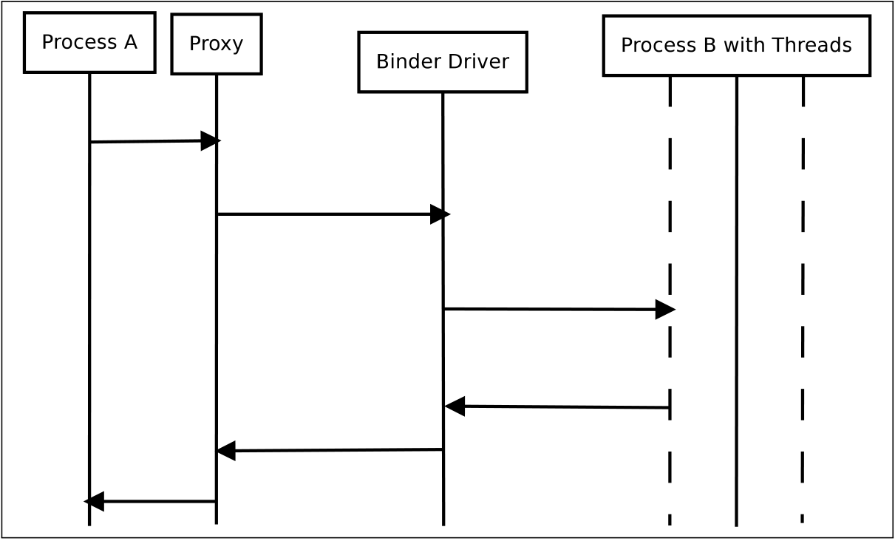

# 4. Binder

Chương này giải thích chất kết dính là gì và khả năng của nó là gì.Giải thích bao gồm một cấp độ trừu tượng, mà không đi vào chi tiết thực hiện.Chúng được xử lý trong chương tiếp theo.

## 4.1. Origin

Binder ban đầu được phát triển dưới cái tên OpenBinder của Be Inc và sau đó là Palm Inc dưới sự lãnh đạo của Dianne Hackborn.Tài liệu của nó tuyên bố OpenBinder là ... một kiến trúc thành phần cấp hệ thống, được thiết kế để cung cấp sự trừu tượng cao hơn trên các dịch vụ hệ điều hành hiện đại truyền thống.

Hoặc cụ thể hơn, chất kết dính có cơ sở để cung cấp các ràng buộc cho các chức năng và dữ liệu từ môi trường thực hiện này sang môi trường khác.Các hoạt động mở rộng của OpenBinder chạy theo Linux và mở rộng các cơ chế IPC hiện có.Tài liệu của OpenBinder nói rằng ... mã đã chạy trên một loạt các nền tảng khác nhau, bao gồm BEO, Windows và Palmos Cobalt.

Binder in Android là một triển khai tùy chỉnh của OpenBinder.Trong phát hành Android, M3, phần trình điều khiển kernel ban đầu từ OpenBinder đã được sử dụng, nhưng phần không gian người dùng phải được viết lại do giấy phép của OpenBinder Being không tương thích với giấy phép Android.Trong bản phát hành Android, M5, trình điều khiển cũng được viết lại.Các khái niệm cốt lõi vẫn giữ nguyên, nhưng nhiều chi tiết đã thay đổi.

Mã OpenBinder ban đầu không còn được phát triển.Nhưng ở một mức độ nào đó, việc tái tạo lại Android có thể được coi là một nhánh, được duy trì bởi các nhà phát triển Android.Vì vậy, OpenBinder đã sống sót trong Android Binder.

## 4.2. Binder Terminology

The Binder framework uses its own terminology to name facilities and components. This section summarizes the most important terms, the details are discussed in the later sections.

__Binder__ 
&emsp;Thuật ngữ này được sử dụng mơ hồ.Chất kết dính đề cập đến kiến trúc chất kết dính tổng thể, trong khi chất kết dính đề cập đến một triển khai cụ thể của giao diện chất kết dính.

__Binder Object__ 
&emsp; là một ví dụ của một lớp thực hiện giao diện chất kết dính.Một đối tượng chất kết dính có thể thực hiện nhiều chất kết dính.

__Binder Protocol__ 
&emsp; Phần mềm trung gian Binder sử dụng một giao thức cấp rất thấp để kết hợp với trình điều khiển.

__IBinder Interface__ 
&emsp; Giao diện chất kết dính là một tập hợp các phương thức, thuộc tính và sự kiện được xác định rõ mà một chất kết dính có thể thực hiện.Nó thường được mô tả bởi ngôn ngữ AIDL1.

__Binder Token__ 
&emsp; Một giá trị số xác định duy nhất một chất kết dính.

## 4.3. Facilities

Khung chất kết dính cung cấp nhiều hơn một hệ thống nhắn tin liên lạc đơn giản.Các cơ sở được liệt kê trong Hình 4.1

<figure markdown="span">
    
    <figcaption>Hình 4.1: Các cơ sở chất kết dính</figcaption>
</figure>

Sự cải thiện quan trọng nhất từ quan điểm của lập trình viên ứng dụng Android là các phương thức trên các đối tượng từ xa có thể được gọi như thể chúng ở nơi các phương thức đối tượng cục bộ.Điều này đạt được với một cuộc gọi phương thức đồng bộ.Theo đó, quy trình máy khách gọi bị chặn trong suốt thời gian trả lời của máy chủ.Để có lợi thế, khách hàng không cần cung cấp một phương thức đe dọa cho thông báo trả lại không đồng bộ từ máy khách.

Điều này có liên quan đến cơ sở của khung Binder để gửi tin nhắn một và hai chiều và bắt đầu và dừng các luồng.

Đó là một tính năng của AIDL, do đó được giải quyết ở cấp độ cao hơn, rằng một ứng dụng không cần biết liệu một dịch vụ đang chạy trong quy trình máy chủ hay trong quy trình cục bộ.Khái niệm ứng dụng Android, cho phép chạy một dịch vụ trong một quy trình riêng hoặc trong quá trình hoạt động.Điều này giúp một nhà phát triển ứng dụng dễ dàng xuất các dịch vụ xuất khẩu sang các ứng dụng Android khác mà không cần xem xét mã.

Android _System Service_ sử dụng tính năng thông báo đặc biệt của chất kết dính, được gọi là cơ chế liên kết đến tử vong.Cơ sở này cho phép các quy trình được thông báo khi kết thúc của một quy trình nhất định bị chấm dứt.Cụ thể, đây là cách Trình quản lý cửa sổ Android thiết lập một liên kết đến mối quan hệ tử vong với giao diện Binder gọi lại của mỗi cửa sổ, để được thông báo nếu đóng cửa sổ.

Mỗi chất kết dính có thể nhận dạng duy nhất, điều đó có nghĩa là nó có thể hoạt động như mã thông báo được chia sẻ.Theo giả định, chất kết dính không được công bố thông qua Trình quản lý dịch vụ, nhận dạng chất kết dính chỉ được biết bởi các bên liên quan, bao gồm quy trình từ xa, quy trình địa phương và hệ thống.Do đó, một chất kết dính có thể được sử dụng làm mã thông báo truy cập bảo mật.Mã thông báo cũng có thể được chia sẻ trên nhiều quy trình.

Một tính năng bảo mật khác là một quy trình callee có thể xác định quy trình người gọi của anh ta bằng UID và PID.Kết hợp với mô hình bảo mật Android, một quy trình có thể được xác định.Một tính năng khác, nhưng trong công việc này không được phân tích, là cơ chế bộ nhớ được chia sẻ, trong đó thông qua khung Binder có thể được chia sẻ một đống.

Tóm tắt, chất kết dính và khung của nó hỗ trợ nhiều tính năng để đảm bảo giao tiếp giữa các phương tiện định hướng đối tượng tốt.

## 4.4. Concepts

Phần này mô tả các khái niệm đằng sau các cơ sở.Do thiếu một tài liệu có sẵn công khai, chúng chủ yếu có nguồn gốc bằng cách xem xét mã nguồn.

### 4.4.1. Communication Model

Truyền thông khung Binder là một mô hình máy chủ máy khách.Một khách hàng sẽ bắt đầu giao tiếp và chờ phản hồi từ máy chủ.Khung Binder sử dụng proxy phía máy khách để giao tiếp.Về phía máy chủ, một nhóm chủ đề tồn tại để làm việc theo yêu cầu.Trong Hình 4.2 Quy trình A là máy khách và giữ đối tượng proxy thực hiện giao tiếp với trình điều khiển hạt nhân.Quá trình B là quá trình máy chủ, với nhiều luồng chất kết dính.Khung chất kết dính sẽ sinh ra các luồng mới để xử lý tất cả các yêu cầu đến, cho đến khi đạt được số lượng tối đa bị phạt.Các đối tượng proxy đang nói chuyện với trình điều khiển chất kết dính, sẽ gửi thông điệp đến đối tượng định mệnh.

<figure markdown="span">
    
    <figcaption>Hình 4.2 .: Giao tiếp về chất kết dính trừu tượng</figcaption>
</figure>

### 4.4.2. Transactions

Nếu một quá trình gửi dữ liệu đến một quy trình khác, nó được gọi là giao dịch.Cùng với mỗi dữ liệu tải trọng truyền được gửi.Dữ liệu được gọi là dữ liệu giao dịch.

Cấu trúc của dữ liệu được hiển thị trong Hình 4.3.Nó chứa một mục tiêu, đó là một nút chất kết dính đích.Trường Cookie được sử dụng cho thông tin nội bộ.Trường ID người gửi chứa thông tin liên quan bảo mật.Trường dữ liệu chứa một mảng dữ liệu tuần tự hóa.Một mục nhập mảng bao gồm một lệnh và các lập luận của nó, được phân tích cú pháp thông qua chất kết dính.Một ứng dụng trên đỉnh của khung Binder hiện có thể xác định các lệnh riêng và tùy thuộc vào các đối số đó.Như có thể thấy trong các mã nguồn Android có nguồn gốc từ AIDL, các nhà phát triển, việc sử dụng các dịch vụ từ xa sử dụng trường lệnh đích làm một con trỏ chức năng và tuần tự hóa các đối số của nó vào trường đối số tương ứng với tự nhiên.Ngoài thực tế này, khái niệm tạo điều kiện thực hiện giao thức IPC do người dùng xác định.Truyền thông Binder đang dựa vào một yêu cầu và cơ chế trả lời.Thực tế này giới hạn việc thực hiện, có nghĩa là mỗi yêu cầu phải có trả lời và quá trình yêu cầu phải chờ nó.Nó bị chặn trong thời gian chờ đợi và không thể tiến hành.Để thực hiện một giao thức IPC không đồng bộ, nói chung, một nhà phát triển phải chú ý đến thực tế này.Nếu một nhà phát triển cần IPC không chặn, anh ta phải thực hiện một cơ chế quản lý chỉ định câu trả lời cho yêu cầu của nó.Binder không cung cấp tính năng không đồng bộ này.

<figure markdown="span">
    
    <figcaption>Hình 4.3: Dữ liệu truyền tải</figcaption>
</figure>

Do đó, một giao dịch ngụ ý hai tin nhắn, yêu cầu giao dịch và câu trả lời của nó.Phần truyền thông một chiều của phần Binder được giới hạn ở các tính năng nội bộ như thông báo tử vong.

### 4.4.3. Parcels and Marshaling

Trong một chế độ xem hướng đối tượng, dữ liệu giao dịch được gọi là bưu kiện.Cụ thể, đây là cấu trúc dữ liệu truyền.Bất kỳ đối tượng nào, có thể được truyền từ xa, phải thực hiện giao diện có thể chia sẻ.Một đối tượng, thực hiện giao diện này phải cung cấp các phương thức, mà tuần tự hóa cấu trúc dữ liệu của một đối tượng ở phía người gửi và khôi phục nó ở phía người nhận.Tất cả thông tin phải được giảm xuống thành các loại dữ liệu đơn giản như int, float, boolean và chuỗi chuỗi.Thông tin một phần này được viết nối tiếp vào một bưu kiện của người gửi và được người nhận đọc và xây dựng lại.

Thủ tục xây dựng một bưu kiện được gọi là sắp xếp hoặc làm phẳng một đối tượng.Đảo ngược, quy trình xây dựng lại một đối tượng từ một bưu kiện được gọi là không chính xác hoặc không thể xử lý được một đối tượng.

Không thể sử dụng các phương tiện chia sẻ bộ nhớ của Binder bởi các ứng dụng trình bao bọc API Java, chỉ các thư viện C ++ gốc có thể có quyền truy cập vào các lần lặp lại đối tượng được chia sẻ trong bộ nhớ.

### 4.4.4. Death Notification

Khung chất kết dính hỗ trợ thông báo về cái chết của các đối tượng chất kết dính.Điều này được nhận ra bởi một mô hình quan sát viên.Một đối tượng chất kết dính cục bộ, rất thích để biết về việc chấm dứt đối tượng chất kết dính từ xa tự thêm vào danh sách người quan sát.Nếu sự kiện xảy ra rằng một quá trình giữ cho đối tượng chất kết dính từ xa bị chấm dứt, đối tượng cục bộ sẽ được thông báo và có thể phản ứng.Hình 4.4 đã được xuất viện từ mã nguồn và là một biểu đồ dòng chảy và trực quan hóa mẫu.

<figure markdown="span">
       
    <figcaption>Hình 4.4: Thông báo tử vong của chất kết dính</figcaption>
</figure>

## 4.5. Context Manager

Trình quản lý bối cảnh là một nút chất kết dính đặc biệt của khung Binder.Đó là chất kết dính với số 0. Nó đóng vai trò là hệ thống tên và có thể gán tên cho giao diện chất kết dính.Điều này rất quan trọng, bởi vì các máy khách có thể không biết chất kết dính từ xa địa chỉ một tiên nghiệm.Nếu khách hàng biết địa chỉ chất kết dính từ xa, tính năng mã thông báo bảo mật của chất kết dính sẽ không hoạt động.Nhưng nếu không có địa chỉ đối tác từ xa nào được biết, không có giao tiếp ban đầu nào có thể xảy ra, bởi vì mỗi giao diện Binder chỉ biết địa chỉ của chính mình.Trình quản lý bối cảnh giải quyết vấn đề này, có giao diện chất kết dính duy nhất với địa chỉ chất kết dính cố định và ưu tiên.Việc triển khai Trình quản lý bối cảnh không phải là một phần của khung Binder.Trong Android Việc triển khai Trình quản lý bối cảnh được gọi là Trình quản lý dịch vụ.Mỗi chất kết dính cần xuất bản tên của mình do là một dịch vụ, gửi tên và mã thông báo chất kết dính của nó cho Trình quản lý dịch vụ.Dựa vào tính năng đó, máy khách chỉ phải biết tên của dịch vụ và yêu cầu người quản lý dịch vụ cho địa chỉ chất kết dính của dịch vụ được yêu cầu.

## 4.6. Intents

Một ý định là một thông điệp, mà nhà phát triển sử dụng trên lớp API Java và được gửi với IPC Binder.Đây là một đại diện trừu tượng của một hoạt động được thực hiện.Tóm tắt Tóm tắt có nghĩa là người thực hiện hoạt động mong muốn không phải được xác định trong mục đích.Ý định giữ thông tin chính là một hành động và trường dữ liệu.Hình 4.5 đưa ra một ví dụ về ý định.Mục đích này được cung cấp bởi màn hình tham chiếu ý định cho chất kết dính được gán cho quay số hành động hành động, ví dụ:ứng dụng điện thoại.Dịch vụ này sẽ quay số, được lưu trữ trong ứng dụng liên hệ dưới tên đã cho.

<figure markdown="span">
    
    <figcaption>Hình 4.5: Ý định</figcaption>
</figure>

Có hai hình thức ý định.Một ý định rõ ràng địa chỉ đến một thành phần cụ thể.Mặt khác, một ý định ngầm đưa ra quyết định cho hệ thống Android, thành phần nào được giải quyết.Nếu nhiều thành phần cho một mục đích được cài đặt, hệ thống sẽ chọn thành phần tốt nhất để chạy mục đích.

## 4.7. System Integration

Chất kết dính được sử dụng rộng rãi trong nền tảng Android.

Bất cứ khi nào hai quá trình phải giao tiếp, Binder có liên quan.Ví dụ, dữ liệu trao đổi cửa sổ với khách hàng của mình qua khung Binder.Nó cũng sử dụng tính năng Thông báo tử vong của Binder để được thông báo khi ứng dụng khách hàng chấm dứt.Vì vậy, chất kết dính kết nối kiến trúc phân tán của hệ điều hành Android và vì đây là một mô -đun thực sự quan trọng.

## 4.8. Security Model

Mô hình bảo mật chất kết dính là rất cơ bản nhưng hiệu quả.Nó đảm bảo một kênh an toàn để liên lạc với hai quy trình và đảm bảo việc xác định các đối tác truyền thông bằng cách cung cấp thông tin như số PID và số UID.

Một tính năng khác đi kèm với ý định là bộ lọc ý định.Đây là một tuyên bố cho một dịch vụ hoặc ứng dụng, mà ý định được hệ thống chuyển tiếp đến dịch vụ hoặc ứng dụng này.Nhưng nó không đảm bảo bảo mật cho tất cả các ý định, bởi vì bộ lọc ý định có thể được bỏ qua bởi ý định rõ ràng.Trong hậu quả cuối cùng, bảo mật phụ thuộc vào việc kiểm tra PID và UID như được trình bày ở trên.