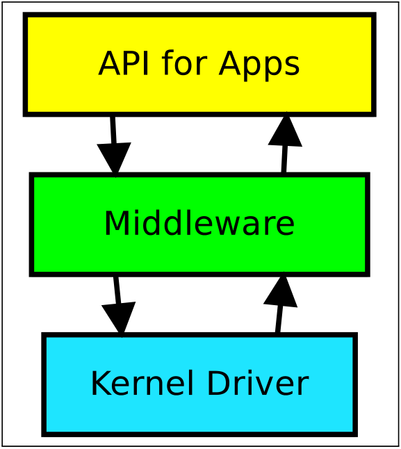
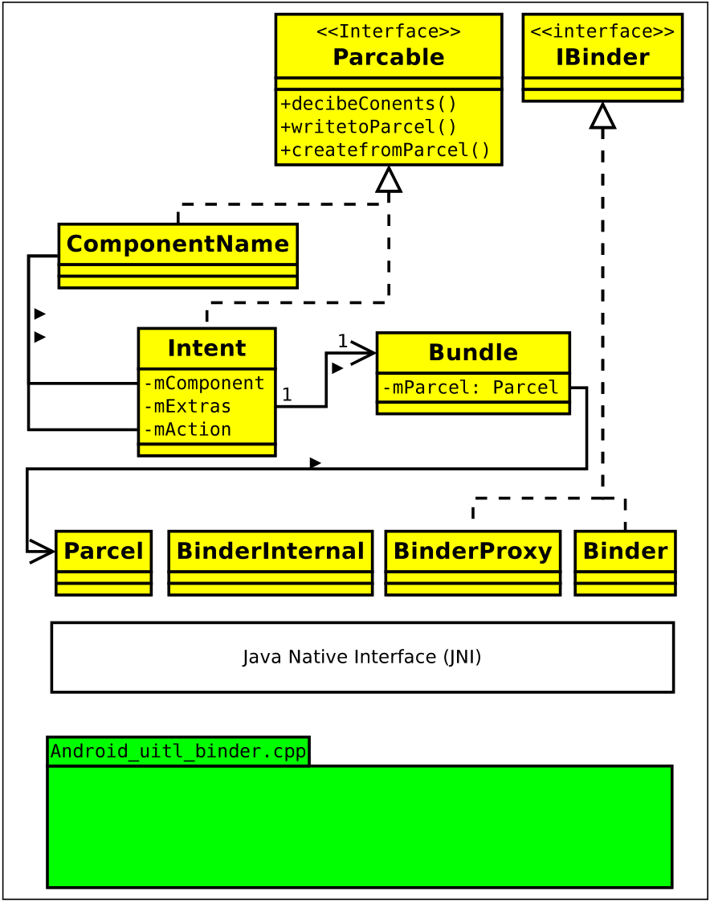
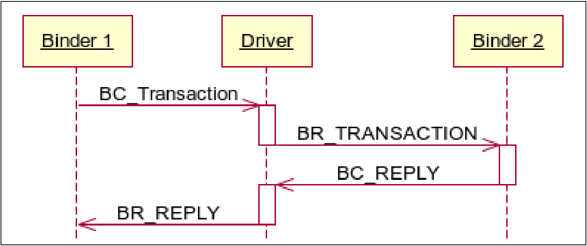
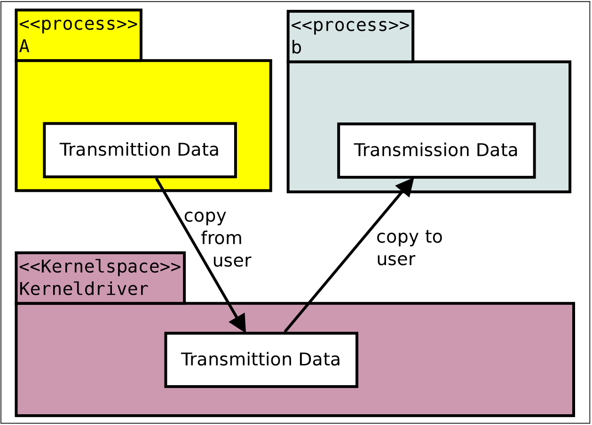

# 5. Implementation of the Binder Framework

Chương này cung cấp một cái nhìn tổng quan về việc thực hiện khung công trình.Đối với mỗi lớp, các tệp mã nguồn được liệt kê và mục đích của nó được thảo luận.Ngoài ra, AIDL được trình bày, đây là một tính năng triển khai vì nó tạo ra mã Java và do đó có thể được xem như là một phần của khung Binder.

<figure markdown="span">
    
    <figcaption>Hình 5.1 .: Hệ thống IPC</figcaption>
</figure>

Hình 5.1 trình bày các lớp khác nhau của khung chất kết dính.Nó bao gồm ba lớp.Lớp đầu tiên và cao nhất là API cho các ứng dụng Android.Lớp thứ hai là phần mềm trung gian giữ cho việc triển khai không gian người dùng của khung Binder.Lớp thứ ba và thấp nhất là trình điều khiển kernel.

## 5.1. AIDL

___Android interface definition language___ (AIDL) là một phần của SDK Eclipse, được cung cấp bởi Google.Mục đích chính của nó là để giảm bớt việc thực hiện các dịch vụ từ xa Android.AIDL theo một cú pháp như Java.

In the AIDL file the developer defines an interface with the method signatures of the remote service.The AIDL parser generates a Java class from the interface, that can be used for two different purposes.Đầu tiên, nó tạo ra một lớp proxy để cung cấp cho máy khách quyền truy cập vào dịch vụ, thứ hai nó tạo ra một lớp sơ khai có thể được sử dụng bởi triển khai dịch vụ để mở rộng nó sang một lớp ẩn danh với việc triển khai các phương thức từ xa.

Ngôn ngữ AIDL chỉ hỗ trợ các loại dữ liệu cơ bản.Nó tạo ra mã chăm sóc việc viết các giá trị vào các bưu kiện, gửi chúng qua Binder IPC, nhận chúng, đọc các giá trị và gọi các phương thức dịch vụ và viết và gửi lại kết quả.

Tệp AIDL phải được chia sẻ giữa nhà phát triển ứng dụng dịch vụ từ xa và nhà phát triển ứng dụng khách.Vì trình tạo AIDL tạo mã nguồn cho khách hàng và dịch vụ từ xa trong một tệp, mỗi ứng dụng chỉ sử dụng và khởi tạo một tập hợp con của các lớp được tạo.

## 5.2. Java API Wrapper

Phần này thảo luận về khung Java, hoạt động trên đầu phần mềm và trình điều khiển kernel.Các lớp và giao diện nguồn này thuộc về lớp API Java:

Interfaces:

```text
android.app.IActivityManager
    android.os.Parcable
    andorid.os.IBinder
android.content.ServiceConnection
```

Classes:

```txt
android.app.ActivityManagerNative
android.app.ContextImpl
android.content.Intent
android.content.ComponentName
android.os.Parcel
android.os.Bundle
android.os.Binder
android.os.BinderProxy
com.android.internal.os.BinderInternal
```

Lớp Java của khung Binder có hai chức năng.Một chức năng là gói lớp phần mềm trung gian phụ, để cho phép các ứng dụng Android tham gia vào giao tiếp Binder.Là một chức năng thứ hai, nó giới thiệu các cơ sở cho khung Binder, cụ thể là việc sử dụng ý định.

Hình 5.2 trình bày các lớp Java chính và các phụ thuộc của nó.

<figure markdown="span">
    
    <figcaption>Hình 5.2 .: Hệ thống Java</figcaption>
</figure>

### 5.2.1. JNI Wrapper

Lớp API Java dựa vào phần mềm trung gian.Để sử dụng phần mềm trung gian được viết C ++ từ Java, JNI phải được sử dụng.Trong tệp mã nguồn `frameworks/base/core/jni/android` cho đế __Binder.cpp__, ánh xạ giữa chức năng Java và C ++ được thực hiện.

### 5.3. C++ Middleware

Phần mềm trung gian thực hiện các cơ sở không gian người dùng của khung Binder và được viết bằng C ++.Khung cung cấp các phương thức và cấu trúc kiểm soát quy trình và luồng cần thiết để sinh sản và quản lý các luồng mới để làm việc theo yêu cầu.Các cơ sở sắp xếp và không kết nối được triển khai ở đây, để thông tin đối tượng có thể được chuyển đổi thành một mảnh dữ liệu có thể gửi được.Phần mềm trung gian cung cấp sự tương tác với trình điều khiển hạt nhân Binder và thực hiện bộ nhớ được chia sẻ.

Các dịch vụ hoặc ứng dụng được viết bằng C ++ gốc có thể sử dụng trực tiếp khung Binder, nhưng phải từ bỏ các tính năng được triển khai trong lớp API Java.Mã nguồn được chứa trong các tệp sau:

```txt
frameworks/base/include/utils/IInterface.h
frameworks/base/include/utils/Binder.h
frameworks/base/include/utils/BpBinder.h
frameworks/base/include/utils/IBinder.h
frameworks/base/include/utils/Parcel.h
frameworks/base/include/utils/IPCThreadState.h
frameworks/base/include/utils/ProcessState.h
frameworks/base/libs/utils/Binder.cpp
frameworks/base/libs/utils/BpBinder.cpp
frameworks/base/libs/utils/IInterface.cpp
frameworks/base/libs/utils/ProcessSTate.cpp
frameworks/base/libs/utils/IPCThreadState.cpp
```

## 5.4. C Kernel Driver

Trình điều khiển hạt nhân là trái tim của khung chất kết dính.Tại thời điểm này, việc gửi tin nhắn đáng tin cậy và an toàn phải được đảm bảo.Trình điều khiển kernel là một mô -đun hạt nhân nhỏ và được viết bằng C. Mô -đun trình điều khiển được xây dựng từ các tệp nguồn:

```bash
/drivers/staging/android/binder.c
/drivers/staging/android/binder.h
```

Trình điều khiển Kernel Binder hỗ trợ các hoạt động tệp mở, MMAP, Phát hành, Thăm dò ý kiến và hệ thống gọi IOCTL.Các hoạt động này đại diện cho giao diện mà các lớp cao hơn truy cập trình điều khiển chất kết dính.Hoạt động Binder Open thiết lập kết nối với trình điều khiển Binder và gán nó bằng con trỏ tệp Linux, trong khi thao tác phát hành đóng kết nối.Hoạt động MMAP là cần thiết để ánh xạ bộ nhớ chất kết dính.Hoạt động chính là hệ thống gọi IOCTL.Các lớp cao hơn gửi và nhận tất cả thông tin và tin nhắn bằng hoạt động đó.Hoạt động của IOCTL lấy mã lệnh trình điều khiển Binder và bộ đệm dữ liệu.Các lệnh này là:

- `BINDER WRITE READ` là lệnh quan trọng nhất, nó gửi một loạt dữ liệu truyền.Sê -ri bao gồm nhiều dữ liệu như được mô tả trong Hình 4.3.
- `BINDER SET MAX THREADS` Đặt số lượng luồng tối đa cho mỗi quá trình để làm việc theo yêu cầu.
- `BINDER SET CONTEXT MGR` Đặt trình quản lý bối cảnh.Nó chỉ có thể được đặt một lần thành công và theo mô hình phục vụ đầu tiên đến đầu tiên.
- `BINDER THREAD EXIT`Lệnh này được gửi bởi phần mềm trung gian, nếu một luồng chất kết dính thoát ra.
- `BINDER VERSION`Trả về số phiên bản Binder.

Các cơ sở được triển khai trong trình điều khiển Binder được thảo luận trong các phần tiếp theo.Các lệnh được sử dụng trong phần này là các lệnh đích.Ngay cả khi tên là lệnh đích, một số lệnh này được áp dụng cho chất kết dính cục bộ.Trong tài liệu OpenBinder, chúng được gọi là Giao thức trình điều khiển Binder.Các mã có sẵn được thảo luận như sau và bắt đầu với tiền tố BC cho lệnh Binder.Binder Diver nói lại với các mã bắt đầu bằng tiền tố BR cho sự trở lại của chất kết dính.


#### 5.4.1. Hỗ trợ chủ đề Binder

Vì trình điều khiển kernel không thực hiện cơ chế bắt đầu luồng, nên nó phải là Luôn cập nhật về số lượng chủ đề được bắt đầu.Các lệnh này được gửi như vậy Trình điều khiển chất kết dính đó có thể có số lượng chính xác số lượng các luồng vòng lặp có sẵn.Các lệnh đích là `BC REGISTER LOOPER`, `BC ENTER LOOPER` Và `BC EXIT LOOPER`. Các lệnh này dành cho sổ sách kế toán và được định sẵn cho Binder địa phương.

<figure markdown="span">
    
    <figcaption>Hình 5.3: Tương tác trình điều khiển Binder</figcaption>
</figure>

### 5.4.2. Binder Transactions

Các lệnh `BC TRANSACTION` Và `BC REPLY`gây ra quá cảnh dữ liệu sang người khác Giao diện chất kết dính.Các `BC REPLY`lệnh được sử dụng bởi phần mềm trung gian để trả lời một nhận được `BC TRANSACTION`.Hình 5.3 trình bày sự tương tác với trình điều khiển chất kết dính khi chất kết dính truyền giao dịch và chờ cho đến khi nhận được trả lời giao dịch này.Trình điều khiển Binder quan tâm đến việc cung cấp trả lời cho chuỗi chờ, rằng nó có thể xem câu trả lời là phản hồi trực tiếp.

Trình điều khiển Binder sao chép dữ liệu truyền từ không gian địa chỉ bộ nhớ người dùng của quy trình gửi vào không gian kernel của nó và sau đó sao chép dữ liệu truyền lên quy trình đích. Điều này đạt được bằng bản sao từ người dùng và sao chép sang lệnh người dùng của nhân Linux.Giao dịch dữ liệu được trình bày trong Hình 5.4.

<figure markdown="span">
    
    <figcaption>Hình 5.4 .: Giao dịch dữ liệu</figcaption>
</figure>

#### 5.4.3. Further Mechanism

Các lệnh kernel Binder `BC INCREFS`, `BC RELEASE` và `BC DECREFS` Thực hiện các cơ sở đếm tham chiếu của khung Binder.Tính năng liên kết đến tử vong hoặc thông báo tử vong cũng được thực hiện trong trình điều khiển kernel.Trình điều khiển kernel quản lý và giữ tất cả thông tin, cần thiết để nhận ra và cung cấp việc chấm dứt một nút chất kết dính.Các lệnh là `BC REQUEST DEATH NOTIFICIATION`, `BC CLEAR DEATH NOTIFICATION`, `BC DEAD BINDER DONE`và mã phản hồi của họ.