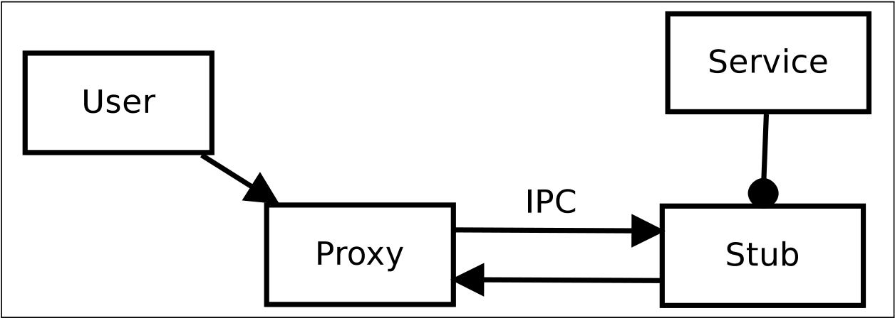
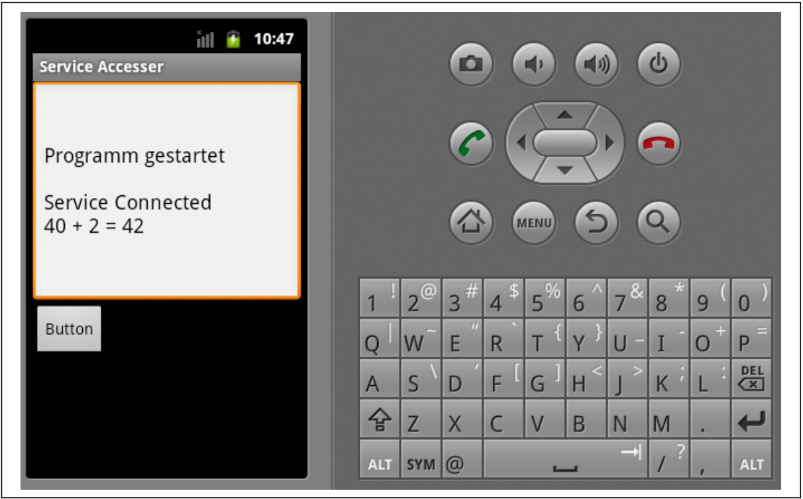

# 6. Example IPC Message Flow

## 6.1. Testing Environment

Chúng tôi đã sử dụng hai ứng dụng thử nghiệm chạy trên một thiết bị ảo.Cái đầu tiên là một ví dụ đã sửa đổi1, ban đầu được thiết kế để chứng minh giao tiếp dịch vụ trong ứng dụng.Điều này được xử lý khá khác nhau và đối phó với giao tiếp liên đối viên, không giao tiếp với các quá trình.Nó được gọi là `SimpleMathService` và cung cấp các phương pháp cho các hoạt động toán học đơn giản.

<figure markdown="span">
    
    <figcaption>Hình 6.1: Môi trường thử nghiệm</figcaption>
</figure>

Ứng dụng thứ hai được tự lập trình và chỉ cần sử dụng phương pháp từ xa được cung cấp bởi ứng dụng đầu tiên.

Các ứng dụng của môi trường thử nghiệm được minh họa dưới dạng sơ đồ lớp UML mở rộng trong Hình 6.1.Sơ đồ UML được mở rộng với chế độ xem các quy trình, trong đó khởi tạo các đối tượng Java lồng nhau.Các lớp và đối tượng của họ (hiển thị bằng màu vàng) được tổng hợp từ ngôn ngữ Android AIDL.Ứng dụng Dịch vụ có hai thành phần, một thành phần hoạt động có tên là Main và một thành phần dịch vụ có tên `SimpleMathService`.Lớp `SimpleMathService` giữ một lớp bên trong ẩn danh mở rộng thực hiện logic kinh doanh của dịch vụ.Lớp bên trong có nguồn gốc từ isimplemathService.stub được tạo bởi sdk android từ tệp định nghĩa isimplemathService.aidl.Tệp này chứa định nghĩa API của dịch vụ và phải được xuất bản nếu các nhà phát triển ứng dụng khác muốn sử dụng dịch vụ này.Lớp Stub mở rộng lớp chất kết dính cũng như lớp proxy.Theo đó, chúng là điểm cuối của tiến trình giao tiếp chất kết dính.

Bảng kê khai ứng dụng tuyên bố dịch vụ là từ xa và do đó nó được bắt đầu trong một quy trình riêng của Android.Thành phần hoạt động sẽ giữ một đối tượng proxy là một lớp lồng nhau của giao diện isimplemathService.Các hoạt động chạy trong một quy trình riêng, quá.

Ứng dụng thứ hai chỉ chứa hoạt động chính là thành phần.Đối tượng chính này giữ giao diện người dùng bằng một nút và đầu ra văn bản và đối tượng proxy cho `SimpleMathService`, có liên quan nhiều hơn đến IPC.

Các ứng dụng được biên dịch với SDK Android cho Eclipse và được thực thi trong trình giả lập Android.

## 6.2. Message Flow and Call Stacks

Do kích thước hạn chế của bài viết này, chỉ có thể trình bày một đoạn trích.Sự ràng buộc của dịch vụ được trình bày một cách trừu tượng và cuộc gọi thủ tục từ xa được trình bày chi tiết.

Ứng dụng người dùng được thực thi đầu tiên.Nó yêu cầu Trình quản lý dịch vụ cho __binder__ của `SimpleMathService`. __Binder__ này được triển khai như một lớp ẩn danh từ `ISimplemathService.stub` của ứng dụng` SimplemathService`.Trong ví dụ này, đối tượng Stub thực hiện logic kinh doanh của dịch vụ.Phương thức `BindService ()` của lớp chính của ứng dụng người dùng sẽ tạo một đối tượng proxy cho dịch vụ được yêu cầu, giao tiếp với đối tượng sơ khai ở phía máy chủ.


Figure 6.2.: Proxy and Stub

At this point we describe in detail what happens, when a remote procedure is
called after the binding to the service has been established. The listing 6.1 shows
a nested anonymous extended class, which is used as callback.

```java
ISimpleMathService mService ;
private ServiceConnection mConn = new ServiceConnection () {
    @Override
    public void onServiceConnected (ComponentName name, IBinder service) {
        mService = ISimpleMathService.Stub.asInterface(service);
    }
    @Override
    public void onServiceDisconnected (ComponentName name) {
        mService = null
    }
};
```

<div style="text-align: center;">Liệt kê 6.1: gọi lại trên các sự kiện kết nối</div>

Đối tượng __ServiceConnection__ này là một đối số của cái được gọi là trước đó `bindService()` phương pháp. Các`onServiceConnected` phương thức gọi lại trả về một đối tượng proxy, cung cấp tất cả các cuộc gọi phương thức đến dịch vụ từ xa.Ứng dụng người dùng hiện có thể xử lý đối tượng như thể nó là một đối tượng cục bộ và các phương thức nguyên soái.

```java
int i = 40;
int j = 2;
mService.add(j,i);
```

<div style="text-align: center;">
Liệt kê 6.2: Cuộc gọi phương thức từ xa
</div>

Liệt kê 6.2 Có một phương thức gọi trên đối tượng proxy để thêm 40 và 2. Trong nền, sau đó xảy ra: Cuộc gọi được chia cho đối tượng proxy trong 6.3 thành các loại dữ liệu cơ bản, có thể được viết thành một bưu kiện.Lúc đầu, máy thu được ghi vào bưu kiện, đó là một chất kết dính.Các đối số được viết tuần tự hóa trong gói dữ liệu.Một mã INT do người dùng xác định được gán cho giao dịch.Mã này liên quan đến tên phương thức dự định, bởi vì khung chất kết dính tại thời điểm này chỉ cho phép gửi giá trị số nguyên.Để tránh những hiểu lầm, dịch vụ từ xa vì ứng dụng người dùng phải sử dụng cùng một gán mã và phương thức.

```java
public int add(int a, int b) throws android.os.RemoteException {
    android.os.Parcel data = android.os.Parcel.obtain();
    android.os.Parcel reply = android.os.Parcel.obtain();
    int result;
    try {
        data.writeInterfaceToken(DESCRIPTOR);
        data.writeInt(a);
        data.writeInt(b);
        mRemote.transact(Stub.TRANSACTION_add, data, reply, 0);
        reply.readException();
        result = reply.readInt();
    } finally {
        reply.recycle();
        data.recycle();
    }
    return result;
}
```

<div style="text-align: center;">
Liệt kê 6.3: Phương pháp proxy
</div>

Tại thời điểm này, giao tiếp giữa các chuyên gia được bắt đầu với phương thức giao dịch.

Bưu kiện được gửi đến giao diện JNI gửi nó đến phần mềm trung gian Binder C ++ gửi nó đến trình điều khiển hạt nhân.Trình điều khiển Kernel Binder sẽ gửi quy trình máy khách đến giấc ngủ và ánh xạ dữ liệu bưu kiện và mã từ quy trình máy khách đến quy trình máy chủ.Bưu kiện được gửi từ trình điều khiển Binder đến phần mềm trung gian C ++ và sau đó đến JNI và trên lớp trình bao bọc API Java Phương pháp Ontransact của sơ khai được gọi.

```java
@Override
public boolean onTransact(int code, android.os.Parcel data, android.os.Parcel reply, int flags)
        throws android.os.RemoteException {
    switch (code) {
        case TRANSACTION_add: {
            data.enforceInterface(DESCRIPTOR);
            int arg0 = data.readInt();
            int arg1 = data.readInt();
            int result = this.add(arg0, arg1);
            reply.writeNoException();
            reply.writeInt(result);
            return true;
        }
    }
    return super.onTransact(code, data, reply, flags); // Optional fallback
}
```

<div style="text-align: center;">
Liệt kê 6.4: Phương pháp sơ khai
</div>

Trong danh sách 6.4 Điểm vào để nhận tin nhắn được trình bày.Mã này được đọc đầu tiên và do kiến thức về chữ ký phương thức, số lượng chính xác của các đối số được đọc từ bưu kiện.Bây giờ phương thức tương ứng với mã thực hiện logic kinh doanh được gọi với các đối số được trích xuất.Kết quả được viết cho một bưu kiện trả lời.

Một lần nữa, nó được chuyển qua các lớp đến trình điều khiển chất kết dính, chuyển các bưu kiện và đánh thức quy trình khách hàng ngủ và cung cấp bưu kiện trả lời cho đối tượng proxy.Relpy không được chia sẻ và được trả về do kết quả của phương thức proxy.Sau đó, kết quả được hiển thị ở cửa sổ hoạt động của ứng dụng máy khách, tham khảo Hình 6.3.

<figure markdown="span">
    
    <figcaption>Hình 6.3: Môi trường thử nghiệm</figcaption>
</figure>

