# II. Nó có nghĩa là gì

Chà, thế cũng gọn gẽ rồi. Ok, tiếp. Tôi đã miêu tả chi tiết ở một mức nào đó về cách hoạt động của cái thứ Bitcoin này, cái mà Satoshi Nakamoto đã phát minh. Nhưng hãy quay lại một chút: Chính xác thì anh ta đã phát minh ra cái gì?

Câu trả lời đơn giản nhất là anh ta đã phát minh ra Bitcoin.  

Lúc ở đỉnh, tổng giá trị của Bitcoin trên thế giới là hơn 1 nghìn tỷ đô la. Có hàng nghìn bài viết về nó; nó có rất nhiều nhà đầu tư và người hâm mộ và tín đồ. Một vài trong số này được gọi là “Những người theo chủ nghĩa tối đa hóa Bitcoin”; họ tin rằng thứ duy nhất thực sự thú vị và giá trị trong thế giới crypto là Bitcoin. Những người này có thể dừng ở đây được rồi. Muốn đọc về Bitcoin thì bên trên có rồi đó.

Nhưng tôi thì muốn tiếp tục, bắt đầu từ đây. Tôi muốn nói về những cách khác nhau mà bạn có thể đã khái quát hóa phát minh của Satoshi. Có những cách khác nhau để thông diễn cái mà Satoshi đã mưu tính và cái mà anh ta đã đạt được, và mỗi cách thông diễn lại dẫn bạn đến một hướng khác nhau về crypto.

## Một cất trữ giá trị

Một khái quát hóa tối thiểu về Bitcoin là gì đó như này: Satoshi đã phát minh một công nghệ để mọi người gửi các số cho nhau. Thế cũng đúng đúng ở khía cạnh nào đó. Trước thời Satoshi, tôi có thể gửi bạn một email ghi “132,51”, nhưng bạn sẽ không có cách nào biết được liệu tôi có 132,51 trên máy tính của tôi hay không hoặc liệu tôi đã gửi nó cho ai khác chưa, và bạn sẽ không có cách nào để chứng minh với người khác là giờ bạn đã có 132,51 trên máy của bạn và có thể gửi nó cho người khác.

Tôi nhận ra đoạn trên nghe thật ngu ngốc, vì nó đúng thực như vậy. Bạn chắc chắn có 132,51 trên máy tính của bạn, cũng như bất kì con số có thể tưởng tượng ra nào khác; các máy tính có thể tạo những số một cách tùy ý và cơ bản là chẳng tốn gì. Mở một bảng tính, gõ “132,51”, và đấy, xong. Theo một nghĩa nào đó, thành tựu công nghệ của Bitcoin là nó đã phát minh ra một cách phi tập trung để tạo ra sự khan hiếm trên máy tính. Bitcoin bày ra một cách rõ ràng một cách thức để tôi gửi cho bạn một thông điệp máy tính để bạn sẽ có thông điệp đó và tôi thì không có nữa, một cách thức để di chuyển các mục thông tin máy tính giữa tôi và bạn theo một cách mà giới hạn nguồn cung của chúng và chuyển đi quyền sở hữu.

Nhưng thành tựu công nghệ không phải là toàn bộ câu chuyện, có lẽ càng không phải là phần quan trọng nhất. Điều điên rồ, nhưng hấp dẫn, về Bitcoin không phải là Satoshi đã phát minh ra một cách cụ thể để người ta gửi các con số cho nhau và rồi gọi chúng là các khoản thanh toán. Mà đó là người ta chấp nhận các con số đó như các khoản thanh toán.

Không có đặc tính có sẵn nào trong công nghệ có thể làm cho điều đó xảy ra. Người ta có thể đã đọc sách trắng Bitcoin và nói, “Ơ, đây là một cách hay ho để gửi các khoản thanh toán, nhưng vấn đề là bạn không gửi đi đồng đô la, bạn đang gửi đi cái thứ bạn tự bịa rồi chế ra, và ai lại muốn cái đó cơ chứ?” Chà, hầu hết mọi người đúng là đã nói thế, lúc ban đầu. Nhưng rất nhiều người rồi cuối cùng đã quyết định là Bitcoin có giá trị.

Thế kỳ cục thật! Satoshi lúc đó kiểu,

<figure markdown="span">
    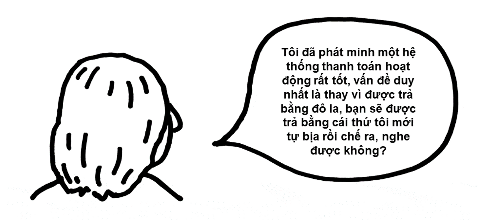    
    <figcaption></figcaption>
</figure>

Và có đủ nhiều người kiểu,

<figure markdown="span">
    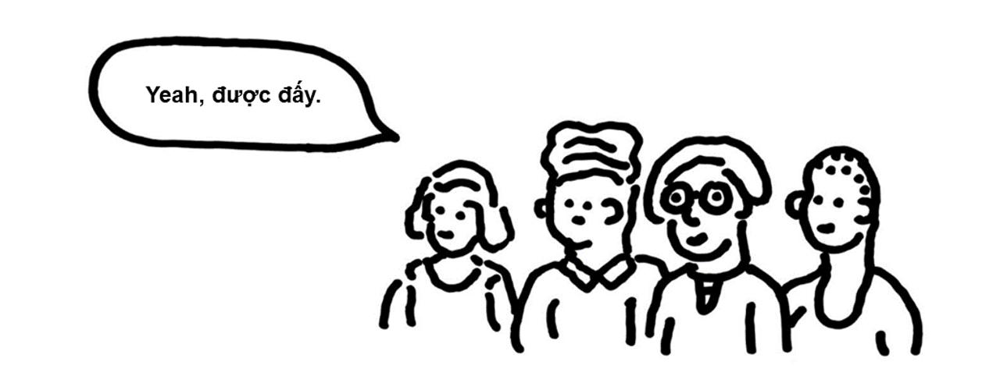    
    <figcaption>Minh họa: C.W. Moss</figcaption>
</figure>

### Shitcoins

Dưới đây là một sự khái quát hóa cực đơn giản khác về Bitcoin:

<figure markdown="span">
    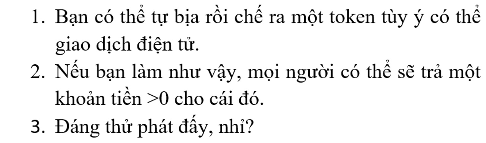    
    <figcaption></figcaption>
</figure>

Khi Bitcoin đã trở nên rõ ràng và có giá trị hơn, mọi người chỉ cứ thế…làm…như vậy? Đã có sự xuất hiện hàng loạt và bừa bãi của các loại tiền mã hóa mà đôi khi là những biến thể tinh tế của Bitcoin và đôi khi chỉ là những thứ hàng nhái làm qua quít. “Shitcoins (coin rác)” là tên chính để gọi chúng.

Vào 2013 hai kỹ sư phần mềm đã cùng nhau tạo ra một loại tiền mã hóa và lấy Doge, tức meme chú chó shiba biết nói, làm biểu tượng cho nó. Họ gọi nó là Dogecoin, và nó là một sự giễu nhại cơn bùng nổ tiền số. Ngày nay nó trị giá 8 tỷ đô la. Tôi sẽ không giải thích cái này cho bạn. Không ai sẽ giải thích cái này cho bạn. Chắc chắn là những người đã phát minh ra Dogecoin cũng không hiểu chuyện đã diễn ra thế nào; một trong số họ đã lên Twitter và nói anh ta ghét nó. Nó chỉ, như kiểu, bạn tự bịa rồi chế ra một token tùy ý có thể giao dịch điện tử, và bạn hi vọng người ta sẽ mua nó chẳng vì lý do gì, bạn cũng có thể làm nó trông nhộn nhộn. Dán hình một chú chó lên làm logo; cho mọi người thứ để đùa cợt trên mạng.

<figure markdown="span">
        
    <figcaption>Dogecoin</figcaption>
</figure>

Nhân tiện, đây là một lập luận thú vị được đưa ra để chống lại Bitcoin thuở nó mới ra đời:

<figure markdown="span">
    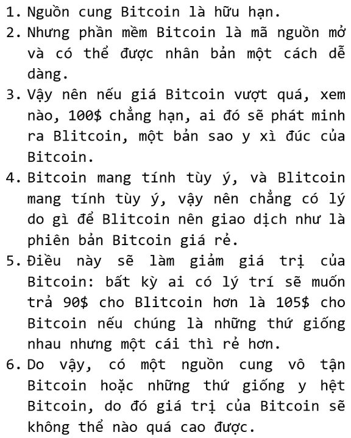    
    <figcaption></figcaption>
</figure>

Lập luận này về sau thành ra sai phần lớn. Về mặt xã hội, tiền mã hóa là một trò chơi phối hợp đồng thời (coordination game)*; mọi người muốn có loại coin mà những người khác muốn có, và một số sự tương đương mang tính kỹ thuật đầy trừu tượng không làm cho một loại tiền mã hóa trở thành một sự thay thế tốt cho một loại khác. Sự chấp thuận có tính xã hội – tức tính hợp lệ – là cái khiến một loại tiền mã hóa có giá trị, và đó là thứ bạn không thể chỉ cần sao chép mã là có được.

> có thể đọc thêm về __Lý thuyết trò chơi__.

Đó là một sự thật mang tính tiết lộ: Điều khiến Bitcoin có giá trị không phải là những dòng mã thanh nhã của nó, mà là sự chấp thuận của xã hội với nó [20]. Một thứ hoạt động y hệt như Bitcoin nhưng không có gia phả của Bitcoin – tức là không khai sinh ra từ khối nguyên thủy của Satoshi (khối đầu tiên được đào) và chỉ là thứ được tạo ra bởi một số kẻ bắt chước – sẽ có cùng công nghệ nhưng không có giá trị như Bitcoin.

!!! note "Note 20"
    Một lợi thế mà Bitcoin có so với hàng nhái sao chép: nhiều thợ đào hơn. Một nhóm lớn đa dạng các thợ đào sẽ giữ cho chuỗi khối của một loại tiền mã hóa có tính bảo đảm cao hơn so với một nhóm nhỏ tập trung. Nhưng sự bảo đảm đó chỉ là một sự khởi đầu của sự chấp nhận xã hội rộng rãi hơn của nó. Toàn bộ thợ đào Bitcoin có thể ngừng làm việc và chuyển sang đào Blitcoin. Chỉ là họ không làm thế.

### Một tài sản không liên quan

Đây là một sự khái quát hóa khác về Bitcoin:

<figure markdown="span">
    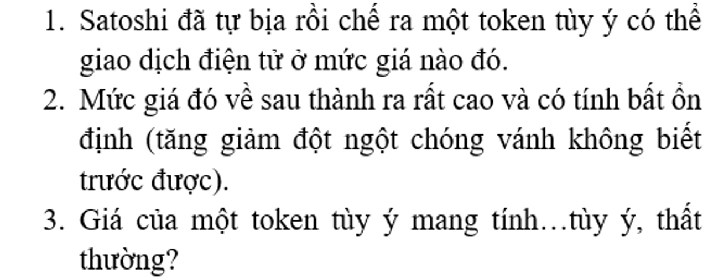    
    <figcaption></figcaption>
</figure>

Điều này có thể nghe chẳng hay ho gì với bạn. Nhưng nó rất thú vị dưới vai trò là một vấn đề của lý thuyết tài chính. Lý thuyết danh mục đầu tư hiện đại cho thấy rằng việc thêm một tài sản không liên quan vào danh mục đầu tư (portfolio) có thể cải thiện lợi nhuận và giảm thiểu rủi ro. Các tổ chức lớn sẽ đầu tư vào rừng trồng cây lấy gỗ hay thu phí cao tốc hay bảo hiểm bão, bởi họ nghĩ rằng những thứ này sẽ không hoạt động giống cổ phiếu hoặc trái phiếu, rằng chúng sẽ đa dạng hóa danh mục đầu tư của họ, rằng chúng sẽ giữ được giá trị ngay cả khi cổ phiếu mất giá.

Xét ở khía cạnh mà giá Bitcoin:

1. hầu như là đi lên, dù có rất nhiều lần tăng giảm, và
2. đi lên và đi xuống vì những lý do thất thường và bí ẩn và không bị ràng buộc với mấy thứ kiểu doanh thu công ty hoặc kinh tế toàn cầu, thì Bitcoin là một thứ gây hứng thú với các nhà đầu tư tổ chức.

Có những biến thể. Ví dụ:

<figure markdown="span">
    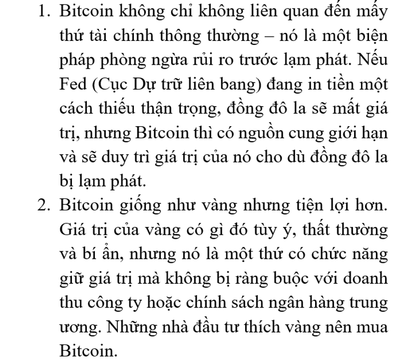    
    <figcaption></figcaption>
</figure>

Chà, đó là vài thứ mà người ta nói. Trên thực tế, giá của Bitcoin tương quan khá chặt chẽ với thị trường chứng khoán, đặc biệt là các cổ phiếu công nghệ. Bitcoin không phải là một công cụ phòng ngừa lạm phát đặc biệt hiệu quả: Giá của nó tăng trong những năm lạm phát ở Mỹ thấp, và nó giảm trong năm nay khi lạm phát tăng. Mô hình phù hợp của giá crypto có lẽ là chúng tăng trong giai đoạn các bong bóng đầu cơ phình to khi giá cổ phiếu tăng, và sau đó chúng giảm khi các bong bóng này vỡ. Đó không phải là một câu chuyện đặc biệt hấp dẫn với các nhà đầu tư đang muốn đa dạng hóa danh mục. Bạn muốn những thứ mà sẽ tăng giá khi bong bóng vỡ cơ!

### GameStop

Tôi sẽ không đi sâu vào hiện tượng cổ phiếu meme này ở đây – tôi đã đi sâu vào nó ở bài đăng này vào tháng 12 năm ngoái rồi. Nhưng một khả năng quan trọng là sự khái hóa đầu tiên về Bitcoin, rằng một token điện tử có thể giao dịch tùy ý có thể trở nên có giá trị chỉ bởi vì người ta muốn như vậy, đã vĩnh viễn phá vỡ cách hiểu của tất cả mọi người về mọi thứ trong tài chính.

<figure markdown="span">
        
    <figcaption>Phiên bản đơn giản cho câu chuyện về GameStop là có một số người trên internet thích cổ phiếu của GameStop.</figcaption>
</figure>

Trước thời của Bitcoin, thứ thường được nói về cổ phần là giá của nó thể hiện mong đợi của thị trường với giá trị hiện tại của dòng tiền tương lai của doanh nghiệp. Nhưng Bitcoin không có dòng tiền; giá của nó thể hiện mức mà mọi người sẵn sàng trả cho nó. Tuy thế, nó vẫn có một mức giá thị trường cao và biến động; mọi người đã trở nên giàu có nhờ mua Bitcoin. Vì vậy người ta sao chép mô hình đó, và việc tạo ra và đầu cơ vào các tokens điện tử thuần túy, trừu tượng, khan hiếm đã trở thành một lĩnh vực kinh doanh lớn.

Một cổ phần là một token điện tử khan hiếm. Nó cũng là một thứ gì đó khác! Một xác nhận về dòng tiền hay gì gì đó. Nhưng nó cũng là một thứ: một token điện tử mà về cơ bản là có nguồn cung giới hạn. Nếu bạn và bạn bè trên mạng của bạn muốn tạo ra những trò vui và đầu tư dựa trên những trò đó, thì, tùy vào khiếu hài hước của bạn và nhóm trò chuyện trực tuyến nào mà bạn tham gia, bạn có thể mua hoặc là Dogecoin hoặc là cổ phiếu của Công ty GameStop, và với mục đích như trên của bạn thì mấy thứ này cũng chẳng có gì khác biệt đến thế.

## Một máy tính phân tán

Đây là một sự khái quát hóa nữa, rất khác, về Bitcoin. Ở hình thái rõ nét nhất của mình, sự khái quát hóa này hầu như được gán cho lập trình viên Vitalik Buterin, một nhân vật độc đáo thú vị khác mà chúng ta sẽ không nói về. Sự khái quát đó như sau:

<figure markdown="span">
    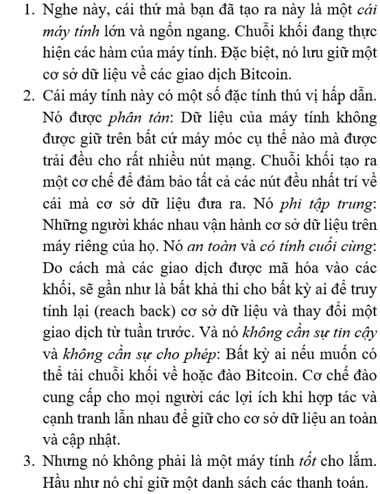
    <figcaption></figcaption>
</figure>

<figure markdown="span">
    
    <figcaption>Vitalik tại ETHDenver hồi tháng Hai. Đã bảo anh ta độc đáo thú vị mà!</figcaption>
</figure>

### Ethereum

Cái máy tính mà Vitalik [22] đã phát minh thường được gọi là Ethereum, hoặc Máy ảo Ethereum (Ethereum Virtual Machine): Nó là một máy tính ảo, phân tán giữa hàng nghìn nút mạng dự phòng. Tất cả các nút đều biết “trạng thái” của Máy ảo – tức là những thứ nằm trong bộ nhớ của máy – và mỗi giao dịch trên hệ thống cập nhật trạng thái đó.

!!! note "Note 22"
    Tương tự như Satoshi, Vitalik Buterin được nhắc đến rộng rãi trong giới crypto bằng tên của anh ấy và tôi tuân theo quy ước đó ở đây.

Ethereum hoạt động rất giống Bitcoin: Mọi người tạo các giao dịch, họ truyền phát chúng lên mạng lưới, các giao dịch được gộp vào một khối, các khối được xâu chuỗi với nhau, tất cả mọi người đều có thể thấy từng giao dịch, v.v. Tiền tệ của chuỗi khối Ethereum được gọi là…tôi không biết nữa, cách gọi phổ biến của nó là “Ether”, dù đôi khi người ta gọi là “Ethereum”, và thường họ chỉ viết là “ETH”. (Tương tự, Bitcoin đôi khi được viết là “BTC”). Trong cái cuộc hội thoại nó thường được gọi vắn tắt là “Eth”, phát âm “Eeth” (t/n: âm /i:/ trong tiếng Anh).

Nhưng dù các giao dịch Bitcoin hầu như là về gửi đi các thanh toán [23], các hoạt động trên Ethereum được hình thành một cách chung chung hơn: Ethereum là một máy tính ảo lớn, và bạn có thể gửi cho nó những lệnh để làm gì đó trên đó. Một vài trong số các lệnh này là “Gửi 10 Ether từ Địa chỉ X tới Địa chỉ Y”: Trong bộ nhớ của máy tính có một cơ sở dữ liệu về các địa chỉ Ethereum và số Ether có trong các địa chỉ đó, và bạn có thể bảo máy tính cập nhật cơ sở dữ liệu đó.

!!! note "Note 23"
    Đây là nói hơi quá; trong Bitcoin có một ngôn ngữ Script và một số khả khả năng viết chương trình.

Nhưng bạn cũng có thể viết các chương trình để chạy trên máy tính để làm một số thứ một cách tự động. Chương trình có thể là: Gửi 10 Ether đến Địa chỉ Y nếu điều gì đó xảy ra. Giả dụ Alice và Bob muốn cá cược một trận bóng đá, hoặc cuộc bầu cử tổng thống, hoặc về giá của Ether. Họ có thể viết một chương trình máy tính trên Máy ảo Ethereum để làm việc đó. Chương trình sẽ có tài khoản Ethereum riêng của nó, nơi nó có thể giữ Ether, và logic lập trình của nó sẽ ghi đại loại kiểu “nếu đội Jets thắng vào Chủ Nhật” – hoặc “nếu Joe Biden thắng cuộc bầu cử”, hoặc _“nếu Ether giao dịch trên mức 1.500$ vào ngày 01 tháng 11”_ – _“thì gửi tiền trong tài khoản này cho Alice; nếu không thì gửi cho Bob”_. Alice và Bob sau đó mỗi người gửi một Ether tới tài khoản đó, và nó sẽ kiểm tra kết quả trận đấu bóng hoặc kếu quả bầu cử hoặc giá Ether [25], và sau khi nó đã có câu trả lời – ai thắng trận đấu hoặc cuộc bầu cử hoặc liệu giá Ether có lớn hơn 1.500$ – nó sẽ tự động giải quyết vụ cược và gửi hai Ether cho người thắng cuộc.

!!! note "Note 25"
    Làm thế nào để nó kiểm tra? Giải pháp tiêu chuẩn trong crypto được gọi là “oracle (nhà tiên tri)”. Đó là một chương trình sẽ định kỳ truy vấn một số công ty hoặc trang web theo dõi thông tin liên quan (kết quả bầu cử, tỷ số bóng đá, thời tiết, v.v.) và đăng câu trả lời lên chuỗi khối Ethereum. Oracle về cơ bản là một cách để đưa thông tin từ thế giới bên ngoài (thế giới thực hoặc internet) vào chuỗi khối.

Hoặc bạn có thể viết một chương trình ghi: “Nếu bất kỳ ai gửi một Ether tới chương trình này, chương trình sẽ gửi lại họ một thứ gì đó hay hay”. “Thứ gì đó hay hay” ở đây khá mơ hồ, và nói thực thì nó cũng khá mơ hồ trong thực tế, nhưng về mặt lý thuyết, bất cứ thứ gì bạn có thể đưa vào một chương trình máy tính đều có thể là phần thưởng. Vậy nên “gửi tôi một Ether và tôi sẽ gửi lại cho bạn một bức ảnh kỹ thuật số về một con khỉ” sẽ là một chương trình khả dĩ, và tôi biết mình nói thế này nghe như đang đùa, nhưng trong một quãng thời gian, những bức ảnh kỹ thuật số về những con khỉ đã được bán với giá hàng triệu đô trên Ethereum. Hoặc có một thứ được gọi là Dịch vụ Tên Ethereum (Ethereum Name Service), hoặc ENS, thứ cho phép mọi người đăng ký các tên miền như “matthewlevine.eth” và dùng chúng trên nhiều chức năng trên Ethereum. Bạn gửi Ether tới chương trình ENS, và nó đăng ký tên bạn muốn cho bạn – bạn gửi tiền vào, nó gửi lại một tên miền.

<figure markdown="span">
    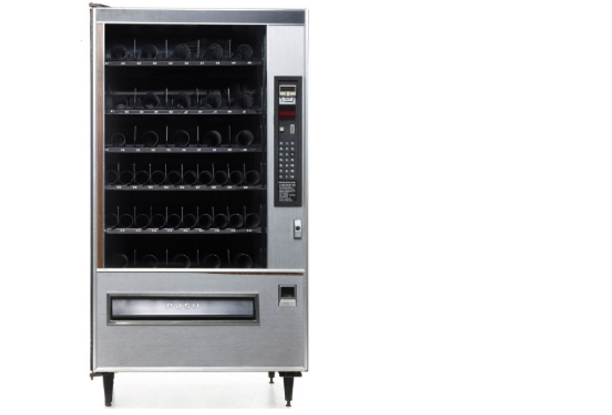    
    <figcaption>Vui nhỉ, trông chẳng giống một hợp đồng gì cả.</figcaption>
</figure>

Sự so sánh thường được dùng để minh họa cho việc này là ví với một chiếc máy bán hàng tự động: Máy bán hàng tự động là một máy tính trong thế giới thực, cái mà bạn bỏ vào một đô la và nhận lại thứ gì đó bạn muốn. Bạn không mặc cả với nó, hoặc tám chuyện về thời tiết trong lúc nó thực hiện việc của nó. Phần hoạt động của máy bán hàng tự động trong cuộc giao dịch này là hoàn toàn tự động. Chương trình của cỗ máy làm cho nó phản ứng theo cách đã được định trước nếu bạn bỏ tiền vào và bấm nút nào đó.

Trong thế giới crypto, những chương trình này được gọi là “các hợp đồng thông minh (smart contracts)”. Cái tên có chút đáng tiếc. Một hợp đồng thông minh là một chương trình máy tính chạy trên chuỗi khối. Một số hợp đồng thông minh trông giống như những hợp đồng: Vụ cá cược của Alice và Bob về giá Ethereum rất giống với một phái sinh tài chính, thứ mà chắc chắn là một hợp đồng. Một số hợp đồng thông minh trông giống như những máy bán hàng tự động: Chúng nằm nơi công cộng chờ người ta bỏ tiền vào, và nhả ra hàng hóa. Một máy bán hàng tự động không hẳn chính xác là một hợp đồng bình thường, nhưng nó là một giao dịch, và những người yêu thích bàn luận triết lý về hợp đồng thích nghĩ về máy bán hàng tự động.

Nhưng một số hợp đồng thông minh trông chỉ giống như, ờ, những chương trình máy tính. Khái niệm của nó thì chung chung hơn cái tên. Trong sách trắng về Ethereum, Vitalik Buterin viết:

!!! warning "Lưu ý"
    Lưu ý rằng “các hợp đồng” trong Ethereum không nên được xem như những thứ mà nên được “hoàn thành” hoặc “tuân thủ”; thay vào đó, chúng giống như những “tác tử tự chủ” tồn tại trong môi trường thực thi của Ethereum, luôn luôn thực thi một đoạn mã cụ thể khi bị “chọc” bởi một tin nhắn hay giao dịch, và có kiểm soát trực tiếp với số dư Ether và chìa khóa/cấp trữ giá trị của chúng để theo dõi các biến liên tục.

Có những giới hạn: Ethereum là một máy tính phân tán, nhưng nó không có bàn phím hay màn hình. Sẽ khó để chơi Call of Duty trên Máy ảo Ethereum. Nhưng chuỗi khối và các hợp đồng thông minh của Ethereum có thể hoạt động như một dạng máy chủ, cơ sở dữ liệu nguồn cho các kiểu chương trình khác. Các lập trình viên xây dựng các

<figure markdown="span">
    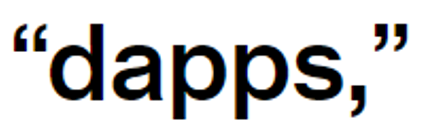
    <figcaption></figcaption>
</figure>

tức các ứng dụng phi tập trung (t/n: decentralized apps > d-apps), trên Ethereum và các chuỗi khối khác. Có những chương trình máy tính hầu như chỉ chạy trên web (có lẽ trên một số máy chủ tập trung hoặc máy chủ ảo đám mây) nhưng giữ một số dữ liệu thiết yếu của chúng trên chuỗi khối. Bạn chơi một chơi trò trên máy tính, và thuộc tính của nhân vật của bạn được lưu trữ trên chuỗi khối. Một chương trình bình thường trên máy chủ của công ty phát hành game kết xuất đồ họa thanh kiếm của nhân vật trên màn hình của bạn, nhưng thông tin nhân vật đó có thanh kiếm được lưu trữ trên chuỗi khối.

Một giới hạn khác: nó là một máy tính chạy chậm. Cách Ethereum thực thi các chương trình đó là bạn truyền phát các lệnh tới hàng nghìn nút mạng trên mạng lưới, và chúng sẽ thực thi các lệnh đó và đạt sự đồng thuận về các kết quả từ các lệnh. Tất cả những việc đó tốn thời gian. Chương trình của bạn cần chạy hàng nghìn lần trên hàng nghìn máy tính.

Hiện nay các máy tính và các kết nối mạng lưới có tốc độ khá nhanh, và máy tính Ethereum đủ nhanh cho nhiều mục đích (như chuyển Ether, hoặc giữ một cơ sở dữ liệu về các nhân vật game). Nhưng bạn sẽ không muốn dùng kiểu kiến trúc máy tính này cho các ứng dụng đòi hỏi nhiều tính toán, cực kỳ nhạy cảm về thời gian. Bạn sẽ không muốn, ví dụ, một chiếc xe tự lái chạy trên Máy ảo Ethereum. Bạn sẽ không muốn hàng nghìn máy tính rải rác trên thế giới tính toán còn bao xa thì bạn sẽ đâm vào ai đó trước khi kịp đạp phanh.

### Bằng chứng cổ phần

Chiếc máy tính phân tán này, tức Máy ảo Ethereum, có thiết kiết cơ bản được dựa trên Bitcoin. Có các khối, mọi người có thể thấy chúng, chúng được xâu chuỗi lại với nhau, các giao dịch được ký bằng các khóa riêng tư, mọi thứ đều được băm, v.v.  Tất cả những thứ đó, cộng thêm việc gửi tiền cho mọi người, bạn có thể gửi các lệnh máy tính tới chuỗi khối, và chuỗi khối sẽ thực thi chúng.

Điều đó có nghĩa là có hàng nghìn máy tính mà mỗi máy đang chạy các nút mạng của mạng lưới Ethereum, và tất cả những máy tính đó sẽ nhất trí về những thứ xảy ra trên mạng lưới, ai đã gửi tiền cho ai, và những lệnh máy tính nào đã được thực thi sau đó. Sự thực rằng Ethereum là một máy tính ảo, phân tán nghĩa là tất cả những máy tính thực có thể đi đến một sự đồng thuận về hoạt động nào đã được thực hiện khi nào. Và lý do khiến điều này khả thi là bởi Bitcoin đã cho thấy cách mà một mạng lưới máy tính phi tập trung có thể đạt được sự đồng thuận như thế nào. Những thứ liên quan đến hàm băm và đào coin và số nonce và điện: Đó là cơ chế đồng thuận của Bitcoin, proof of work (hay PoW, bằng chứng công việc).

Cho đến cuối tháng trước (t/n: 09/2022), cơ chế đồng thuận của Ethereum cũng vậy. Có một số khác biệt kỹ thuật, nhưng các cơ chế cơ bản thì khá tương tự. Các thợ đào băm cả đống dữ liệu khối, và bất kỳ ai tìm ra số băm phù hợp trước sẽ đào được khối và nhận một phần thưởng. Vì việc này đắt đỏ và lãng phí rất nhiều nguồn lực, nó cho thấy một sự cam kết với hệ sinh thái Ethereum. Nhưng việc lãng phí thì bản thân nó thật tệ.

Và vì vậy, vào ngày 15 tháng 9, sau nhiều năm lập kế hoạch, Ethereum đã chuyển đổi qua một cơ chế đồng thuận mới: Ethereum giờ sẽ dùng một thứ gọi là proof of stake (hay PoS, bằng chứng cổ phần). Các ý tưởng cơ bản giữ nguyên như cũ. Mọi người làm các giao dịch và truyền phát chúng lên mạng Ethereum. Một đống máy tính – trong cơ chế PoW chúng được gọi là “thợ đào (miner)”, trong cơ chế PoS chúng được gọi “người xác thực (validator)” – làm việc để biên soạn những giao dịch này vào một danh sách được sắp xếp thứ tự chính thức, gọi là chuỗi khối. Bất kỳ ai với một chiếc máy tính cũng có thể làm một thợ đào/người xác thực; giao thức là mở cho tất cả mọi người. Nhưng các thợ đào/người xác thực phải chứng minh sự cam kết của họ với hệ thống để đào/xác thực các khối. Trong PoW, cách để bạn chứng minh là sử dụng rất nhiều điện để chạy hàm băm. Trong PoS, cách để bạn chứng minh là có rất nhiều Ether.

Các cơ chế chung, diễn giải theo cách hơi quá đơn giản một chút, là:

<figure markdown="span">
    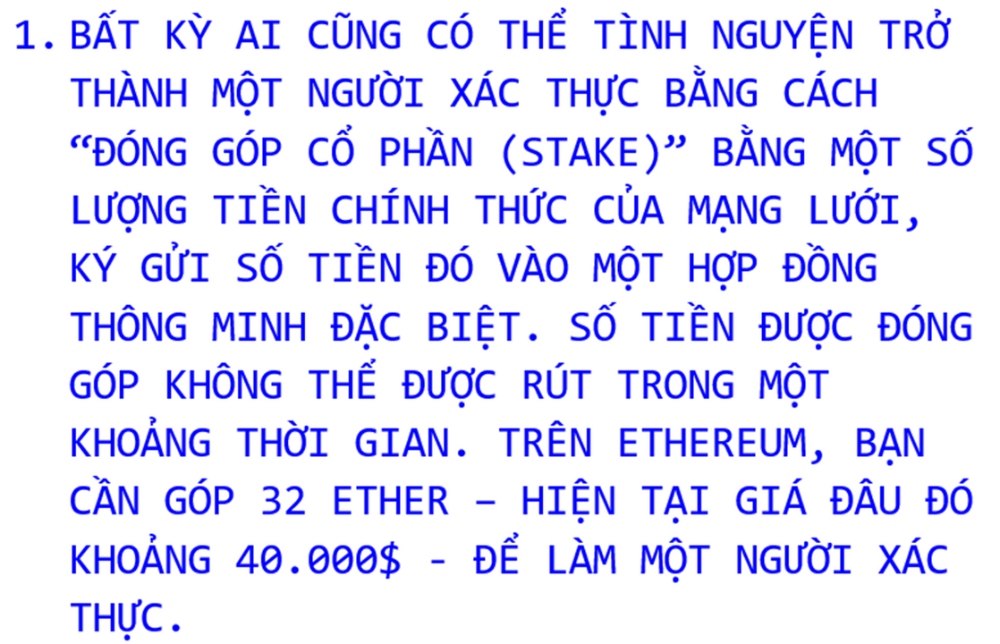    
    <figcaption></figcaption>
</figure>

!!! note "Note 27"
    Trên thực tế có một sự phân công lao động trong Ethereum, nơi mà có những công ty chuyên môn hóa được gọi là “những người xây dựng khối (block builders)” chuyên biên soạn các khối cho những người xác thực làm công việc xác thực.

Dù đó đúng là khái niệm của nó, nhưng khi tôi viết nó ra như vậy thì nó trông như cần nhiều thao tác thủ công hơn thực tế. Không ai ngồi cả ngày để duyệt lại từng giao dịch và vò đầu bóp trán xem xem chúng có hợp lệ không. Những người xác thực chỉ đơn giản chạy phần mềm Ethereum mã nguồn mở chính thức. Nó hầu như là tự động, và bạn có thể chạy nó trên một chiếc laptop có nguồn điện dự phòng khỏe và kết nối internet ổn định. Khoản chi lớn có lẽ là 40.000$ để mua Ether. Việc đóng góp cho sự đồng thuận không khó. Việc ghi đè nó mới khó. Nhưng để làm một người xác thực trung thực thì khá dễ.

Khi chúng ta bàn về việc đào coin theo cơ chế proof of work, tôi đã nói rằng các hệ thống crypto được thiết kế để hoạt động dựa trên sự đồng thuận giữa những người có đóng góp cổ phần trong hệ thống. Các hệ thống PoW thể hiện sự đóng góp kinh tế theo cách gián tiếp một cách khéo léo: Bạn mua một đồng các phần cứng máy tính và chi trả rất nhiều chi phí điện và làm một đống tính toán để chứng minh bạn thực sự quan tâm đến Bitcoin. Các hệ thống PoS (proof of stake) thể hiện sự đóng góp kinh tế theo cách trực tiếp: Bạn chỉ cần đầu tư rất nhiều tiền vào Ethereum và đăng nó lên như một bảo đảm, điều này chứng minh là bạn quan tâm.

<figure markdown="span">
    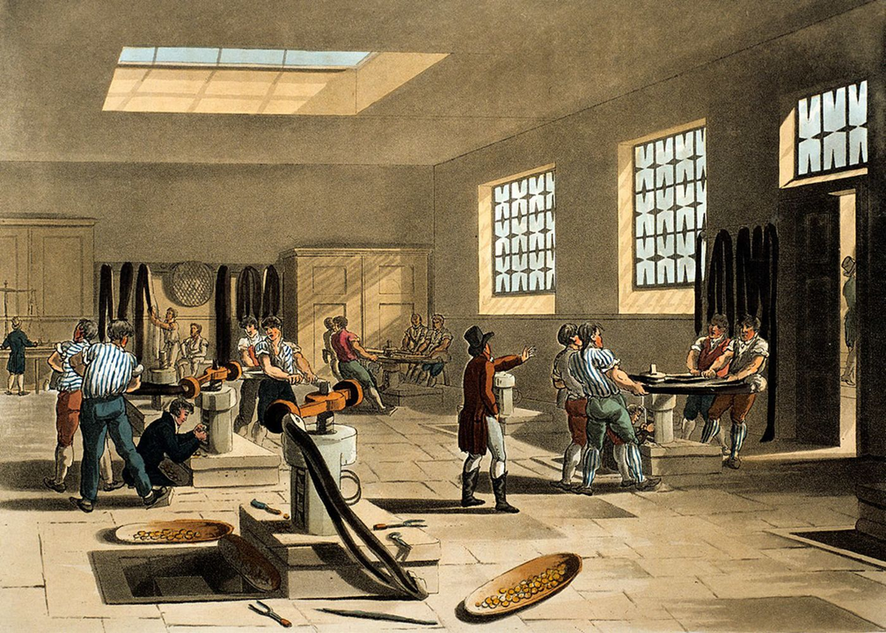    
    <figcaption>Làm ra coin cần rất nhiều công sức.</figcaption>
</figure>

Điều này hiệu quả hơn, theo hai cách. Đầu tiên, nó sử dụng ít điện hơn. Việc tiêu tốn rất nhiều điện năng để làm hàng nghìn tỷ những phép tính toán vô nghĩa mỗi giây, trong bối cảnh ấm lên toàn cầu, nghe thật ngớ ngẩn. PoS sử dụng, theo ước tính ban đầu, 0 lượng điện. Bạn đơn giản là đang lưu giữ một danh sách các giao dịch, và bạn chỉ phải biên soạn danh sách một lần thay vì 200 triệu tỷ lần. Sự chuyển đổi sang PoS giảm mức sử dụng năng lượng của Ethereum đi đâu đó khoảng 99.95%.

Thứ hai, PoS đo lường một cách trực tiếp hơn đóng góp của bạn trong hệ thống. Bạn cho thấy sự đóng góp của mình trong Ethereum bằng cách:

1. sở hữu Ether và
2. đặt nó vào rủi ro để xác thực các giao dịch.

Để chiếm quyền điều khiển hệ thống PoS và lạm dụng nó cho những toan tính xấu xa riêng, bạn cần sở hữu rất nhiều Ether, và bạn sở hữu càng nhiều thì bạn càng muốn bớt xấu xa đi. “PoS có thể có được sự bảo đảm nhiều hơn đâu đó 20 lần với cùng chi phí,” Vitalik lập luận.

#### Đóng góp cổ phần

Đây là cách một thợ đào Bitcoin kiếm tiền:

<figure markdown="span">
    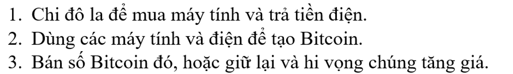
    <figcaption></figcaption>
</figure>

Đây là cách một người xác thực Ethereum kiếm tiền:

<figure markdown="span">
    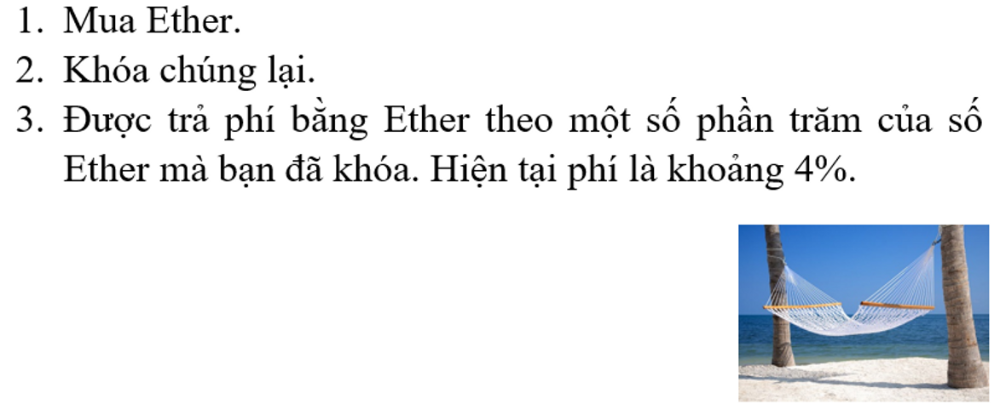
    <figcaption></figcaption>
</figure>

Vẫn cần có một số phần cứng máy tính – bạn phải chạy phần mềm để biên soạn và kiểm tra các giao dịch – nhưng không nhiều; phần cứng có thể là, nói lại lần nữa, một chiếc laptop. Vốn đầu tư không phải là vào máy tính mà vào loại tiền mã hóa có liên quan. Mô tả rất sát cho việc này là: “Đầu tư rất nhiều tiền mã hóa và sau đó được trả tiền lãi bằng chính loại tiền mã hóa đó.”

Bạn thậm chí có thể khiến mọi việc trở nên dễ dàng hơn cho mình. Thay vì tải phần mềm để chạy đầy đủ tất cả các nút mạng của những người xác thực Ethereum, và gửi vào 32 Ether, bạn có thể bàn giao Ether của mình cho ai đó và để họ làm người xác thực. Cũng không cần đến 32 Ether: Nếu bạn có 1 Ether, và 31 người khác mỗi người có 1 Ether, và tất cả các bạn gom chung Ether lại, như vậy các bạn đã có đủ để đóng góp, xác thực các giao dịch, và kiếm phí. Và sau đó mỗi người có thể lấy một khoản chia từ phí đó. Công việc xác thực các giao dịch có thể hoàn toàn được chia tách với việc đóng góp Ether.

Và thực tế có rất nhiều xác thực trên Ethereum chạy thông qua các sàn giao dịch crypto như Coinbase, Kraken, và Binance, những nơi mà cung cấp việc đóng góp cổ phần như một sản phẩm cho khách hàng. (Có một cái tên lớn được gọi là Lido Finance, nó không hẳn là một sàn giao dịch mà là kiểu một nhóm đóng góp cổ phần phi tập trung). Các khách hàng dù gì cũng giữ Ether của họ trên sàn giao dịch, nên họ cũng có thể để các sàn này đóng góp cổ phần thay họ và kiếm tiền lãi. 

Đúng đó: tiền lãi. Nếu bạn đang để crypto vào một nhóm đóng góp cổ phần (staking pool), thì bạn sẽ thấy điều đó không khác gì việc kiếm lợi tức từ số crypto mà mình có: Bạn có 100 token, bạn khóa chúng lại sau một chút thời gian, bạn nhận lại 103 token. Mấy thứ về xác thực giao dịch xảy ra ở đâu đó sau cánh gà, và bạn không thực sự phải lo nghĩ gì về nó. Bạn cứ thế nhận được tiền lời là một số phần trăm của số tiền bạn có – hiện tại khoảng 4%, nhưng có thể ít hơn sau khi trừ các phí – từ việc khóa số tiền đó lại. (Trước khi bạn so sánh con số với thu nhập tự động bạn có thể kiếm được từ, giả dụ, trái phiếu, hãy nhớ rằng chúng được trả bằng đồng Ether có giá trị vô cùng thất thường.)

Crypto đã tìm ra một cách mới mẻ lạ thường để tạo ra lợi suất đầu tư. Crypto có cả một lĩnh vực kinh doanh cho việc “khai thác lợi suất (yield farming)” – đây là một trong số chúng (ta sẽ nói về những thứ khác sau). Bạn có thể gửi crypto vào một tài khoản, và nó sẽ trả bạn tiền lãi. Nó sẽ trả bạn tiền lãi không vì cùng lý do như các ngân hàng – ngân hàng mang tiền của bạn cho khách hàng khác vay – mà bởi vì bạn đang, theo cách của bạn, dù nhỏ, giúp duy trì tính bảo đảm cho sổ cái giao dịch.

### Gas

Một khác biệt khác giữa Ethereum và Bitcoin là các phí giao dịch đóng vai trò quan trọng hơn nhiều trong Ethereum.

Lý do cơ bản là vì các giao dịch trong Bitcoin cơ bản là không khác gì nhau: “X gửi Y Bitcoin đến Z.” Nhưng trong Ethereum, có những giao dịch kiểu “Chạy chương trình máy tính phức tạp có 10.000 bước này.” Việc đó không nhanh. Hàng nghìn nút mạng trên mạng Ethereum phải chạy và xác thực từng bước tính toán của từng hợp đồng. Nếu một hợp đồng đòi hỏi rất nhiều bước, nó sẽ tiêu tốn nhiều thời gian và các nguồn lực máy tính của những người xác thực hơn. Nếu nó đòi hỏi vô tận các bước, nó sẽ làm sập toàn bộ mọi thứ.

Để giải quyết vấn đề này, Ethereum có “gas (xăng)”, tức là phí mà mọi người và hợp đồng thông minh trả cho việc tính toán. Mỗi giao dịch sẽ chỉ định 1, một giới hạn gas tối đa (cơ bản là số lượng các bước tính toán) và 2, một mức giá cho mỗi đơn vị gas. Nếu một giao dịch dùng hết số gas của nó – tức nếu nó cần nhiều bước để thực thi hơn giới hạn gas cho phép – nó sẽ thất bại (và vẫn phải trả phí gas). Việc này ngăn chặn mọi người khỏi việc gửi lên những giao dịch siêu dài làm tắc nghẽn mạng lưới, và nó ngăn chặn nhữn giao dịch siêu dài đó một cách tuyệt đối khỏi việc làm nghẽn mạng lưới vĩnh viễn.

<figure markdown="span">
    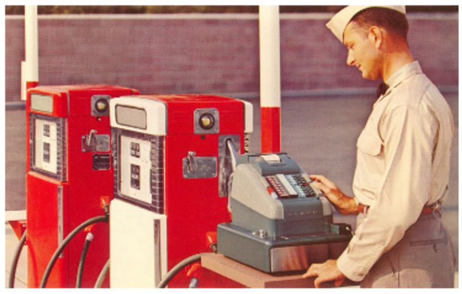
    <figcaption></figcaption>
</figure>

Trong thời kỳ đầu của Ethereum, các phí gas, cũng như những phần thường gắn liền có sẵn dành cho việc đào, được trả cho thợ đào đã đào một khối. Từ khi chuyển sang PoS, những phần thường gắn liền có sẵn trở nên thấp hơn (bởi vì làm một người xác thực thì ít tốn kém hơn là làm một thợ đào, nên bạn không cần được trả nhiều như cũ). Và hiện tại một vài phí gas bị “thiêu hủy” (Ether trong đó biến mất) thay vì trả cho những người xác thực. Kết quả cơ bản là Ethereum về tổng thể trả ít hơn cho việc bảo đảm so với trước đây.

Nhưng vẫn có những phí gas, và một số trong số chúng vẫn đến tay những người xác thực. Và, nói chung, bạn càng trả nhiều tiền gas, giao dịch của bạn được thực thi càng nhanh: Nếu Ethereum đang có nhiều hoạt động, trả nhiều tiền gas hơn sẽ cho bạn ưu tiên để thực thi các giao dịch của bạn. Nó là một máy tính chung nơi bạn có thể trả nhiều hơn để được dùng trước.

### Tokens

#### ERC-20
Một trong những điều mà một hợp đồng thông minh có thể làm trong Ethereum là tạo ra các loại tiền mã hóa mới. Các loại tiền mã hóa này thường được gọi là “token.”

Tại sao bạn lại muốn làm thế? Có một lý do mà chúng ta đã nói đến:

<figure markdown="span">
    
    <figcaption></figcaption>
</figure>

Việc này cực kỳ dễ thực hiện trên Ethereum. (Sách trắng Ethereum bao gồm một đoạn mã bốn dòng “để triển khai hệ thống token” trên Ethereum). Và thế là xuất hiện Shiba token, cái mà tự gọi nó là “một token meme phi tập trung sẽ tiến hóa thành một hệ sinh thái sôi động.” Ví von thì, nó là Dogecoin nhưng là trên Ethereum. Nó có hẳn một cuốn “Sách Gâu gâu (Woof Paper)” (t/n: nhái lại White Paper).

Nhưng có rất nhiều lý do khác để tạo ra các loại tiền mã hóa. Nếu bạn thiết lập một số ứng dụng để làm một thứ gì đó trên hệ thống Ethereum và bạn muốn tính phí những ai sử dụng thứ đó, bạn sẽ tính phí họ bằng loại tiền nào? Hoặc nếu bạn thiết lập thị trường hai mặt để kết nối những người thực hiện công việc với những người muốn công việc được thực hiện, họ sẽ thanh toán với nhau bằng loại tiền nào?

Đồng đô la là một câu trả lời khả dĩ, dù nó là một lựa chọn khó một cách kì lạ: Đồng đô la Mỹ không tồn tại trên chuỗi khối mà trong tài khoản ngân hàng. Ether là lựa chọn dĩ nhiên nhất: Bạn đã thiết lập một ứng dụng trên Ethereum, vì thế bạn nên nhận thanh toán bằng tiền tệ của Ethereum. Nhưng có một câu trả lời phổ biến trong thời gian dài: Bạn nên nhận thanh toán bằng loại tiền tệ của riêng bạn. Những người gia tăng giá trị cho dịch vụ của bạn nên được trả bằng token đặc biệt của riêng bạn; những người sử dụng dịch vụ nên trả phí bằng token đó. Và nếu sau đó dịch vụ ấy trở nên phổ biến, token đó có thể trở nên có giá trị hơn.

Chúng ta sẽ thảo luận vấn đề này kỹ hơn ở phần sau. Hiện tại, tôi sẽ chỉ nói rằng Ethereum có một tiêu chuẩn về cách triển khai những loại token kiểu này, và nó được gọi là ERC-20. Và khi có các ứng dụng phi tập trung trên chuỗi khối Ethereum, rất có thể chúng sẽ ghi rằng chúng có một ERC-20 token.

<figure markdown="span">
    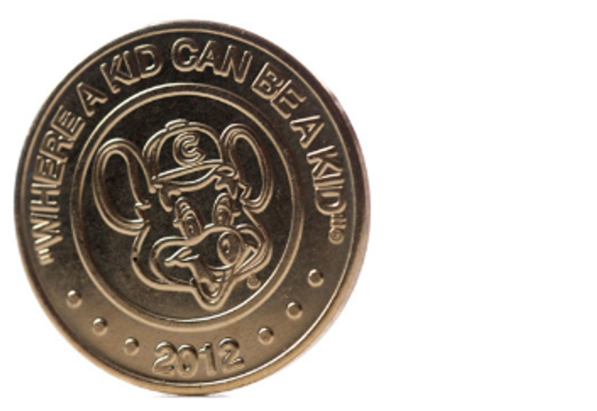    
    <figcaption>Một loại tài sản?</figcaption>
</figure>

Một thuộc tính thiết yếu của một ERC-20 token đó là nó có thể thay thế (fungible) – giống như đô la, hay Bitcoin, hay Ether. Nếu tôi tạo ra một ERC-20 token gọi là Mattcoin và đúc một tỷ Mattcoin, từng token trong một tỷ này hoạt động y hệt nhau và có thể hoán đổi bất kỳ với nhau. Những token này giao dịch ở cùng mức giá, và chẳng ai muốn có, hay nhận được, bất kỳ Mattcoin cụ thể nào cả.

#### ERC-721

Tuy thế có một cách nữa để tạo một loại token. Bạn có thể có một sê-ri (chuỗi/dãy) các token khác nhau, mỗi token có một số. Token Số 1 sẽ khác với Token Số 99, theo nghĩa là Token Số 1 có con số 1 và Token Số 99 có con số 99. Thứ này thường được gọi là một token không thể thay thế (nonfungible token), hay NFT. Chuẩn Ethereum phổ biến nhất cho các NFT được gọi là ERC-721, và đôi lúc bạn sẽ thấy cái tên này ở đâu đó.

Tôi xin trích dẫn một đoạn ngắn từ tiêu chuẩn ERC-721:

!!! warning "ERC-721"
    ERC-721 giới thiệu một chuẩn cho NFT, nói cách khác, loại hình token này độc đáo và có thể có các giá trị khác nhau so với loại Token khác từ cùng Hợp đồng Thông minh, có thể là bởi tuổi, hộ hiếm hay thậm chí điều gì khác như hình ảnh của nó. Khoan đã, hình ảnh á? 

    Đúng! Tất cả NFT có một biến số [số bất kỳ] gọi là tokenId, vì vậy với bất kỳ Hợp đồng ERC-721 nào, địa chỉ hợp đồng cặp, tokenId [số bất kỳ] phải là duy nhất trên khắp thế giới. Tuy nói vậy, mỗi dapp (t/n: decentralized app, ứng dụng phi tập trung) có thể có một “bộ chuyển đổi” sử dụng tokenId làm dữ liệu đầu vào và cho ra một hình ảnh của thứ gì đó thú vị, như zombie, vũ khí, kỹ năng, hoặc mèo con đáng yêu!

Nhìn xem tiêu chuẩn này ở mức tối thiểu thế nào, dù có liên quan tới zombie và mèo. Một NFT bao gồm một sê-ri những token được đánh số, và thứ khiến nó là một NFT đó là nó có một số không trùng lặp trong tokenId so với các token khác trong cùng sê-ri.

Nếu bạn thích tưởng tượng rằng những số khác biệt này làm cho nó trở thành thứ gì đó thú vị, như zombie, hay mèo con, thì cứ việc thôi! Hoặc nếu có một chương trình máy tính – hoặc một dapp Ethereum – ghi nhận số của bạn và nói, “Ồ, ok, đây là số tương ứng với một zombie tóc xanh lá cây và có một vết sẹo bên má phải,” thì nó có thể thoải mái nói như vậy – và thậm chí cung cấp cho bạn bức ảnh zombie đó – và bạn cũng có thể thoải mái tin như vậy.

Chúng ta sẽ trở lại với điều này sau.

<figure markdown="span">
    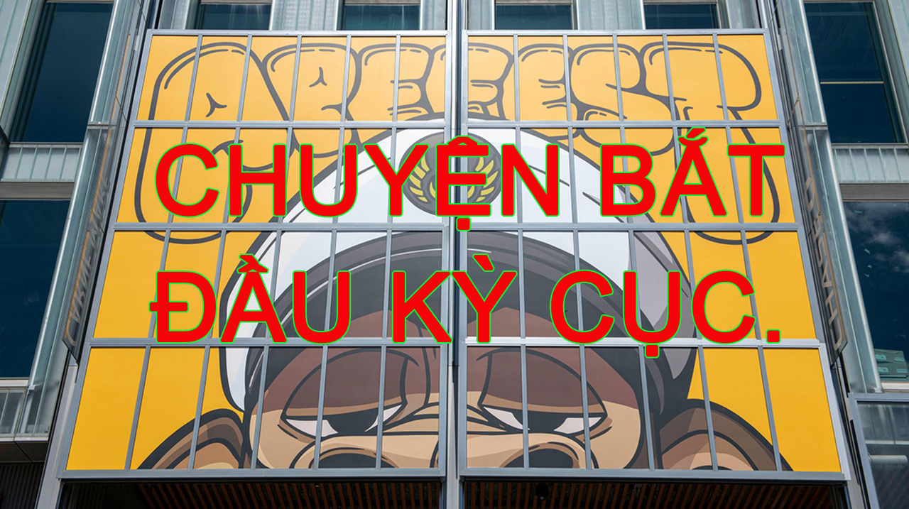
    <figcaption></figcaption>
</figure>

### Phát hành coin lần đầu

Đây là một khác biệt quan trọng nữa giữa Ethereum và Bitcoin. Bitcoin chưa bao giờ huy động tiền; Ethereum thì có.

Bạn có thể coi Bitcoin cũng giống như một sản phẩm mã nguồn mở làm vì đam mê của một gã vô danh thực sự thích mật mã học. Chi phí để xây dựng hệ thống cơ bản của Bitcoin là thời gian của Satoshi, thứ mà anh ta đã quyên tặng. Sau đó anh ta đào những Bitcoin đầu tiên và trở nên cực kỳ giàu có, có lẽ vậy, nhưng đó là chuyện sau này.

Ethereum thì hơi phức tạp hơn chút trong cách xây dựng. Vitalik Buterin là lãnh đạo về mặt trí tuệ của Ethereum, nhưng có cả đống những đồng sáng lập khác. Có các pháp nhân. Có các lập trình viên. Họ tiêu rất nhiều thời gian cho Ethereum. Họ phải trả tiền ship đồ ăn.

Có thể bạn nghĩ Vitalik đã nói kiểu: “OK, chúng ta là một công ty, chúng ta là Ethereum Inc., chúng ta sẽ bắt đầu chuỗi khối Ethereum và kiếm tiền từ nó, và chúng ta sẽ bán cổ phẩn của Ethereum Inc. để huy động tiền để xây dựng chuỗi khối. Hãy bán 20% cổ phần của Ethereum Inc. để lấy tiền mặt, cầm tiền mặt, xây dựng chuỗi khối và, không biết nữa, thu tiền bản quyền gì đó. Ethereum Inc. sẽ luôn luôn thu 0,01% của tất cả các giao dịch Ethereum.” Ethereum đã là một dự án nổi tiếng và rất được ngóng chờ trước cả khi nó trình làng, và họ có thể dễ dàng tìm thấy các nhà đầu tư.

Họ đã không làm thế, vì những lý do mang tính triết học và kinh tế. Họ muốn có một hệ sinh thái chuỗi khối phi tập trung, và nếu nó được sở hữu bởi một công ty thì sẽ làm hỏng mục đích đó. Vì vậy họ đã không bán cổ phần. Họ bán các token. Vào tháng 7 năm 2014 họ đã bán Ether “ở mức giá 1000-2000 ether/BTC, một cơ chế nhằm tài trợ cho tổ chức Ethereum và chi trả cho việc phát triển,” theo như sách trắng của Ethereum ghi. Tổng cộng, họ đã bán khoảng 60 triệu Ether để lấy 18,3 triệu đô la, trước cả khi phần công nghệ đi vào hoạt động. Khối nguyên thủy của Ethereum được đào vào tháng 7 năm 2015. Hiện nay có tổng cộng khoảng 122 triệu Ether đang tồn đọng. Một số trong số đố, giống Bitcoin, đến từ việc đào hoặc, như bây giờ, xác thực. Nhưng gần một nửa số đó là được mua, trước khi Ethereum được ra mắt, bởi những người muốn cược vào sự thành công của nó.

Camila Russo, trong cuốn sách của cô về Ethereum, đã viết:

!!! note "Note"
    Một mô hình tài chính hoàn toàn mới đã được thử nghiệm. Trong đó một nhóm lộn xộn gồm những hacker thù địch với không kế hoạch kinh doanh và không sản phẩm hoàn thiện, chứ đừng nói đến người dùng hoặc doanh thu, có thể huy động hàng triệu đô la từ hàng nghìn người trên khắp thế giới. Trước đó, bất kỳ ai muốn mua cổ phiếu của những công ty công nghệ lớn như Facebook hay Google sẽ cần một tài khoản ngân hàng Mỹ; mọi thứ thậm chí còn phức tạp hơn với những người muốn đầu tư vào các startup chưa ra thị trường để huy động vốn. Giờ đây, bất kỳ ai cũng có thể là một nhà đầu tư vào một trong những công ty công nghệ tân tiến nhất hiện nay. Tất cả những gì họ cần là kết nối internet và tối thiểu 0,01 Bitcoin.

Chuyện về sau đã đạt kết quả như các nhà đầu tư mong đợi; 60 triệu Ether ngày đó giờ trị giá hàng tỷ đô la.

Nhưng là một “mô hình tài chính hoàn toàn mới,” nó khá hỗn tạp. Nhiều người, cụ thể là các cơ quan quản lý chứng khoán, cho rằng việc các startup thường không thể huy động vốn từ công chúng nếu không có ít nhất một bản kế hoạch kinh doanh là tốt. Và theo một lý nào đó thì việc bán hàng này – Ether “trước thời đào coin,” hay “phát hành coin lần đầu (ICO)” – là nguồn cơn tội lỗi của crypto dưới tư cách là một công cụ tài chính. Có rất nhiều đội ngũ crypto khác đã sao chép cách tiếp cận của Ethereum, viết ra những kế hoạch mơ hồ để xây dựng một dự án nào đó và sau đó huy động tiền bằng cách bán trước các token mà sẽ hữu dụng nếu như dự án đó thực sự xảy ra. Tôi đã từng tweet để ví von các ICO như là “việc các anh em nhà Wright bán số dặm bay để tài trợ cho việc phát minh ra máy bay vậy.”

<figure markdown="span">
        
    <figcaption></figcaption>
</figure>

Đã có một cơn bùng nổ ICO vào 2017 mà trong đó rất nhiều dự án đã huy động được rất nhiều tiền bằng cách bán những token mà hóa ra chẳng có tý hữu ích gì. Khi một nhóm lộn xộn gồm những hacker với không kế hoạch kinh doanh có thể huy động hàng triệu đô la từ bất kỳ ai có kết nối internet, tất cả mọi người đều sẽ làm thế. Tỷ lệ thành công của bất kỳ ai trong số nhóm không-kế-hoạch-kinh-doanh này thì thấp. Tỷ lệ họ là những kẻ lừa đảo thì cao.

### Những chuỗi khác

#### Các Layer, tam nan đề

Các ý tưởng cơ bản của Ethereum – một máy tính phân tán, các hợp đồng thông minh, các dapp, các token mới, v.v.  - trở nên phổ biến trong giới crypto. Ether hiện tại là loại tiền mã hóa lớn thứ hai (dưới Bitcoin khá xa, hơn tất cả mọi coin khác khá xa).

Nhưng nó có rất nhiều đối thủ cạnh tranh: Nếu bạn xây dựng các hợp đồng thông minh, có rất nhiều các chuỗi khối khác để bạn chạy chúng, bao gồm

<figure markdown="span">
    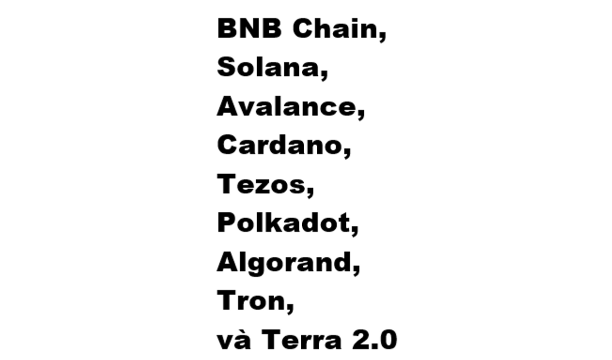    
    <figcaption>Terra 1.0 đã sụp đổ, âyyy</figcaption>
</figure>

Những nền tảng này, cũng như Bitcoin và Ethereum, được gọi là “Layer 1 blockchain (chuỗi khối Lớp kiến trúc thứ nhất)”, nghĩa là chúng hoàn toàn tách biệt với nhau; mỗi chuỗi khối Layer 1 tự duy trì sổ cái của riêng nó. Chúng cạnh tranh với nhau cũng giống như cách các nền tảng công nghệ cạnh tranh với nhau, tranh cãi rằng họ mới là bên có hiệu suất tốt hơn, có môi trường tốt hơn cho các nhà phát triển, có phong cách lập trình khác biệt, có công cụ tốt hơn.

Có một vấn đề nổi tiếng trong giới crypto là “blockchain trilemma (tạm dịch: tam nan đề chuỗi khối)”: Các chuỗi khối muốn có khả năng mở rộng (có thể xử lý rất giao dịch một cách nhanh chóng), phi tập trung (không phụ thuộc vào một vài bên được tin cậy), và bảo đảm (một thiểu số các máy tính trong mạng lưới không thể tấn công được nó). Nhưng, như cái tên tam nan đề thể hiện, bạn chỉ có thể chọn hai trong số ba cái trên.

<figure markdown="span">
    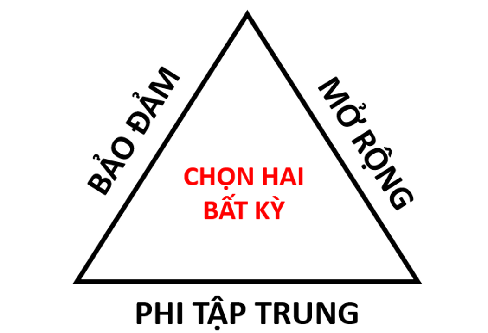
    <figcaption></figcaption>
</figure>

Bitcoin và Ethereum chọn sự phi tập trung và bảo đảm, hai thứ khiến chúng trở thành những máy tính khá chậm. Các chuỗi khối khác nhanh hơn nhưng mang tính tập trung hơn: Nếu cơ chế đồng thuận của bạn là “Chúng tôi tin và để sáu chiếc máy tính xác minh tất cả các giao dịch,” thì nó sẽ nhanh hơn thuật toán proof of work của Bitcoin. Nhưng nếu ai đó hack sáu chiếc máy tính đó thì hãy coi chừng.

Những người trên các chuỗi khối bảo-mật-và-phi-tập-trung dành rất nhiều thời gian để nghĩ về việc mở rộng. Thường việc này sẽ bao gồm thứ được gọi là các hệ thống Layer 2, thứ mà được xây dựng trên nền tảng của công nghệ Layer 1 như Bitcoin và Ethereum. Ví dụ, Bitcoin có Lightning Network (Mạng Sét), một hệ thống thanh toán Layer 2 mà về cơ bản là cho phép mọi người trên chuỗi khối Bitcoin thiết lập các thanh toán cho nhau mà không cần chạy chúng thông qua chuỗi khối. Việc này giúp các thanh toán nhanh và rẻ hơn, và chúng sẽ được giải quyết định kỳ trên chuỗi khối để bảo đảm.

Phần lớn suy nghĩ về Ethereum hiện nay là về việc làm thế nào để mở rộng nó để nó có thể thực thi một lượng lớn các giao dịch một cách nhanh và rẻ - một điều kiện tiên quyết cho việc xây dựng một máy tính có tính chất toàn cầu, hoặc thậm chí, nói một cách thẳng thắn, một hệ thống thanh toán có thể cạnh tranh được với thẻ tín dụng. Phần lớn những hoạt động nhằm phục vụ các mục tiêu đó là về các hệ thống Layer 2 chuyên thực hiện một số loại giao dịch nhất định ngoài chuỗi khối Ethereum chính (nơi mà không gian, ở mức độ nào đó, khan hiếm và đắt đỏ) và sau đó lưu kết quả thực thi vào chuỗi khối (nơi các giao dịch được bảo đảm và giữ bất biến).

#### Cầu nối, gói - wrapping

Một số người trong giới crypto có niềm tin vào một chuỗi khối duy nhất: Họ là những người theo chủ nghĩa tối đa hóa Bitcoin, hoặc những người trung thành với Ethereum hoặc Avalance hoặc Solana. Nhưng cũng có nhiều người kiểu tài tử cái gì cũng thử. Những người này thích mua nhiều loại token trên nhiều chuỗi khối khác nhau, bởi họ nhìn thấy giá trị trong nhiều nền tảng chuỗi khối, hoặc vì họ thích những các đường hiển thị giá tăng lên.

<figure markdown="span">
    
    <figcaption></figcaption>
</figure>

Một kết quả của việc này là đôi khi bạn sẽ muốn sở hữu token của chuỗi khối này trên chuỗi khối khác. Điều này xuất hiện rất nhiều trong tài chính phi tập trung (decentralized finance), hay DeFi, tức hệ thống của các sàn giao dịch crypto và các sản phẩm tài chính tồn tại trên các chuỗi khối. Nếu bạn viết các hợp đồng thông minh để trao đổi các token trên chuỗi khối, những hợp đồng thông minh này – các chương trình máy tính – sẽ phải chạy trên một chuỗi khối cụ thể. Nhưng bạn có thể không muốn giới hạn bản thân chỉ ở những token trên chuỗi khối đó. (Nói cho cùng, bạn đang xây dựng một sàn giao dịch mà.) Bạn có thể sẽ muốn viết các chương trình trên chuỗi khối Ethereum dùng để trao đổi Bitcoin hoặc viết các chương trình trên Solana dùng để trao đổi Ether. Giả dụ bạn muốn viết một hợp đồng thông minh trên Solana để đổi vài Ether lấy SOL (token của Solana). Bạn sẽ làm thế nào?

Bạn không viết được đâu. Số Ether của bạn tồn tại trên chuỗi khối Ethereum. “Bạn có Ether” là một thực tế có liên quan đến cuốn sổ cái trên chuỗi khối đó. Chuỗi khối Solana không có bản ghi nào cho việc đó. Cũng như Ethereum không có bất kỳ bản ghi nào về các token Solana. Chúng là những hệ thống riêng biệt, không tương thích. Lại là sự lặp lại của những hệ thống riêng biệt: ngân hàng, sổ đăng ký đất đai, cơ quan đăng ký xe cơ giới và cấp phép lái xe.

Đó là một câu trả lời khó chịu, khiến bạn có suy nghĩ “không thể chỉ có vậy được”. Đúng là có các cách giải quyết khác. Và cách chính được gọi là “cầu nối”. Nhìn chung, một cầu nối là một hợp đồng thông minh trên một chuỗi khối, một hợp đồng thông minh trên một chuỗi khối khác, và một kiểu chương trình máy tính được tin cậy nào đó nằm giữa hai chuỗi khối đó và truyền thông điệp qua lại. Nếu bạn muốn đổi một vài Ether lấy SOL, bạn tìm một cầu nối. Bạn gửi Ether tới hợp đồng thông minh trên Ethereum của cầu nối, và nó khóa số Ether đó lại: Liên quan đến chuỗi khối Ethereum, số Ether của bạn giờ thuộc về cầu nối đó. Chương trình máy tính ngoài-chuỗi (off-chain) của cầu nối nhận thấy điều này và báo động cho hợp đồng thông minh trên Solana của nó, cái mà đưa cho bạn phần tương đương với số Ether đó trên chuỗi khối Solana.

“Phần tương đương với số Ether đó” có thể là, tôi cho rằng, một lượng SOL nào đó tính theo tỉ giá trao đổi Ether/SOL hiện tại. (Cầu nối cũng có thể là một công cụ trao đổi.) Nhưng cách tiếp cận bình thường là lấy Ether trên Ethereum và đưa lại cho bạn “wrapped Ether (tạm dịch: Ether đã được gói lại)” (đôi khi gọi là “wETH”) trên Solana. Ether đã được gói là một token phát hành bởi hợp đồng thông minh trên chuỗi khối Solana của cầu nối, thể hiện một xác nhận với số Ether trên chuỗi khối Ethereum của cầu nối. Nó là, theo một cách nào đó, Ether trên mạng lưới Solana.

Các cầu nối là những thứ khét tiếng rủi ro trong crypto: Một hợp đồng cầu nối lớn sẽ có rất nhiều crypto được khóa bên trong, và sẽ cần thường xuyên gửi và nhận crypto từ những người lạ, và sẽ phải tương tác đa chiều giữa các môi trường khác nhau. Nếu bạn có thể tìm ra một lỗi trong cầu nối, bạn có thể kiếm chác rất nhiều tiền. Người ta làm thế khá thường xuyên. Có một cầu nối Solana/Ethereum lớn có thực tên là Wormhole; nó đã bị hack vào năm nay và mất số wETH trị giá 320 triệu đô.