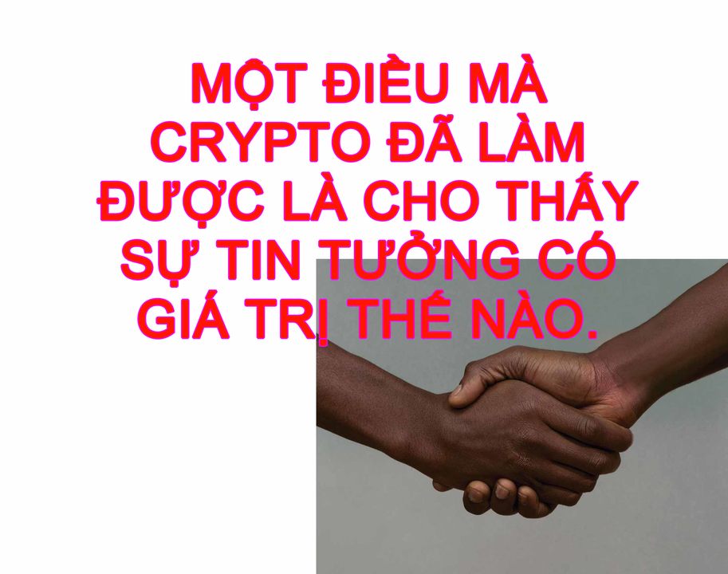
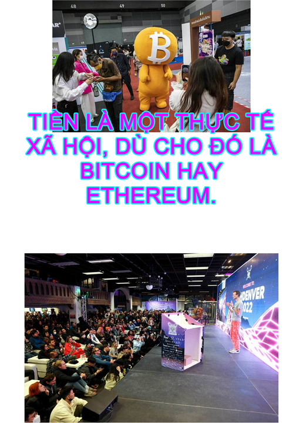
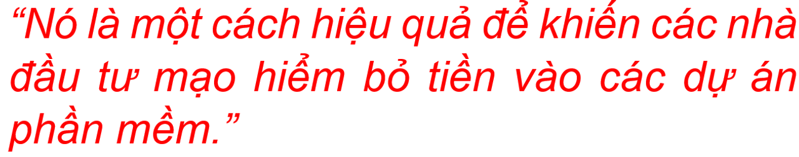

# VI. Sự tin tưởng - Tiền bạc - Cộng đồng

Hãy để tôi kể một vài câu chuyện về crypto và xã hội.

## Tin tưởng

Một câu chuyện diễn ra như này. Chúng ta sống trong một thế giới của sự tin tưởng. Nó thấm dẫm mọi thứ chúng ta làm. Chúng ta bị chiều hư; các tổ chức chúng ta phải tương tác hàng ngày đều đáng tin. Không phải tất cả, không phải mọi lúc, không phải theo mọi cách, nhưng rất nhiều trong số họ đáng tin ở mức độ cao. Chúng ta bỏ tiền vào ngân hàng, và khi ta đến đó lấy tiền, tiền vẫn ở đó.

Giới crypto – Satoshi và các môn đồ - đã nói:

<figure markdown="span">
        
    <figcaption></figcaption>
</figure>

Điều này có một sức hấp dẫn, và crypto đã trở nên rất có giá trị, và mọi người tìm cách đầu tư vào crypto – và họ tin tưởng người khác. Hết lần này đến lần khác, họ tin Quadriga, Terra, Voyager, Celsius, và hàng tá những dự án khác đã thất bại hoặc ôm tiền bỏ trốn hoặc bị hack. Họ cứ thế tin người khác một cách háo hức nhiệt thành.

Tại sao họ làm thế? Chà, có một điểm chung trong những trường hợp kiểu thế này. Những người dễ dụ vào tròng nhất thường là những người nghĩ rằng họ có tư duy độc lập và hoài nghi nhất. “Hoặc là ngân hàng hoặc là Celsius đang nói dối,” Celsius bảo mọi người, tự tâng bốc niềm tin phi lý rằng họ mới là người biết rõ được “sự thật” tăm tối của cuộc chơi.

Nhưng cũng có thứ gì đó khác nữa. Những người tin Celsius không chỉ mắc sai lầm bởi niềm tin rằng họ đang thông minh ăn đứt hệ thống, dù đúng là có những người như vậy thật. Mà còn vì họ…họ nghĩ Celsius là một ngân hàng? Nó trông cũng kiểu kiểu như ngân hàng. Nó làm mấy thứ gì đó, với crypto, trông như ngân hàng hay làm. Họ đã quen thuộc với cách ngân hàng hoạt động. Họ hiểu rằng ngân hàng thì an toàn, rằng nếu bạn bỏ tiền vào ngân hàng bạn có thể lấy lại tiền. Họ nhìn Celsius và nghĩ, “Chà, đây là một thứ lớn, có có trang web đẹp, có sẵn để người Mỹ dùng. Chắc chắn nếu nó có vấn đề thì ai đó đã làm gì đó chứ không để yên rồi.” [65]

!!! note "Note 65"
    Tại sao không ai làm bất cứ điều gì và cứ để yên? Tại sao các nền tảng này được phép lấy tiền từ khách hàng cá nhân, dùng mức đòn bẩy cao và tự sụp đổ tanh bành? Tôi nghĩ rằng câu trả lời cơ bản là do các cơ quan quản lý vẫn còn đang cố nắm bắt về việc crypto hoạt động như thế nào và ai nên quản lý nó. Có một hệ thống quản lý ngân hàng rất rõ ràng: Có những thanh tra ngân hàng biết ngân hàng hoạt động thế nào và thường xuyên đến thăm các ngân hàng để đảm bảo rằng chúng hoạt động bình thường. Trong crypto, các nền tảng lớn thường có tính phi tập trung và có quốc tịch mơ hồ hoặc không xác định, và ngay cả ở Mỹ cũng có rất nhiều quyền tài phán tranh cãi về việc cơ quan quản lý nào sẽ quản lý crypto và họ nên làm điều đó như thế nào. Nếu bạn phát hành một nền tảng crypto cực kỳ dở tệ, các nhà quản lý có thể mất nhiều thời gian để hiểu xem bạn đang làm gì và tìm ra cách ngăn bạn. Và tiền điện tử thì có thể coi đã đang ở trong chế độ tiến-nhanh-và-phá-tan-nhiều-thứ, vì vậy nó đã phá tan rất nhiều thứ trước khi các cơ quan quản lý có thể bắt kịp.

Có gì đó đáng báo động về điều này. Crypto, theo góc độ nào đó, là về việc từ chối các tổ chức xã hội, là về tính không có sự tin tưởng và chống kiểm duyệt. Nhưng nó lặng lẽ lợi dụng sự tin tưởng sâu sắc có sẵn của mọi người vào những tổ chức đó. Mọi người đã quá quen với việc tin tưởng ngân hàng đến nỗi, khi Celsius bảo họ đừng tin ngân hàng, họ bèn nói, “À, được, OK,” rồi tin Celsius sẽ hoạt động như một ngân hàng, được quản lý như một ngân hàng. Họ không lo lắng về sự mờ ám và đòn bẩy của Celsius. Họ không tự mình thẩm định các khoản vay cũng như các position DeFi của nó và yêu cầu các bằng chứng không thể chối cãi về sự lành mạnh của nó. Celsius hứa hẹn sẽ trả tiền lại, và thế là đủ tốt với họ rồi.

Nhưng cũng có gì đầy hi vọng. Lòng tin vào các tổ chức (xã hội) mạnh mẽ và kiên cường tới nỗi tất cả những huyên áo và ồn áo nhường ấy của crypto cũng không thể đánh đổ được. “Không phải chìa khóa, cũng không phải coin, hãy chỉ đặt niềm tin của bạn vào các mã có thể xác minh được,” các tông đồ crypto hét, và mọi người nghe thấy và nói, “Ừ, nghe hay đấy, nhưng tôi đang bận, tôi sẽ tin vào giao phó Bitcoin của mình cho những người lạ tốt bụng này.”

Crypto, ở khởi nguồn của nó, là về việc từ bỏ hệ thống tin tưởng xã hội đã được xây dựng suốt nhiều thế kỷ qua và thay thế nó bằng các bằng chứng mã hóa. Và rồi nó bắt đầu hoạt động và tái xây dựng hệ thống tin tưởng một lần nữa. Thật là một sự tán thành hay ho với ý tưởng về sự tin tưởng.

<figure markdown="span">
        
    <figcaption></figcaption>
</figure>

## Tiền bạc

Có một câu chuyện có liên quan về tiền bạc. Một cách để nhìn nhận tiền đó là nó là một hệ thống tín dụng xã hội. Xã hội có các cơ chế – chủ nghĩa tư bản, chính trị, v.v. – để phân bổ các nguồn lực, với nguyên tắc đại khái kiểu: “Bạn càng làm nhiều điều tốt cho xã hội, bạn càng nhận được nhiều điều tốt cho mình”. Tiền là một cách thức cơ bản để đo lường việc đó. Nếu bạn làm cái gì đó tốt cho người khác, họ sẽ cho bạn tiền, thứ bạn có thể dùng để mua cái gì đó tốt cho bản thân.

Một cách khác để nhìn nhận tiền đó là nó là một dạng thực tế khách quan bên ngoài. Nếu bạn có tiền, đó là tiền của bạn, và xã hội không có quyền để nói về việc bạn có thể giữ hoặc làm gì với nó.

Crypto khởi đầu từ quan điểm thứ hai: Số Bitcoin của bạn là của bạn, một cách bất biến; chúng chỉ được kiểm soát bởi khóa riêng tư của bạn, và không chính phủ hay ngân hàng nào có thể lấy chúng khỏi bạn. Nhưng lịch sử của crypto kể từ thời Satoshi đã làm suy yếu quan điểm này. Nếu bạn có được Bitcoin một cách bất hợp pháp, chính phủ có thể theo dõi chúng và ngăn bạn tiêu chúng. Vẫn có những người gác cổng – các sàn giao dịch crypto và đơn vị chuyển tiền điện tử thành tiền mặt và ngân hàng – quyết định bạn có thể làm gì với số tiền của mình. Crypto có thể là bất biến và “chống kiểm duyệt”, nhưng những tương tác của nó với thế giới thực thì không.

Không chỉ vậy. Crypto thậm chí còn không (thực sự) bất biến. Vào 2016, một hợp đồng thông minh quan trọng trên chuỗi khối Ethereum được gọi là DAO đã bị hack. (Hiện tại DAO là một thuật ngữ chung, nhưng DAO này là tên riêng, DAO Đệ nhất.) Có một lỗi trong hợp đồng cho phép một hacker rút tháo rất nhiều tiền từ nó, và hacker đó đã làm vậy. Ethereum lúc đó là một công nghệ mới, nên vụ hack là một sự kiện lớn.

Vụ hack này gây tranh cãi; người ta tranh cãi về việc liệu nó có phải là một vụ “hack” hay không. Một số người nói: “Nghe này, nếu các mã của hợp đồng thông minh cho phép gã hacker làm việc này, thì chúng đã được cho phép. Không có các tiêu chuẩn về tính hợp lệ nào bên ngoài, chỉ thuần túy các mã thôi, và nếu chuyện đó xảy ra bên trong các mã thì không sao cả. Nếu đảo ngược giao dịch này, chúng ta sẽ phá hủy bản chất của chuỗi khối, tức là tính không thể đảo ngược của các giao dịch.”

Một số người khác nói: “Không, thật điên rồ. Đây là một vụ hack lớn, và rất nhiều người bị mất tiền.” Dù sao điều đó cũng đủ rõ ràng – với con người thôi – rằng đây không phải là cách mà mọi người cho rằng hợp đồng thông minh sẽ hoạt động, ngay cả khi trên thực tế đó là cách nó thực sự hoạt động. Đôi khi các mã bị sai.

Mạng Ethereum đã quyết định khôi phục chuỗi khối và đảo ngược vụ hack. Điều đó khó thực hiện. Bạn không thể cứ thế tự mình dùng một đống sức mạnh máy tính và hack chuỗi khối Ethereum và đảo ngược các giao dịch. Nhưng nếu tất cả mọi người trong mạng Ethereum đồng ý làm điều đó, họ có thể làm được [66].

!!! note "Note 66"
    Hoặc đủ nhiều trong số họ đồng ý. Trên thực tế, một số ít những người không đồng tình đã tách ra, “rẽ nhánh” chuỗi khối Ethereum và bắt đầu mạng của riêng họ ;hiện được gọi là “Ethereum Classic”.

Tiền mã hóa không phải là loại tiền hoàn toàn miễn nhiễm với sự kiểm duyệt, mang tính cá nhân và bất biến. Đó là loại tiền được kiểm soát bởi sự đồng thuận, cũng giống như đồng đô la. Đó là một hình thức đồng thuận khác – đào theo mô hình proof of work, xác thực theo mô hình proof of stake, cộng đồng phi tập trung, DAO, phòng chat Discord – nhưng thứ mang lại cho bạn tiền và làm cho tiền trở nên có giá trị chính là sự đồng thuận đó.

<figure markdown="span">
    \
    
    <figcaption></figcaption>
</figure>

## Cộng đồng

Đây là một câu chuyện khác, mang tính đầu cơ hơn.

Câu chuyện bắt đầu với thứ có giá trị nhất trong cuộc đời con người, sự kết nối. Ở cùng bạn bè, kết bạn, cảm thấy được tôn trọng bởi bạn bè trang lứa: Đây là những thứ khiến cuộc đời có ý nghĩa.

“À à à à, thế à,” bạn nói, vì điều này nghe ảo ảo giả tạo. Nhưng nhìn Mark Zuckerberg giàu như thế nào kìa! Vào năm 1999, nếu bạn nói, “Một đóng góp khổng lồ cho tổng sản phẩm quốc nội của Mỹ là những người bạn ta có trên đường đời,” thì điều đó sẽ chẳng có nghĩa lý gì. Giờ đây, Facebook trị giá gần nửa tỷ đô la – tuy nhiên, công bằng mà nói, nó đã đổi tên thành Meta Platform Inc. để đánh dấu sự chuyển trọng tâm phát triển xa khỏi tình bạn.

Và chuyển trọng tâm sang vũ trụ ảo. Tôi không biết vũ trụ ảo là cái gì. Nhưng tôi đoán nó là thứ gì đó kiểu: Cuộc sống của chúng ta, các khía cạnh xã hội, trí tuệ, nghề nghiệp, thẩm mỹ, những thứ mà ta làm hàng ngày khiến cuộc đời ta có ý nghĩa, sẽ ngày càng diễn ra trên các máy tính được kết nối lẫn nhau. Thực tại của chúng ta sẽ được ngày càng được trung gian thông qua máy tính và internet.

Hóa ra, việc đời sống xã hội của con người chuyển lên internet có giá trị kinh tế, dù nếu bạn giải thích về cơ chế, nó nghe có vẻ cực kỳ tầm thường. “Nếu mọi người nói với bạn bè về máy hút bụi, và bạn cho họ xem một quảng cáo về máy hút bụi, họ có lẽ sẽ mua một chiếc máy hút bụi.” “Nếu chúng ta làm trung gian trong tình bạn của mọi người, chúng ta có thể phát tán quảng cáo.”

Một bài học quan trọng về crypto là: Một nhóm người có thể tập hợp lại trên mạng và làm cho cộng đồng của họ có giá trị kinh tế, sau đó thu lấy giá trị đó cho riêng họ. Nếu bạn giải thích cơ chế cho điều đó, nó nghe thậm chí còn tệ hơn. “Chà, thấy không, có cái token hội viên này trong cộng đồng, và nó đã tăng giá 400% trong tuần này. Ngoài ra, cái token này là mấy bức ảnh JPEG về mấy con khỉ.”

Nhưng nghe này, chẳng bao lâu nữa, chúng ta sẽ bán gì cho nhau bây giờ? Cộng đồng trực tuyến có giá trị. Có tiền để kiếm.

<figure markdown="span">
    
    <figcaption></figcaption>
</figure>

## Tài chính

Tuy nhiên, có rất nhiều cộng đồng trên mạng. Một trong số đố là Bored Ape Yacht Club, một câu lạc bộ tự chọn mà bạn có thể trở thành thành viên bằng cách mua một token hội viên đắt đỏ. Tôi đoán giá trị của cộng đồng đó là, ờ, bạn cảm thấy hay ho và độc quyền? Có thể bạn sẽ kết bạn với một người nổi tiếng hoặc một nhà đầu tư mạo hiểm, được gắn bó thông qua những con khỉ mà các bạn sở hữu.

Còn có mạng xã hội. Facebook có giá trị; làm một Facebook-Mới; cho mọi người một token; để họ tự giữ giá trị cho mình. “Các nhà quảng cáo chỉ có thể lấy dữ liệu của bạn nếu họ trả bạn bằng token,” bạn bảo mọi người, hoặc “Bạn có thể kiếm token bằng cách đăng bài, sau đó bạn có thể dùng token đó để trả cho người khác để họ đăng bài.” Tại sao lại không nhỉ?

Hoặc game. “Nếu bạn mua một khẩu laze trong game này, nó là một NFT, và nó là của bạn mãi mãi. Có lẽ bạn có thể dùng nó ở game khác nữa.” Tại sao không? Đây là những tuyên bố mang tính tiêu chuẩn về web3 mà tôi hoàn toàn không hứng thú gì. Tôi không muốn ở trong mấy lĩnh vực kinh doanh bán-dữ-liệu-quảng-cáo hoặc buôn-bán-vũ-khí-trò-chơi-điện-tử.

Nhưng các cộng đồng khác có phải là DeFi không? Kiểu, theo một nghĩa thô nào đó, tài chính phi tập trung là một cộng đồng lớn của những người tụ họp lại để giả vờ giao dịch các tài sản tài chính – hay đúng hơn, những người giao dịch tài sản tài chính trên một kiểu thế giới ảo nào đó. Họ đã xây dưng các sàn giao dịch (hợp đồng) phái sinh và các giao thức cho vay có bảo đảm và các cách thức mới để tạo lập thị trường, nhưng thay vì giao dịch cổ phiếu hay trái phiếu, họ giao dịch các loại token họ tự bịa rồi chế ra. Và những token này có giá trị, một phần vì chúng được liên kết tới các cộng đồng trực tuyến khác (bạn có thể dùng DeFi để mua Ether, sau đó dùng số Ether này để mua NFT để trở thành một người sở hữu Bored Ape), nhưng cũng một phần vì bản thân DeFi là một cộng đồng trực tuyến, hoặc cụm các cộng đồng, và các token mà nó giao dịch là các điểm trong cộng đồng đó. Nếu bạn xây dựng một nền tảng giao dịch hay ho hoặc thực hiện một giao dịch hay ho, bạn sẽ kiếm được token, thứ bạn có thể tiêu tvào những nền tảng hoặc giao dịch hay ho khác. Các trader tài chính tài năng sẵn sàng làm việc trong các dự án để nhận những token này. Nếu bạn có một số lượng nào đó các token này, bạn có thể thuê những trader này.

Một vấn đề, cũng là một lợi thế, của crypto là nó tài chính hóa mọi thứ. “Sẽ thế nào nếu việc đọc cuốn sách yêu thích có thể làm cho bạn trở thành một nhà đầu tư vào cổ phiếu của cuốn sách đó.” Ầy, nó là một câu chuyện mà chỉ một nhà đầu tư mạo hiểm mới có thể yêu thích được. Mặt khác, nó là một câu chuyện mà các nhà đầu tư mạo hiểm yêu thích. Một miêu tả tối giản về crypto là:

<figure markdown="span">
        
    <figcaption></figcaption>
</figure>

Hoặc nó là một mô hình Ponzi. Tầm nhìn của web3 về việc biến khách hàng trong mọi dự án đồng thời là nhà đầu tư của dự án đó có hiệu quả trong các giai đoạn dư thừa đầu cơ, nhưng nó là một thảm họa trong một vụ sụp đổ. “Tất cả khách hàng của chúng tôi đều có một cổ phần trong thành công của chúng tôi” thì nghe rất hay khi giá token tăng, nhưng nó cũng có nghĩa là tất cả khách hàng của bạn cũng sẽ trở nên nghèo hơn khi giá token đi xuống, điều này khiến việc thu hút khách hàng trở nên khó khăn.

Nhưng chúng ta thực sự mới chỉ thấy sự bùng nổ. Vấn đề với việc làm cho tất cả các sản phẩm đồng thời là một mô hình Ponzi là bạn không thể chắc chắn nếu khách hàng của bạn tham gia là vì sản phẩm hay vì Ponzi. Khi nó sụp đổ, bạn cũng có thể sụp đổ. Nếu khách hàng vẫn ở lại – nếu họ vẫn sử dụng sản phẩm của bạn mà không làm giàu từ token – thì thế có nghĩa là sản phẩm của bạn rất hứa hẹn. Nếu không, chà, bạn đã điều hành một mô hình Ponzi.

Cơn sốt đầu cơ điên cuồng vào crypto và web3 trong vài năm qua đã thu hút rất nhiều tiền bạc và sự chú ý và các tài năng vào thế giới crypto. Phần lớn số tiền và sự chú ý và các tài năng đó hoàn toàn được dùng để tối ưu hóa cơn đầu cơ điên cuồng đó, để điều chỉnh nền kinh tế token và bơm đòn bẩy cho các vụ cược để mọi người có thể kiếm được nhiều tiền nhất có thể mà không cần thực sự xây dựng bất cứ thứ gì. Tuy nhiên, có lẽ cũng có một số được dùng cho việc xây dựng.

Giờ thì cơn sốt đầu cơ điên cuồng, nếu chưa biến mất, cũng đã ít nhất nguội lại. Hiện tại, nếu bạn đang cố huy động tiền cho một dự án web3, dự án đó có lẽ nên làm được gì đó bên cạnh việc phát hành một loại token giá cứ tăng tăng. Nếu nó tạo ra giá trị cho mọi người, nếu sản phẩm là cái gì đó mọi người muốn, thì token của nó sẽ tự xoay sở được. Những người yêu thích crypto vẫn còn rất nhiều thứ để chứng minh về mặt đó. Một lý do mà cuộc khủng hoảng 2022 trong lĩnh vực crypto không tạo ra một sự thiệt hại lây lan là vì crypto có quá ít sự kết nối với những thứ quan trọng với mọi người. Người ta chơi game và đánh bạc trên chuỗi khối, nhưng họ không có các khoản vay thế chấp tài sản trên đó.

Có lẽ đây là một cái lò ngốn tiền đều đặn mang tính tự quy chiếu dành cho những dân tài chính thông minh, nhưng thành thật mà nói, sẽ thật kỳ dị nếu tất cả chỉ có vậy. Nếu nhiều dân tài chính thông minh đã chuyển sang hệ thống tài chính crypto đến thế, nếu họ thấy nó thú vị, thiết thực và hiệu quả hơn hệ thống tài chính truyền thống nhiều đến thế, chắc chắn rồi họ cũng sẽ tìm ra cách để làm cho nó trở nên, kiểu, hữu ích.

Đây là một cách khác để kể câu chuyện này. Có thế giới thực, và người ta làm gì đó trong thế giới thực. Họ trồng trọt và xây nhà.

<figure markdown="span">
        
    <figcaption></figcaption>
</figure>

Qua nhiều thế kỷ, một hệ thống tài chính xuất hiện và phát triển, như một phụ trợ cho thế giới thực. Hệ thống tài chính đó cho phép mọi người làm được nhiều thứ hơn trong thế giới thực. Họ có thể xây các đường sắt, nhà máy bán dẫn, hay ô tô điện, vì họ có thể huy động tiền từ người lạ để tài trợ cho các hoạt động của họ. Họ có thể mua nhà lớn hơn, bởi vì họ có thể vay tiền từ ngân hàng. Họ cũng có thể giao dịch các quyền chọn mua thua lỗ trên GameStop, vì nó vui và bạn có thể làm meme về nó, nhưng nó là một tính năng tình cờ của một hệ thống tài chính mà chủ yếu làm những thứ nghiêm túc trong thế giới thực.

Đến 2008, hay 2022, hệ thống đó trông khá trừu tượng. Khi bạn nghĩ về tài chính hiện đại, bạn thường nghĩ về những thứ như các quyền chọn GameStop, hoặc hệ thống thanh toán cho luồng lệnh cho phép các thứ ấy giao dịch, hoặc các nghĩa vụ nợ được thế chấp tổng hợp liên quan đến các nghĩa vụ nợ được thế chấp liên quan đến nhóm các chứng khoán được bảo đảm bằng thế chấp. Có một ngôi nhà đâu đó dưới ma trận các nghĩa vụ nợ được thế chấp này. Toàn bộ nền tài chính hiện đại tinh vi có thể được truy ngược trở lại, từng bước một, tới thế giới thực. Hẳn nhiên, bây giờ có rất nhiều bước. Nhưng điểm quan trọng là nền tài chính hiện đại tinh vi đó được xây dựng lên, từng bước một, từ thế giới thực. Thế giới thực có trước, rồi đến tài chính, rồi đến các hiện tượng tài chính phụ phức tạp hơn.

Trong khi đó, crypto đã xây dựng một hệ thống tài chính từ tư duy nguyên bản, thuần khiết và hài lòng với chính nó, không bị hoen ố bởi việc tiếp xúc với thế giới thực. (Tôi phóng đại đó: Chức năng cơ bản về việc gửi tiền bằng crypto, mục tiêu ban đầu của Satoshi, là khá thực tế. Nhưng mà, nếu không thì.) Điều đó thật thú vị nếu coi nó như một đối tượng để chiêm nghiệm thẩm mỹ, và tôi đã thích thú chiêm ngưỡng nó, và tôi hy vọng bạn cũng vậy. Và nó đã thu hút rất nhiều người yêu thích tài chính, những người cũng thích chiêm ngưỡng nó, và thích làm giàu. Và nhiệm vụ của họ là xây dựng từ trên xuống, từng bước một, để kết nối hệ thống tài chính của crypto trang nhã đó với thế giới thực. Bạn xây dựng được một sàn giao dịch phái sinh, hay, rất thú vị. Nhưng liệu một công ty thực sự có thể dùng nó để phòng ngừa một rủi ro thực sự mà nhà máy của nó đang phải đối mặt? Bạn xây dựng được một nền tảng cho vay phi tập trung, tuyệt vời. Nhưng liệu một gia đình trẻ có thể dùng nó để mua nhà?

Và câu trả lời, bạn biết đấy, có lẽ là, hãy cho nó thêm thời gian. Hệ thống crypto đã thu hút được rất nhiều người thông minh muốn giải quyết những vấn đề này, một phần vì chúng là những vấn đề thú vị về mặt trí tuệ và một phần vì giải quyết chúng sẽ khiến những người đó giàu lên.

Nhưng một phần khác của câu trả lời có lẽ là thế giới thực – trồng trọt, xây nhà – là phần nhỏ hơn của đời sống kinh tế so với trước đây, và việc thao túng các đối tượng có tính tượng trưng trên các cơ sở dữ liệu trực tuyến là phần lớn hơn. Cuộc sống hiện đại được sống trên các cơ sở dữ liệu. Và crypto là về một cách thức mới để lưu giữ các cơ sở dữ liệu (trên chuỗi khối).

Nếu bạn xây dựng một hệ thống tài chính mà gặp vấn đề với nhà cửa nhưng lại đặc biệt phù hợp với việc tài trợ cho các trò chơi điện tử - một hệ thống cho phép bạn lưu giữ nhân vật của mình trên chuỗi khối, và vay tiền từ một nền tảng phi tập trung để mua một bộ trang phục hay ho cho nhân vật, hoặc gì gì đó, tôi không biết nữa – thì hệ thống đó có lẽ sẽ ngày càng có giá trị khi trò chơi điện tử ngày càng trở thành một phần quan trọng của cuộc sống. Nếu bạn xây dựng một hệ thống tài chính mà sức hấp dẫn lớn nhất của nó là cơ sở dữ liệu, nó sẽ rất phù hợp với một thế giới được sống trong các cơ sở dữ liệu. Nếu thế giới ngày càng có nhiều phần mềm, quảng cáo, mạng xã hội, và, lạy Chúa trên cao, vũ trụ ảo, thì hệ thống tài chính crypto không cần phải xây dựng từ trên xuống để kết nối với thế giới thực để trở nên có giá trị. Thế giới có thể đến với thế giới crypto.

<figure markdown="span">
    
    <figcaption></figcaption>
</figure>