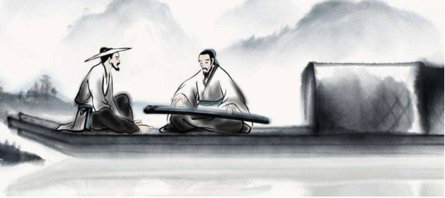

# Bức thư số 6: Về học tập và chia sẻ kiến thức

Bạn thân mến!

Tôi mới hiểu ra một điều quan trọng, đó là tâm trí tôi không những chỉ loại bỏ những tật xấu, mà nó còn đang thực sự chuyển hóa đến một mức cao hơn của sự thông thái. Xin đừng hiểu lầm điều đó là tôi không còn tật xấu nào, để sửa chữa hay để làm cho tốt hơn. Bạn biết tôi không phải kẻ tự phụ như vậy, đúng không? Và, một điều hiển nhiên là chúng ta luôn có thể làm mình trở nên tốt hơn mỗi ngày. Nhưng, chỉ cần tâm trí ta nhận ra những tật xấu sai lầm của mình mà trước đây ta không biết đã là một thành công rồi. Cũng như với nhiều người bệnh, riêng việc được biết mình đang có bệnh cũng đủ để mở tiệc mừng rồi (để có thể kịp thời chữa trị).

Bạn có thể tin rằng không điều gì tôi mong ước hơn là được chia sẻ với bạn những chuyển hóa đột ngột ấy trong tâm trí mình. Vì như vậy tôi mới có thể tin tưởng hoàn toàn vào tình bạn của chúng ta. Khi mà không một mưu toan, lợi ích cá nhân hay bất cứ thứ gì tương tự có thể thay đổi được tình cảm bạn bè, đó mới là tình bạn thật sự, thứ mà người ta mong muốn cả cuộc đời.

<figure markdown="span">
    
    <figcaption>Người quen thiên hạ nhiều vô kể Thử hỏi tri kỷ được mấy người!</figcaption>
</figure>

Tôi có thể kể cho bạn hàng tá những người quen biết rộng mà không có đến một người bạn thân. Vì tình bạn thực sự là khi hai tâm trí đều hướng tới những điều thiêng liêng tốt đẹp (ý chỉ những phẩm cách của con người mà Stoics đề cao và cố gắng gìn giữ). Vì khi đó họ biết rằng họ chia sẻ mọi thứ, từ trong suy nghĩ đến những thử thách khó khăn của cuộc đời.

Bạn chắc sẽ khó tưởng tượng được sự trưởng thành trong tâm tưởng của tôi mỗi ngày trong giai đoạn này. Và vì vậy nên bạn sẽ muốn biết đâu là phương pháp, hay thứ gì đã khiến tôi trở nên tiến bộ đến vậy. Thực ra, không cần bạn nói, tôi cũng rất muốn chia sẻ với bạn tất cả những thứ đó.

Vì hạnh phúc của việc học được một thứ gì đó thực ra nằm ở khả năng ta có thể truyền hay dạy nó cho người khác. Không gì có thể làm tôi hứng thú, dù nó có đem lại lợi ích lớn đến đâu đi chăng nữa, nếu tôi phải giữ nó khư khư cho bản thân mình. Nếu sự thông thái được trao cho tôi với một điều kiện là tôi phải giấu nó và không cho ai khác biết, tôi sẽ không ngần ngại mà từ chối nhận nó.

Vì vậy, tôi sẽ gửi cho bạn đống sách của tôi, thậm chí, tôi sẽ đánh dấu cho bạn, để bạn đỡ tốn thời gian và có thể ngay lập tức tiếp nhận những điều quý giá trong đó.

Nhưng, sách sẽ không thể đem lại cho bạn nhiều bằng việc chúng ta có thể gặp gỡ trực tiếp, vì con người thường tin tưởng những điều mắt thấy hơn là tai nghe. Đồng thời, học từ những bài học trong sách là cả một đoạn đường dài (ý chỉ sự xa xôi giữa lý thuyết và thực hành).

Cách học nhanh và hiệu quả nhất là từ ví dụ cụ thể trong cuộc sống. Bạn có nhớ Plato, Aristotle và hầu hết những triết gia (cổ đại) khác, đều học từ việc nhìn cách Socrates sống mỗi ngày chứ không phải lời dạy của ông. Và thực ra, việc học trực tiếp này có lợi cho cả thầy và trò đấy nhé. Giờ, như thường lệ, để tôi chia sẻ với bạn thứ tôi học được ngày hôm nay, từ Hecaton (một nhân quan trọng khác của Stoicism):

- _Bạn hỏi thứ gì tôi nghiệm được gần đây? Tôi bắt đầu làm bạn với chính mình._

Một lời khuyên quá giá trị luôn: một người không thể cô đơn nếu anh ta có thể làm bạn với chính bản thân mình. Tin tôi đi, anh ta sẽ là một người bạn lý tưởng với tất cả mọi người.

Tạm biệt!