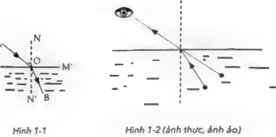

# Chương 1: Định luật Murphy - Mọi thứ đều có quy luật phát triển bất ngờ

!!! note "Note"
    Dường như vận mệnh luôn muốn trêu đùa bạn: Càng bận tâm tới điều gì thì ban càng dễ đánh mất điều đó, càng muốn thành công thì bạn càng dễ thất bại, những điều tốt đẹp bạn mong đợi không bao giờ xảy ra, song những điều tồi tệ bạn suy đoán lại luôn xuất hiện. Đừng nản lòng, vì mọi người đều bị định luật Murphy trêu đùa.

<figure markdown="span">
    
    <figcaption></figcaption>
</figure>

## Định luật của các định luật - Định luật Murphy

> Một số người thường phàn nàn rằng: “Tại sao tôi lại xui xẻo đến vậy?” Sự thật là khi bạn cảm thấy xui xẻo, vẫn có người còn xui xẻo hơn bạn. Định luật Murphy tồn tại ở khắp mọi nơi và ảnh hưởng tới tất cả mọi người.

Định luật Murphy là một hiệu ứng tâm lý, hay còn được người ta gọi đùa là “định luật xui xẻo”. Đây là một trong ba phát hiện lớn của văn hóa phương Tây thế kỷ 20 và được coi là định luật của các định luật.

Định luật Murphy bắt nguồn từ câu nói tự giễu của kỹ sư người Mỹ Edward Murphy.

_Năm 1949, căn cứ không quân Hoa Kỳ đã tiến hành một cuộc thí nghiệm — thí nghiệm giảm tốc và giảm trọng lượng tên lửa MX981, tới mục đích nghiên cứu giới hạn chịu đựng của phi công bằng sự thay đổi tốc độ nhanh chóng. Bấu giờ, Thượng йу Murphy đã tham gia обі ће cách là một kỹ sư._

_Trong quá trình chuẩn bị, có một bước trong thí nghiệm là phải gắn 16 cảm biến одо giá đỡ của ghế đôi tượng tham gia. Cảm biến cần được cài đặt hai dâu, mà nếu kêt nói bị đảo ngược thì sẽ không thể đọc được dữ liệu từ thí nghiệm. Kết quả là Thượng úy Murphy phát hiện hệ thông dây của 16 cảm biển đều bị đảo ngược!_

_Sau đó, Thượng úy Murphy đã thừa nhận lý do thất bại của thí nghiệm là do ông không tính toán tới tiệc có người nối ngược dâu khi thiết kế cảm biến. Vì thể; ông đã tự cười nhao bản thân: “Nếi: một điều gì đồ có thể được xử lý sai cách, thì cuối cùng chắc chắn sẽ có người xử lý nó theo cách sai ấu.”_

Định luật Murphy ra đời vào giữa thế kỷ 20, thời điểm nền kinh tế châu Âu và Hoa Kỳ đang phát triển nhanh chóng, khoa học kỹ thuật không ngừng tiến bộ, con người không chỉ chiến thắng bệnh tật mà còn bay vào vũ trụ, phá vỡ nhiều trở ngại nặng nề và lập nhiều chiến công tưởng như không thể thực hiện được. Vì vậy, mọi người đều lạc quan cho rằng, con người ta có thể vượt qua mọi khó khăn, cải tạo vạn vật, không có vấn đề gì là con người không đánh bại được. Sự ra đời của định luật Murphy đã gióng lên hồi chuông cảnh tỉnh: Kỹ thuật sẽ cải tiến từng ngày nhưng con người ta sẽ luôn mắc phải sai lầm.

Điều này có nghĩa là dù khoa học kỹ thuật phát triển tiên tiến như thế nào đi nữa, nhưng chỉ cần có sự can thiệp của con người thì không thể đảm bảo toàn bộ các mắt xích đều không xảy ra sai sót. Trên thực tế, liên kết càng phức tạp và càng có nhiều người tham gia thì xác suất sai sót càng lớn.

Sau đó mọi người mở rộng định luật Murphy và giải thích bốn điều sau:

1. Mọi chuyện không đơn gián như vẻ bề ngoài.
1. Thời gian hoàn thành các nhiệm vụ sẽ lâu hon bạn mong đợi.
1. Nếu mọi việc có khả năng хау ra sai sót thì xác suất mắc sai sót rất lớn.
1. Nếu bạn lo sợ điều gì xảy ra, điều đó sẽ xảy ra.

Định luật Murphy cho chúng ta biết rằng chỉ cần có cơ hội, mọi thứ sẽ luôn đi hướng xấu mà bạn nghĩ tới. Ví dụ, khi lát bánh mì rơi xuống đất, bạn lo lắng mặt phết mứt sẽ úp xuống, và thực tế lại đúng với những gì bạn lo lắng.

Định luật Murphy có phạm vi ứng dụng rộng rãi, nó cho thấy một hiện tượng tự nhiên và xã hội độc đáo. Công thức cực đoan của nó là: Nếu điều tồi tệ có thể xảy ra thì dù khả năng nhỏ tới mấy, nó vẫn sẽ xảy ra và thậm chí còn gây ra thiệt hại ở mức độ lớn nhất.

Định luật này không phải định luật nhấn mạnh xác suất sai Tâm của con người mà chỉ thể hiện tính tất yếu trong sự tình cờ ngẫu nhiên. Chúng tôi sẽ minh họa bằng một ví dụ như sau.

_Có người rút một xấp tiền từ ngân hàng, anh ta vira sợ người khác biết vira sợ bản thân làm mất nên cứ một lúc lại sờ túi xem thử tiền còn ở đó hay không. Kết quả là, bởi vì sờ túi quá nhiều lần nên anh ta làm rơi тї tiền._

Xét từ mặt ngữ nghĩa, rõ ràng định luật Murphy là luận điệu của chủ nghĩa bi quan. Nó nhấn mạnh rằng mọi thứ không thể nào phát triển theo chiều hướng tốt đẹp. Nếu có khả năng trở nên tồi tệ, sự việc chắc chắn sẽ trở nên tồi tệ. Vậy thì chúng ta chỉ có thế phó mặc cho số phận hay sao?

Thực tế, ở một góc độ khác, định luật Murphy chỉ đang nhắc nhờ chúng ta rằng trước khi làm một việc gì đó, bạn phải chú ý đến kha năng sẽ xảy ra nhiều sai lầm khác nhau trong từng chi tiết dù là nhỏ nhất và lập phương án dự trù một cách chu toàn. Như vậy, bạn mới có thể loại bỏ các nguy cơ tiềm ẩn ngay từ trong trứng nước.

!!! abstract "Tóm tắt"
    1. Định luật Murphy là định luật tâm lý học tuyệt vời, nó cho thấy một hiên tượng phố biến đang tồn tại trong xã hôi loài người và thế giới tự nhiên: Bất cứ khi nào có thế, điều tồi tê sẽ luôn xảy ra.
    1. Định luật Murphy gióng lên hồi chuông cảnh báo chúng ta: Điều tồi tệ chắc chắn sẽ xảy ra, đừng mù quáng tin vào kỹ thuật hay xác suất.
    1. Định luật Murphy nhắc nhở chúng ta rằng, trước khi làm việc gì cũng phải suy xét tới các lỗi có thể mắc phải và đề phòng nguy cơ tiềm án. Như vậy, chúng ta mới có thế giảm xác suất mắc sai sót.

## Mất giác quan và giác quan thứ sáu luôn mắc sai lầm

### NĂM GIÁC QUAN BIẾT “NÓI DỐI”

!!! quote "Quote"
    _Bạn có tin “mắt thấy là thật, tai nghe là giả” không? Bạn có tin vào giác quan thứ sáu không? Trên thế giới này, sai lầm ở khắp mọi nơi và ngay cả các giác quan khác nhau của cơ thể con người cũng có thể mắc sai lầm. Đây chính là tác động sơ khai nhất của định luật Murphy với con người. Vì thế, niềm tin mù quáng có thể sẽ dẫn tới nhận thức sai lầm và từ đó đưa ra kết quả sai lầm._
    
NĂM GIÁC QUAN BIẾT “NÓI DỐI”

Con người ta có năm giác quan và bộ não. Năm giác quan sẽ truyền thông tin mà chúng nhìn, nghe, ngửi, nếm và cảm nhận được tới bộ não. Bộ não chịu trách nhiệm xử lý các thông tin này và hướng dẫn cơ thể phản ứng lại. Tuy nhiên, thông tin cảm nhận được từ năm giác quan chưa chắc đã là sự thật.

#### Thị giác: Đừng quá tin vào điều “mắt thấy là thật”

Nhiều người tin vào “mắt thấy là thật” và lấy đó làm lý do để chí trích người khác. Song, cũng không ít lần con người ta bị hiện tượng giả dối che mờ đôi mắt và tinh hinh thực tế không giống với những gì bản thân nhìn thấy, thậm chí có những pha “quay xe” mà mọi người không thể ngờ tới.

Ví dụ, khi xem một ảo thuật gia biểu diễn, mặc dù chúng tạ nhìn thấy tận mắt nhưng vẫn không thể hiếu màn trình diễn đã điển ra như thế nào. Những gì chúng ta nhìn thấy chỉ là ảo ảnh đo ảo thuật gia sử dụng thủ thuật che mắt.

Có thể thấy được, đôi mắt chúng ta mang tính lừa đảo ở một mức độ nhất định. Khi nhận biết sự vật hoặc đánh giá ai đó, một vài người thường “mở một mắt nhắm một mắt”, dù có tỉnh tường đến mấy thì vẫn không thể ngăn được sự xuất hiện của những hiện tượng giả dối. Đặc biệt, khi chúng ta đã có định kiến sẵn từ trước thì càng đễ bóp méo sự vật, sự việc.

#### Thính giác: Không muốn nghe không có nghĩa là không nghe thấy

Trong một bữa tiệc cocktail, khắp nơi đều có tiếng nhạc, tiếng nói chuyện, tiếng va chạm của những ly rượu..., thế nhưng con người ta vẫn có thể thưởng thức âm nhạc mà bản thân yêu thích hay tập trung nghe ai đó trò chuyện, dù đối phương nói nhỏ tới mức nào cũng có thể nghe rõ nội dung. Hiện tượng này được gọi là “hiệu ứng tiệc cocktail”.

Tuy nhiên, quá trình xử lý âm thanh của bộ não không hề đơn giản. Những tiếng ồn xung quanh không biến mất chỉ vì chúng ta không muốn nghe thấy mà chúng chỉ bị kiểm soát một cách vô thức.

Trên thực tế, những tiếng động dường như bị bó não bó qua sẽ được kiểm tra từ khóa một cách vô thức trước khi “biến mất”, và những âm thanh mà bộ não cảm thấy thú vị sẽ được phát hiện.

!!! example "Ví dụ"
    Khi nhạc chuông giống như điện thoại di động của bạn kêu lên, bạn sẽ nhìn vào nơi phát ra tiếng nhạc đó. Nếu ai đó nhắc đến tên bạn, tai bạn sẽ nóng ran lên...

Ngoài ra, những tiếng nói thì thầm sẽ dë bị phát hiện hơn là tiếng nói lớn. Ví dụ, khi đôi vợ chồng bên cạnh bạn đang nói thầm với nhau, bạn bắt đầu cảnh giác và cố gắng hết sức để nghe nội dung cuộc trò chuyện của họ. Khi nghe lén người khác nói chuyện, bạn thường có xu hướng bỏ lỡ một số nội dung, thế nhưng não bộ của bạn sẽ tự động bổ sung những nội dung đó.

Thông thường, nó có thế đoán đúng, song cũng có lúc đoán sai.

#### Vi giác và khứu giác: Cảm giác khi ngửi và khi ăn vào miệng khác hẳn nhau.

Một số món ăn ngon rất khó ngửi, chẳng hạn như sầu riêng, vậy nên sẽ để lại ấn tượng xấu “chắc chắn rất khó ăn” với mọi người. Nhưng sau khi nếm thử rồi mới phát hiện, bản thân chúng ta đã bị mùi “thum thủm” kia lừa gạt, những món ăn đó chẳng những không khó ăn mà còn vô cùng ngon.

Rốt cuộc tại sao lại như vậy? Hiện tượng này chứa đựng, những nguyên lý khoa học nào chứ?

Đó là bởi vì sau khi ăn xong những món ăn này, các phân tử trong mùi vị của thức ăn phát tán và lan rộng từ khoang miệng tới phần cuói của khoang mũi, mùi vị kết hợp với trải nghiệm thuc të thu nhân được sẽ có cảm giác khác hoàn toàn với việc chỉ ngửi bằng mũi. Cách thức cảm nhận bằng phần cuối của khoang mũi, kết hợp với vị giác và khứu giác có một tên gọi khác chuyên nghiệp hơn là “ngửi lại”. Đây là một trong những nguyên nhân thật sự của những món ăn mỹ vị “ngửi thì thối nhưng ăn lại rất ngon”.

#### Xúc giác: Xúc cảm như có như không,

Cơ thể con người có hàng triệu tế bào thần kinh cảm giác có thể truyền thông tin cho não bộ bất cứ lúc nào, không chỉ bao gồm xúc cảm mà còn có đau đớn, áp lực, nóng bức, lạnh giá,... Thông thường, chúng ta rất dë ngó lơ những thông tin này nhưng đôi khi sẽ phải chịu ảnh hưởng của chúng.

!!! example "Ví dụ"
    Vào một khoảnh khắc nào đó, bạn sẽ cảm thấy đôi giày mình đang mang hơi chật một chút, thế nhưng một lúc sau lại quên mất. Khi hai tay đang cầm nhiều đồ cùng lúc thì đột nhiên bạn lại thấy ngứa mũi và muốn lấy tay gãi vài cái. Khi đang nằm thoải mái trên bãi cỏ phơi nắng, bạn luôn cảm thấy có sâu đang bò qua bò lại trên người mình...

### GIÁC QUAN THỨ SÁU THẦN BÍ

Giác quan thứ sáu cũng được gọi là “cảm nhận cơ thể”, là một loại cảm giác ngoài năm giác quan. Rất nhiều người hoài nghỉ: Trên thế giới này thật sự tồn tại giác quan thứ sáu hay sao? Trên thực tế, mỗi người dù ít hay nhiều đều sẽ có giác quan thứ sáu.

!!! example "Vi dụ"
    Khi đi trên đường, bạn thường nghe thấy tiếng bước chân vọng tới từ phía sau nhưng khi ngoảnh ra sau lại không thấy gì cả; khi nằm ngủ không đúng tư thế, lúc tỉnh dậy bạn sẽ thấy cảnh tay bị të tới nỗi mất cảm giác; chuyện đã từng xuất hiện trong giấc mơ lại xảy ra trong cuộc sống thực tế; khi tới một nơi nào đó, bạn nhận ra cảnh vật nơi đây rất quen, mặc dù bạn chưa bao giờ đặt chân tới địa điểm này...

Trên thực tế, nhiều khi giác quan thứ sáu không quá chuẩn xác, vì vậy chúng ta không thể đưa ra phản ứng nếu chỉ dựa vào giác quan thứ sáu của bản thân.

!!! note "Note"
    1. Năm giác quan cũng sẽ “nói dối”. Tin tưởng một cách mù quáng vào năm giác quan có thể sẽ đưa ra phản ứng sai lầm.
    2. Giác quan thứ sáu cũng chính là “trực giác” mà con người ta thường nói. Nó tồn tại trong các phương diện cuộc sống nhưng phần lớn giác quan thứ sáu không chính xác, vậy nên chúng ta không thể dựa dẫm quá nhiều vào nó.

## Thời gian: Bị ý thức bóp méo nghiêm trọng trong thế giới hiện thực

!!! abstract "Note"
    _Có người hình dung thời gian “thấm thoát thoi đưa”, “như bóng câu qua cửa sổ”; cũng có người miêu tả thời gian “chậm chap như trôi qua vài thế kỷ“ Trên thực tế, con người ta thường bị ý thức khống chế cảm giác về thời gian._

Nhiều người có cảm giác như thế này: Thời gian luôn thích đi ngược lại với con người. Ví dụ: Khi con người ta vui vẻ, thời gian luôn trôi qua rất nhanh; khi con người ta cảm thấy nhàm chán, đau khó thì thời gian lại trôi qua chậm như ốc sên đang bò, khiến ta cảm thấy khó chịu từng phút từng giây; hoặc khi con người ta muốn mau chóng hoàn thành một việc thì lại luôn “dục tốc bất đạt”.

Thực ra những điều này đều là ảo giác của con người với thời gian, là kết quả sau khi ý thức con người tiến hành phán đoán thời gian một cách chủ quan.

Vào những năm 1930, nhà tâm lý học Hudson Hoagland đã phát hiện ra một hiện tượng thú vị: Thời gian mà vợ ông ấy ước tính khi bị ốm luôn dài hơn thời gian thực tế. Chẳng hạn, ông mới rời đi 40 phút nhưng người vợ lại luôn nghĩ rằng ông ấy đã rời di một tiếng. Vậy nên, ông đã tiến hành một loạt thí nghiệm về hiện tượng này trong thời gian vợ mình bị bệnh. Sau khi người vợ khỏi bệnh, ông ấy bắt đầu tìm kiếm nhiều đối tượng thí nghiệm hơn. Hoagland đã thử nghiệm bằng cách quấn sợi dây hồng ngoại quanh đầu người tham gia thí nghiệm, kết quả phát hiện ra rằng thời gian mà những người có nhiệt độ cơ thể tăng cao ước tính dài hơn thời gian thực tế.

Con người ta thường nói: “Bệnh tới như núi đổ, bệnh đi như kéo tơ”. Nói như vậy ắt hẳn có lý do của nó. Cơ thể con người từ khi khỏe mạnh đến lúc bị bệnh vốn là một quá trình diễn ra chậm rãi. Tuy nhiên, quá trình này chỉ lặng lẽ diễn ra bên trong cơ thể nên con người ta không thể biết được. Trong tình huống bình thường, dưới tác động của lối sống không lành mạnh trong, thời gian dài, thể chất của con người ta sẽ đần chuyển sang chiều hướng xấu. Khi mọi người nhận ra và cảm thấy cơ thể có điều bất thường, đồng thời được chẩn đoán bị bệnh thì tình trạng thể chất của họ thường đã khá tệ, thậm chí còn có khả năng đang ở trong giai đoạn xấu đi một cách nhanh chóng. Về cảm nhận thời gian, con người ta thường cảm thấy chẳng bao lâu trước đây cơ thể vẫn đang khoẻ mạnh, cho nên mới có kết luận “bệnh tới như núi đổ”.

Bệnh tật là kết quả của một xu hướng hành động được tích lũy trong thời gian dài, vì vậy khi chữa bệnh sẽ không thể nào có hiệu quả ngay tức khắc được. Trong quá trình chữa bệnh, trước hết chúng ta cần phải xác định rõ nguyên nhân gây bệnh, đưa ra phương án chữa trị, kiềm chế xu hướng gây bệnh ban đầu, dua bệnh tình phát triển theo chiều hướng tốt hơn cho tới khi cơ thể hoàn toàn hồi phục. Cùng với đó, chúng ta còn phải tích cực kết hợp ăn uống, rèn luyện thân thể. Vì phải trải qua quá trình điều trị chậm rãi như vậy nên mới khiến con người ta có cảm giác “bệnh đi như kéo tơ”.

Trên thực të có rất nhiều hiện tượng tương tự trong cuộc sống: Học sinh luôn cảm thấy thời gian lên lớp trôi qua chậm hơn thời gian chơi game; đợi thang máy, đợi thức ăn, đợi người khác luôn khiến người ta bứt rứt sốt ruột; đứng xếp hàng, đợi ngoài nhà vệ sinh luôn cảm thấy thời gian trôi rất chậm...

Những người hâm mộ thích xem bóng đá uống bia chắc hẳn sẽ rất tiếc nuối nếu bỏ lỡ phần đặc sắc. Thế nhưng, thời gian rất thích trêu đùa con người ta, nó luôn khiến chúng ta phải có những tiếc nuối như việc bàn thắng tuyệt vời diễn ra ngay lúc bạn đi vệ sinh.

Trong cuộc sống cũng có một hiện tượng kỳ lạ: Khi đồng hồ báo thức sắp kêu, bạn chợt tỉnh dậy nhưng nhìn thời gian vẫn còn hai phút nữa, vì vậy bạn muốn chợp mắt thêm hai phút ngắn ngủi này. Bạn tắt báo thức và nằm lên giường một cách thoải mái. Tuy nhiên, khi bạn mở mắt ra lần nữa, nửa tiếng bất giác trôi qua khiến tất cả kế hoạch mà bạn dày công chuẩn bị đều tan thành mây khói. Tóm lại, thời gian nhanh hay chậm phụ thuộc vào ý thức chủ quan của con người và việc đo lường thời gian một cách chủ quan cũng chứa đầy bất trắc.

### LIÊN KẾT KIẾN THÚC: TẠI SAO NGƯỜI TRƯỞNG THÀNH CẢM THẤY THỜI GIAN TRÔI NHANH?

Sau khi trưởng thành, con người ta luôn cảm thấy bước đi của thời gian ngày càng trở nên nhanh hơn. So với thời thơ ấu, thời gian một năm, thậm chí là ba năm thường trôi qua trong chớp mắt.

Tại sao lại có cảm giác này chứ? Có cách giải thích khoa học nào không? Hiện nay, các nhà khoa học giải thích hiện tượng này bằng ba loại lý luận sau:

__Lý luận 1: Điều này dựa trên những thay đối sinh lý của con người__

Lý thuyết cho rằng, khi con người ta già đi, đồng hồ não bộ của họ sẽ chậm lại nên cảm giác thời gian trôi nhanh hơn.

__Lý luận 2: Cảm giác “tương đối về thời gian”__

Lý thuyết cho rằng, khi càng lớn tuổi, tỷ lệ khoảng thời gian còn lại trong cuộc đời bạn sẽ càng nhỏ, và do đó cảm giác tương, đối về thời gian cũng ngày càng ngắn. Ví dụ, đối với một đứa bé năm tuổi, thời gian một năm sẽ bằng 1/5 cuộc đời mà đứa bé đã sống. Nhưng đối với người trưởng thành 50 tuổi, thời gian một năm chỉ bằng 1/50 cuộc đời đã sống. Vậy nên, họ mới cảm giác thời gian một năm ngắn hơn so với đứa trẻ.

__Lý luận 3: Lý thuyết “thời gian được ghi nhớ”__

Nhà tâm lý học người Mỹ William James cho rằng mọi người đã quen với việc sử dụng “lần đầu tiên” để đo lường thời gian, chẳng hạn như ngày đầu tiên đi học, nụ hôn đầu tiên,... Các nhà tâm lý học Nhật Bản đã mở rộng lý thuyết này, lập luận rằng mọi người sử dụng số lượng sự kiện mà họ nhớ được trong một khoảng thời gian để đo tốc độ thời gian trôi qua.

Điều này giải thích cho vấn đề “thời gian trôi nhanh hơn theo tuổi tác”: Khi còn nhỏ, chúng ta cảm thấy mọi thứ đều mới lạ và bộ não thường phát ra “lệnh bộ nhớ”, vì vậy sẽ có cảm giác như thời gian trôi rất chậm. Theo quá trình trưởng thành, đặc biệt là khi già đi, chúng ta đã trải qua nhiều điều trong cuộc sống, thiếu đi những thứ mới mẻ, cho nên chúng ta sẽ cảm thấy thời gian trôi nhanh hơn.

!!! note "Note"
    1. Thời gian là một khái niệm vô cùng quan trọng. Nó có thể dài hoặc ngắn và thường có mối quan hệ mật thiết với ý thức của con người. Khi cảm thấy thời gian trôi qua thật châm, con người ta muốn nó chuyển sang chế độ tua nhanh, và khi cảm thấy thời gian trôi qua thật nhanh thì lại muốn giữ nó lại.
    2. Ý thức của con người là một thước đo thời gian nhưng lại có tính bất ốn rất lớn.

## Ký ức bị định luật Murphy “thao túng”

!!! quote "Quote"
    Bạn đã bao giờ có trải nghiệm này chưa? Khi ai đó chào hỏi bạn, bản cảm thấy như đã gặp họ ở đâu đó rồi nhưng lại chẳng thể nhớ ra tên họ. Khi bạn xuống cầu thang trong bóng tối, bạn luôn cảm thấy cầu thang có nhiều hơn một bậc so với bạn nghĩ. Đây thực sự là những hiện tượng kỳ lạ của định luật Murphy tác động lên con người.

Độ dài của mỗi ký ức là khác nhau. Có một số ký ức rất ngắn, trong đó ta thu nhận thông tin qua trí nhớ ngắn hạn nhưng lại hoàn toàn quên mất chúng sau vài giây; trong khi đó, có một số ký ức lại rất dài và được ghi nhớ rất lâu, đôi khi là cả một đời người.

Trên thực tế, con người ta thường nhớ những điều không muốn nhớ song lại quên mất những điều cần phải nhớ. Không ai có thể nhớ hết mọi thứ, điều quan trọng là chúng ta nên nhớ những gì và nên quên những gì. Điều này là do chúng ta cần phải ghi nhớ chắc chắn một số người và một số điều trong cuộc sống, nếu quên chúng, chúng ta sẽ dễ tự gây ra vô số rắc rối cho bản thân. Sau đây là một số hiện tượng lạ thường gặp liên quan tới trí nhớ.

__Hiện tượng 1: Tôi nhớ mặt nhưng không nhớ tên.__

Tại sao lại xảy ra hiện tượng này? Đó là bởi vì họ tên thường khó nhớ hơn nhiều so với khuôn mặt. Một phần lớn bộ não của con người được dùng để nhận dạng khuôn mặt, từ đó tạo ra một khu vực nhận điện khuôn mặt hoạt động vô cùng mạnh mẽ. Tên thuộc về ngôn ngữ, bộ phận ngôn ngữ của não không tốt bằng bộ phận nhận dạng khuôn mặt. Điều này dẫn đến việc chúng ta thường nhớ khuôn mặt của một người mà quên mất tên của họ.

__Hiện tượng 2: Bước vào phòng nhưng quên mất bản thân cần thứ gì.__

Trong cuộc sống, chúng ta thường gặp phải tình huống như thế này: Khi bước vào một căn phòng, bạn đột nhiên sững người. “Tại sao mình lại muốn tới căn phòng này?“ Lúc này, đầu óc của chúng ta trở nên trống rỗng. Nếu chúng ta quay lại vị trí ban đầu thì rất có khả năng sẽ nhớ ra được chuyện bản thân muốn làm. Ví dụ, khi đang làm món đồ thủ công ở phòng khách, bạn bỗng cần dùng tới một đồ vật nhỏ trong phòng sách. Sau khi vào phòng sách, bạn lại đột nhiên quên mất bản thân muốn tìm thứ gì.

Lý do là khi bạn ngồi vào Ьар làm việc, bộ não của bạn có đầy đủ các cảm giác: Ánh sáng của đèn (thị giác), tiếng sột soạt của giấy (thính giác), mùi keo (khứu giác), xúc cảm khi sờ vào vật liệu (xúc giác). Thêm vào đó là cảm giác hoàn thành hoặc thất vọng khi sử dụng kéo nhỏ và băng dính để tạo ra bán thành phẩm.

Những cảm giác khác nhau này được kết nối lại bởi các dây thần kinh, giống như một tấm thảm dây thần kinh lỏng lẻo được thêu đệt xung quanh vỏ não.

Tuy nhiên, khi bạn tới phòng sách, tất cả các giác quan, bao gồm cả cảm nhận về màu sắc, mùi vị, âm thanh... đều hoàn toàn mới lạ và không có gì để kết nối với chuỗi ký ức cũ của bạn. Điều này có nghĩa là không có gì nhắc nhở bạn về những điều bạn vừa làm và những gì cần làm tiếp theo.

Một cách hiệu quả để giải quyết tình huống này là hãy nói to tên đồ vật bạn đang tìm kiếm khi sang phòng khác. Cách giải quyết này liên quan đến nhiều vùng của não bộ, chẳng hạn như vùng ngôn ngữ, vỏ não vận động... và có thể khiến “tấm thảm” dây thần kinh lớn hơn, trí nhớ của bạn trở nên mở rộng hơn.

__Hiện tượng 3: Luôn rẽ nhầm trên cùng một con đường.__

Nhiều tài xế đều có trải nghiệm như thế này: Mỗi lần tới ngã tư rẽ nhầm lần trước, họ luôn tự nhủ rằng lần này không được rẽ sai nữa, thế nhưng đường như nó không hề có tác dụng, kết quả là họ vẫn rẽ nhầm đường.

Nguyên nhân của hiện tượng này nằm ở một điều kỳ lạ của ký ức. Khi tới ngã rẽ, bạn muốn nhớ lại những gì đã xảy ra lần trước song lại không hề có một chút ấn tượng nào về lối rẽ đúng, thay vào đó bạn càng quen thuộc hơn với lối rẽ sai. Sau khi cân bằng giữa sự nghi ngờ và khẳng định, bạn sẽ vội vàng đi lại con đường mình đã từng rẽ sai.

Nếu muốn đối phó với hiện tượng này, bạn cần phải áp dung phương pháp hơi khó chịu một chút. Ví dụ như khi sắp tới ngã tư đường, có người sẽ kích thích bạn bằng ngôn ngữ hoặc các khía cạnh khác.

Ngoài ra, trong cuộc sống còn có một hiện tượng thú vị khác, đó chính là chúng ta thường xuyên quên mất những chuyện vui vẻ nhưng lại nhớ rất rõ những chuyện đau khổ.

Thực ra, việc nhớ những chuyện tồi tệ đã xảy ra trước đây cũng có lợi cho chúng ta, nó có thể giúp chúng ta tránh gặp phải những việc tương tự sẽ xảy ra trong tương lai. Những ký ức đau buồn ấy được lưu giữ ở một vị trí đặc biệt của bộ não — hạch hạnh nhân. Kích thích hạch hạnh nhân có thể sinh ra các cảm xúc khác nhau, đặc biệt là cảm xúc lo sợ. Ký ức bình thường của con người được lưu giữ xung quanh vỏ não và đần biến mất theo sự dịch chuyển của thời gian. Tuy nhiên, những ký ức đau buồn và những chuyện nguy hiểm tới tính mạng lại được lưu trữ mãi mãi, và chúng được lưu trữ gần hạch hạnh nhân để có thể lấy ra ôn lại bất cứ lúc nào.

!!! note "Note"
    1. Ký ức được chia làm hai loại, là ký ức dài hạn và ký ức ngắn hạn. Có lúc ký ức sẽ bị quên đi một cách nhanh chóng nhưng cũng có lúc lại có thể được nhớ suốt đời.
    1. Trong cuộc sống, thường xảy ra một số hiện tượng kỳ lạ về ký ức nhưng chúng ta luôn có cách dé sửa chữa.
    1. Con người ta luôn nhớ như in về những chuyện đau khố. Những ký ức đau khổ này được lưu trữ vĩnh viễn, song đây cũng không hẳn là một chuyện xấu.

## Cảm xúc - Cơ sở của định luật Murphy

!!! quote "Quote"
    Mọi điều trong cuộc đời này đều mang theo cảm xúc, và chúng ta luôn có những phản ứng cảm xúc thế này hoặc thế khác. Đặc biệt là khi định luật Murphy phát huy tác dụng (ví dụ như mua xong một món đồ thì phát hiện ra cửa hàng khác bán rẻ hơn), không ai có thể làm ngơ cả. Nếu đã như vậy, cách duy nhất chúng ta có thể làm bấy giờ là tránh “cảm xúc hoá” vấn đề.

Thông thường, cảm xúc của con người ta được chia làm sáu kiểu: Ngạc nhiên, vui vẻ, lo sợ, chán ghét, phẫn nộ và buồn đau. Có thể thấy rằng, phần lớn cảm xúc (bốn loại) đều là cảm xúc không vui, vì vậy cũng không có gì bất ngờ khi người ta thường nói “cuộc đời không như ý muốn”. Chính vì thế, con người ta luôn nhớ tới những chuyện không may hoặc không vui trong cuộc sống, và dễ dàng quên đi những chuyện diễn ra suôn sẻ.

### 1 Lo sợ: Lo sợ trước những sự vật vô hại.

Trong cuộc sống thực tế, có người sợ phải giao tiếp với thế giới bên ngoài, có người sợ cảnh bí bách, có người sợ nhìn thẳng vào người khác. Ngoài ra, còn có những người lại vô cùng sợ hãi trước những động vật nhỏ vô hại - đây chính là chứng sợ động vật mà người ta thường nhắc tới. Nói chung, nguyên nhân dẫn tới chứng sợ hãi này chủ yếu bắt ngưồn từ thời thơ ấu, thường có biểu hiện là sợ nhện, thỏ, mèo, chó,... Người bị nhẹ sẽ bộc lộ sự căng, thẳng, còn người bị nặng sẽ xuất hiện hành vi trốn tránh rõ ràng, chẳng hạn như người sợ dơi thậm chí còn không dám ra khỏi nhà. Dù phần lớn mọi người tin rằng nhện không làm hại con người nhưng vẫn có không ít người mắc chứng sợ nhện, biểu hiện thường là vừa nhìn thấy nhện liền hét lớn và lập tức chạy ra khỏi nơi đó.

Một số nhà khoa học cho rằng hiện tượng này là phản ứng bản năng nguyên thủy của con người đối với loài nhện. Giống như các loài động vật khác, nhện cũng là kẻ săn mồi, chúng thường mai phục, truy đuổi, leo trèo, tập kích và ăn các động vật khác. Có lẽ con người ta lo lắng bản thân mình sẽ trở thành con mồi của loài nhện nên mới nảy sinh nỗi sợ hãi với chúng.

### 2 Chán ghét: Trở thành kiểu người mà bản thân từng ghét bỏ.

Trong quá trình không ngừng trưởng thành và thay đổi, cuối cùng chúng ta sẽ bất ngờ phát hiện ra rằng: Chúng ta đang từng chút đến gần với kiểu người mà bản thân từng ghét bỏ, thậm chí còn trở thành kiểu người đó trong vô thức.

!!! example "Example"
    _Thuở còn trẻ, chúng ta ghét bố mẹ cần nhàn, nhưng sau khi trở thành bậc cha mẹ, chúng ta cũng dần trở nên giống như vậy. Thuở còn trẻ, chúng ta có một cái nhìn thuần khiết và lãng man về tình yêu, nhưng bước qua tuổi trưởng thành rồi, rất có khả năng chúng ta sẽ bị khuất phục trước cuộc hôn nhân mang tính chất giao dịch sau khi đã trải qua những cuộc tình không có kết quả. Sau khi đi làm, ban đầu chúng ta rất ghét việc gió chiều nào theo chiều ấy, tâng bốc nịnh nọt, mưu tính hại nhau, nhưng khi đần phát hiện ra những cách này có thể giúp bản thân đạt được rất nhiều lợi ich, chúng ta sẽ không ngừng nghỉ ngờ lựa chọn của bản thân, có người thậm chí còn biến thành kiểu người mà bản thân từng ghét bỏ._

### 3 Phẫn nộ: Tức giận bao nhiêu, hối hận bấy nhiêu.

Trong đại não chúng ta có hai bộ phận quản lý cảm xúc: Một là hạch hạnh nhân, một là thùy trán. Trong đó, hạch hạnh nhân dễ khiến chúng ta mất đi lý trí; còn thùy trán thì ngược lại, nó phụ trách kiểm soát cảm xúc phẫn nộ. Khi bạn vô cùng tức giận, thùy trán sẽ ra lệnh cho hạch hạnh nhân bình tĩnh lại. Nó cho rằng hạch hạnh nhân nên giành được thắng lợi cuối cùng trong trận chiến này bằng cách nhượng bộ thích hợp.

Khi tức giận, chúng ta đường như bị thao túng bởi một nguồn sức mạnh không thể khống chế được. Những cơn thịnh nộ trong giao thông và chen lấn lối đi ở siêu thị đều là hành vi bạo lực xuất hiện trong tình huống này. Do thùy trán thường kiểm soát hạch hạnh nhân thông qua hoạt động giao tiếp xã hội, cho nên những hành vi bạo lực không thể kiểm soát này có thể được rèn luyện qua hoạt động giao tiếp, từ đó đần đần được sửa đổi.

### 4 Buồn đau: Không phải lúc nào tình yêu cũng hoàn hảo.

Buồn đau chính là buồn bã kèm theo cảm giác đau lòng. Buồn đau trong tình yêu thường đi cùng cảm giác trái tim vỡ vụn. Từ bao đời nay, tình yêu luôn là đề tài được thơ văn ca tụng, nhưng trong cuộc sống thực tế, tình yêu lại chất chứa những nỗi niềm tiếc nuối: Tôi yêu người song người không yêu tôi; rõ ràng yêu nhau nhưng cuối cùng lại không thể ở bên nhau.

Điều gì đã gây ra sự tiếc nuối như vậy? “Sai lệch tình yêu” là một trong những nguyên nhân vô cùng quan trọng. Trong tình yêu, đàn ông thường khá chủ động; ngược lại, phụ nữ thường ở thế bị động, họ vừa khao khát tình yêu vừa ngại ngùng, do dự không quyết. Trạng thái này rất dễ khiến đàn ông có ảo giác rằng đối phương không thích họ. Một thời gian sau, đàn ông sẽ đần mất đi hứng thú và lựa chọn từ bỏ. Rất nhiều lúc, hai người không yêu nhau được nữa không phải vì không hợp mà bởi vì sự khác biệt trong nhận thức giữa nam và nữ. “Sai lệch tình yêu” thường. khiến hai người hữu duyên vô phận, và rồi cứ thế bỏ lỡ nhau. Cảm xúc là phản ứng tự nhiên của con người khi đối mặt với các sự vật và là phản ứng mang tính tự phát. Nếu một người có cảm xúc phong phú, chứng tỏ họ khá nhạy cảm, có thể đưa ra phản hồi tương ứng với hoàn cảnh xung quanh và các loại tình huống khác nhau.

Hằng ngày, mọi người đều sẽ thể hiện rất nhiều cảm xúc, điều quan trọng là họ có thể hành động một cách lý trí hay không. Có lẽ rất khó để chúng ta kiểm soát bằng lý trí khi cảm xúc dâng trào, thế nhưng có thay đổi hành động hay không thì phải dựa vào khả năng quản lý cảm xúc của chính mình.

Tuy nhiên, việc kiểm soát hiện tượng cảm xúc hóa bằng lý trí là mục tiêu quan trọng của người trưởng thành. Vì thế, dù định luật Murphy phát huy tác dụng và gây ra những cảm xúc khó chịu, chúng ta cũng phải thử “loại bỏ cảm xúc hoá”, kiểm soát tốt tâm trạng của bản thân.

!!! abstract "Tóm tắt"
    1. Cảm xúc là thứ sinh ra đã có. Con người ta có sáu cảm xúc cơ bản và hầu hết là những cảm xúc khó chịu.
    2. Mọi người đều có những cảm xúc khác nhau, điều cốt yếu là tránh mất kiểm soát hoặc thực hiện những hành vi phi lý trí. Điều này cũng có nghĩa là người trưởng thành phải học cách “loại bỏ cảm xúc hóa”.

## Định luật Murphy trong các lĩnh vực khoa học khác nhau

!!! info "Info"
    Định luật Murphy có mặt ở khắp mọi nơi - ngay cả các lĩnh vực khoa học tưởng chừng như chặt chẽ, khô khan cũng bị nó chi phối. Một số hiện tượng con số, hiện tượng vật lý, hiện tượng sinh học trong cuộc sống đều khẳng định sự tồn tại của định luật Murphy. Nói một cách khác, rất nhiều hiện tượng kỳ lạ trong cuộc sống có liên quan tới định luật Murphy.

### SỐ HỌC

Nhìn thì có vẻ như toán học không liên quan đến định luật Murphy nhưng một số hiện tượng về con số đã xác nhận sự tồn tại của định luật này.

__Hiện tượng 1: Người trúng số luôn là người khác__

Trong cuộc sống, chúng ta thường nghe một người quen của người bạn mà chúng ta thân thiết kể về người bạn nào đó của anh ta trúng số, nhưng ngày chính bản thân chúng ta trúng số thì còn xa vời lắm.

Tại sao lại như vậy chứ? Dưới góc độ xác suất, có thể 100 người bạn của tôi đang mua vé số, những người bạn này còn có 100 người bạn và bạn của họ quen 100 người dá mua vé số, vậy thì tổng số người đã mua vé số là 100x100x100 = 1.000.000. Nếu những người này mua vẻ số mỗi tuần một lần thì tổng số lượt mua vé số hằng năm sẽ là 5,2 triệu lượt người. Trong số đó, chắc chắn sẽ có người trúng số, nhưng xác suất quá nhỏ vì cơ số quá lớn. Tuy nhiên, tỷ lệ thắng xổ số của một cá nhân là rất thấp vì cơ hội trúng thưởng tương đối thấp và mang tính ngẫu nhiên rất lớn.

__Hiện tượng 2: Khói luôn thổi về phía mình__

Trong một buổi đã ngoại, một số người nghĩ rằng khói từ lửa trại luôn thổi về phía họ. Kiến thức toán học cho chúng ta biết rằng mọi thứ là ngẫu nhiên, vì vậy khói có thể thổi về tất cả mọi người. Nhưng vẫn có người nghĩ rằng, khói từ lửa trại sẽ thổi về phía mình nên sẽ cố hết sức tránh, và tin rằng giây phút tiếp theo, khói vẫn sẽ thổi về phía mình.

__Hiện tượng 3: Luôn gặp đèn đỏ khi có việc gấp__

Đối với những người chạy đua với thời gian, mỗi giây đều vô cùng quý giá. Thế nhưng đôi khi chúng ta sẽ phát hiện ra ràng, bản thân càng vội vã, cuống quýt thì lại càng gặp đèn đỏ liên tiếp.

Trên thực tế, xác suất рар đèn đỏ ở mỗi ngã tư là như nhau | và đều là 2/3. Đây thực sự là lúc định luật Murphy dang phát . huy tác dụng.

Một số hiện tượng vật lý thú vị cũng minh chứng cho sự tồn tại của định luật Murphy.

__Hiện tượng 1: Cần soi gương trong nhà tắm nhưng gương bị bám đầy hơi nước__

Các phân tử nước riêng lẻ trôi nổi trong không khí đưới dạng hơi nước nhưng không thể được nhìn thấy bằng mắt thường, bởi các phân tử nước bị phân tán. Chúng chuyển động rất nhanh, khi va chạm vào nhau chúng bật ra và chuyển động theo những hướng khác nhau. Sau khi nước nóng trong phòng tắm tuôn ra từ vòi nước, các phân tử nước sẽ thẩm thấu trong không khí. Khi gắp gương lạnh, tốc độ của chúng bị chậm lại. Hai phân tử nước chuyển động chậm lại rồi va vào nhau, song thay vì bật ra, chúng lại dính vào nhau. Khi hàng nghìn tỷ phân tử nước kết dính với nhau, chúng sẽ trở thành những giọt nước có thể nhìn thấy bằng mắt thường. Hơi nước bao phủ trong gương được tạo thành từ hàng nghìn các giọt nước nhỏ.

__Hiện tượng 2: Độ sâu của bể bơi không nông như bạn thấy__

Đôi khi, chúng ta thấy nước trong bể bơi rất nông, nhưng thực ra không phải như vậy. Khi ánh sáng từ không khí đi vào bể bơi thì xảy ra hiện tượng khúc xạ và góc khúc xạ nhỏ hơn góc tới (như hình 1-1), làm cho mắt nhìn thấy ảnh ảo (như hình 1-2). Vì vậy, độ sâu mà chúng ta nhìn thấy khi đứng bên bể bơi không chính xác, nó nông hơn độ sâu thực tế rất nhiều.

<figure markdown="span">
    
    <figcaption></figcaption>
</figure>

### SINH HỌC

Có rất nhiều hiện tượng sinh học thú vị trong cuộc sống, đồng thời chúng cũng khẳng định sự tồn tại của định luật Murphy.

Hiện tượng 1: Bật đèn trong phòng, bên ngoài lại quay về lúc nửa đêm

Rạng đông, bầu trời hừng sáng. Khi bạn bật đèn trong phòng, bên ngoài có vẻ tối trở lại. Nguyên nhân của hiện tượng này là gì? Điều này là do mắt chúng ta thích ứng trực tiếp với cường độ ánh sáng bằng cách điều chỉnh khẩu độ. Khi không có đèn trong phòng, trời tối đen như mực, tròng mắt giãn ra để có nhiều ánh sáng vào mắt hơn. Lúc này, khi nhìn thấy bầu trời hơi sáng ở bên ngoài, chúng ta sẽ cảm thấy bầu trời dường như hửng sáng. Tuy nhiên, khi chúng ta bật đèn trong phòng, các cơ tròng, mắt bắt đầu chuyển động, cắt bớt ánh sáng chói và điều chỉnh ánh sáng bên ngoài tương đối tối.

Trong bóng đêm, đồng tử giãn ra, cho phép nhiều ánh sáng đi vào mắt hơn nên cảm giác trời bên ngoài rất sáng. Song, khi đồng tử co lại dưới ánh đèn thì ánh sáng từ bên ngoài sẽ đi vào mắt ít hơn.

__Hiện tượng 2: Ốc sên thích ăn loại rau diếp yêu thích của bạn.__

Nhiều người thích ăn rau diếp, nhưng ốc sên lại không tha cho rau điếp. Trong vườn có nhiều loại rau như vậy, tại sao ốc sên lại chọn rau diếp yêu thích của bạn? Nguyên nhân là do rau diếp ngon hơn so với các loại rau khác nên nó sẽ luôn được ốc sên ưa thích.

!!! abstract "Tóm tắt"
    1. Trong một số hiện tượng toán học, định luật Murphy thường mang tới sai lầm “xui xẻo” cho con người. Trên thực tế không phải như vậy, những hiện tượng đó xuất hiện vì xác suất xảy ra của chúng tương đối cao mà thôi.
    2. Một số hiện tượng vật lý và sinh học cũng chứng minh sự tồn tại của định luật Murphy, tuy có vẻ kỳ lạ nhưng lại rất dễ hiểu qua cách giải thích dưới góc độ khoa học.