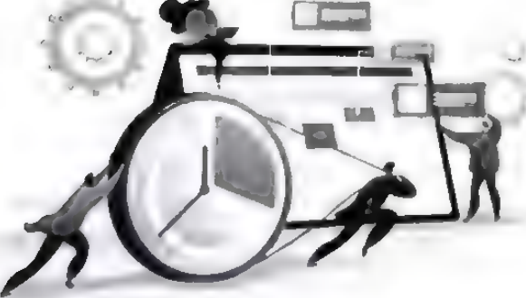

# Chương 2: Hiệu ứng Tô Đông Pha - Người khác không thể quyết định nhận thức của bạn

Ban đã bao giờ hoài nghỉ về khả năng tự. nhận thức của bản thân chưa? Ban đã bao giờ nghỉ ngờ về mối quan hệ giữa các са nhân xung quanh mình, hoặc thậm chí chứa đầy những suy nghi không chắc chắn về thế giới này chưa? Trên thực tế, nhận thức của mỗi người sẽ bị ảnh hưởng bởi con người hoặc sự vật xung quanh. Tất cả những gì chúng ta có thể làm là đừng để bản thân chiu ảnh hưỡng.

<figure markdown="span">
    
    <figcaption></figcaption>
</figure>

## Hiệu ứng Tô Đông Pha: Hiểu rõ bản thân là chuyện không dễ dàng

!!! note "Note"
    _Người ta kể rằng trên cổng ngôi đền ở sườn núi phía nam của núi Parnassus tại Hy Lạp có câu: “Hãy tự biết mình”. Hàng ngàn năm trôi qua, mọi người vẫn còn đau đầu về vấn đề này. Có câu: “Con người ta quý ở chỗ biết rõ bản thân mình” Điều này cũng cho thấy: Biết người đã khó, biết mình còn khó hơn._

Tô Đông Pha, một nhà thơ Trung Quốc nổi tiếng thời Bắc Tống, đã viết trong bài thơ của mình như sau: “Không biết diện mạo thật của núi Lư / Chỉ có duyên đang ở trong núi này”. Hai câu thơ trên không chỉ bàn luận về cuộc đời mà còn giải thích về nét đẹp của việc tự nhận thức. Con người ta thường lầm tưởng. rằng đã hiểu rõ bản thân như lòng bàn tay. Nhưng thực tế, xét theo góc độ ý nghĩa nào đó, hiểu bản thân mình còn khó hơn hiểu những hiện tượng khách quan. Điều này cũng giống như ở trong núi sâu, rất khó có thể thấy được diện mạo thật của ngọn núi. Hiện tượng tâm lý này được gọi là “Hiệu ứng Tô Đông Pha”. Trong tâm lý học có một thuật ngữ dùng để mô tả hành vi biết về bản thân mình, ấy là “tự nhận thức”. Nhiều nghiên cứu thực nghiệm trong tâm lý học đã chỉ ra rằng, bạn nghĩ bản thân thế nào còn quan trọng hon thực tế bạn như thế nào. Nếu một người có thể hiểu đúng về bản thân, họ có thể kiểm soát lời nói và hành động của mình về mặt tâm lý để giúp mọi việc đi theo chiều hướng tốt. Nếu không, họ sẽ dë đánh mất chính mình, không biết suy nghĩ và hành vi của mình sẽ phát triển theo hướng nào, và cũng không thể tránh khỏi những khó khăn hay sai lâm.

Tuy nhiên, thật sự hiểu đúng về bản thân không phải một chuyện đơn giản. Trong cuộc sống hằng ngày, không phải lúc nào con người ta cũng tự kiểm điểm, không phải lúc nào cũng có thể soi mình đưới góc độ người ngoài. Chính vì vậy, con người ta mới cần dua vào thông tin bên ngoài để hiểu bản thân mình. Trong quá trình này, chúng ta rất đễ bị thông tin bên ngoài ám thị và làm nhiễu, và thường không thể nhìn nhận bản thân một cách khách quan chính xác, nếu không phải đánh giá quá cao thì cũng là đánh giá quá thấp chính mình.

Trong tình huống thông thường, con người ta dë đề cao bản thân. Thí nghiệm của một nhà tâm lý học người Mỹ dưới đây đã chứng minh điều này.

Nhà tâm lý học tìm 25 người quen biết nhau và đảm bảo rằng họ khá hiểu về ưu khuyết điểm của bản chính mình. Những người tham gia thí nghiệm đã liệt kê ra 9 tiêu chí, gồm thanh lịch, hài hước, thông minh, hòa đồng, sạch sẽ, xinh đẹp, kiêu ngạo, Һет hinh, thô lỗ, và yêu cầu mọi người xếp hạng tất cả, bao gồm chính bản thân họ. Ví dụ, dựa vào tiêu chí “thanh lịch”, cho rằng ai là người thanh lịch nhất thì sẽ xếp người đó số một, người tiếp theo thứ hai... Như vậy, mỗi người đều sẽ có đánh giá của bản thân ở cả 9 khía cạnh và đánh giá về 24 người còn lại.

Sau khi tiến hành phân tích kết quả thí nghiệm, nhà tâm lý học thấy rằng cả hai mươi lăm người đều có xu hướng phóng đại ưu điểm và che giấu khuyết điểm ở các mức độ khác nhau. Một số người cho rằng điểm mạnh của bản thân có thể xếp lên hàng đầu, nhưng trong đánh giá của người khác họ lại bị xếp cuối bảng, và họ cũng xếp khuyết điểm của bản thân thấp hơn sự đánh giá của người khác.

Từ đó có thể thấy được, con người ta thường đánh giá phẩm chất tốt của bản thân cao hơn so với người khác đánh giá, trong khi đó lại đánh giá về phẩm chất xấu thấp hơn so với người khác đánh giá. Điều đó nói lên rằng, con người ta luôn đễ dàng đánh giá cao bản thân mình.

“Người trong cuộc mơ hồ, người bên ngoài sáng tỏ”, mọi người luôn rất khó hiểu rõ về bản thân mình. Điều này đòi hỏi họ không chỉ phải biết tự soi xét bản thân mà còn phải biết nhìn nhận bản thân qua sự đánh giá của người khác để có cái nhìn khách quan, toàn diện và đúng đắn.

### LIÊN KẾT KIẾN THỨC: TRẮC NGHIỆM TỰ NHÂN THÚC BẢN THÂN

Nói chung, sự minh bạch trong tự nhận thức bản thân tỷ lệ thuận với sự trưởng thành của bản thân. Nhận thức về bản thân càng rõ ràng thi sự trưởng thành của bản thân càng cao.

Về vấn đề này, các chuyên gia quốc tế đã đặc biệt thiết kë bộ đề kiểm tra mang tính đại diện. Bằng cách trả lời trung thực những câu hỏi sau, bạn có thể hiểu được mức độ trưởng thành của mình, xem thử liệu bạn có đang bị hiệu ứng Tô Đông Pha “dắt mũi” hay không, đồng thời cũng làm chủ được con người thật của mình và trạng thái nhận thức thực tế của bản thân.

1. Tâm trạng của bạn có thường xuyên thay đổi hay không?
2. Tình bạn của bạn và người khác có thể tồn tại lâu dài không?
3. Bạn có thường xuyên mua những sản phẩm giá rẻ hoặc giảm giá mà bạn không cần dùng tới hay không?
4. Bạn có phải là một người giữ chữ tín không?
5. Bạn có tùy tiện gặp gỡ bạn bè khác giới và hẹn hò với họ không?
6. Bạn có hài lòng về những gì bạn đã mua không?
7. Bạn có vội vã đưa ra kết luận về ai đó hoặc điều gì đó không?
8. Bạn có thường mắc lỗi trong công việc không?
9. Bạn có những người bạn cũ mà bạn không còn thích họ nữa không?
10. Thói quen sinh hoạt của bạn có bình thường không?
11. Bạn có thường đánh giá mọi người qua ấn tượng đầu tiên về họ hông?
12. Bạn có thể viết thư một cách nghiêm túc cho người khác không?
13. Bạn có thường cảm thấy bất an khi làm sai điều gì đó không?
14. Bình thường bạn có tuân thủ luật lệ giao thông không?
15. Khi bạn đọc sách hoặc tài liệu, bạn có thường bỏ qua các chú thích và biến nó thành một thói quen hay không?

### QUY TẮC TÍNH ĐIỂM

- Câu `[1, 3, 5, 7, 9, 11, 13, 15]`, trả lời “có”, tính một điểm.
- Câu `[2, 4, 6, 8, 10, 12, 14]`, trả lời “không”, tính một điểm.

__Phân tích kết quả__

- Tổng điểm `trên 11` cho thấy bản thân tương đối trưởng thành.
- Tổng điểm `9-10` cho thấy bản thân trưởng thành một phần.
- Tổng điểm `6-8` cho thấy bản thân chưa đủ trưởng thành.
- Tổng điểm `thấp hơn 5` cho thấy bản thân khá ngây thơ.

!!! abstract "Tóm tắt"
    1. Hiệu ứng Tô Đông Pha là một hiện tượng tâm lý học tồn tại phổ biến trong xã hội. Hiệu ứng này cho thấy mọi người thường gặp khó khăn trong việc hiểu đúng về bản thân.
    1. Bé hiéu dúng vë bàn thàn, ngoài viëc thuëng xuyën tu kiếm điểm thì còn cần phải đưa ra đánh giá toàn diện về bản thân với sự trợ giúp từ đánh giá của người khác. Chỉ bằng cách này, chúng ta mới có thể quản lý cảm xúc và hành vi của mình với sự tự nhận thức đúng đắn và giúp cho lời nói, hành động trở nên thỏa đáng, phù hợp. Ngược lại, một người có sự hiểu biết lệch lạc về bản thân thường gặp phải những thất bại khác nhau trong cuộc sống.

## Hiệu ứng ánh đèn sân khấu: Bạn không quan trọng như bạn tưởng

!!! note "Note"
    _Một số người quá coi trọng bản thân. Họ luôn lo lắng rằng trang phục của mình sẽ bị người khác chê cười; họ ngại nói trước mặt người khác vì sợ nói sai; họ sợ rằng nếu mình đi muộn sẽ phải nhận những cái nhìn khác lạ của mọi người... Họ luôn sống dưới ánh mắt của người khác. Tuy nhiên, thực tế lại không phải như vậy, bởi điều mọi người quan tâm nhất chính là bản thân._

Hiệu ứng ánh đèn sân khấu còn được gọi là “hiệu ứng tâm
điểm xã hội”, là biểu hiện của việc mọi người đánh giá quá cao
sự chú ý mà những người xung quanh dành cho ngoại hình và
hành vi của mình. Hiện tượng tâm lý này cho thấy mọi người có
xu hướng coi mình là trung tâm của mọi thứ và quá chủ ý đến bản
thân, ít nhất là họ không muốn bị người khác coi thường. Do đó,
họ thường đánh giá quá cao mức độ chú ý của người khác dành
cho mình. Từ một góc nhìn khác, hiệu ứng ánh đèn sân khấu phản
ánh nhu cầu chung của con người là muốn được người khác chú ý.
Hiệu ứng ánh đèn sân khấu rất phổ biến trong cuộc sống. Ví
dụ, trong một bữa tiệc tối, nếu ai dó vô tình làm đổ ly rượu hoặc làm
rơi đĩa xuống bàn khi lấy đồ ăn, người đó sẽ thường đỏ mặt và xấu
hổ. Trong một bức ảnh tập thể, mọi người sẽ luôn tìm thấy mình
đầu tiên và quan tâm đến dáng vẻ của bản thân trong bức ảnh. Khi
nói chuyện
với người thân bạn bè, đường như tất cả mọi người đều
chuyển chủ đề sang
bản thân một cách vô tình hoặc
có ý thức...
Trên thực tế, nhiều khi chúng ta không hề quan trọng như
bản thân tưởng, trừ khi chúng ta là người của công chúng.

- _Có một nghệ sĩ nổi tiếng nọ từng kể cho mọi người nghe vê một tiệc xảy ra khi anh йу còn nhỏ._
- _Gia đình anh ấu là một đại gia đình có nhiều thành uiên. Mỗi khi ăn cơm, cả nhà lại quâu quần bên chiếc bàn ăn lớn._
- _Một lần, người nghệ sĩ bát chợt muốn chơi trò trốn tìm обі mọi người. Vì ойу, trước bữa ăn, anh йу bèn trốn trong chiếc tủ không có gì nổi bật ở phòng ăn nà nghĩ rằng sẽ nhảy ra khỏi tử khi mọi người phát hiện ra sự nắng mặt của mình._
- _Tuy nhiên, điều khiến người nghệ sĩ vô cùng xấu hổ là không một ai nhận ra sự tắng mặt của anh йу cho đến khi kết thúc bữa ăn. Bất tực, anh ấ chỉ đành đợi mọi người rời di sau khi ăn uống no nê rồi mới bước ra khỏi tủ và ăn chỗ thức ăn còn lại._
- _Từ đó vë sau, anh ấy đã tự nhủ rằng: “Đừng quá coi trọng bản thân, nếu không kết quả cuối cùng có thể sẽ khiến bản thân thất vọng nhiều hơn”._

Đúng là nhiều lúc sự vắng mặt hay rời đi của một người sẽ có ảnh hưởng nhất định tới người khác, nhưng cuộc sống của mỗi người vẫn sẽ trôi qua như thường lệ mà không có nhiều thay đối. Vì thế, đừng quá coi trọng bản thân, đừng tự cho rằng nếu thiếu mình thì mọi việc đều không ổn. Điều này sẽ chỉ khiến bản thân bạn thêm phiền não và càng thêm mệt mỏi mà thôi.

Nhà thơ Lỗ Lê đã từng viết: “Luôn coi mình là hạt ngọc trai / Thời luôn lo sợ một mai chôn vùi”. Nếu bạn quá coi trọng bản thân và muốn trở thành nhân vật chính trong cuộc sống của người khác, thì người khác chẳng những không chấp nhận bạn mà còn chán ghét sự kiêu căng tự phụ của bạn, thậm chí còn nảy sinh ác cảm.

Nhà thơ nổi tiếng Tagore đã từng nói: “Sở dĩ thiên sứ có thể bay được là vì họ luôn xem nhẹ bản thân mình”. Đối với con người ta mà nói, chỉ khi xem nhẹ bản thân, chúng ta mới có thể thực sự chạm đến chân lý của cuộc sống.

Trên thế giới này, ai cũng có giá trị của riêng mình, nhưng “vắng mợ thì chợ vẫn đông”. Việc chúng ta cần làm là điều chỉnh tâm lý, nhìn nhận lại bản thân, chỉnh đốn vị trí của mình, không làm bộ làm tịch, duy trì sự khiêm tốn một cách hợp lý. Cần lưu ý rằng, đây không phải là chùn bước hèn nhát, mà là một cách sống thông minh.

Ngoài ra, chúng ta có thể dùng tâm lý “ai cũng muốn mình là tâm điểm” trong giao tiếp xã hội để thu hẹp khoảng cách giữa hai bên. Cách này không chỉ giúp cải thiện kỹ năng và hiệu quả giao tiếp mà đồng thời còn giảm bớt những xung đột cũng như rắc rối không cần thiết.

Để làm được điều này, bạn không những cần học cách thấu hiểu “tâm lý tâm điểm”, mà còn phải cố gắng làm hài lòng và khiển người khác trở thành tâm điểm của đám đông.

!!! abstract "Tóm tắt"
    1. Mọi người có xu hướng đánh giá quá cao sự chú ý mà những người xung quanh dành cho ngoại hình và hành vi của họ, đây chính là hiệu ứng ánh đèn sân khấu - tức là, ai cũng nghĩ mình rất quan trọng và muốn trở thành trung tâm của đám đông.
    1. Điều mọi người quan tâm nhất chỉ có chính họ, vì vậy bạn không nên quá coi trọng bản thân mình. Đương nhiên, cũng đừng quá coi thường bản thân. Chỉ có duy trì sự khiêm tốn một cách hợp lý mới là cách sống thông minh.

## Hiệu ứng Barnum: Đừng nhạy сảm, chưa chắc họ đã nói về bạn

!!! note "Note"
    _Trong cuộc họp, khi ai đó khen ngợi chung chung, bạn có thầm vui mừng trong lòng vì nghĩ rằng người đó đang khen bạn không? Ngược lại, bạn có bực bội chán nản khi ai đó phê bình chung chung, vì nghĩ rằng người đó đang nhắm vào bạn? Thực ra, đôi khi bạn đã suy nghĩ quá nhiều. Đây chính là biểu hiện của hiệu ứng Barnum._

Bạn có tin vào các chòm sao không? Bạn có thường liên tưởng, mình với nhân vật được miêu tả trong các cung hoàng đạo và tin tưởng không chút nghỉ ngờ nào không?

Ví dụ, có một cuốn sách về cung hoàng đạo có miêu tả tính cách của cung Nhân Mã như thế này: “Đàn ông Nhân Mã luôn hài hước, vui vẻ, lạc quan, hiểu đời, tràn đầy năng lượng mỗi ngày và dường như không có điều gì khiến anh ấy bất mãn. Người đàn ông Nhân Mã yêu tự do, nếu mất tự do thì anh ấy thà chết còn hơn. Anh ấy không bị ám ảnh bởi kết quả cuối cùng và thích tận hưởng niềm vui trong quá trình sống”. Về vấn đề này, nhiều chàng trai Nhân Mã trẻ tuổi sẽ tự ướm bản thân mình vào trong đó và cho rằng đoạn văn này đang nói về chính họ.

Nếu phân tích kỹ, bạn së thấy đoạn văn này thực ra đang miëu tả đặc điểm tính cách của hầu hết những chàng trai trẻ tuổi. Hãy nghĩ mà xem, có mấy ai trong số họ không yêu tự do? Không tràn đầy sức sống? Ai lại nghĩ bản thân không hiểu sự đời? Họ chi chấp nhận những miêu tả mơ hồ chung chung và tự động bỏ qua những miêu tả không phù hợp với bản thân.

Trên thực tế, mọi người đều có phản ứng tương tự trong hầu hết các tinh huống khác, bởi vì họ có xu hướng tin rằng một vài khải quát chung chung phù hợp với đặc điểm tính cách của họ. Bài kiểm tra tính cách Forer nổi tiếng trong tâm lý học đã khẳng định sự tồn tại của hiện tượng tâm lý này.

Năm 1948, Bertram Forer đã cho các sinh viên làm bài kiểm tra tinh cách và phân tích đặc điểm tính cách của học sinh dựa trên kết quả bài kiểm tra. Cuối cùng, các sinh viên được yêu cầu đánh giá xem kết quả bài kiểm tra có phù hợp với đặc điểm tính cách của bản thân hay không.

Kết quả cho thấy, hơn 90% sinh viên tin rằng kết quả bài kiểm tra tính cách Forer vô cùng phù hợp với đặc điểm tính cách của bản thần.

Thực ra, bài kiểm tra tính cách của Forer chỉ là một trò tung hỏa mù. Cuối cùng, kết quả kiểm tra mà ông đã đưa cho mọi người đều giống hệt nhau, đó là một đoạn văn trích từ sách về chòm sao, tính cách... Chúng ta hãy đọc thử đoạn văn này:

!!! quote "Quote"
    _Bạn cầu mong được người khác yêu thích, nhưng lại luôn xoi mói chính mình. Mặc dù có một số khiếm khuyêt trong tính cách, nhưng nhìn chung ban có thể bù đắp lại. Bạn có tiềm năng đáng ké chưa được khai thác, nhưng vän chưa phát huy được hêt điểm mạnh của bản thân. Sự cứng rắn, nghiêm khắc kỷ luật bên ngoài đã che giấu sự bât ап và lo lắng bên trong. Nhiều lần, bạn nghiêm túc đặt ra câu hỏi обі bản thân rằng liệu mình đã làm đúng hay đã ra quyêt định đúng chưa. Bạn thích sự thay đổi nhất định và cảm thấu không thoải mái khi bị hạn chế gò bó. Bạn tự hào vì mình là một người có suy nghĩ độc lập và không chấp nhận những lời nói chưa có bằng chứng đầy đủ. Tuy nhiên, bạn cho rằng thật không khôn ngoan nêu thẳng thắn quá mức tới người khác. Có những lúc bạn hướng ngoại, niềm nở ъй hòa đồng, nhưng có những lúc bạn lại hướng nội, cẩn trọng tà im lặng. Một số tham tọng của bạn là không thực tế._

Đây là một chiếc mũ vừa vặn với đầu của tất cả mọi người,
nhưng có quá nhiều người thích đội chiếc mũ này một mình.
Trong tâm lý học, khuynh hướng tâm lý mà “mọi người sẽ dễ
dàng tin rằng sự miêu tả tính cách chung chung mơ hồ là cực kỳ
phù hợp với họ” được gọi là “hiệu ứng Barnum”.
Trong cuộc sống, chúng ta ít nhiều cũng sẽ bị ảnh hưởng bởi
hiệu ứng Barnum, nhất là hiện nay khi chiêm tinh học, tính cách
theo nhóm máu... lại đang rất thịnh hành. Việc này khiến cho
nhiều người lầm tưởng rằng, những bài viết miêu tả đó phù hop
với tính cách thật sự của chính mình và từ đó không thể nhận
thức đúng đắn về bản thân.
Điều này chủ yếu là do chúng ta mong muốn tin tưởng vào
một điều gì đó. Chỉ cần muốn tin vào một việc thì chúng ta sẽ
tìm ra đủ các loại bằng chứng khác nhau để chứng minh cho việc
đó. Ngay cả khi mọi thứ không liên quan gì tới nhau, chúng ta
vẫn có thể tìm ra logic để làm nó phù hợp với những giả thiết
của mình.
Có thể nói, hiệu ứng Barnum là rào chắn cản trở nghiêm
trọng quá trình nhận thức đúng. đắn về bản thân. Vì vậy, khi đối
mặt với những quan điểm và miêu tả mơ hồ không rõ ràng liên
quan tới bản thân, chúng ta cần phải giữ cho mình một cái đầu
tỉnh táo và cẩn thận đưa ra nhận định của bản thân.
Ngoài ra, một cách quan trọng để tránh rơi vào cái bẫy của
hiệu ứng Barnum chính là hiểu đúng về bản thân. Nếu một người
hiểu rõ bản thân như lòng bàn tay thì sẽ không đễ dàng gắn mác
cho mình bằng những thuật ngữ chung chung; đồng thời có thể
phân biệt một cách hiệu quả trong những miêu tả tính cách đó,
câu nào liên quan đến bản thân, câu nào không liên quan đến
bản thân, câu nào lời lẽ ba phải, câu nào rõ như ban ngày. Như
vậy, chúng ta sẽ không bị hiệu ứng Barnum chi phối.

!!! abstract "Tóm tắt"
    1. Con người ta luôn cho rằng, miêu tả tính cách chung chung mơ hồ đã tiết lộ tính cách của họ một cách chính xác. Đây chính là hiệu ứng Barnum.
    1. Nguồn cảm hứng của hiệu ứng Barnum: Đừng dễ dàng tin vào những quan điểm và biểu hiện mơ hồ có vë như có liên quan tới bạn. Hãy giữ cho mình một cái đầu thật tỉnh táo,
    1. Một cách quan trọng để tránh rơi vào cái bẫy của hiệu ứng Barnum chính là hiểu đúng bản thân mình.

## Hiệu ứng quyền hạn: Tin vào thẩm quyền, nhưng đừng tin mù quáng

!!! note "Note"
    _Trong cuộc sống có một số hiện tượng như sau: Khi đến bệnh viện, người ta luôn có xu hướng đăng ký khám với các chuyên gia; khi mua såm luôn thích mua những món đồ người nổi tiếng giới thiệu; trích dẫn kinh điển dễ thuyết phục người khác hơn... Hiệu ứng quyền hạn có ở khắp mọi nơi, nhưng không nên tôn thờ quyền hạn một cách mù quáng vì ai cũng có thể mắc sai lầm._

“Miệng nhà quan có gang có thép”, câu nói này phản ánh
một hiện tượng tâm lý khá phổ biến trong cuộc sống, đó chính
là hiệu ứng quyền hạn. Nó còn được gọi là “hiệu ứng ám thị
quyền hạn”, đề cập đến việc nếu một người có địa vị cao, có
thẩm quyền và được người khác tôn trọng thì mọi người sẽ coi
trọng lời nói của người đó và sẵn sàng tin tưởng độ chính xác
trong hành vi, ngôn ngữ của người đó.
Có hai nguyên nhân chính dẫn đến sự xuất hiện của hiệu
ứng quyền hạn: Một là do tâm lý an toàn, tức là mọi người luôn
lấy những nhân vật có quyền hành làm hình mẫu, đồng thời cho
rằng việc nghe theo họ có thể mang lại cảm giác an toàn và tăng
tính đảm bảo mà không hề có sai sót; hai là tâm lý tán thành,
tức là mọi người luôn cho rằng yêu cầu của các nhân vật có chức
quyền phù hợp với chuẩn mực xã hội, nếu làm đúng theo yêu
cầu của họ thì có thể được khen ngợi về mọi mặt.
Không thể phủ nhận rằng, sở di những người có chức quyền
ẩn chứa vẻ quyền uy là bởi họ thực sự có khả năng xuất chúng.
Tuy nhiên, điều chúng ta cần hiểu rõ là người có quyền hành
cũng là con người, ít nhiều cũng sẽ bị giới hạn bởi thời đại và
điều kiện của bản thân, đồng thời cũng sẽ mắc phải sai Гат.
Albert Einstein đã nói: “Ngay từ những năm tháng thiếu
niên, sự hoài nghỉ về quyền lực, về những niềm tin tồn tại trong
bất kỳ môi trường xã hội nào, chưa bao giờ rời bỏ tôi”. Đôi khi,
sự thật không nằm trong những quan niệm cũ kỹ của thế tục hay
nằm trong tay những người có thẩm quyền. Điều chúng ta cần
làm là dám phá bỏ khuôn khổ vốn có và học cách đặt câu hỏi
thách thức quyền hạn. Nếu không ý thức được điều này và răm
rắp tuân theo quyền uy, chúng ta sẽ mãi mãi không thể tiến bộ,
thậm chí còn mắc phải một số sai lầm cơ bản nhất.
Trong ngành hàng không, có một hiện tượng gọi là hội chứng
cơ trưởng. Nghĩa là trong nhiều vụ tai nạn hàng không, sai lầm
mà cơ trưởng mắc phải vô cùng rõ ràng, song cơ phó lại không có
bất cứ hành động nào để ngăn cản sai lầm ấy, cuối cùng gây ra
tai nạn hàng không. Vụ tai nạn hàng không nghiêm trọng trong
lịch sử là một ví dụ điển hình của hội chứng cơ trưởng.

!!! note "Note"
    Khi đó, Trung tướng Ernst Udet của Lực lượng Không quân phải thực hiện nhiệm vụ bay, nhưng vì trước đó cơ phó của ông bị ốm không thể đi cùng nên Bộ chỉ huy đã bô trí cho ông một cơ phó khác thay thế. Cơ phó này cảm thấu rất vinh dự tì có thể trở thành trợ thủ cho vị tướng lừng danh này.

    ~~Trong qua trình cât cánh, Ernst Udet vån ngán nga vài câu hát nhu thường lệ pá lắc đầu theo từng nhịp bài hát. Không ngờ hành động пау l: khuôn co pho lầm tưởng rằng Ernst ra hiệu cho anh ta gạt cầm nắng тау bav lên. Dù biết rõ máu bay còn lâu mới đạt tốc độ cất cánh, thë nhưng anh ta vån đầu cần điều khiển lên. Kết quả, bụng máy bay té chạm nơi mặt đất và một trong những cánh quạt bay одо lưng Ernst khuên ông bị tån tật suốt đời~~

    Sau dó. со người hoi со phố: “Tại sao anh lại thao tác đẩy cần lên khi bi rõ máu bay chưa thể cất cảnh?” Câu trả lời của anh ta là: “Tôi nghĩ tương quân muôn tói làm nhw ойу, ой tôi tin rằng tướng quân không thế phạm sai lầm”

Một phi công day đạn kinh nghiệm lại tin tưởng mù quáng vào quyền hạn, hiều lầm mệnh lệnh của trung tướng Lực lượng Không quân và mắc phải sai lâm mà thậm chí người mới còn không mắc phải, gây ra một bi kịch tới cuối đời. Đây chính là sức mạnh cua hiệu ứng quyền hạn.

Chúng ta cần phải biết rằng, hiệu ứng quyền hạn là một hiện tượng phô biến, và bản thân nó vốn không tốt cũng không xấu, quan trọng la cách chúng ta ứng dụng nó như thế nào. Khi được su dụng đúng cách, hiệu ứng quyền hạn có thể đóng vai trò tích cực vô cùng lớn; ngược lại, khi sử dụng không đúng cách, nó có thê gây ra tác động tiêu cực ở một mức độ nhất định.

Vậy, chúng ta có thể làm gì để loại bỏ những tác động tiêu cực của hiệu ứng quyền hạn? Một mặt, chúng ta phải trau dồi khả năng tư duy phản biện, giữ vững tinh thần hoài nghi và luôn đặt câu hỏi để không tin tưởng một cách mù quáng vào quyền hạn. Mặt khác, chúng ta phải tự tin vào khả năng của chính mình, như vậy mới có can đảm để công khai thách thức quyền hạn.

Phải thừa nhận rằng, mỗi người trong chúng ta đều có ảnh hưởng nhất định đến những người xung quanh, nhưng những nhân vật quyền thế có ảnh hưởng lớn và sâu rộng hơn đối với những người khác. Vì vậy, đối với hiệu ứng quyền hạn, chúng ta vẫn cần tin tưởng, nhưng không phải tin tưởng một cách mù quáng.

!!! abstract "Tóm tắt"
    1. Lời nói của những người có địa vị cao, có quyền thế và được kính trọng luôn dễ được coi trọng, đồng thời mọi người cũng sẽ tin lời nói và hành động của ho là đúng đắn. Đây là hiệu ứng quyền hạn.
    1. Hiệu ứng quyền hạn là một hiệu ứng tâm lý phổ biến, bản thân nó không tốt hay xấu mà phụ thuộc vào sự vận dụng của chúng ta.
    1. Để loại bỏ tác động tiêu cực của hiệu ứng quyền hạn, chúng ta phải dám đặt câu hỏi và thách thức quyền hạn, tin vào quyền hạn nhưng không được mù quáng.

## Tâm lý đám đông: Chạy theo trào lưu, khó kiên định với ý kiến cá nhân

Khi gặp chuyện khó quyết định, chúng ta thường chọn cùng nhau biểu quyết, cuối cùng áp dụng phương pháp “đa số tháng thiểu số” để đưa ra quyết định. Câu hỏi đặt ra là quyết định này liệu có đúng không? Khi suy nghĩ của bạn trái ngược với suy nghĩ của hầu hết mọi người, bạn có chọn theo đuổi suy nghĩ của mình không?

Tâm lý đám đông là hiện tượng tâm lý và hành vi xã hội tương đối phổ biến. Tuân theo đám đông chính là chạy theo trào lưu, bảo sao nghe vậy. Con người là động vật xã hội, các cá nhân để bị ảnh hưởng bởi một nhóm người, từ đó sẽ nảy sinh nghỉ ngờ và thay đổi quan điểm, suy đoán, hành vi của bản thân để có thể giống với người khác. Tâm lý này gọi là “tâm lý đám đông”.

Một nhà tâm lý học đã làm một thí nghiệm đơn giản. Trong một khu trung tâm sầm uất, anh đứng trên con phố đông đúc, ngẩng đầu nhìn lên bầu trời xanh thẳm, chống cằm trầm ngâm, lâu lâu lại cất giọng chắc nịch. Chẳng bao lâu, hành động của anh bắt đầu thu hút sự chú ý của những người xung quanh. Vì tò mò, mọi người bắt đầu hỏi nhà tâm lý học đang làm gì, nhưng anh vẫn im lặng và tiếp tục nhìn lên bầu trời. Mấy phút sau, càng ngày càng có nhiều người vây xem. Có hơn chục người vây xung quanh nhà tâm lý học cũng không ngừng nhìn lên bầu trời. Mặc dù giữa chừng cũng có người rời đi, thế nhưng số người này còn kém xa số người tham gia vào hoạt động. Nửa tiếng sau, một điều khó tin đã xảy ra: Trên con phố mà nhà tâm lý học đang đứng, hàng trăm người đã làm điều tương tự như anh - ngẩng đầu nhìn lên bầu trời xanh.

Trong lĩnh vực tâm lý học, có một thí nghiệm kinh điển để nghiên cứu hiện tượng tâm lý đám đông, ấy là “thí nghiệm Asch”. Đây là một thí nghiệm do nhà tâm lý học người Mỹ Solomon Asch nghĩ ra để nghiên cứu mức độ mà mọi người bị ảnh hưởng bởi những người khác để đưa ra những phán đoán rõ ràng là đi ngược lại với ý muốn của họ.

Giáo sư Asch đã mời một số sinh viên tình nguyện tham gia thí nghiệm này và nói với họ rằng, mục đích của thí nghiệm là nghiên cứu thị giác của con người. Khi bước vào phòng thí nghiệm, những sinh viên này nhận thấy đã có 5 người đang ngồi trên ghế, thế là họ bèn ngồi lần lượt vào vị trí thứ 6, vị trí thứ 7, vị trí thứ 8,... Thực ra, họ không hề biết rằng 5 người vào trước đã thông đồng với giáo sư Asch. Họ là trợ lý thí nghiệm cho ông, tạm gọi là “kẻ lừa gạt” trong hoàn cảnh thí nghiệm này.

Bắt đầu thí nghiệm, giáo sư Asch lấy ra hai tấm thẻ, một tấm có một đường kẻ doc và tấm kia có ba đường kẻ dọc có độ dài khác nhau, như trong hình 2-1. Giáo sư Asch yêu cầu mọi người so sánh, tìm xem đường kẻ doc trên tấm thẻ thứ nhất có bằng độ đài của đường kẻ dọc trên tấm thẻ thứ hai không, đồng thời yêu cầu mọi người trả lời theo thứ tự chỗ ngồi.

<figure markdown="span">
    
    <figcaption>Hình 2-1</figcaption>
</figure>

Trên thực tế, sự khác biệt về độ dài giữa các đường kẻ dọc quá rõ ràng, người bình thường có thể đưa ra suy đoán chính xác một cách dë dàng. Sau khi phán đoán chính xác 2 lần, tới lần thứ 3, cả 5 “kẻ lừa gạt” đã cố ý đồng loạt đưa ra đáp án sai. Những người ngồi phía sau bắt đầu tự hỏi: “Liệu mình có bị hoa mắt không? Mình nên kiên trì với suy đoán của bản thân, hay nên nói một câu trả lời mà mình không công nhận giống như những người khác?”

Kết quả thí nghiệm cho thấy, những người khác nhau có mức độ chạy theo đám đông khác nhau. Nhìn vào kết quả tổng thể, trung bình 33% đưa ra đánh giá chạy theo đám đông, 76% đưa ra đánh giá chạy theo đám đồng ít nhất một lần. Đương nhiên, còn 24% không chạy theo đám đông, họ vẫn luôn kiên định với đánh giá của riêng mình từ đầu tới cuối.

### LIÊN KẾT KIẾN THÚC: Ý THÚC CHUNG VỀ TÂM LÝ ĐÁM ĐÔNG

Tâm lý đám đông hết sức phổ biến trong cuộc sống thường ngày. Ví dụ, khi đang thảo luận về một vấn đề nào đó, nếu hầu hết mọi người đều có chung ý kiến, nhưng quan điểm của ai đó lại khác với mọi người thì người đó sẽ cảm thấy bị cô lập, nội tâm trở nên bồn chồn bất an, và cuối cùng có thể sẽ thay đổi quan điểm của chính mình.

Trên thực tế, đa số mọi người đều có xu hướng chạy theo đám đông. Thông qua nghiên cứu, các nhà tâm lý học phát hiện ra rằng, những kiểu người khác nhau có mức độ chạy theo đám đông khác nhau. Những người có tính cách hướng nội, tự tỉ có xu hướng chạy theo đám đông nhiều hơn so với những người có tính cách hướng ngoại, tự tin. Bên cạnh đó, người trẻ tuổi có tâm lý này rõ ràng hơn người lớn tuổi, và những người có ít kinh nghiệm xã hội dễ có hành vi chạy theo đám đông.

Có một vài nguyên nhân hình thành tâm lý đám đông như sau: Một là chịu ảnh hưởng của nguyên tắc “thiểu số nghe theo đa số”, từ bỏ quan điểm của bản thân; hai là chịu ảnh hưởng từ ар lực của thế giới bên ngoài, sợ bị cô lập nên lựa chọn tuân theo đám đông; ba là chịu ảnh hưởng bởi tâm lý không chắc chắn, nếu đã không biết lựa chọn như thế nào thì càng nên nghe theo lựa chọn giống với mọi người.

Tất cả những lý do này đều đánh trúng tâm lý của chúng ta, vậy nên việc có tâm lý chạy theo đám đông cũng là lẽ thường tình.

Tuy nhiên, nếu thường xuyên chạy theo đám đông mà không có tư duy hay phản đoán độc lập, lâu dàn, chúng ta sẽ mất đi lý trí và phương hướng, từ đó chọn cách mù quáng chạy theo đám đông.

Vì vậy, chúng ta phải luôn giữ một cái đầu tỉnh táo, phân tích tình hình hiện tại một cách khách quan; khi ý kiến của bản thân không phù hợp với mọi người, đừng vội vã nghỉ ngờ hoặc phủ nhận bản thân mà hãy suy nghĩ kỹ trước khi hành động.

!!! abstract "Tóm tắt"
    1. Lời nói và hành động của một cá nhân dễ bị ảnh hưởng bởi người khác hoặc một tập thể. Khi lời nói và hành động của mình không phù hợp với đa số, con người ta luôn có xu hướng thay đổi chúng để phù hợp với mọi người. Đây là tâm lý đám đông - một hiện tượng tâm lý phổ biến trong xã hội.
    1. Hầu hết mọi người đều có tâm lý đám đông. Tuy nhiên, những kiểu người khác nhau có mức độ chạy theo đám đông khác nhau.
    1. Muốn tránh chay theo dám dóng mót cách mü quáng, bạn cần phải giữ một cái đầu tỉnh táo, phân tích tình hình khách quan một cách bình tĩnh và lý trí, rồi suy nghĩ thắt kỹ trước khi hành động.

## Hiệu ứng ám thị: Hãy coi chừng bi “thôi miên” bởi người tiêu cực

!!! note "Note"
    Có người tiêu cực nào xung quanh bạn không? Họ luôn đưa ra những nhận xét tiêu cực về bạn dù vô tình hay cố ý, chẳng hạn như “Bạn thực sự kém cỏi đấy” “Làm thế nào mà bạn có thể không hoàn thành nối một việc đơn giản như vậy chứ?”... Đây là những biéu hiện của hiệu ứng ám thị tiêu cực, chúng ta cần phải cẩn thận không bị chúng thôi miên trở thành người “không thế”.

Hiệu ứng ám thị chỉ việc tác động đến tâm lý và hành vi của người khác một cách ẩn ý và trừu tượng trong điều kiện không có sự đối đầu, khiến người đó có thể chấp nhận ý kiến hoặc hành động theo một cách nhất định, từ đó khiến suy nghĩ và hành vi của người bị ám thị phù hợp với mục tiêu mong muốn của người ám thị.

Nguyên nhân gây ra hiệu ứng ám thị chính là trong tiềm thức của con người ta vốn tồn tại những quan điểm về một vài sự vật, sự việc. Khi người khác ám thị bằng lời nói hành động, mọi người së kết hợp quan điểm trong tiềm thức của mình với sự ám thị của người khác rồi hình thành phản ứng.

Có người đã thực hiện một thí nghiệm tâm lý học như sau.

Người tổ chức thí nghiệm đã in 30 bản sao từ một bức ảnh chụp ai đó rồi chia thành hai loại A và B, đồng thời chuẩn bị hai phần giới thiệu lý lịch khác nhau kèm theo gợi ý có tác dụng ám thị. Sau đó, ông yêu cầu những người tham gia thí nghiệm mô tả bức ảnh dựa theo phần giới thiệu lý lịch và gợi ý về những nhân Vật này.

__Loại А__: Người trong bức ảnh này được giả định là người : đàn ông ở bang Louisiana (Mỹ), tên là Gilbert Gosh, bị kết án vào nằm 66 tuổi vì tội quấy rối một bé gái 12 tuổi. Luật sư của nguyên cáo nói rằng số nạn nhân thực tế được ước tính cẩn thận la hơn 30 người. Cuối cùng người đàn ông này bị kết án từ 9 đến 10 nằm tù.

__Loại B__: Người trong bức ảnh này được giả định là Alfred Goodman Gilman, sinh ngày 1 tháng 7 năm 1941 tại New Haven, Connecticut, Mỹ. Năm 1962, Gilman tốt nghiệp trường Đại học Yale với tấm bằng cử nhân. Năm 1969, ông nhận bằng kép tiến sĩ y khoa và triết học tại Đại học Case Western Reserve. Năm 1977, Gilman lần đầu tiên phát hiện ra protein G và vai trò của nó trong việc truyền tín hiệu tế bào. Năm 1981, Gilman tinh chế thanh công protein С đầu tiên, và sau 13 năm, cuối cùng ông cũng giải mã được mã dẫn truyền của tế bào, nhờ vậy mà giành được giải Nobel. Sau khi giành được giải thưởng, Gilman đã thanh lập “Liên minh truyền tín hiệu tế bào”, đồng thời làm việc với các nha khoa học sinh hóa trên khắp nước Mỹ để khám phá những bí ấn cua tất cả các protein G trong cơ thể con người.

Hãy mô tả người trong bức ảnh dua vào hai tấm hình. Gợi ý: Có thể miêu tả các nhân vật về ngoại hình, tính cách...; có thë dùng nhiều câu hoặc một số từ để miêu tả. Ví dụ: Đôi mắt hình tam giác đáng sợ cho thấy người này chứa đầy những ý nghĩ xấu xa. Hãy thực hiện việc mô tả một mình, không bàn bạc với nhau. Kết quả thí nghiệm cho thấy, những người tham gia đã mô tả hoàn toàn khác nhau cho cùng một bức ảnh với hai kiểu giới thiệu lý lịch và gợi ý khác nhau.

Điều này cho thấy vai trò mạnh mẽ của ám thị. Khi nghiên cứu sâu hơn, người ta thấy rằng, gợi ý ám thị giống như một con đao hai lưỡi. Nó có thể cứu vớt một người hoặc hủy hoại một người, mấu chốt nằm ở cách người bị ám thị sử dụng và nắm bắt ý nghĩa của ám thị như thế nào.

Thông qua nghiên cứu, các nhà tâm lý học cho rằng, những người có ý chí kém hoặc thiếu tự tin sẽ dë chịu ảnh hưởng từ ám thị của người khác. Điều này cũng có nghĩa là một vài ám thị tiêu cực của người khác sẽ không hề có tác dụng với những người có lòng tự tin và ý chí mạnh mẽ.

Vậy chúng ta nên làm thế nào với những người bị người khác ám thị là “không thê”? Có một cách đơn giản để những người này trở thành người “có thể” chính là dựa vào hiệu ứng ám thị.

_Trong Thế chiến thứ Hai, do thiếu hụt quân lính, chính phủ Hoa Kỳ tạm thời quyêt định cho các tù nhân trong nhà tù tham gia chiên đấu. Để tạo điều kiện cho những tù nhân nàu ra tiền tuyến trong trạng thái tôt nhật, chính phủ đã đặc biệt mời chuyên gia tâm lý học đến tu vån cho họ trước khi tham gia chiến tranh._

_Do đó, các chuyên gia tâm lý học bắt đầu cuộc te vån kéo đài ba tháng cho các phạm nhân trong trại giam. Trong thời gian huấn Іиуёп, các chuyên gia tâm lý học wu cầu các tù nhân mỗi ngày hãy viêt một 1а thư cho những người thân yêu nhất của họ. Nội dung của những bức thư được các nhà tâm lý học viêt ra một cách thống nhất, bao gồm thành tịch tôt của tù nhân, mong muôn cải tạo, tiến bộ ой khát оопа chiên đâu của họ..._

_Ba tháng sau, các tà nhân được gửi đến hỗ trợ tiền tuyến. Trên chiên trường, các nhà tâm lý học cũng yêu cầu họ viết thư cho những người thân yêu nhất mỗi đêm. Tất nhiên, nội dung bức thư vån do các nha tâm lý học vach ra, chủ yêu viết vê thành tích của tà nhân trên chiến trường, chàng hạn như cách chấp hành kỷ luật, chiến đấu anh vẫn có kẻ thù như thế nào..._

_Kết quả là không mất nhiều thời gian, những gì mà các tù nhân nav thể hiện trên chiến trường đều giống hệt như họ đã viêt trong thư: Tuân theo mệnh lệnh, chiến đấu anh dũng обі kẻ địch, không thua gì quán đội chính quy._

Có thể thấy được, con người ta sẽ phát triển theo chiều hướng tích cực khi khóng ngừng đưa ra những ám thị tích cực.

!!! abstract "Tóm tắt"
    1. Hiệu ứng ám thị là hiệu ứng tâm lý đề cập đến việc ảnh hưởng tới người khác một cách ẩn ý và trừu tượng dé khiến cho suy nghĩ lẫn hành động của họ phù hợp với mục tiêu mong muốn mà không cần phải đối đầu với nhau.
    1. Ám thị là con dao hai lưỡi, nó có thể cứu vớt một người song cũng có thé hủy hoại một người.
    1. Trong cuộc sống, muốn tránh được những ám thị tiêu cực thì bạn phải luôn tạo ra những ám thị tích cực cho bản thân.