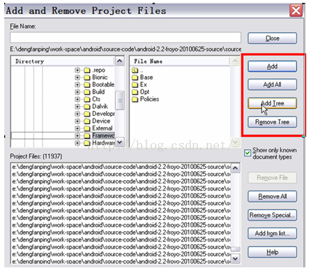

# Chương 1 Chuẩn bị trước khi đọc

!!! note "Note"
    Chương này giới thiệu ngắn gọn về kiến trúc hệ thống Android, cách xây dựng môi trường biên dịch và cách sử dụng một số công cụ.

## Kiến trúc hệ thống

### Kiến trúc hệ thống Android

Android là một nền tảng phát triển điện thoại di động do Google phát hành. Bản thân nền tảng này dựa trên nhân Linux. Hình 1-1 cho thấy kiến trúc của hệ thống này:

<figure markdown="span">
    
    <figcaption>Hình 1-1 Kiến trúc hệ thống Android</figcaption>
</figure>

Như có thể thấy từ hình trên, hệ thống Android có thể được chia thành bốn lớp, từ dưới lên trên:

Lớp nhân Linux, hiện tại là Android 2.2 (tên mã là Froyo) dựa trên phiên bản nhân Linux 2.6.
Lớp thư viện, lớp này cung cấp các thư viện động (còn gọi là thư viện dùng chung), thư viện thời gian chạy Android, máy ảo Dalvik, v.v. Về mặt ngôn ngữ lập trình, hầu hết lớp này được viết bằng C hoặc C++, do đó nó cũng có thể được coi đơn giản là lớp gốc.
Lớp Framework chủ yếu được viết bằng Java. Đây là nền tảng của thế giới Java trên nền tảng Android.
Lớp ứng dụng là những ứng dụng tương tác trực tiếp với người dùng và tất cả đều được phát triển bằng Java.
Từ phần giới thiệu ở trên, chúng ta có thể thấy một trong những tính năng lớn nhất của Android là nó đã xây dựng một thế giới Java rất phổ biến trong giới lập trình viên Java. Tuy nhiên, thế giới này không phải là một lâu đài trên không. Hoạt động của nó phụ thuộc vào một thế giới gốc khác mà Google đã cố gắng che giấu. Sự tương tác giữa hai thế giới có thể được biểu diễn bằng Hình 1-2:

<figure markdown="span">
    
    <figcaption>Hình 1-2 Sự tương tác giữa thế giới Java và thế giới gốc</figcaption>
</figure>

Từ hình trên, chúng ta có thể thấy rằng:

Mặc dù Java độc lập với nền tảng, nhưng sự cô lập giữa Java và các nền tảng cụ thể được thực hiện thông qua lớp JNI. Java gọi các lệnh gọi hệ thống trong hệ điều hành Linux thông qua lớp JNI để hoàn thành các chức năng tương ứng, chẳng hạn như tạo tệp, tạo socket, v.v.
Ngoài thế giới Java, còn có một thế giới Native cốt lõi, hỗ trợ mạnh mẽ cho hoạt động hiệu quả và ổn định của toàn bộ hệ thống. Nhìn chung, thế giới Java tương tác với thế giới Native thông qua lớp JNI thông qua phương thức IPC. Phương thức IPC bí ẩn nhất trên nền tảng Android là Binder. Binder sẽ được giới thiệu chi tiết trong Chương 6. Ngoài ra, Socket cũng là một phương thức IPC được sử dụng phổ biến. Những nội dung này sẽ được trình bày trong phần phân tích mã sau.

### Cấu trúc của cuốn sách này

Các mô-đun được phân tích trong cuốn sách này cũng sẽ tuân theo kiến trúc hệ thống Android, như thể hiện trong Hình 1-3:

<figure markdown="span">
    
    <figcaption>Sơ đồ kiến trúc Hình 1-3 của cuốn sách này</figcaption>
</figure>

Như có thể thấy từ hình trên, các mô-đun được phân tích trong cuốn sách này bao gồm cả ba lớp ngoại trừ Kernel, đó là:

Lớp Native bao gồm init, hệ thống âm thanh (bao gồm AudioTrack, AudioFlinger và AudioPolicyService), hệ thống Surface (bao gồm Surface và SurfaceFlinger), các lớp chung (bao gồm RefBase, sp, wp, v.v.), Vold và Rild.
Lớp Java Framework bao gồm Zygote, System_server và các lớp thường dùng trong Java (bao gồm Handler, Looper, v.v.).
Lớp ứng dụng Java, bao gồm MediaProvider và Phone.

## Xây dựng môi trường phát triển

Phần này sẽ giới thiệu cách xây dựng môi trường phát triển mã nguồn Android.
Trước tiên, bạn cần có một hệ thống Linux. Cá nhân tôi khuyên bạn nên cài đặt Ubuntu 10.04 (phiên bản 32 bit). Bạn đọc có thể tải xuống phiên bản hệ thống này từ Internet. Người dùng Windows có thể sử dụng VMWare hoặc VirtualBox làm máy ảo để cài đặt Ubuntu 10.04. Cá nhân tôi khuyên bạn nên sử dụng VMWare vì các chức năng của nó rất mạnh mẽ!

Nếu bạn muốn sử dụng VMWare, thì sau khi cài đặt Ubuntu, hãy nhớ cài đặt cả VMWare Tools nữa, vì công cụ này cung cấp nhiều chức năng rất thiết thực. Đây là một gợi ý nhỏ khác. Nếu hệ thống Linux chỉ dành cho mục đích sử dụng cá nhân, bạn nên đăng nhập vào hệ thống bằng tài khoản root. Tại nơi làm việc, tôi thấy nhiều đồng nghiệp đăng nhập bằng tài khoản không phải root và phải sudo và nhập mật khẩu suốt ngày, điều này lãng phí rất nhiều thời gian rời rạc.

Giả sử bạn đọc đã cài đặt Ubuntu 10.04 (phiên bản 32 bit) và đăng nhập vào hệ thống bằng tài khoản root, bước tiếp theo là:

### Tải xuống mã nguồn

Như có thể thấy từ hình trên, địa chỉ nguồn phần mềm được đặt là [http://mirror.bjtu.edu.cn/ubuntu](http://mirror.bjtu.edu.cn/ubuntu). Mọi người có thể chọn nguồn phần mềm phù hợp tùy theo tình huống của mình.

Tải xuống mã nguồn Android:

Bắt đầu tải xuống mã nguồn Android. Quá trình này tương đối đơn giản và có thể hoàn tất chỉ trong một lần.

```bash
apt-get install git-core curl #Tải xuống hai công cụ này trước
mkdir –p ~/android/froyo #Tạo hai thư mục, android và froyo, trong thư mục của người dùng đã đăng nhập
cd ~/android/froyo #Vào thư mục này
curl http://Android.git.kernel.org/repo > ./repo #Tải xuống tập lệnh repo từ trang web mã nguồn. Tập lệnh này được Google cung cấp để hỗ trợ việc tải xuống mã nguồn. Tập lệnh này có thể được sử dụng để tải xuống toàn bộ mã nguồn.
chmod a+x repo #Đặt tập lệnh thành có thể thực thi
./repo init -u git://Android.git.kernel.org/platform/manifest.git –bfroyo #Khởi tạo kho lưu trữ git
./repo sync #Tải xuống mã nguồn, dung lượng hơn 2 GB. Quá trình này sẽ mất hơn 2 giờ nếu tốc độ mạng của bạn nhanh.
```
Sau khi tải xuống, nội dung của thư mục như thể hiện trong Hình 1-4:

<figure markdown="span">
    
    <figcaption>Hình 1-4 Kết quả tải xuống mã nguồn</figcaption>
</figure>

Lưu ý rằng mã hạt nhân phải được tải xuống riêng. Phương pháp tải xuống như sau:

```bash
git clone git://android.git.kernel.org/kernel/common.gitkernel
```

!!! info "Info"
    Nếu bạn chưa quen với Git hoặc rất quan tâm đến nó, tôi khuyên bạn nên đọc __"Git Definitive Guide"__ (Nhà xuất bản Machinery Industry Press, xuất bản tháng 7 năm 2011, do Jiang Xin biên soạn), đây là cuốn sách toàn diện và chuyên sâu nhất về Git. ↩︎

### Biên dịch mã nguồn

#### Triển khai JDK.

Biên dịch Froyo phụ thuộc vào `JDK1.5`, vì vậy việc đầu tiên cần làm là tải xuống `JDK1.5`.

- [URL tải xuống](http://www.oracle.com/technetwork/java/javase/downloads/index-jdk5-jsp-142662.html).

Tệp đã tải xuống là `jdk-1_5_0_22-linux-i586.bin`. Đặt nó vào một thư mục, ví dụ: tôi đặt nó trong `/develop`, rồi thực thi trong thư mục này:

```bash
./jdk-1_5_0_22-linux-i586.bin
```

Lệnh này thực chất là lệnh giải nén, và kết quả giải nén nằm trong thư mục `/develop/jdk1.5.0_22`. Giờ bạn đã có JDK, bạn có thể triển khai nó bằng cách làm theo các bước sau:

Thêm các câu sau vào cuối tệp `~/.bashrc`:

```bash
exportJAVA_HOME=/develop/jdk1.5.0_22 #Đặt vào thư mục vừa giải nén
exportJRE_HOME=JAVA_HOME/jre
exportCLASSPATH=$JAVA_HOME/lib:$JRE_HOME/lib:$CLASSPATH
exportPATH=$JAVA_HOME/bin:$JRE_HOME/bin:$PATH
```

Đăng nhập lại vào hệ thống để có thể tìm thấy tài nguyên JDK một cách chính xác.

#### Biên dịch mã nguồn.

Biên dịch Android có bộ quy tắc riêng, chủ yếu sử dụng tệp mk. Có quá nhiều giải thích về nó trên Internet, vì vậy tôi sẽ không nhắc lại ở đây. Tôi sẽ chỉ giới thiệu ngắn gọn về quy trình biên dịch:
Vào thư mục mã nguồn (lấy môi trường phát triển của tôi làm ví dụ), tức là cd /develop/download_froyo

Thực thi . build/envsetup.sh, tập lệnh này được sử dụng để thiết lập môi trường biên dịch Android.
Thực hiện lệnh choosecombo, được sử dụng để chọn mục tiêu biên dịch (chẳng hạn như nền tảng phần cứng, eng hoặc người dùng mục tiêu, v.v.). Nói chung, các nhà sản xuất điện thoại di động sẽ thiết lập các tùy chọn biên dịch riêng của họ.
Sau khi hoàn tất các bước trên, bạn có thể biên dịch hệ thống. Nền tảng Android cung cấp ba lệnh biên dịch, cụ thể là make, mmm và mm. Cách sử dụng, ưu và nhược điểm của ba lệnh này như sau:

make: Không có tham số nào, nó được dùng để biên dịch toàn bộ hệ thống, mất nhiều thời gian. Cá nhân tôi không khuyến khích cách tiếp cận này trừ khi người đọc muốn biên dịch toàn bộ hệ thống.

- `make MediaProvider`: Các ví dụ sau đây đều lấy việc biên dịch MediaProvider làm ví dụ. Phương thức này tương ứng với việc biên dịch một _module_ duy nhất. Ưu điểm của nó là các _module_ khác mà _module_ này phụ thuộc cũng sẽ được biên dịch cùng nhau. Ví dụ, `make libmedia` sẽ biên dịch tất cả các thư viện mà libmedia phụ thuộc. Nhược điểm của nó cũng rất rõ ràng. Nó cần phải tìm kiếm toàn bộ mã nguồn để định nghĩa tệp Android.mk được _module_ MediaProvider sử dụng, đồng thời xác định xem các _module_ khác mà _module_ này phụ thuộc đã được sửa đổi hay chưa. Thời gian biên dịch tổng thể sẽ lâu hơn.
- `mmm packages/providers/MediaProvider`: Lệnh này sẽ biên dịch mô-đun đích trong thư mục được chỉ định, nhưng không biên dịch các mô-đun mà nó phụ thuộc. Vì vậy, nếu bạn đang biên dịch lần đầu, việc biên dịch mô-đun theo cách này thường sẽ dẫn đến lỗi. Nguyên nhân gây ra lỗi là do các mô-đun mà nó phụ thuộc chưa được biên dịch.
- `mm`: Phương thức này yêu cầu thư mục cdpackages/providers/MediaProvider trước, sau đó là mm. Lệnh này sẽ biên dịch các mô-đun trong thư mục hiện tại. Nó giống như lệnh mm, chỉ biên dịch mô-đun đích. Cả lệnh mm và mm đều biên dịch rất nhanh.
Về góc độ sử dụng, tôi có một số gợi ý sau:

Nếu bạn chỉ biết tên _module_ đích, bạn nên sử dụng phương thức make _module_ name để biên dịch _module_ đích. Ví dụ: để biên dịch libmedia, bạn có thể sử dụng trực tiếp make libmedia. Ngoài ra, phương thức này cũng nên được sử dụng cho lần biên dịch đầu tiên.
Nếu bạn không biết tên _module_ đích nhưng biết thư mục chứa _module_ đích, bạn có thể sử dụng lệnh mm hoặc mm để biên dịch. Tất nhiên, bạn phải sử dụng lệnh make cho lần biên dịch đầu tiên. Bạn có thể sử dụng mm hoặc mm cho các lần biên dịch tiếp theo, điều này sẽ tiết kiệm rất nhiều thời gian.

!!! warning "Warning"
    __Lưu ý:__ Thông thường, biên dịch gia tăng được sử dụng, nghĩa là chỉ biên dịch các tệp đích đã thay đổi. Tuy nhiên, đôi khi tất cả các tệp đích cần được biên dịch lại, vì vậy có thể sử dụng tùy chọn -B của lệnh make. Ví dụ: make –B tên mô-đun, hoặc mm –B, mmm –B. mm và mmm cũng gọi lệnh make, và tùy chọn -B của lệnh make sẽ buộc biên dịch tất cả các tệp đích.

Quá trình biên dịch Android tương đối đơn giản, và khó khăn chủ yếu nằm ở việc viết tệp Android.mk. Độc giả có thể tìm kiếm tài liệu học tập liên quan trên Internet.

#### Mục tiêu biên dịch của từng mô-đun trong sách này

Mục tiêu biên dịch của từng mô-đun trong sách này được trình bày trong Bảng 1-1. Dưới đây chỉ là một vài mô-đun tiêu biểu:

| Mô-đun mục tiêu    | ra lệnh                  | Lệnh mmm                                    |
| :----------------- | :----------------------- | :------------------------------------------ |
| init               | `make init`              | `mmm system/core/init`                      |
| zygote             | `make app_process`       | `mmm frameworks/base/cmds/app_process`      |
| system_server      | `make services`          | `mmm frameworks/base/services/java`         |
| RefBase            | `make libutils`          | `mmm frameworks/base/libs/utils`            |
| Looper             | `make framework`         | `mmm frameworks/base`                       |
| AudioTrack         | `make libmedia`          | `mmm frameworks/base/media/libmedia`        |
| AudioFlinger       | `make libaudioflinger`   | `mmm frameworks/base/libs/audioflinger`     |
| AudioPolicyService | `make libaudiopolicy`    | `mmm hardware/msm7k/libaudio-qsd8k` (Ví dụ) |
| SurfaceFlinger     | `make libsurfaceflinger` | `mmm frameworks/base/libs/surfaceflinger`   |
| Vold               | `make vold`              | `mmm system/vold/`                          |
| Rild               | `make rild`              | `mmm hardware/ril/rild/`                    |
| MediaProvider      | `make MediaProvider`     | `mmm packages/providers/MediaProvider`      |
| Phone              | `make Phone`             | `mmm packages/apps/Phone/`                  |

<div style="text-align: center;">Bảng 1-1 Mục tiêu biên dịch của từng mô-đun trong sách này</div>

Giả sử make framework, kết quả biên dịch được thể hiện như trong Hình 1-5:

<figure markdown="span">
    
    <figcaption>Hình 1-5 Kết quả của make framework</figcaption>
</figure>

Như có thể thấy từ hình trên, lệnh make biên dịch hai mô-đun, framework-res.apk và framework.jar. Kết quả biên dịch của chúng nằm trong out/target/product/generic/system/framework. Người đọc có thể sử dụng lệnh adb để đẩy hai tệp này vào thư mục system/framework của điện thoại di động để thay thế các tệp cũ. Nếu bạn muốn kiểm tra mô-đun mới này, trước tiên bạn cần phải tắt tất cả các tiến trình sử dụng mô-đun. Sau khi tiến trình khởi động lại, mô-đun sẽ được tải lại và có thể sử dụng tệp mới. Ví dụ: nếu bạn muốn kiểm tra mô-đun libaudioflinger vừa được sửa đổi, hãy tắt tiến trình mediaserver sau khi adb đẩy nó, vì thư viện libaudioflinger hiện chỉ được tiến trình này sử dụng. Khi mediaserver khởi động lại, thư viện libaudioflinger mới được đẩy sẽ được tải.

!!! warning "Warning"
    __Lưu ý__ : Các dịch vụ hệ thống thường được tự động khởi động lại sau khi bị tắt (do init kiểm soát, như đã thấy trong Chương 3).

## Giới thiệu công cụ

### Giới thiệu về Source Insight

_Source Insight_ là một công cụ thiết yếu để đọc mã nguồn. Đây là phần mềm dành cho Windows và có thể cài đặt thông qua Wine trên Linux. Ở đây, tôi sẽ không hướng dẫn cách cài đặt _Source Insight_, tôi tin rằng tất cả độc giả đều biết cách thực hiện. Dưới đây là một số mẹo sử dụng _Source Insight_.

#### Source Insight giúp giảm tải công việc

Khi sử dụng _Source Insight_, bạn cần tạo một dự án mã nguồn mới. Thông qua mục menu `Project→New Project`, bạn có thể chỉ định thư mục mã nguồn. Tại nơi làm việc, tôi nhận thấy nhiều đồng nghiệp thường thêm toàn bộ mã nguồn Android vào dự án, khiến _Source Insight_ chạy rất chậm. Thực tế, bạn chỉ cần thêm thư mục mã nguồn đang được phân tích vào dự án. Ví dụ: sau khi tạo một dự án _Source Insight_ mới, chỉ có thư mục `source/framework/base` được thêm vào. Ngoài ra, sau khi mã nguồn trong một thư mục được phân tích, bạn có thể xóa thư mục không cần phân tích khỏi dự án thông qua tùy chọn `Project→Add` and Remove `Project Files`. Như thể hiện trong Hình 1-6:

<figure markdown="span">
    
    <figcaption>Hình 1-6 Thêm hoặc xóa các thư mục trong dự án</figcaption>
</figure>

Từ các đường khung trong hình, ta có thể thấy rằng:

_Source Insight_ hỗ trợ thêm hoặc xóa thư mục một cách linh hoạt, giúp giảm đáng kể khối lượng công việc của _Source Insight_.

!!! warning "Warning"
    __Lưu ý__: Thông thường, trước tiên bạn nên thêm các thư mục trong `framework/base` vào dự án, sau đó mới thêm các thư mục khác nếu cần.

#### Điều chỉnh phông chữ.
Phông chữ mặc định của _Source Insight_ nhỏ và gây khó chịu cho mắt. Tôi nên làm gì?
Chọn Tùy chọn → Tùy chọn tài liệu trên thanh công cụ để bật hộp thoại Tùy chọn tài liệu. Có mục Phông chữ Màn hình ở góc trên bên trái, sau đó một hộp thoại phông chữ sẽ bật lên. Bạn có thể chọn phông chữ lớn, chẳng hạn như cỡ 4 hoặc cỡ 5. Như minh họa trong Hình 1-7:

<figure markdown="span">
    <figcaption>Hình 1-7 Điều chỉnh phông chữ</figcaption>
</figure>


#### Định vị nhanh các tệp.

Sau khi dự án được thiết lập, bạn phải sử dụng tùy chọn Project→Rebuild Project để phân tích cú pháp mã nguồn. Ngoài ra, khi nghiên cứu mã nguồn, bạn thường chỉ nhớ tên tệp chứ không nhớ thư mục chứa tệp. Tuy nhiên, _Source Insight_ hỗ trợ định vị nhanh các tệp trong mã nguồn. Cách sử dụng được minh họa trong Hình 1-8:

<figure markdown="span">
    <figcaption>Hình 1-8 Định vị nhanh các tệp</figcaption>
</figure>

Cách sử dụng:

- Đầu tiên, hãy chọn nút ở góc dưới bên trái của Hình 1-8.
- Sau đó nhập tên tệp mã nguồn vào ô nhập liệu ở góc trên bên trái, chẳng hạn như app_process. Các tệp tương ứng sẽ được liệt kê trong cột kết quả.

### Sử dụng Busybox

Busybox, được mệnh danh là "con dao đa năng" của nền tảng Linux, cung cấp nhiều công cụ phổ biến như grep, find, v.v. Các công cụ này có sẵn trên Linux tiêu chuẩn, nhưng hệ thống Android đã loại bỏ hầu hết chúng. Điều này gây khó khăn cho việc gỡ lỗi chương trình và nghiên cứu hệ thống Android, vì vậy chúng ta cần cài đặt Busybox trên điện thoại di động.

#### Tải Busybox

Chúng ta có thể [tải Busybox](http://www.busybox.net/downloads/binaries/1.18.4/) đã biên dịch từ trang web sau, như được hiển thị trong Hình 1-9:

<figure markdown="span">
    <figcaption>Hình 1-9 Tải Busybox</figcaption>
</figure>

Xin lưu ý rằng trang web đã biên soạn Busybox tương ứng theo các nền tảng khác nhau. Chúng ta có thể tải xuống các tệp tương ứng tùy theo tình trạng điện thoại di động của mình. Ví dụ: CPU của __HTC G7__ hỗ trợ `armv7l`, vì vậy tôi đã tải xuống `busybox-armv6l` gần nhất.

!!! info "Info"
    arm v7 nghĩa là tập lệnh ARM là v7. Hiện tại, CPU dòng ARM Cortex-A8/A9 hỗ trợ tập lệnh này.

#### Cài đặt và sử dụng Busybox

Sau khi tải Busybox về, bạn cần tải ứng dụng về điện thoại. Ví dụ:

```bash
adb push busybox /system/xbin #为了避免冲突，我push到了/system/xbin目录下了。
cd /system/xbin     #进入对应目录
chmod 755 busybox  #更改busybox权限为可执行
busybox –-install  #安装busybox
grep  #执行busybox提供的grep命令，或者busybox xxx执行xxx命令也行
```

Sau khi Busybox được cài đặt, nếu bạn thực hiện lệnh busybox, đầu ra được hiển thị trong Hình 1-10 sẽ được in ra.

<figure markdown="span">
    <figcaption>Hình 1-10 Các công cụ do busybox cung cấp</figcaption>
</figure>

Như có thể thấy từ hình ảnh trên, busybox cung cấp rất nhiều công cụ, giúp chúng ta có thêm sức mạnh khi nghiên cứu hệ thống Android.

!!! warning "Warning"
    __Lưu ý__: Bạn cần quyền root để cài đặt busybox trên điện thoại. Để học Android tốt, tốt nhất nên mua điện thoại có thể bẻ khóa.

## Tóm tắt chương

Chương này đã giới thiệu một phần về hệ thống Android, xây dựng mã nguồn, các công cụ nghiên cứu, v.v. Tôi tin rằng độc giả đang rất háo hức muốn trải nghiệm, phải không? Hãy cùng bắt đầu hành trình mã nguồn của chúng ta ngay thôi!