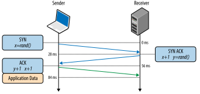
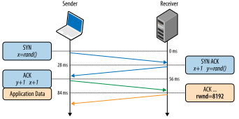
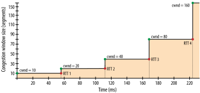
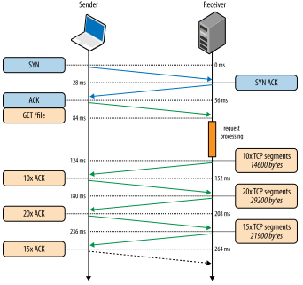
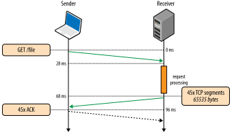
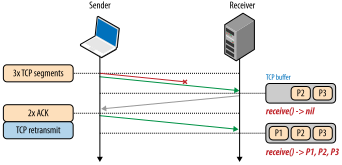

# Building Blocks of TCP

> [Các khối xây dựng của TCP](https://hpbn.co/building-blocks-of-tcp/)

Trung tâm của Internet là hai giao thức, IP và TCP. IP, hay Giao thức Internet, là thứ cung cấp định tuyến và địa chỉ từ máy chủ đến máy chủ, và TCP, hay Giao thức điều khiển truyền, là thứ cung cấp sự trừu tượng của một mạng đáng tin cậy chạy trên một kênh không đáng tin cậy. TCP/IP cũng thường được gọi là Bộ giao thức Internet và lần đầu tiên được Vint Cerf và Bob Kahn đề xuất trong bài báo năm 1974 có tựa đề "Giao thức cho liên lạc mạng gói tin".

Đề xuất ban đầu (RFC 675) đã được sửa đổi nhiều lần và vào năm 1981, đặc tả v4 của TCP/IP đã được xuất bản không phải dưới dạng một mà là hai RFC riêng biệt:

- RFC 791 - Giao thức Internet
- RFC 793 - Giao thức điều khiển truyền dẫn

Kể từ đó, đã có một số cải tiến được đề xuất và thực hiện đối với TCP, nhưng hoạt động cốt lõi không có thay đổi đáng kể. TCP nhanh chóng thay thế các giao thức trước đây và hiện là giao thức được lựa chọn cho nhiều ứng dụng phổ biến nhất: World Wide Web, email, truyền tệp và nhiều ứng dụng khác.

TCP cung cấp một sự trừu tượng hiệu quả của một mạng đáng tin cậy chạy trên một kênh không đáng tin cậy, ẩn hầu hết sự phức tạp của giao tiếp mạng khỏi các ứng dụng của chúng ta: truyền lại dữ liệu bị mất, phân phối theo thứ tự, kiểm soát và tránh tắc nghẽn, tính toàn vẹn của dữ liệu, v.v. Khi bạn làm việc với luồng TCP, bạn được đảm bảo rằng tất cả các byte được gửi sẽ giống hệt với các byte được nhận và chúng sẽ đến máy khách theo cùng thứ tự. Do đó, TCP được tối ưu hóa để phân phối chính xác, thay vì kịp thời. Điều này, như bạn thấy, cũng tạo ra một số thách thức khi nói đến việc tối ưu hóa hiệu suất web trong trình duyệt.

Tiêu chuẩn HTTP không bắt buộc TCP là giao thức truyền tải duy nhất. Nếu muốn, chúng tôi có thể phân phối HTTP qua ổ cắm datagram (Giao thức gói dữ liệu người dùng hoặc UDP) hoặc bất kỳ giao thức truyền tải nào khác mà chúng tôi chọn, nhưng trên thực tế, tất cả lưu lượng HTTP trên Internet ngày nay đều được phân phối qua TCP do có nhiều điều tuyệt vời và thuận tiện. các tính năng nó cung cấp ngay lập tức.

Vì lý do này, việc hiểu một số cơ chế cốt lõi của TCP là kiến ​​thức cần thiết để xây dựng trải nghiệm web được tối ưu hóa. Có thể bạn sẽ không làm việc trực tiếp với các socket TCP trong ứng dụng của mình, nhưng những lựa chọn thiết kế bạn thực hiện ở lớp ứng dụng sẽ quyết định hiệu suất của TCP và mạng cơ bản mà ứng dụng của bạn được phân phối qua đó.

!!! info "Info"

    __Lịch sử đan xen của giao thức TCP và IP__

    Tất cả chúng ta đều quen thuộc với IPv4 và IPv6, nhưng điều gì đã xảy ra với IPv{1,2,3,5}? Số 4 trong IPv4 là viết tắt của phiên bản 4 của giao thức TCP/IP, được xuất bản vào tháng 9 năm 1981. Đề xuất TCP/IP ban đầu đã kết hợp hai giao thức và chính bản dự thảo v4 đã chính thức chia hai giao thức thành các RFC riêng biệt. Do đó, v4 trong IPv4 là di sản của mối quan hệ với TCP: không có giao thức IPv1, IPv2 hoặc IPv3 độc lập.

    Khi nhóm làm việc bắt đầu làm việc về "Giao thức Internet thế hệ tiếp theo" (IPng) vào năm 1994, cần có số phiên bản mới, nhưng v5 đã được gán cho một giao thức thử nghiệm khác: Giao thức luồng Internet (ST). Hóa ra, ST chưa bao giờ thành công, đó là lý do tại sao ít người biết đến nó. Do đó là 6 trong IPv6.


## Three-Way Handshake
> Bắt tay ba chiều

Tất cả các kết nối TCP đều bắt đầu bằng quá trình bắt tay ba bước ( Hình 2-1 ). Trước khi máy khách hoặc máy chủ có thể trao đổi bất kỳ dữ liệu ứng dụng nào, chúng phải đồng ý về việc bắt đầu số thứ tự gói, cũng như một số biến cụ thể về kết nối khác, từ cả hai phía. Các số thứ tự được chọn ngẫu nhiên từ cả hai phía vì lý do bảo mật.

SYN
Máy khách chọn một số thứ tự ngẫu nhiên xvà gửi gói SYN, gói này cũng có thể bao gồm các tùy chọn và cờ TCP bổ sung.

SYN ACK
Máy chủ tăng xthêm một, chọn số thứ tự ngẫu nhiên của riêng mình y, thêm bộ cờ và tùy chọn của riêng mình, rồi gửi phản hồi.

ACK
Máy khách tăng cả hai giá trị xvà ythêm một và hoàn tất quá trình bắt tay bằng cách gửi gói ACK cuối cùng trong quá trình bắt tay.

<figure markdown="span">
    
    <figcaption>Hình 2-1. Bắt tay ba chiều</figcaption>
</figure>

Khi quá trình bắt tay ba chiều hoàn tất, dữ liệu ứng dụng có thể bắt đầu truyền giữa máy khách và máy chủ. Máy khách có thể gửi gói dữ liệu ngay sau gói ACK và máy chủ phải đợi ACK trước khi có thể gửi bất kỳ dữ liệu nào. Quá trình khởi động này áp dụng cho mọi kết nối TCP và mang ý nghĩa quan trọng đối với hiệu suất của tất cả các ứng dụng mạng sử dụng TCP: mỗi kết nối mới sẽ có độ trễ đầy đủ trước khi bất kỳ dữ liệu ứng dụng nào có thể được truyền.

Ví dụ, nếu máy khách của chúng ta ở New York, máy chủ ở London và chúng ta đang bắt đầu một kết nối TCP mới qua liên kết cáp quang, thì bắt tay ba chiều sẽ mất tối thiểu 56 mili giây ( Bảng 1-1 ): 28 mili giây để truyền gói tin theo một hướng, sau đó nó phải quay trở lại New York. Lưu ý rằng băng thông của kết nối không đóng vai trò gì ở đây. Thay vào đó, độ trễ được điều chỉnh bởi độ trễ giữa máy khách và máy chủ, mà độ trễ này lại bị chi phối bởi thời gian truyền giữa New York và London.

Độ trễ do quá trình bắt tay ba chiều gây ra khiến việc tạo kết nối TCP mới trở nên tốn kém và là một trong những lý do chính khiến việc sử dụng lại kết nối là một biện pháp tối ưu hóa quan trọng đối với bất kỳ ứng dụng nào chạy trên TCP.

!!! info "Info"
    __TCP Fast Open (TFO)__

    Tải một trang web thường yêu cầu tìm nạp hàng trăm tài nguyên từ hàng chục máy chủ khác nhau. Đổi lại, điều này có thể yêu cầu trình duyệt thiết lập hàng chục kết nối TCP mới, mỗi kết nối trong số đó sẽ phải chịu chi phí bắt tay TCP. Không cần phải nói, đây có thể là nguyên nhân gây ra độ trễ duyệt web đáng kể, đặc biệt là trên các mạng di động chậm hơn.

    TCP Fast Open (TFO) là một cơ chế nhằm loại bỏ hình phạt về độ trễ áp dụng cho các kết nối TCP mới bằng cách cho phép truyền dữ liệu trong gói SYN. Tuy nhiên, nó có những hạn chế riêng: có giới hạn về kích thước tối đa của tải trọng dữ liệu trong gói SYN, chỉ một số loại yêu cầu HTTP nhất định mới có thể được gửi và nó chỉ hoạt động đối với các kết nối lặp lại do yêu cầu về cookie mật mã. Để thảo luận chi tiết về các khả năng và hạn chế của TFO, hãy xem bản dự thảo IETF mới nhất về "TCP Fast Open".

    Việc bật TFO yêu cầu hỗ trợ rõ ràng trên máy khách, máy chủ và chọn tham gia từ ứng dụng. Để có kết quả tốt nhất, hãy sử dụng nhân Linux v4.1+ trên máy chủ, máy khách tương thích (ví dụ: Linux hoặc iOS9+ / OSX 10.11+) và bật cờ ổ cắm thích hợp trong ứng dụng của bạn.

    Dựa trên phân tích lưu lượng truy cập và mô phỏng mạng được thực hiện tại Google, các nhà nghiên cứu đã chỉ ra rằng TFO có thể giảm độ trễ mạng giao dịch HTTP xuống 15%, thời gian tải toàn bộ trang trung bình hơn 10% và trong một số trường hợp lên tới 40% ở mức cao. kịch bản độ trễ!

## Congestion Avoidance and Control
> Tránh và kiểm soát tắc nghẽn

Vào đầu năm 1984, John Nagle đã ghi chép lại một tình trạng được gọi là "sụp đổ tắc nghẽn", có thể ảnh hưởng đến bất kỳ mạng nào có dung lượng băng thông không đối xứng giữa các nút mạng:

> Kiểm soát tắc nghẽn là một vấn đề được công nhận trong các mạng phức tạp. Chúng tôi đã phát hiện ra rằng Giao thức Internet (IP) của Bộ Quốc phòng, một giao thức gói dữ liệu thuần túy và Giao thức Kiểm soát Truyền tải (TCP), một giao thức lớp vận chuyển, khi được sử dụng cùng nhau, có thể gặp phải các vấn đề tắc nghẽn bất thường do tương tác giữa quá trình vận chuyển và gói dữ liệu gây ra. các lớp. Đặc biệt, các cổng IP dễ bị ảnh hưởng bởi hiện tượng mà chúng tôi gọi là "sụp đổ tắc nghẽn", đặc biệt khi các cổng như vậy kết nối các mạng có băng thông rất khác nhau…
> 
> Nếu thời gian khứ hồi vượt quá khoảng thời gian truyền lại tối đa cho bất kỳ máy chủ nào, máy chủ đó sẽ bắt đầu đưa ngày càng nhiều bản sao của cùng một datagram vào mạng. Mạng bây giờ đang gặp rắc rối nghiêm trọng. Cuối cùng tất cả các bộ đệm có sẵn trong các nút chuyển mạch sẽ đầy và các gói phải bị loại bỏ. Thời gian khứ hồi cho các gói được phân phối hiện ở mức tối đa. Các máy chủ đang gửi mỗi gói nhiều lần và cuối cùng một số bản sao của mỗi gói sẽ đến đích. Đây là sự sụp đổ tắc nghẽn.
> 
> Tình trạng này ổn định. Khi đã đạt đến điểm bão hòa, nếu thuật toán chọn gói bị loại bỏ là hợp lý thì mạng sẽ tiếp tục hoạt động trong tình trạng xuống cấp.

Báo cáo kết luận rằng sự sụp đổ do tắc nghẽn vẫn chưa trở thành vấn đề đối với ARPANET vì hầu hết các nút đều có băng thông đồng đều và xương sống có dung lượng dư thừa đáng kể. Tuy nhiên, không có khẳng định nào trong số này đúng trong thời gian dài. Vào năm 1986, khi số lượng (hơn 5.000) và sự đa dạng của các nút trên mạng tăng lên, một loạt các sự cố sụp đổ do tắc nghẽn đã lan rộng khắp mạng — trong một số trường hợp, dung lượng giảm xuống gấp 1.000 lần và mạng trở nên không sử dụng được.

Để giải quyết những vấn đề này, nhiều cơ chế đã được triển khai trong TCP để quản lý tốc độ dữ liệu có thể được gửi theo cả hai hướng: kiểm soát luồng, kiểm soát tắc nghẽn và tránh tắc nghẽn.

!!! note "Note"
    Mạng lưới Cơ quan Dự án Nghiên cứu Tiên tiến (ARPANET) là tiền thân của Internet hiện đại và là mạng chuyển mạch gói đầu tiên trên thế giới. Dự án được chính thức khởi động vào năm 1969, và vào năm 1983, các giao thức TCP/IP đã thay thế NCP (Chương trình Kiểm soát Mạng) trước đó làm giao thức truyền thông chính. Phần còn lại, như họ nói, là lịch sử.

### Flow Control
> Kiểm soát lưu lượng

Kiểm soát luồng là một cơ chế nhằm ngăn chặn việc người gửi làm cho người nhận choáng ngợp với dữ liệu mà họ có thể không xử lý được - người nhận có thể đang bận, đang tải nặng hoặc có thể chỉ sẵn sàng phân bổ một lượng không gian bộ đệm cố định. Để giải quyết vấn đề này, mỗi bên của kết nối TCP quảng cáo ( Hình 2-2 ) cửa sổ nhận riêng của nó (rwnd), truyền đạt kích thước của không gian bộ đệm có sẵn để giữ dữ liệu đến.

Khi kết nối được thiết lập lần đầu tiên, cả hai bên sẽ bắt đầu các giá trị rwnd bằng cách sử dụng cài đặt mặc định của hệ thống. Một trang web thông thường sẽ truyền phần lớn dữ liệu từ máy chủ đến máy khách, khiến cửa sổ của máy khách có thể bị tắc nghẽn. Tuy nhiên, nếu máy khách đang truyền một lượng lớn dữ liệu đến máy chủ, chẳng hạn như trong trường hợp tải lên hình ảnh hoặc video thì cửa sổ nhận máy chủ có thể trở thành yếu tố hạn chế.

Nếu vì lý do nào đó, một trong hai bên không thể theo kịp, thì bên đó có thể quảng cáo một cửa sổ nhỏ hơn cho bên gửi. Nếu cửa sổ đạt đến số không, thì nó được coi là tín hiệu không nên gửi thêm dữ liệu cho đến khi dữ liệu hiện có trong bộ đệm được xóa bởi lớp ứng dụng. Quy trình làm việc này tiếp tục trong suốt vòng đời của mọi kết nối TCP: mỗi gói ACK mang giá trị rwnd mới nhất cho mỗi bên, cho phép cả hai bên điều chỉnh động tốc độ luồng dữ liệu theo dung lượng và tốc độ xử lý của bên gửi và bên nhận.

<figure markdown="span">
    
    <figcaption>Hình 2-2. Nhận quảng cáo kích thước cửa sổ (rwnd)</figcaption>
</figure>

!!! info "Info"
    __Tỷ lệ cửa sổ (RFC 1323)__

    Đặc tả TCP gốc phân bổ 16 bit để quảng cáo kích thước cửa sổ nhận, đặt ra giới hạn trên cứng cho giá trị tối đa ($2^{16}$ hoặc `65.535 byte`) mà người gửi và người nhận có thể quảng cáo. Hóa ra, giới hạn trên này thường không đủ để có hiệu suất tối ưu, đặc biệt là trong các mạng có sản phẩm trễ băng thông cao; có thể tìm hiểu thêm về điều này tại Bandwidth-Delay Product .

    Để giải quyết vấn đề này, RFC 1323 đã được soạn thảo để cung cấp tùy chọn "mở rộng cửa sổ TCP", cho phép chúng tôi tăng kích thước cửa sổ nhận tối đa từ 65.535 byte lên 1 gigabyte! Tùy chọn chia tỷ lệ cửa sổ được truyền đạt trong quá trình bắt tay ba chiều và mang một giá trị biểu thị số bit để dịch chuyển trái trường kích thước cửa sổ 16 bit trong các ACK trong tương lai.

    Ngày nay, tính năng chia tỷ lệ cửa sổ TCP được bật theo mặc định trên tất cả các nền tảng chính. Tuy nhiên, các nút trung gian, bộ định tuyến và tường lửa có thể viết lại hoặc thậm chí loại bỏ hoàn toàn tùy chọn này. Nếu kết nối của bạn với máy chủ hoặc máy khách không thể tận dụng tối đa băng thông sẵn có thì việc kiểm tra sự tương tác của các kích thước cửa sổ luôn là cách tốt để bắt đầu. Trên nền tảng Linux, cài đặt chia tỷ lệ cửa sổ có thể được kiểm tra và bật thông qua các lệnh sau:

    ```bash
    sysctl net.ipv4.tcp_window_scaling
    sysctl -w net.ipv4.tcp_window_scaling=1
    ```

### Slow-Start

> Bắt đầu chậm

Mặc dù có kiểm soát luồng trong TCP, tình trạng tắc nghẽn mạng đã trở thành một vấn đề thực sự vào giữa đến cuối những năm 1980. Vấn đề là kiểm soát luồng ngăn không cho người gửi tràn ngập người nhận, nhưng không có cơ chế nào ngăn không cho cả hai bên tràn ngập mạng cơ bản: cả người gửi và người nhận đều không biết băng thông khả dụng khi bắt đầu kết nối mới và do đó cần một cơ chế để ước tính băng thông đó và cũng để điều chỉnh tốc độ của họ theo các điều kiện liên tục thay đổi trong mạng.

Để minh họa một ví dụ cho thấy việc thích ứng như vậy mang lại lợi ích, hãy tưởng tượng bạn đang ở nhà và phát trực tuyến một video lớn từ một máy chủ từ xa đã quản lý bão hòa đường xuống của bạn để mang lại trải nghiệm chất lượng tối đa. Sau đó, một người dùng khác trên mạng gia đình của bạn sẽ mở kết nối mới để tải xuống một số bản cập nhật phần mềm. Đột nhiên, lượng băng thông đường xuống có sẵn cho luồng video ít hơn nhiều và máy chủ video phải điều chỉnh tốc độ dữ liệu của nó - nếu không, nếu tiếp tục ở tốc độ tương tự, dữ liệu sẽ chỉ chồng chất ở một số cổng trung gian và các gói sẽ bị loại bỏ, dẫn đến việc sử dụng mạng không hiệu quả.

Năm 1988, Van Jacobson và Michael J. Karels đã ghi lại một số thuật toán để giải quyết những vấn đề này: khởi động chậm, tránh tắc nghẽn, truyền lại nhanh và phục hồi nhanh. Cả bốn nhanh chóng trở thành một phần bắt buộc của đặc tả TCP. Trên thực tế, nhiều người cho rằng chính những cập nhật này cho TCP đã ngăn chặn cuộc khủng hoảng Internet vào những năm 80 và đầu những năm 90 khi lưu lượng truy cập tiếp tục tăng theo cấp số nhân.

Để hiểu được sự khởi đầu chậm, tốt nhất là hãy xem nó hoạt động như thế nào. Vì vậy, một lần nữa, chúng ta hãy quay lại với khách hàng của mình, khách hàng này ở New York, đang cố gắng truy xuất một tệp từ máy chủ ở London. Đầu tiên, bắt tay ba chiều được thực hiện, trong đó cả hai bên quảng cáo kích thước cửa sổ nhận (rwnd) tương ứng của họ trong các gói ACK ( Hình 2-2 ). Sau khi gói ACK cuối cùng được đưa lên mạng, chúng ta có thể bắt đầu trao đổi dữ liệu ứng dụng.

Cách duy nhất để ước tính dung lượng khả dụng giữa máy khách và máy chủ là đo lường nó bằng cách trao đổi dữ liệu và đây chính xác là điều mà tính năng khởi động chậm được thiết kế để thực hiện. Để bắt đầu, máy chủ khởi tạo một biến cửa sổ tắc nghẽn (cwnd) mới cho mỗi kết nối TCP và đặt giá trị ban đầu của nó thành giá trị bảo thủ do hệ thống chỉ định (initcwnd trên Linux).

> Kích thước cửa sổ tắc nghẽn (cwnd)<br>
> &emsp;Giới hạn phía người gửi về lượng dữ liệu mà người gửi có thể có trong chuyến bay trước khi nhận được xác nhận (ACK) từ khách hàng.

Biến cwnd không được quảng cáo hoặc trao đổi giữa người gửi và người nhận — trong trường hợp này, nó sẽ là một biến riêng do máy chủ ở London duy trì. Hơn nữa, một quy tắc mới được giới thiệu: lượng dữ liệu tối đa đang truyền (không được ACK) giữa máy khách và máy chủ là lượng dữ liệu tối thiểu trong các biến rwnd và cwnd. Cho đến nay thì mọi thứ vẫn ổn, nhưng máy chủ và máy khách xác định các giá trị tối ưu cho kích thước cửa sổ tắc nghẽn của chúng như thế nào? Xét cho cùng, các điều kiện mạng luôn thay đổi, ngay cả giữa hai nút mạng giống nhau, như chúng ta đã thấy trong ví dụ trước đó, và sẽ thật tuyệt nếu chúng ta có thể sử dụng thuật toán mà không cần phải điều chỉnh thủ công kích thước cửa sổ cho mỗi kết nối.

Giải pháp là bắt đầu chậm và tăng kích thước cửa sổ khi các gói được xác nhận: bắt đầu chậm! Ban đầu, giá trị bắt đầu cwnd được đặt thành 1 phân đoạn mạng; RFC 2581 đã cập nhật giá trị này thành 4 phân đoạn vào tháng 4 năm 1999; gần đây nhất, giá trị đã được tăng thêm một lần nữa lên 10 phân đoạn bởi RFC 6928 vào tháng 4 năm 2013.

Lượng dữ liệu tối đa đang truyền cho một kết nối TCP mới là giá trị tối thiểu của rwnd và cwnd; do đó, một máy chủ hiện đại có thể gửi tối đa mười phân đoạn mạng tới máy khách, tại thời điểm đó, nó phải dừng và chờ xác nhận. Sau đó, đối với mỗi ACK nhận được, thuật toán khởi động chậm chỉ ra rằng máy chủ có thể tăng kích thước cửa sổ cwnd của nó lên một phân đoạn - đối với mỗi gói ACKed, hai gói mới có thể được gửi. Giai đoạn này của kết nối TCP thường được gọi là thuật toán "tăng trưởng theo cấp số nhân" ( Hình 2-3 ), vì máy khách và máy chủ đang cố gắng nhanh chóng hội tụ băng thông có sẵn trên đường dẫn mạng giữa chúng.

<figure markdown="span">
    
    <figcaption>Hình 2-3. Kiểm soát tắc nghẽn và tránh tắc nghẽn</figcaption>
</figure>

Vậy tại sao khởi động chậm lại là yếu tố quan trọng cần lưu ý khi chúng ta xây dựng ứng dụng cho trình duyệt? Vâng, HTTP và nhiều giao thức ứng dụng khác chạy trên TCP và bất kể băng thông sẵn có là bao nhiêu, mọi kết nối TCP đều phải trải qua giai đoạn khởi động chậm — chúng ta không thể sử dụng toàn bộ dung lượng của liên kết ngay lập tức!

Thay vào đó, chúng ta bắt đầu với một cửa sổ tắc nghẽn nhỏ và nhân đôi nó cho mỗi vòng lặp — tức là tăng trưởng theo cấp số nhân. Do đó, thời gian cần thiết để đạt được mục tiêu thông lượng cụ thể là một hàm ( [Thời gian để đạt được kích thước cwnd có kích thước N](https://hpbn.co/building-blocks-of-tcp/#ss-time) ) của cả thời gian vòng lặp giữa máy khách và máy chủ và kích thước cửa sổ tắc nghẽn ban đầu.

Thời gian để đạt đến kích thước cwnd của kích thước N

$$
Time = RTT \times \left[\log_{2}\left(1+ \frac{N}{initial\,cwnd}\right)\right]
$$

Để có một ví dụ thực tế về tác động khởi đầu chậm, chúng ta hãy giả sử tình huống sau:

- Cửa sổ nhận của máy khách và máy chủ: 65.535 byte (64 KB)
- Cửa sổ tắc nghẽn ban đầu: 10 phân đoạn (RFC 6928)
- Thời gian khứ hồi: 56 ms (London đến New York)

Mặc dù kích thước cửa sổ nhận 64 KB, thông lượng của kết nối TCP mới ban đầu bị giới hạn bởi kích thước của cửa sổ tắc nghẽn. Trên thực tế, để đạt đến giới hạn cửa sổ nhận 64 KB, trước tiên chúng ta sẽ cần tăng kích thước cửa sổ tắc nghẽn lên 45 phân đoạn, mất 168 mili giây:

$$
\frac{65,535 bytes}{1,460 byete} \thickapprox 45\,(segments)
$$

$$
56\,ms \times \left[\log_{2}\left(1+ \frac{45}{10}\right)\right] = 168\,ms
$$

Đó là ba chuyến khứ hồi ( Hình 2-4 ) để đạt được 64 KB thông lượng giữa máy khách và máy chủ! Thực tế là máy khách và máy chủ có thể truyền dữ liệu ở tốc độ Mbps+ không có tác dụng gì khi kết nối mới được thiết lập — đó là khởi động chậm.

!!! note "Note"
    Ví dụ trên sử dụng giá trị mới (RFC 6928) của mười phân đoạn mạng cho cửa sổ tắc nghẽn ban đầu. Để thực hành, hãy lặp lại phép tính tương tự với kích thước cũ hơn của bốn phân đoạn — bạn sẽ thấy rằng điều này sẽ thêm 56 mili giây khứ hồi vào kết quả trên!

<figure markdown="span">
    
    <figcaption>Hình 2-4. Sự tăng trưởng kích thước cửa sổ tắc nghẽn</figcaption>
</figure>

Để giảm lượng thời gian cần thiết để mở rộng cửa sổ tắc nghẽn, chúng ta có thể giảm thời gian khứ hồi giữa máy khách và máy chủ — ví dụ, di chuyển máy chủ gần máy khách hơn về mặt địa lý. Hoặc chúng ta có thể tăng kích thước cửa sổ tắc nghẽn ban đầu lên giá trị RFC 6928 mới là 10 phân đoạn.

Khởi động chậm không phải là vấn đề lớn đối với các bản tải xuống trực tuyến lớn vì máy khách và máy chủ sẽ đạt đến kích thước cửa sổ tối đa sau vài trăm mili giây và tiếp tục truyền ở tốc độ gần tối đa — chi phí cho giai đoạn khởi động chậm sẽ được khấu hao trong suốt thời gian truyền dữ liệu lớn hơn.

Tuy nhiên, đối với nhiều kết nối HTTP, thường ngắn và đột ngột, việc truyền dữ liệu kết thúc trước khi đạt đến kích thước cửa sổ tối đa là điều bình thường. Do đó, hiệu suất của nhiều ứng dụng web thường bị giới hạn bởi thời gian khứ hồi giữa máy chủ và máy khách: khởi động chậm giới hạn thông lượng băng thông khả dụng, điều này có tác động tiêu cực đến hiệu suất của các lần truyền nhỏ.

!!! info "Info"
    __Slow-Start Restart__ (Khởi động lại chậm)

    Ngoài việc điều chỉnh tốc độ truyền của các kết nối mới, TCP còn thực hiện cơ chế khởi động lại chậm (SSR), cơ chế này sẽ đặt lại cửa sổ tắc nghẽn của kết nối sau khi nó không hoạt động trong một khoảng thời gian xác định. Lý do rất đơn giản: điều kiện mạng có thể đã thay đổi trong khi kết nối không hoạt động và để tránh tắc nghẽn, cửa sổ được đặt lại về mặc định "an toàn".

    Không có gì ngạc nhiên khi SSR có thể có tác động đáng kể đến hiệu suất của các kết nối TCP tồn tại lâu dài có thể không hoạt động trong một khoảng thời gian — ví dụ: do người dùng không hoạt động. Do đó, thông thường nên tắt SSR trên máy chủ để giúp cải thiện hiệu suất của các kết nối HTTP tồn tại lâu dài. Trên nền tảng Linux, cài đặt SSR có thể được kiểm tra và tắt thông qua các lệnh sau:

    ```bash
    sysctl net.ipv4.tcp_slow_start_after_idle
    sysctl -w net.ipv4.tcp_slow_start_after_idle=0
    ```

Để minh họa tác động của bắt tay ba chiều và giai đoạn khởi động chậm đối với quá trình truyền HTTP đơn giản, hãy giả sử rằng máy khách của chúng ta ở New York yêu cầu một tệp 64 KB từ máy chủ ở London qua kết nối TCP mới ( Hình 2-5 ) và các tham số kết nối sau đã được thiết lập:

- Thời gian khứ hồi: 56 ms
- Băng thông máy khách và máy chủ: 5 Mbps
- Cửa sổ nhận máy khách và máy chủ: 65.535 byte
- Cửa sổ tắc nghẽn ban đầu: 10 phân đoạn ( )
- Thời gian xử lý của máy chủ để tạo phản hồi: 40 ms
- Không mất gói, ACK trên mỗi gói, yêu cầu GET phù hợp với một phân đoạn

<figure markdown="span">
    
    <figcaption>Hình 2-5. Tìm nạp tệp qua kết nối TCP mới</figcaption>
</figure>

| Độ trễ | Chu trinh                                                                                                                        |
| :----: | :------------------------------------------------------------------------------------------------------------------------------- |
|        |                                                                                                                                  |
|  0 ms  | Máy khách bắt đầu bắt tay TCP với gói SYN.                                                                                       |
| 28 ms  | Máy chủ trả lời bằng SYN-ACK và chỉ định kích thước rwnd của nó.                                                                 |
| 56 ms  | Máy khách ACK SYN-ACK, chỉ định kích thước rwnd của nó và ngay lập tức gửi yêu cầu HTTP GET.                                     |
| 84 ms  | Máy chủ nhận được yêu cầu HTTP.                                                                                                  |
| 124 ms | Máy chủ hoàn tất việc tạo phản hồi 64 KB và gửi 10 phân đoạn TCP trước khi tạm dừng nhận ACK<br>(kích thước cwnd ban đầu là 10). |
| 152 ms | Máy khách nhận được 10 phân đoạn TCP và ACK cho mỗi phân đoạn.                                                                   |
| 180 ms | Máy chủ tăng cwnd của nó cho mỗi ACK và gửi 20 phân đoạn TCP.                                                                    |
| 208 ms | Máy khách nhận được 20 phân đoạn TCP và ACK cho mỗi phân đoạn.                                                                   |
| 236 ms | Máy chủ tăng cwnd cho mỗi ACK và gửi 15 phân đoạn TCP còn lại.                                                                   |
| 264 ms | Máy khách nhận được 15 phân đoạn TCP, mỗi phân đoạn có ACK.                                                                      |

264 ms để truyền tệp 64 KB trên kết nối TCP mới với thời gian khứ hồi 56 ms giữa máy khách và máy chủ! Để so sánh, bây giờ hãy giả sử rằng máy khách có thể sử dụng lại cùng một kết nối TCP ( Hình 2-6 ) và đưa ra cùng một yêu cầu một lần nữa.

<figure markdown="span">
    
    <figcaption>Hình 2-6. Tìm nạp tệp qua kết nối TCP hiện có</figcaption>
</figure>

| Độ trễ | Chu trinh                                                                                                                                                       |
| :----: | :-------------------------------------------------------------------------------------------------------------------------------------------------------------- |
|        |                                                                                                                                                                 |
|  0 ms  | Máy khách gửi yêu cầu HTTP.                                                                                                                                     |
| 28 ms  | Máy chủ nhận được yêu cầu HTTP.                                                                                                                                 |
| 68 ms  | Máy chủ hoàn tất việc tạo phản hồi 64 KB, nhưng giá trị cwnd đã lớn hơn 45 phân đoạn cần thiết để gửi tệp; do đó nó gửi tất cả các phân đoạn trong một lần gửi. |
| 96 ms  | Máy khách nhận được tất cả 45 phân đoạn, ACK cho từng phân đoạn.                                                                                                |

Yêu cầu tương tự được thực hiện trên cùng một kết nối, nhưng không mất chi phí bắt tay ba chiều và hình phạt của giai đoạn khởi động chậm, giờ chỉ mất 96 mili giây, tương đương với việc cải thiện hiệu suất 275%!

Trong cả hai trường hợp, thực tế là cả máy chủ và máy khách đều có quyền truy cập vào 5 Mbps băng thông ngược dòng không có tác động nào trong giai đoạn khởi động của kết nối TCP. Thay vào đó, độ trễ và kích thước cửa sổ tắc nghẽn là các yếu tố hạn chế.

Trên thực tế, khoảng cách hiệu suất giữa yêu cầu đầu tiên và yêu cầu thứ hai được gửi qua kết nối hiện có sẽ chỉ mở rộng nếu chúng ta tăng thời gian khứ hồi; như một bài tập, hãy thử với một vài giá trị khác nhau. Khi bạn phát triển trực giác về cơ chế kiểm soát tắc nghẽn TCP, hàng chục tối ưu hóa như duy trì trạng thái hoạt động, đường ống và ghép kênh sẽ không đòi hỏi nhiều động lực hơn nữa.

!!! info "Info"
    __Tăng cửa sổ tắc nghẽn ban đầu của TCP__
    
    Tăng kích thước cwnd ban đầu trên máy chủ lên giá trị RFC 6928 mới gồm 10 phân đoạn (IW10) là một trong những cách đơn giản nhất để cải thiện hiệu suất cho tất cả người dùng và tất cả các ứng dụng chạy trên TCP. Và tin tốt là nhiều hệ điều hành đã cập nhật nhân mới nhất của họ để sử dụng giá trị gia tăng — hãy kiểm tra tài liệu thích hợp và ghi chú phát hành.

    Đối với Linux, IW10 là mặc định mới cho tất cả các hạt nhân trên 2.6.39. Tuy nhiên, đừng dừng lại ở đó: hãy nâng cấp lên 3.2+ để nhận được lợi ích từ các bản cập nhật quan trọng khác; xem [Giảm tỷ lệ theo tỷ lệ cho TCP](https://hpbn.co/building-blocks-of-tcp/#proportional-rate-reduction-for-tcp).

### Congestion Avoidance
> Tránh ùn tắc

Điều quan trọng là phải nhận ra rằng TCP được thiết kế riêng để sử dụng mất gói tin như một cơ chế phản hồi để giúp điều chỉnh hiệu suất của nó. Nói cách khác, vấn đề không phải là nếu , mà là khi nào mất gói tin sẽ xảy ra. Slow-start khởi tạo kết nối với một cửa sổ bảo thủ và, đối với mỗi vòng lặp, tăng gấp đôi lượng dữ liệu đang truyền cho đến khi vượt quá cửa sổ kiểm soát luồng của máy thu, cửa sổ ngưỡng tắc nghẽn do hệ thống cấu hình (ssthresh) hoặc cho đến khi một gói tin bị mất, tại thời điểm đó thuật toán tránh tắc nghẽn ( Hình 2-3 ) sẽ tiếp quản.

Giả định ngầm trong việc tránh tắc nghẽn là việc mất gói là biểu hiện của tắc nghẽn mạng: ở đâu đó dọc đường dẫn, chúng ta gặp phải một liên kết hoặc bộ định tuyến bị tắc nghẽn, buộc phải loại bỏ gói và do đó chúng ta cần điều chỉnh cửa sổ của mình để tránh gây ra tắc nghẽn nhiều hơn. mất gói để tránh làm quá tải mạng.

Sau khi cửa sổ tắc nghẽn được thiết lập lại, tránh tắc nghẽn sẽ chỉ định các thuật toán riêng của nó về cách mở rộng cửa sổ để giảm thiểu mất mát thêm. Tại một thời điểm nhất định, một sự kiện mất gói khác sẽ xảy ra và quá trình sẽ lặp lại một lần nữa. Nếu bạn đã từng xem dấu vết thông lượng của kết nối TCP và quan sát thấy một mẫu hình răng cưa bên trong nó, thì giờ bạn đã biết tại sao nó trông như vậy: đó là các thuật toán kiểm soát và tránh tắc nghẽn điều chỉnh kích thước cửa sổ tắc nghẽn để tính đến mất gói trong mạng.

Cuối cùng, điều đáng lưu ý là việc cải thiện khả năng kiểm soát và tránh tắc nghẽn là một lĩnh vực đang được cả nghiên cứu hàn lâm và các sản phẩm thương mại quan tâm: có những điều chỉnh cho các loại mạng khác nhau, các loại truyền dữ liệu khác nhau, v.v. Ngày nay, tùy thuộc vào nền tảng của bạn, bạn có thể sẽ chạy một trong nhiều biến thể: TCP Tahoe và Reno (các triển khai ban đầu), TCP Vegas, TCP New Reno, TCP BIC, TCP CUBIC (mặc định trên Linux) hoặc Compound TCP (mặc định trên Windows), trong số nhiều biến thể khác. Tuy nhiên, bất kể loại nào, các tác động cốt lõi về hiệu suất của khả năng kiểm soát và tránh tắc nghẽn đều đúng với tất cả.

!!! info "Info"
    __Giảm tỷ lệ tỷ lệ cho TCP__

    Xác định cách tối ưu để phục hồi sau mất gói tin là một bài toán không hề đơn giản: nếu bạn quá quyết liệt, thì một gói tin bị mất liên tục sẽ có tác động đáng kể đến thông lượng của toàn bộ kết nối và nếu bạn không điều chỉnh đủ nhanh, thì bạn sẽ gây ra thêm nhiều gói tin bị mất hơn!

    Ban đầu, TCP sử dụng thuật toán Giảm nhân và tăng cộng (AIMD): khi xảy ra mất gói, hãy giảm một nửa kích thước cửa sổ tắc nghẽn, sau đó tăng từ từ cửa sổ lên một lượng cố định trên mỗi chuyến khứ hồi. Tuy nhiên, trong nhiều trường hợp AIMD quá bảo thủ và do đó các thuật toán mới đã được phát triển.

    Giảm tỷ lệ theo tỷ lệ (PRR) là một thuật toán mới được chỉ định bởi RFC 6937, có mục tiêu là cải thiện tốc độ phục hồi khi một gói tin bị mất. Nó tốt hơn bao nhiêu? Theo các phép đo được thực hiện tại Google, nơi thuật toán mới được phát triển, nó cung cấp khả năng giảm 3–10% độ trễ trung bình cho các kết nối bị mất gói tin.

    PRR hiện là thuật toán tránh tắc nghẽn mặc định trong kernel Linux 3.2 trở lên — một lý do chính đáng khác để nâng cấp máy chủ của bạn!

## Bandwidth-Delay Product
> Sản phẩm có độ trễ băng thông

Cơ chế kiểm soát tắc nghẽn và tránh tắc nghẽn tích hợp trong TCP mang một ý nghĩa hiệu suất quan trọng khác: kích thước cửa sổ người gửi và người nhận tối ưu phải thay đổi dựa trên thời gian khứ hồi và tốc độ dữ liệu mục tiêu giữa chúng.

Để hiểu lý do tại sao lại như vậy, trước tiên hãy nhớ lại rằng lượng dữ liệu đang truyền, chưa được xác nhận tối đa giữa người gửi và người nhận được xác định là mức tối thiểu của kích thước cửa sổ nhận (rwnd) và tắc nghẽn (cwnd): cửa sổ nhận hiện tại là được truyền đạt trong mọi ACK và cửa sổ tắc nghẽn được người gửi điều chỉnh linh hoạt dựa trên các thuật toán tránh và kiểm soát tắc nghẽn.

Nếu người gửi hoặc người nhận vượt quá lượng dữ liệu chưa được xác nhận tối đa thì nó phải dừng lại và đợi đầu kia ACK một số gói trước khi tiếp tục. Sẽ phải đợi bao lâu? Điều đó được quyết định bởi thời gian khứ hồi giữa hai người!

> Tích số độ trễ băng thông (BDP)<br>
> &emsp;Tích của dung lượng liên kết dữ liệu và độ trễ từ đầu đến cuối. Kết quả là lượng dữ liệu tối đa chưa được xác nhận có thể được truyền đi tại bất kỳ thời điểm nào.

Nếu người gửi hoặc người nhận thường xuyên bị buộc phải dừng và chờ ACK cho các gói trước đó thì điều này sẽ tạo ra các khoảng trống trong luồng dữ liệu ( Hình 2-7 ), do đó sẽ hạn chế thông lượng tối đa của kết nối. Để giải quyết vấn đề này, kích thước cửa sổ phải được tạo vừa đủ lớn để một trong hai bên có thể tiếp tục gửi dữ liệu cho đến khi có ACK gửi lại từ máy khách cho gói trước đó - không có khoảng trống, thông lượng tối đa. Do đó, kích thước cửa sổ tối ưu phụ thuộc vào thời gian khứ hồi! Chọn kích thước cửa sổ thấp và bạn sẽ giới hạn thông lượng kết nối của mình, bất kể băng thông có sẵn hoặc được quảng cáo giữa các thiết bị ngang hàng.

<figure markdown="span">
    
    <figcaption>Hình 2-7. Khoảng cách truyền dẫn do kích thước cửa sổ tắc nghẽn thấp</figcaption>
</figure>

Vậy giá trị cửa sổ điều khiển luồng (rwnd) và tắc nghẽn (cwnd) cần lớn đến mức nào? Việc tính toán thực tế là một việc đơn giản. Trước tiên, chúng ta hãy giả sử rằng kích thước cửa sổ cwnd và rwnd tối thiểu là 16 KB và thời gian khứ hồi là 100 ms:

$$
16\,KB = \left(16 \times 1024 \times 8\right) = 131,072\,(bits)
$$

$$
\frac{131,072\,(bits)}{0.1\,(s)} = 1,310,720\,(bits/s)
$$

$$
1,310,720\,(bits/s) = \frac{1,310,720}{1,000,000} = 1.31\,(Mbps)
$$

Bất kể băng thông khả dụng giữa người gửi và người nhận là bao nhiêu, kết nối TCP này sẽ không vượt quá tốc độ dữ liệu 1,31 Mbps! Để đạt được thông lượng cao hơn, chúng ta cần tăng kích thước cửa sổ hoặc giảm thời gian khứ hồi.

Tương tự, chúng ta có thể tính toán kích thước cửa sổ tối ưu nếu chúng ta biết thời gian khứ hồi và băng thông khả dụng ở cả hai đầu. Trong trường hợp này, giả sử rằng thời gian khứ hồi không đổi (100 ms), nhưng bên gửi có băng thông khả dụng là 10 Mbps và bên nhận đang sử dụng liên kết 100 Mbps+ thông lượng cao. Giả sử không có tắc nghẽn mạng giữa chúng, mục tiêu của chúng tôi là bão hòa liên kết 10 Mbps có sẵn cho máy khách:

$$
10\,(Mbps) = 10 \times 1,000,000 = 10,000,000\,(bits/s) 
$$

$$
10,000,000\,(bits/s) = \frac{10,000,000}{8 \times 1024} = 1,221\,(KB/s)
$$

$$
1,221\,(KB/s) \times 0.1\,(s) = 122.1\,(KB)
$$

Kích thước cửa sổ cần phải ít nhất là 122,1 KB để bão hòa liên kết 10 Mbps. Hãy nhớ rằng kích thước cửa sổ nhận tối đa trong TCP là 64 KB trừ khi có tính năng mở rộng cửa sổ — xem Mở rộng cửa sổ (RFC 1323) : hãy kiểm tra lại cài đặt máy khách và máy chủ của bạn!

Tin vui là việc đàm phán và điều chỉnh kích thước cửa sổ được quản lý tự động bởi ngăn xếp mạng và sẽ điều chỉnh cho phù hợp. Tin xấu là đôi khi nó vẫn là yếu tố hạn chế hiệu suất của TCP. Nếu bạn đã từng thắc mắc tại sao kết nối của mình lại truyền ở một phần băng thông khả dụng, ngay cả khi bạn biết rằng cả máy khách và máy chủ đều có tốc độ cao hơn, thì có thể là do kích thước cửa sổ nhỏ: quảng cáo ngang hàng đã bão hòa cửa sổ nhận thấp, thời tiết mạng xấu và mất gói cao, đặt lại cửa sổ tắc nghẽn hoặc định hình lưu lượng truy cập rõ ràng có thể đã được áp dụng để hạn chế thông lượng kết nối của bạn.

!!! info "Info"
    Sản phẩm trễ băng thông trong mạng LAN tốc độ cao
    
    BDP là một hàm của thời gian khứ hồi và tốc độ dữ liệu mục tiêu. Do đó, mặc dù thời gian khứ hồi là một nút cổ chai phổ biến trong các trường hợp có độ trễ truyền cao, nhưng nó cũng có thể là một nút cổ chai trên mạng LAN cục bộ!

    Để đạt được 1 Gbit/s với thời gian khứ hồi 1 ms, chúng ta cũng cần một cửa sổ tắc nghẽn ít nhất là 122 KB. Việc tính toán hoàn toàn giống như chúng ta đã thấy trước đó; chúng tôi chỉ cần thêm một vài số 0 vào tốc độ dữ liệu mục tiêu và loại bỏ cùng một lượng số 0 khỏi độ trễ khứ hồi.

### Head-of-Line Blocking

> Chặn đầu dòng

TCP cung cấp sự trừu tượng của một mạng đáng tin cậy chạy trên một kênh không đáng tin cậy, bao gồm kiểm tra và sửa lỗi gói tin cơ bản, phân phối theo thứ tự, truyền lại các gói tin bị mất, cũng như kiểm soát luồng, kiểm soát tắc nghẽn và tránh tắc nghẽn được thiết kế để vận hành mạng tại điểm hiệu quả cao nhất. Kết hợp lại, các tính năng này làm cho TCP trở thành phương tiện truyền tải được ưa chuộng cho hầu hết các ứng dụng.

Tuy nhiên, mặc dù TCP là một lựa chọn phổ biến nhưng nó không phải là lựa chọn duy nhất và cũng không nhất thiết là lựa chọn tốt nhất cho mọi trường hợp. Cụ thể, một số tính năng, chẳng hạn như phân phối gói tin cậy và đúng thứ tự, không phải lúc nào cũng cần thiết và có thể gây ra sự chậm trễ không cần thiết cũng như tác động tiêu cực đến hiệu suất.

Để hiểu lý do tại sao lại như vậy, hãy nhớ lại rằng mỗi gói TCP đều mang một số thứ tự duy nhất khi được đưa vào dây và dữ liệu phải được truyền đến người nhận theo thứ tự ( Hình 2-8 ). Nếu một trong các gói bị mất trên đường đến người nhận thì tất cả các gói tiếp theo phải được giữ trong bộ đệm TCP của người nhận cho đến khi gói bị mất được truyền lại và đến người nhận. Vì công việc này được thực hiện trong lớp TCP nên ứng dụng của chúng tôi không thể nhìn thấy các lần truyền lại TCP hoặc bộ đệm gói được xếp hàng đợi và phải đợi chuỗi đầy đủ trước khi có thể truy cập dữ liệu. Thay vào đó, nó chỉ thấy độ trễ phân phối khi cố đọc dữ liệu từ ổ cắm. Hiệu ứng này được gọi là chặn đầu dòng TCP (HOL).

Độ trễ do chặn đầu dòng gây ra cho phép các ứng dụng của chúng ta tránh phải xử lý việc sắp xếp lại và lắp ráp lại gói tin, giúp mã ứng dụng của chúng ta đơn giản hơn nhiều. Tuy nhiên, điều này phải trả giá bằng việc đưa vào sự thay đổi độ trễ không thể đoán trước trong thời gian đến của gói tin, thường được gọi là jitter , có thể ảnh hưởng tiêu cực đến hiệu suất của ứng dụng.

<figure markdown="span">
        
    <figcaption>Hình 2-8. Chặn đầu dòng TCP</figcaption>
</figure>

Hơn nữa, một số ứng dụng thậm chí có thể không cần phân phối đáng tin cậy hoặc phân phối theo thứ tự: nếu mỗi gói là một tin nhắn độc lập thì việc phân phối theo thứ tự là hoàn toàn không cần thiết và nếu mọi tin nhắn ghi đè lên tất cả các tin nhắn trước đó thì yêu cầu về phân phối đáng tin cậy có thể được loại bỏ hoàn toàn. Thật không may, TCP không cung cấp cấu hình như vậy - tất cả các gói đều được sắp xếp theo trình tự và được phân phối theo thứ tự.

Các ứng dụng có thể xử lý tình trạng phân phối không theo thứ tự hoặc mất gói tin và nhạy cảm với độ trễ hoặc độ rung có thể được phục vụ tốt hơn bằng phương thức truyền tải thay thế, chẳng hạn như UDP.

!!! info "Info"
    __Mất gói là ổn__

    Trên thực tế, mất gói tin là cần thiết để có được hiệu suất tốt nhất từ ​​TCP! Một gói tin bị mất hoạt động như một cơ chế phản hồi, cho phép người nhận và người gửi điều chỉnh tốc độ gửi của họ để tránh làm quá tải mạng và giảm thiểu độ trễ; xem Bufferbloat trong Bộ định tuyến cục bộ của bạn . Ngoài ra, một số ứng dụng có thể chịu được mất gói tin mà không có tác động tiêu cực: cập nhật trạng thái âm thanh, video và trò chơi là những ví dụ phổ biến về dữ liệu ứng dụng không yêu cầu phân phối đáng tin cậy hoặc theo thứ tự — tình cờ, đây cũng là lý do tại sao WebRTC sử dụng UDP làm phương thức vận chuyển cơ sở của nó.

    Nếu một gói bị mất thì bộ giải mã âm thanh có thể chỉ cần chèn một đoạn ngắt nhỏ vào âm thanh và tiếp tục xử lý các gói đến. Nếu khoảng cách nhỏ, người dùng thậm chí có thể không nhận thấy và việc chờ gói bị mất sẽ có nguy cơ gây ra các khoảng dừng thay đổi trong đầu ra âm thanh, điều này sẽ dẫn đến trải nghiệm tồi tệ hơn nhiều cho người dùng.

    Tương tự, nếu chúng tôi đang cung cấp các bản cập nhật trạng thái trò chơi thì việc chờ đợi một gói mô tả trạng thái của nó vào thời điểm đó T-1, khi chúng tôi đã có gói đó trong một khoảng thời gian, Tthường đơn giản là không cần thiết — lý tưởng nhất là chúng tôi sẽ nhận được từng bản cập nhật nhưng để tránh sự chậm trễ trong trò chơi, chúng ta có thể chấp nhận mất mát không liên tục để có độ trễ thấp hơn.

## Optimizing for TCP
> Tối ưu hóa cho TCP

TCP là một giao thức thích ứng được thiết kế để công bằng cho tất cả các mạng ngang hàng và để tận dụng mạng cơ bản một cách hiệu quả nhất. Do đó, cách tốt nhất để tối ưu hóa TCP là điều chỉnh cách TCP cảm nhận các điều kiện mạng hiện tại và điều chỉnh hành vi của nó dựa trên loại cũng như yêu cầu của các lớp bên dưới và bên trên nó: mạng không dây có thể cần các thuật toán tắc nghẽn khác nhau và một số ứng dụng có thể cần ngữ nghĩa chất lượng dịch vụ (QoS) tùy chỉnh để mang lại trải nghiệm tốt nhất.

Sự tương tác chặt chẽ giữa các yêu cầu ứng dụng khác nhau và nhiều nút bấm trong mọi thuật toán TCP khiến việc điều chỉnh và tối ưu hóa TCP trở thành một lĩnh vực nghiên cứu học thuật và thương mại vô tận. Trong chương này, chúng ta chỉ mới đề cập sơ qua về nhiều yếu tố chi phối hiệu suất TCP. Các cơ chế bổ sung, chẳng hạn như xác nhận có chọn lọc (SACK), xác nhận bị trì hoãn và truyền lại nhanh, cùng nhiều cơ chế khác, khiến mỗi phiên TCP trở nên phức tạp hơn nhiều (hoặc thú vị hơn, tùy thuộc vào quan điểm của bạn) để hiểu, phân tích và điều chỉnh.

Tuy nhiên, trong khi các chi tiết cụ thể của từng thuật toán và cơ chế phản hồi sẽ tiếp tục phát triển, các nguyên tắc cốt lõi và ý nghĩa của chúng vẫn không thay đổi:

- Bắt tay ba chiều TCP tạo ra độ trễ trọn vẹn.
- Khởi động chậm TCP được áp dụng cho mọi kết nối mới.
- Kiểm soát lưu lượng và tắc nghẽn TCP điều chỉnh thông lượng của tất cả các kết nối.
- Thông lượng TCP được điều chỉnh theo kích thước cửa sổ tắc nghẽn hiện tại.

Kết quả là tốc độ kết nối TCP có thể truyền dữ liệu trong các mạng tốc độ cao hiện đại thường bị giới hạn bởi thời gian khứ hồi giữa người nhận và người gửi. Hơn nữa, trong khi băng thông tiếp tục tăng, độ trễ bị giới hạn bởi tốc độ ánh sáng và đã nằm trong một hệ số không đổi nhỏ của giá trị tối đa của nó. Trong hầu hết các trường hợp, độ trễ chứ không phải băng thông mới là nút thắt cổ chai đối với TCP - ví dụ: xem Hình 2-5.

### Tuning Server Configuration
> Điều chỉnh cấu hình máy chủ

Để bắt đầu, trước khi điều chỉnh bất kỳ giá trị cụ thể nào cho từng biến bộ đệm và thời gian chờ trong TCP, trong đó có hàng tá, tốt hơn hết bạn chỉ nên nâng cấp máy chủ của mình lên phiên bản hệ thống mới nhất của chúng. Các phương pháp thực hành tốt nhất của TCP và các thuật toán cơ bản chi phối hiệu suất của nó tiếp tục phát triển và hầu hết những thay đổi này chỉ có trong các nhân mới nhất. Nói tóm lại, hãy cập nhật máy chủ của bạn để đảm bảo sự tương tác tối ưu giữa ngăn xếp TCP của người gửi và người nhận.

!!! note "Note"
    Trên bề mặt, việc nâng cấp các phiên bản hạt nhân máy chủ có vẻ như là lời khuyên tầm thường. Tuy nhiên, trên thực tế, nó thường gặp phải sự phản đối đáng kể: nhiều máy chủ hiện có được điều chỉnh cho các phiên bản hạt nhân cụ thể và quản trị viên hệ thống không muốn thực hiện nâng cấp.

    Công bằng mà nói, mọi nâng cấp đều có rủi ro, nhưng để có được hiệu suất TCP tốt nhất, đó cũng có thể là khoản đầu tư tốt nhất mà bạn có thể thực hiện.

Với kernel mới nhất, bạn nên đảm bảo máy chủ của mình được cấu hình để sử dụng các biện pháp tốt nhất sau đây:

__Tăng cửa sổ tắc nghẽn ban đầu của TCP__<br>&emsp;
Cửa sổ tắc nghẽn khởi đầu lớn hơn cho phép TCP truyền nhiều dữ liệu hơn trong vòng khứ hồi đầu tiên và tăng tốc đáng kể tốc độ tăng trưởng cửa sổ.

__Khởi động lại chậm__<br>&emsp;
Tắt tính năng khởi động chậm sau khi nhàn rỗi sẽ cải thiện hiệu suất của các kết nối TCP tồn tại lâu dài, truyền dữ liệu theo từng đợt định kỳ.

__Chia tỷ lệ cửa sổ (RFC 1323)__<br>&emsp;
Bật tính năng mở rộng cửa sổ sẽ tăng kích thước cửa sổ nhận tối đa và cho phép các kết nối có độ trễ cao đạt được thông lượng tốt hơn.

__TCP Mở Nhanh__<br>&emsp;
Cho phép gửi dữ liệu ứng dụng trong gói SYN ban đầu trong một số trường hợp nhất định. TFO là một phương pháp tối ưu hóa mới, yêu cầu hỗ trợ cả trên máy khách và máy chủ; điều tra xem ứng dụng của bạn có thể sử dụng nó hay không.

Sự kết hợp của các thiết lập trước đó và kernel mới nhất sẽ mang lại hiệu suất tốt nhất — độ trễ thấp hơn và thông lượng cao hơn — cho từng kết nối TCP.

Tùy thuộc vào ứng dụng của bạn, bạn cũng có thể cần điều chỉnh các thiết lập TCP khác trên máy chủ để tối ưu hóa cho tốc độ kết nối cao, mức tiêu thụ bộ nhớ hoặc các tiêu chí tương tự. Tham khảo tài liệu nền tảng của bạn và đọc qua tài liệu "[Điều chỉnh TCP cho HTTP](https://hpbn.co/http-tcp)" do Nhóm làm việc HTTP duy trì để biết thêm lời khuyên.

!!! note "Note"
    Đối với người dùng Linux, ssđây là công cụ hữu ích để kiểm tra nhiều số liệu thống kê khác nhau cho các socket mở. Từ dòng lệnh, hãy chạy `ss` với

    - `--options`
    - `--extended`
    - `--memory`
    - `--processes`
    - `--info`

    để xem các đối tác hiện tại và cài đặt kết nối tương ứng của chúng.

### Tuning Application Behavior
> Điều chỉnh hành vi ứng dụng

Việc điều chỉnh hiệu suất của TCP cho phép máy chủ và máy khách cung cấp thông lượng và độ trễ tốt nhất cho một kết nối riêng lẻ. Tuy nhiên, cách một ứng dụng sử dụng mỗi kết nối TCP mới hoặc đã thiết lập có thể có tác động lớn hơn nữa:

- Không có bit nào nhanh hơn bit không được gửi; gửi ít bit hơn.
- Chúng ta không thể làm cho các bit di chuyển nhanh hơn nhưng chúng ta có thể di chuyển các bit lại gần hơn.
- Việc tái sử dụng kết nối TCP rất quan trọng để cải thiện hiệu suất.

Tất nhiên, việc loại bỏ các dữ liệu truyền không cần thiết là cách tối ưu hóa tốt nhất — ví dụ, loại bỏ các tài nguyên không cần thiết hoặc đảm bảo rằng số bit tối thiểu được truyền bằng cách áp dụng thuật toán nén thích hợp. Sau đó, việc định vị các bit gần máy khách hơn, bằng cách phân phối địa lý các máy chủ trên toàn thế giới — ví dụ, sử dụng CDN — sẽ giúp giảm độ trễ của các vòng lặp mạng và cải thiện đáng kể hiệu suất TCP. Cuối cùng, nếu có thể, các kết nối TCP hiện có nên được sử dụng lại để giảm thiểu chi phí phát sinh do cơ chế khởi động chậm và các cơ chế tắc nghẽn khác.

### Performance Checklist
> Danh sách kiểm tra hiệu suất

Tối ưu hóa hiệu suất TCP mang lại lợi ích cao, bất kể loại ứng dụng nào, cho mỗi kết nối mới tới máy chủ của bạn. Một danh sách ngắn để đưa vào chương trình nghị sự:

- Nâng cấp kernel máy chủ lên phiên bản mới nhất.
- Đảm bảo rằng kích thước cwnd được đặt thành 10.
- Đảm bảo rằng tính năng chia tỷ lệ cửa sổ được bật.
- Tắt chế độ khởi động chậm sau khi chạy không tải.
- Điều tra việc bật TCP Fast Open.
- Loại bỏ việc truyền dữ liệu dư thừa.
- Nén dữ liệu đã truyền.
- Đặt máy chủ gần người dùng hơn để giảm thời gian khứ hồi.
- Sử dụng lại kết nối TCP bất cứ khi nào có thể.
- Điều tra các đề xuất "Điều chỉnh TCP cho HTTP".