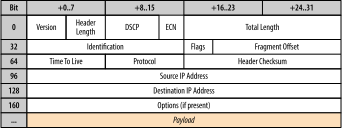
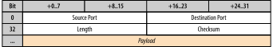
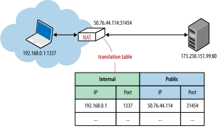
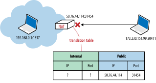
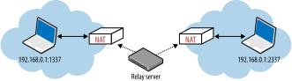

# Building Blocks of UDP

> [Khối xây dựng của UDP](https://hpbn.co/building-blocks-of-udp/)

Giao thức Datagram Người dùng, hay UDP, được Jon Postel thêm vào bộ giao thức mạng cốt lõi vào tháng 8 năm 1980, khá lâu sau khi TCP/IP được giới thiệu lần đầu, nhưng đúng vào thời điểm các thông số kỹ thuật TCP và IP đang được tách ra để trở thành hai RFC riêng biệt. Thời điểm này rất quan trọng vì, như chúng ta sẽ thấy, tính năng chính và sức hấp dẫn của UDP không nằm ở những gì nó giới thiệu, mà là ở tất cả các tính năng mà nó chọn bỏ qua. UDP được gọi một cách thông tục là giao thức null và RFC 768, mô tả hoạt động của nó, thực sự có thể nằm gọn trên một chiếc khăn ăn.

> Biểu đồ dữ liệu\
> Một thực thể dữ liệu độc lập, khép kín mang đủ thông tin được định tuyến từ nguồn tới các nút đích mà không phụ thuộc vào các trao đổi trước đó giữa các nút và mạng truyền tải.

Các từ datagram và gói thường được sử dụng thay thế cho nhau, nhưng có một số sắc thái. Mặc dù thuật ngữ "gói" áp dụng cho bất kỳ khối dữ liệu được định dạng nào, thuật ngữ "datagram" thường được dành riêng cho các gói được gửi qua dịch vụ không đáng tin cậy—không đảm bảo gửi, không có thông báo lỗi. Vì điều này, bạn sẽ thường xuyên thấy thuật ngữ mang tính mô tả hơn "Không đáng tin cậy" được thay thế cho thuật ngữ chính thức "Người dùng" trong từ viết tắt UDP, để tạo thành "Giao thức gói dữ liệu không đáng tin cậy". Đó cũng là lý do tại sao các gói UDP nói chung và chính xác hơn được gọi là datagram.

Có lẽ cách sử dụng UDP nổi tiếng nhất và là cách mà mọi trình duyệt và ứng dụng Internet đều phụ thuộc vào, đó là Hệ thống tên miền (DNS): được cung cấp tên máy chủ máy tính thân thiện với con người, chúng ta cần khám phá địa chỉ IP của nó trước khi bất kỳ trao đổi dữ liệu nào có thể thực hiện được. xảy ra. Tuy nhiên, mặc dù bản thân trình duyệt phụ thuộc vào UDP, nhưng về mặt lịch sử, giao thức này chưa bao giờ được coi là phương tiện vận chuyển hạng nhất cho các trang và ứng dụng chạy bên trong nó. Đó là cho đến khi WebRTC xuất hiện.

Các tiêu chuẩn Giao tiếp thời gian thực trên web (WebRTC) mới, do các nhóm làm việc của IETF và W3C cùng phát triển, đang cho phép giao tiếp theo thời gian thực, chẳng hạn như gọi thoại và gọi video cũng như các hình thức giao tiếp ngang hàng (P2P) khác. trong trình duyệt thông qua UDP. Với WebRTC, UDP hiện là phương tiện truyền tải trình duyệt hạng nhất với API phía máy khách! Chúng tôi sẽ tìm hiểu sâu về WebRTC trong WebRTC , nhưng trước khi đến đó, trước tiên hãy khám phá hoạt động bên trong của giao thức UDP để hiểu lý do và nơi chúng tôi có thể muốn sử dụng nó.

## Null Protocol Services
> Dịch vụ giao thức Null

Để hiểu UDP và lý do tại sao nó thường được gọi là "giao thức null", trước tiên chúng ta cần xem Giao thức Internet (IP), nằm ở một lớp bên dưới cả giao thức TCP và UDP.

Lớp IP có nhiệm vụ chính là phân phối các datagram từ nguồn đến máy chủ đích dựa trên địa chỉ của chúng. Để làm như vậy, các thông báo được gói gọn trong một gói IP ( Hình 3-1 ) để xác định địa chỉ nguồn và đích cũng như một số thông số định tuyến khác.

Một lần nữa, từ "datagram" là một điểm khác biệt quan trọng: lớp IP không đảm bảo về việc gửi tin nhắn hoặc thông báo lỗi và do đó trực tiếp phơi bày tính không đáng tin cậy của mạng cơ bản đối với các lớp bên trên nó. Nếu một nút định tuyến trên đường đi làm mất gói IP do tắc nghẽn, tải cao hoặc vì lý do khác thì giao thức phía trên IP có trách nhiệm phát hiện, khôi phục và truyền lại dữ liệu—nghĩa là, nếu đó là hành vi mong muốn!

<figure markdown="span">
        
    <figcaption>Hình 3-1. Tiêu đề IPv4 (20 byte)</figcaption>
</figure>

Giao thức UDP đóng gói các thông điệp của người dùng vào cấu trúc gói tin riêng của nó ( Hình 3-2 ), chỉ thêm bốn trường bổ sung: cổng nguồn, cổng đích, độ dài của gói tin và tổng kiểm tra. Do đó, khi IP chuyển gói tin đến máy chủ đích, máy chủ có thể mở gói tin UDP, xác định ứng dụng đích theo cổng đích và chuyển thông điệp. Không hơn, không kém.

<figure markdown="span">
        
    <figcaption>Hình 3-2. Tiêu đề UDP (8 byte)</figcaption>
</figure>

Trên thực tế, cả trường cổng nguồn và trường tổng kiểm tra đều là các trường tùy chọn trong các datagram UDP. Gói IP chứa tổng kiểm tra tiêu đề riêng của nó và ứng dụng có thể chọn bỏ qua tổng kiểm tra UDP, điều này có nghĩa là tất cả các phát hiện lỗi và sửa lỗi có thể được chuyển giao cho các ứng dụng ở trên chúng. Về bản chất, UDP chỉ cung cấp "ghép kênh ứng dụng" trên IP bằng cách nhúng các cổng ứng dụng nguồn và đích của các máy chủ đang giao tiếp. Với suy nghĩ đó, bây giờ chúng ta có thể tóm tắt tất cả các dịch vụ không phải UDP:

- Không đảm bảo việc gửi tin nhắn
    - Không có xác nhận, truyền lại hoặc hết thời gian chờ
- Không đảm bảo về thứ tự giao hàng
    - Không có số thứ tự gói tin, không sắp xếp lại, không chặn đầu dòng
- Không theo dõi trạng thái kết nối
    - Không có trạng thái thiết lập kết nối hoặc hủy bỏ máy
- Không kiểm soát tắc nghẽn
    - Không có cơ chế phản hồi mạng hoặc máy khách tích hợp

TCP là một giao thức hướng luồng byte có khả năng truyền tải các thông điệp ứng dụng trải rộng trên nhiều gói mà không có bất kỳ ranh giới thông điệp rõ ràng nào trong chính các gói đó. Để đạt được điều này, trạng thái kết nối được phân bổ ở cả hai đầu của kết nối và mỗi gói được sắp xếp theo trình tự, truyền lại khi bị mất và được phân phối theo thứ tự. Ngược lại, các datagram UDP có ranh giới xác định: mỗi datagram được mang trong một gói IP duy nhất và mỗi lần đọc ứng dụng sẽ tạo ra toàn bộ thông điệp; các datagram không thể bị phân mảnh.

UDP là một giao thức đơn giản, không trạng thái, thích hợp để khởi động các giao thức ứng dụng khác ở trên cùng: hầu như tất cả các quyết định thiết kế giao thức đều được giao cho ứng dụng ở trên nó. Tuy nhiên, trước khi bắt đầu triển khai giao thức của riêng mình để thay thế TCP, bạn nên suy nghĩ cẩn thận về các vấn đề phức tạp như tương tác UDP với nhiều lớp hộp trung gian được triển khai (NAT traversal), cũng như các phương pháp hay nhất về thiết kế giao thức mạng chung. Nếu không có kỹ thuật và lập kế hoạch cẩn thận, không có gì lạ khi bắt đầu với một ý tưởng sáng suốt cho một giao thức mới nhưng kết thúc bằng một phiên bản TCP được triển khai kém. Các thuật toán và máy trạng thái trong TCP đã được mài giũa và cải tiến qua nhiều thập kỷ và đã tính đến hàng tá cơ chế khó có thể sao chép tốt.

## UDP and Network Address Translators

Thật không may, địa chỉ IPv4 chỉ dài 32 bit, cung cấp tối đa 4,29 tỷ địa chỉ IP duy nhất. Đặc tả Trình dịch địa chỉ mạng IP (NAT) được giới thiệu vào giữa năm 1994 (RFC 1631) như một giải pháp tạm thời để giải quyết vấn đề cạn kiệt địa chỉ IPv4 đang rình rập—khi số lượng máy chủ trên Internet bắt đầu tăng theo cấp số nhân vào đầu những năm 90, chúng tôi không thể mong đợi phân bổ một IP duy nhất cho mọi máy chủ.

Giải pháp tái sử dụng IP được đề xuất là giới thiệu các thiết bị NAT ở rìa mạng, mỗi thiết bị sẽ chịu trách nhiệm duy trì ánh xạ bảng của các bộ dữ liệu cổng và IP cục bộ tới một hoặc nhiều bộ dữ liệu cổng và IP (công khai) duy nhất trên toàn cầu ( Hình 3 -3 ). Không gian địa chỉ IP cục bộ đằng sau trình dịch sau đó có thể được sử dụng lại giữa nhiều mạng khác nhau, do đó giải quyết được vấn đề cạn kiệt địa chỉ.

<figure markdown="span">
        
    <figcaption>Hình 3-3. Bộ dịch địa chỉ mạng IP</figcaption>
</figure>

Thật không may, như thường xảy ra, không có gì lâu dài hơn một giải pháp tạm thời. Các thiết bị NAT không chỉ giải quyết được vấn đề ngay lập tức mà còn nhanh chóng trở thành một thành phần phổ biến của nhiều proxy và bộ định tuyến doanh nghiệp và gia đình, thiết bị bảo mật, tường lửa và hàng chục thiết bị phần cứng và phần mềm khác. Các hộp trung gian NAT không còn là giải pháp tạm thời nữa; thay vào đó, chúng đã trở thành một phần cứng nhắc của cơ sở hạ tầng Internet.

!!! info "Info"
    __Phạm vi mạng riêng được bảo lưu__
    
    Cơ quan quản lý số hiệu Internet (IANA), là một tổ chức giám sát việc phân bổ địa chỉ IP toàn cầu, đã dành riêng ba phạm vi được biết đến rộng rãi ( Bảng 3-1 ) cho các mạng riêng, thường nằm sau thiết bị NAT.

    | Phạm vi địa chỉ IP                   | Số lượng địa chỉ |
    | :----------------------------------- | :--------------: |
    | `10.0.0.0` ➡️ `10.255.255.255`     |    16.777.216    |
    | `172.16.0.0` ➡️ `172.31.255.255`   |    1.048.576     |
    | `192.168.0.0` ➡️ `192.168.255.255` |      65.536      |

    _Bảng 3-1. Phạm vi IP được dành riêng_

    Một hoặc tất cả các phạm vi trước đó sẽ trông quen thuộc. Rất có thể bộ định tuyến cục bộ của bạn đã gán cho máy tính của bạn một địa chỉ IP từ một trong những phạm vi đó. Đó là địa chỉ IP riêng của bạn trên mạng nội bộ, sau đó được thiết bị NAT dịch khi liên lạc với mạng bên ngoài.

    Để tránh lỗi định tuyến và nhầm lẫn, không máy tính công cộng nào được phép được cấp địa chỉ IP từ bất kỳ phạm vi mạng riêng nào được dành riêng này.

### Connection-State Timeouts
> Thời gian chờ trạng thái kết nối

Vấn đề với bản dịch NAT, ít nhất là đối với UDP, chính xác là bảng định tuyến mà nó phải duy trì để phân phối các datagram. Các middlebox NAT dựa vào trạng thái kết nối, trong khi UDP không có. Đây là sự không khớp cơ bản và là nguồn gốc của nhiều vấn đề khi phân phối các datagram UDP. Hơn nữa, hiện nay không hiếm khi một máy khách ở sau nhiều lớp NAT, điều này chỉ làm phức tạp thêm vấn đề.

Mỗi kết nối TCP có một máy trạng thái giao thức được xác định rõ ràng, bắt đầu bằng một bắt tay, tiếp theo là truyền dữ liệu ứng dụng và một trao đổi được xác định rõ ràng để đóng kết nối. Với luồng này, mỗi hộp trung gian có thể quan sát trạng thái của kết nối và tạo và xóa các mục định tuyến khi cần. Với UDP, không có bắt tay hoặc chấm dứt kết nối, do đó không có máy trạng thái kết nối để giám sát.

Việc phân phối lưu lượng UDP đi không yêu cầu thêm bất kỳ công việc nào, nhưng việc định tuyến một câu trả lời yêu cầu chúng ta phải có một mục trong bảng dịch, mục này sẽ cho chúng ta biết IP và cổng của máy chủ đích cục bộ. Do đó, người dịch phải giữ trạng thái về từng luồng UDP, bản thân luồng này là không trạng thái.

Tệ hơn nữa, người dịch còn được giao nhiệm vụ tìm ra thời điểm bỏ bản ghi dịch, nhưng vì UDP không có trình tự chấm dứt kết nối nên một trong hai máy ngang hàng có thể ngừng truyền gói dữ liệu tại bất kỳ thời điểm nào mà không cần thông báo. Để giải quyết vấn đề này, các bản ghi định tuyến UDP sẽ hết hạn theo thời gian. Bao lâu? Không có câu trả lời dứt khoát; thay vào đó, thời gian chờ phụ thuộc vào nhà cung cấp, nhãn hiệu, phiên bản và cấu hình của trình dịch. Do đó, một trong những phương pháp hay nhất trên thực tế đối với các phiên chạy dài qua UDP là giới thiệu các gói lưu giữ hai chiều để đặt lại định kỳ bộ hẹn giờ cho các bản ghi dịch trong tất cả các thiết bị NAT dọc theo đường dẫn.

!!! info "Info"
    __Thời gian chờ TCP và NAT__

    Về mặt kỹ thuật, không cần thêm thời gian chờ TCP trên các thiết bị NAT. Giao thức TCP tuân theo trình tự bắt tay và kết thúc được xác định rõ ràng, báo hiệu khi nào có thể thêm và xóa các bản ghi dịch thích hợp.

    Thật không may, trên thực tế, nhiều thiết bị NAT áp dụng logic thời gian chờ tương tự cho cả phiên TCP và UDP. Do đó, trong một số trường hợp, các gói tin duy trì trạng thái hoạt động song phương cũng được yêu cầu cho TCP. Nếu kết nối TCP của bạn bị mất, thì rất có thể là do thời gian chờ NAT trung gian.

### NAT Traversal
> Truyền tải NAT

Xử lý trạng thái kết nối không thể đoán trước là một vấn đề nghiêm trọng do NAT tạo ra, nhưng một vấn đề thậm chí còn lớn hơn đối với nhiều ứng dụng là không thể thiết lập kết nối UDP. Điều này đặc biệt đúng đối với các ứng dụng P2P, chẳng hạn như VoIP, trò chơi và chia sẻ tệp, thường cần hoạt động như cả máy khách và máy chủ để cho phép giao tiếp trực tiếp hai chiều giữa các đối tác.

Vấn đề đầu tiên là khi có NAT, máy khách nội bộ không biết về IP công cộng của nó: nó biết địa chỉ IP nội bộ của mình và các thiết bị NAT thực hiện việc ghi lại cổng và địa chỉ nguồn trong mọi gói UDP, cũng như địa chỉ IP gốc trong gói IP. Tuy nhiên, nếu máy khách liên lạc địa chỉ IP riêng của mình như một phần của dữ liệu ứng dụng với một thiết bị ngang hàng bên ngoài mạng riêng của nó thì kết nối chắc chắn sẽ thất bại. Do đó, lời hứa về bản dịch "minh bạch" không còn đúng nữa và trước tiên ứng dụng phải khám phá địa chỉ IP công cộng của nó nếu cần chia sẻ nó với một thiết bị ngang hàng bên ngoài mạng riêng của nó.

Tuy nhiên, biết IP công cộng cũng chưa đủ để truyền thành công bằng UDP. Bất kỳ gói nào đến IP công cộng của thiết bị NAT cũng phải có cổng đích và một mục trong bảng NAT có thể dịch nó sang IP máy chủ đích nội bộ và bộ cổng. Nếu mục này không tồn tại, đó là trường hợp rất có thể xảy ra nếu ai đó chỉ cố gắng truyền dữ liệu từ mạng công cộng, thì gói sẽ bị loại bỏ ( Hình 3-4 ). Thiết bị NAT hoạt động như một bộ lọc gói đơn giản vì nó không có cách nào để tự động xác định tuyến nội bộ, trừ khi được người dùng cấu hình rõ ràng thông qua cơ chế chuyển tiếp cổng hoặc cơ chế tương tự.

<figure markdown="span">
        
    <figcaption>Hình 3-4. Gói tin gửi đến bị rớt do thiếu ánh xạ</figcaption>
</figure>

Điều quan trọng cần lưu ý là hành vi trước đó không phải là vấn đề đối với các ứng dụng khách, chúng bắt đầu tương tác từ mạng nội bộ và trong quá trình thiết lập các bản ghi dịch cần thiết dọc theo đường dẫn. Tuy nhiên, việc xử lý các kết nối gửi đến (hoạt động như một máy chủ) từ các ứng dụng P2P như VoIP, bảng điều khiển trò chơi, chia sẻ tệp, v.v., với sự hiện diện của NAT, là lúc chúng ta sẽ gặp phải vấn đề này ngay lập tức.

Để giải quyết vấn đề không khớp này trong UDP và NAT, nhiều kỹ thuật truyền tải khác nhau (TURN, STUN, ICE) phải được sử dụng để thiết lập kết nối đầu cuối giữa các đồng nghiệp UDP ở cả hai bên.

### STUN, TURN and ICE
> STUN, TURN và ICE

Tiện ích truyền tải phiên cho NAT (STUN) là một giao thức (RFC 5389) cho phép ứng dụng máy chủ phát hiện sự hiện diện của trình dịch địa chỉ mạng trên mạng và khi có mặt để lấy IP công cộng được phân bổ và bộ cổng cho kết nối hiện tại ( Hình 3-5 ). Để làm như vậy, giao thức cần có sự hỗ trợ từ máy chủ STUN bên thứ ba nổi tiếng phải nằm trên mạng công cộng.

<figure markdown="span">
        
    <figcaption>Hình 3-5. Truy vấn STUN cho IP công cộng và cổng</figcaption>
</figure>

Giả sử biết địa chỉ IP của máy chủ STUN (thông qua khám phá DNS hoặc thông qua địa chỉ được chỉ định thủ công), trước tiên, ứng dụng sẽ gửi yêu cầu ràng buộc đến máy chủ STUN. Đổi lại, máy chủ STUN sẽ trả lời bằng phản hồi chứa địa chỉ IP công cộng và cổng của máy khách như được nhìn thấy từ mạng công cộng. Quy trình làm việc đơn giản này giải quyết một số vấn đề mà chúng tôi gặp phải trong cuộc thảo luận trước đó:

- Ứng dụng phát hiện IP công khai và cổng của nó và sau đó có thể sử dụng thông tin này như một phần dữ liệu ứng dụng khi giao tiếp với các ứng dụng ngang hàng.
- Yêu cầu liên kết gửi đi tới máy chủ STUN sẽ thiết lập các mục định tuyến NAT dọc theo đường dẫn, sao cho các gói gửi đến đến IP công cộng và bộ cổng giờ đây có thể tìm đường quay trở lại ứng dụng máy chủ trên mạng nội bộ.
- Giao thức STUN xác định một cơ chế đơn giản cho các ping liên tục để giữ cho các mục định tuyến NAT không bị hết thời gian chờ.

Với cơ chế này, bất cứ khi nào hai đồng nghiệp muốn nói chuyện với nhau qua UDP, trước tiên họ sẽ gửi yêu cầu ràng buộc đến máy chủ STUN tương ứng của họ và sau khi cả hai bên phản hồi thành công, họ có thể sử dụng bộ dữ liệu cổng và IP công cộng đã thiết lập để trao đổi dữ liệu.

Tuy nhiên, trong thực tế, STUN không đủ để xử lý tất cả các cấu hình mạng và cấu trúc liên kết NAT. Hơn nữa, thật không may, trong một số trường hợp, UDP có thể bị chặn hoàn toàn bởi tường lửa hoặc một số thiết bị mạng khác—không phải là trường hợp hiếm gặp đối với nhiều mạng doanh nghiệp. Để giải quyết vấn đề này, bất cứ khi nào STUN không thành công, chúng tôi có thể sử dụng giao thức Traversal Sử dụng Rơle xung quanh NAT (TURN) (RFC 5766) làm phương án dự phòng, có thể chạy trên UDP và chuyển sang TCP nếu vẫn thất bại.

Tất nhiên, từ khóa trong TURN là "rơle". Giao thức dựa vào sự hiện diện và tính khả dụng của một rơle công cộng ( Hình 3-6 ) để truyền dữ liệu giữa các đồng nghiệp.

<figure markdown="span">
        
    <figcaption>Hình 3-6. Máy chủ chuyển tiếp TURN</figcaption>
</figure>

- Cả hai máy khách đều bắt đầu kết nối bằng cách gửi yêu cầu phân bổ đến cùng một máy chủ TURN, sau đó là đàm phán quyền.
- Khi quá trình đàm phán hoàn tất, cả hai bên sẽ giao tiếp bằng cách gửi dữ liệu của mình đến máy chủ TURN, sau đó máy chủ này sẽ chuyển tiếp dữ liệu đó đến bên kia.

Tất nhiên, nhược điểm rõ ràng của sàn giao dịch này là nó không còn ngang hàng nữa! TURN là cách đáng tin cậy nhất để cung cấp kết nối giữa hai thiết bị ngang hàng bất kỳ trên bất kỳ mạng nào, nhưng nó có chi phí vận hành máy chủ TURN rất cao—ít nhất, rơle phải có đủ công suất để phục vụ tất cả các luồng dữ liệu. Do đó, TURN được sử dụng tốt nhất như phương án dự phòng cuối cùng trong trường hợp kết nối trực tiếp không thành công.

!!! info "Info"
    __STUN và TURN trong thực tế__

    libjingle của Google là một thư viện C++ mã nguồn mở để xây dựng các ứng dụng ngang hàng, xử lý các cuộc đàm phán STUN, TURN và ICE. Thư viện được sử dụng để cung cấp năng lượng cho ứng dụng trò chuyện Google Talk và tài liệu cung cấp một điểm tham chiếu có giá trị về hiệu suất của STUN so với TURN trong thế giới thực:

    92% thời gian kết nối có thể diễn ra trực tiếp (STUN).

    8% thời gian kết nối yêu cầu phải có rơle (TURN).

    Thật không may, ngay cả với STUN, một phần đáng kể người dùng không thể thiết lập đường hầm P2P trực tiếp. Để cung cấp dịch vụ đáng tin cậy, chúng tôi cũng cần rơle TURN, có thể hoạt động như một phương án dự phòng trong trường hợp không thể lựa chọn giao tiếp P2P trực tiếp.

Xây dựng một giải pháp truyền tải NAT hiệu quả không dành cho người yếu tim. Rất may, chúng ta có thể dựa vào giao thức Thiết lập kết nối tương tác (ICE) (RFC 5245) để trợ giúp thực hiện nhiệm vụ này. ICE là một giao thức và một tập hợp các phương thức nhằm thiết lập đường hầm hiệu quả nhất giữa những người tham gia ( Hình 3-7 ): kết nối trực tiếp nếu có thể, tận dụng đàm phán STUN khi cần và cuối cùng là dự phòng cho TURN nếu vẫn thất bại.

<figure markdown="span">
        
    <figcaption>Hình 3-7. ICE thử các tùy chọn kết nối trực tiếp, STUN và TURN</figcaption>
</figure>

Trong thực tế, nếu bạn đang xây dựng một ứng dụng P2P qua UDP thì bạn chắc chắn muốn tận dụng API nền tảng hiện có hoặc thư viện của bên thứ ba triển khai ICE, STUN và TURN cho bạn. Và bây giờ bạn đã quen với chức năng của từng giao thức này, bạn có thể điều hướng theo cách của mình thông qua quá trình thiết lập và cấu hình được yêu cầu!

## Optimizing for UDP
> Tối ưu hóa cho UDP

UDP là một giao thức đơn giản và thường được sử dụng để khởi động các giao thức truyền tải mới. Trên thực tế, tính năng chính của UDP là tất cả các tính năng mà nó bỏ qua: không có trạng thái kết nối, bắt tay, truyền lại, tập hợp lại, sắp xếp lại, kiểm soát tắc nghẽn, tránh tắc nghẽn, kiểm soát luồng hoặc thậm chí kiểm tra lỗi tùy chọn. Tuy nhiên, tính linh hoạt mà lớp vận chuyển hướng thông điệp tối thiểu này mang lại cũng là một trách nhiệm đối với người triển khai. Ứng dụng của bạn có thể sẽ phải triển khai lại một số hoặc nhiều tính năng trong số này từ đầu và mỗi tính năng phải được thiết kế để hoạt động tốt với các ứng dụng ngang hàng và giao thức khác trên mạng.

Không giống như TCP, được tích hợp sẵn tính năng kiểm soát luồng và tắc nghẽn cũng như tránh tắc nghẽn, các ứng dụng UDP phải tự triển khai các cơ chế này. Các ứng dụng UDP không nhạy cảm với tắc nghẽn có thể dễ dàng làm quá tải mạng, điều này có thể dẫn đến hiệu suất mạng bị suy giảm và trong trường hợp nghiêm trọng có thể làm tắc nghẽn mạng.

Nếu bạn muốn tận dụng UDP cho ứng dụng của riêng mình, hãy đảm bảo nghiên cứu và đọc các đề xuất và thực tiễn tốt nhất hiện tại. Một tài liệu như vậy là RFC 5405, đặc biệt tập trung vào hướng dẫn thiết kế cho các ứng dụng được phân phối qua UDP unicast. Dưới đây là một mẫu ngắn về các đề xuất:

- Ứng dụng phải chịu đựng được nhiều điều kiện đường dẫn Internet.
- Ứng dụng phải kiểm soát tốc độ truyền tải.
- Ứng dụng nên thực hiện kiểm soát tắc nghẽn trên tất cả lưu lượng truy cập.
- Ứng dụng nên sử dụng băng thông tương tự như TCP.
- Ứng dụng nên tắt bộ đếm truyền lại sau khi bị mất.
- Ứng dụng không được gửi các datagram vượt quá MTU của đường dẫn.
- Ứng dụng phải xử lý việc mất, sao chép và sắp xếp lại datagram.
- Ứng dụng phải mạnh mẽ để có thể giao hàng chậm trễ tối đa 2 phút.
- Ứng dụng phải kích hoạt tổng kiểm tra IPv4 UDP và phải kích hoạt tổng kiểm tra IPv6.
- Ứng dụng có thể sử dụng chức năng giữ kết nối khi cần (khoảng cách tối thiểu 15 giây).

Việc thiết kế một giao thức truyền tải mới đòi hỏi rất nhiều suy nghĩ, lập kế hoạch và nghiên cứu cẩn thận—hãy thực hiện sự thẩm định của bạn. Nếu có thể, hãy tận dụng thư viện hiện có hoặc một khung đã tính đến việc truyền tải NAT và có thể thiết lập một mức độ công bằng nào đó với các nguồn lưu lượng truy cập mạng đồng thời khác.

Về vấn đề đó, có một tin tốt: WebRTC ( WebRTC ) chính là một nền tảng như vậy!