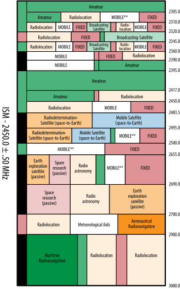
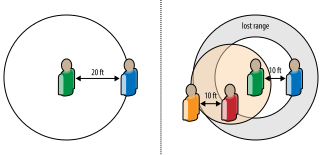

# Introduction to Wireless Networks

> [HIỆU SUẤT CỦA MẠNG KHÔNG DÂY, CHƯƠNG 5](https://hpbn.co/wifi/)

## Ubiquitous Connectivity
> Kết nối khắp nơi

Một trong những xu hướng công nghệ mang tính chuyển đổi nhất của thập kỷ qua là tính khả dụng và kỳ vọng ngày càng tăng về khả năng kết nối ở khắp mọi nơi. Cho dù là để kiểm tra email, thực hiện cuộc trò chuyện bằng giọng nói, duyệt web hay vô số trường hợp sử dụng khác, giờ đây chúng ta mong đợi có thể truy cập các dịch vụ trực tuyến này bất kể vị trí, thời gian hoặc hoàn cảnh: khi đang di chuyển, khi đang xếp hàng, tại văn phòng, trên tàu điện ngầm, khi đang bay và mọi nơi ở giữa. Ngày nay, chúng ta vẫn thường bị buộc phải chủ động tìm kiếm kết nối (ví dụ: tìm kiếm điểm phát sóng WiFi gần đó) nhưng không còn nghi ngờ gì nữa, tương lai sẽ là về khả năng kết nối ở khắp mọi nơi, nơi khả năng truy cập Internet luôn hiện hữu.

Mạng không dây đang là tâm điểm của xu hướng này. Ở phạm vi rộng nhất, mạng không dây đề cập đến bất kỳ mạng nào không được kết nối bằng cáp, điều này mang lại sự thuận tiện và tính di động mong muốn cho người dùng. Không có gì đáng ngạc nhiên, với vô số trường hợp sử dụng và ứng dụng khác nhau, chúng ta cũng có thể mong đợi thấy hàng tá công nghệ không dây khác nhau đáp ứng nhu cầu, mỗi công nghệ có đặc điểm hiệu suất riêng và mỗi công nghệ được tối ưu hóa cho một nhiệm vụ và bối cảnh cụ thể. Ngày nay, chúng ta đã sử dụng hơn chục công nghệ không dây phổ biến: WiFi, Bluetooth, ZigBee, NFC, WiMAX, LTE, HSPA, EV-DO, các tiêu chuẩn 3G trước đây, dịch vụ vệ tinh, v.v.

Do đó, xét đến sự đa dạng, không khôn ngoan khi đưa ra những khái quát chung về hiệu suất của mạng không dây. Tuy nhiên, tin tốt là hầu hết các công nghệ không dây đều hoạt động theo các nguyên tắc chung, có những sự đánh đổi chung và tuân theo các tiêu chí và ràng buộc chung về hiệu suất. Khi chúng ta khám phá và hiểu được các nguyên tắc cơ bản này về hiệu suất không dây, hầu hết các phần khác sẽ bắt đầu tự động đi vào đúng vị trí.

Hơn nữa, mặc dù cơ chế phân phối dữ liệu qua liên lạc vô tuyến về cơ bản khác với thế giới được kết nối, nhưng kết quả mà người dùng trải nghiệm là hoặc phải giống nhau—cùng hiệu suất, cùng kết quả. Về lâu dài, tất cả các ứng dụng đang và sẽ được phân phối qua mạng không dây; có thể một số sẽ được truy cập qua mạng không dây thường xuyên hơn những trường hợp khác. Không có cái gọi là ứng dụng có dây và không có nhu cầu nào về sự khác biệt như vậy.

Tất cả các ứng dụng sẽ hoạt động tốt bất kể kết nối cơ bản. Với tư cách là người dùng, bạn không nên quan tâm đến công nghệ cơ bản đang được sử dụng, nhưng với tư cách là nhà phát triển, chúng tôi phải suy nghĩ trước và xây dựng kiến ​​trúc cho các ứng dụng của mình để dự đoán sự khác biệt giữa các loại mạng khác nhau. Và tin tốt là mọi tối ưu hóa mà chúng tôi áp dụng cho mạng không dây sẽ mang lại trải nghiệm tốt hơn trong tất cả các bối cảnh khác. Hãy đi sâu vào.

## Types of Wireless Networks
> Các loại mạng không dây

Mạng là một nhóm các thiết bị được kết nối với nhau. Trong trường hợp mạng không dây, liên lạc vô tuyến thường là phương tiện được lựa chọn. Tuy nhiên, ngay cả trong tập hợp con được hỗ trợ bằng sóng vô tuyến, có hàng chục công nghệ khác nhau được thiết kế để sử dụng ở các quy mô, cấu trúc liên kết khác nhau và cho các trường hợp sử dụng khác nhau đáng kể. Một cách để minh họa sự khác biệt này là phân vùng các trường hợp sử dụng dựa trên "phạm vi địa lý" của chúng:

| Kiểu                                                          | Phạm vi                                  | Các ứng dụng                           | Tiêu chuẩn                |
| :------------------------------------------------------------ | :--------------------------------------- | :------------------------------------- | :------------------------ |
| Mạng khu vực cá nhân _Personal area network (PAN)_         | Trong tầm với của một người              | Thay thế cáp cho thiết bị ngoại vi     | Bluetooth, ZigBee, NFC    |
| Mạng cục bộ _Local area network (LAN)_                     | Trong một tòa nhà hoặc khuôn viên trường | Mở rộng mạng không dây của mạng có dây | IEEE 802.11 (Wifi)        |
| Mạng lưới khu vực đô thị _Metropolitan area network (MAN)_ | Trong một thành phố                      | Kết nối liên mạng không dây            | IEEE 802.15 (WiMAX)       |
| Mạng diện rộng _Wide area network (WAN)_                   | Trên toàn thế giới                       | Truy cập mạng không dây                | Di động (UMTS, LTE, v.v.) |

_Bảng 5-1. Các loại mạng không dây_

Phân loại trước đó không đầy đủ cũng không hoàn toàn chính xác. Nhiều công nghệ và tiêu chuẩn bắt đầu trong một trường hợp sử dụng cụ thể, chẳng hạn như Bluetooth cho các ứng dụng PAN và thay thế cáp, và theo thời gian có thêm nhiều khả năng, phạm vi và thông lượng hơn. Trên thực tế, các bản thảo mới nhất của Bluetooth hiện cung cấp khả năng tương tác liền mạch với 802.11 (WiFi) cho các trường hợp sử dụng băng thông cao. Tương tự như vậy, các công nghệ như WiMAX có nguồn gốc từ các giải pháp không dây cố định, nhưng theo thời gian đã có thêm các khả năng di động, khiến chúng trở thành một giải pháp thay thế khả thi cho các công nghệ WAN và di động khác.

Mục đích của việc phân loại không phải là phân chia từng công nghệ thành một nhóm riêng biệt mà là làm nổi bật những khác biệt cấp cao trong từng trường hợp sử dụng. Một số thiết bị có thể truy cập vào nguồn điện liên tục; một số khác phải tối ưu hóa tuổi thọ pin bằng mọi giá. Một số yêu cầu tốc độ dữ liệu Gbit/giây+; một số khác được xây dựng để truyền hàng chục hoặc hàng trăm byte dữ liệu (ví dụ: NFC). Một số ứng dụng yêu cầu kết nối luôn bật, trong khi một số khác có thể chịu được độ trễ và độ trễ. Những tiêu chí này cùng với một số lượng lớn các tiêu chí khác là những yếu tố quyết định các đặc điểm ban đầu của từng loại mạng. Tuy nhiên, một khi đã được đưa vào áp dụng, mỗi tiêu chuẩn sẽ tiếp tục phát triển: dung lượng pin tốt hơn, bộ xử lý nhanh hơn, thuật toán điều chế được cải thiện và những tiến bộ khác tiếp tục mở rộng các trường hợp sử dụng và hiệu suất của từng tiêu chuẩn không dây.

!!! note "Note"
    Ứng dụng tiếp theo của bạn có thể được phân phối qua mạng di động nhưng cũng có thể dựa vào NFC để thanh toán, Bluetooth để liên lạc P2P qua WebRTC và WiFi để phát trực tuyến HD. Vấn đề không phải là chọn hay đặt cược vào một tiêu chuẩn không dây duy nhất!

## Performance Fundamentals of Wireless Networks
> Nguyên tắc cơ bản về hiệu suất của mạng không dây

Mỗi loại công nghệ không dây đều có những hạn chế và hạn chế riêng. Tuy nhiên, bất kể công nghệ không dây cụ thể đang được sử dụng là gì, tất cả các phương thức liên lạc đều có dung lượng kênh tối đa, được xác định bởi các nguyên tắc cơ bản giống nhau. Trên thực tế, Claude E. Shannon đã cho chúng ta một mô hình toán học chính xác ( Dung lượng kênh là tốc độ thông tin tối đa ) để xác định dung lượng kênh, bất kể công nghệ đang sử dụng.

Dung lượng kênh là tốc độ thông tin tối đa

$$
C = BW \times \log_2 \left( 1 + \frac{S}{N} \right)
$$

- $C$ : là dung lượng kênh và được đo bằng bit trên giây.
- $BW$ : là băng thông khả dụng và được đo bằng hertz.
- $S$ : là tín hiệu và Nlà tiếng ồn, và chúng được đo bằng watt.

Mặc dù có phần đơn giản hóa, công thức trước đó nắm bắt được tất cả những hiểu biết cần thiết mà chúng ta cần để hiểu hiệu suất của hầu hết các mạng không dây. Bất kể tên, từ viết tắt hay số phiên bản của thông số kỹ thuật, hai ràng buộc cơ bản đối với tốc độ dữ liệu có thể đạt được là lượng băng thông khả dụng và công suất tín hiệu giữa máy thu và máy phát.

### Bandwidth
> Băng thông
Không giống như thế giới được kết nối, nơi có thể chạy một dây chuyên dụng giữa mỗi mạng ngang hàng, liên lạc vô tuyến về bản chất sử dụng một phương tiện dùng chung: sóng vô tuyến hoặc nếu bạn thích, bức xạ điện từ. Cả người gửi và người nhận phải đồng ý trước về dải tần số cụ thể mà hoạt động liên lạc sẽ diễn ra; phạm vi được xác định rõ ràng cho phép khả năng tương tác liền mạch giữa các thiết bị. Ví dụ: cả chuẩn 802.11b và 802.11g đều sử dụng băng tần 2,4–2,5 GHz trên tất cả các thiết bị WiFi.

Ai xác định dải tần và phân bổ nó? Tóm lại, chính quyền địa phương ( Hình 5-1 ). Tại Hoa Kỳ, quá trình này được quản lý bởi Ủy ban Truyền thông Liên bang (FCC). Trên thực tế, do các quy định khác nhau của chính phủ, một số công nghệ không dây có thể hoạt động ở một nơi trên thế giới nhưng không hoạt động ở những nơi khác. Các quốc gia khác nhau có thể và thường chỉ định các dải phổ khác nhau cho cùng một công nghệ không dây.

Bỏ vấn đề chính trị sang một bên, bên cạnh việc có một băng tần chung cho khả năng tương tác, yếu tố hiệu suất quan trọng nhất là kích thước của dải tần được chỉ định. Như mô hình của Shannon cho thấy, tốc độ bit tổng thể của kênh tỷ lệ thuận với phạm vi được chỉ định. Do đó, tất cả các yếu tố khác đều bằng nhau, việc tăng gấp đôi dải tần khả dụng sẽ tăng gấp đôi tốc độ dữ liệu—ví dụ: tăng băng thông từ 20 lên 40 MHz có thể tăng gấp đôi tốc độ dữ liệu kênh, đó chính xác là cách 802.11n đang cải thiện hiệu suất của nó so với các tiêu chuẩn WiFi trước đó !

Cuối cùng, điều đáng chú ý là không phải tất cả các dải tần đều mang lại hiệu suất như nhau. Tín hiệu tần số thấp truyền đi xa hơn và bao phủ các khu vực rộng lớn (macrocell), nhưng phải trả giá bằng việc yêu cầu ăng-ten lớn hơn và có nhiều khách hàng cạnh tranh để truy cập hơn. Mặt khác, tín hiệu tần số cao có thể truyền nhiều dữ liệu hơn nhưng sẽ không truyền đi xa, dẫn đến vùng phủ sóng nhỏ hơn (microcell) và yêu cầu nhiều cơ sở hạ tầng hơn.

!!! note "Note"
    Một số dải tần số nhất định có giá trị hơn các dải tần khác đối với một số ứng dụng. Các ứng dụng chỉ phát sóng (ví dụ: đài phát thanh) rất phù hợp với dải tần số thấp. Mặt khác, giao tiếp hai chiều được hưởng lợi từ việc sử dụng các ô nhỏ hơn, mang lại băng thông cao hơn và ít cạnh tranh hơn.

<figure markdown="span">
    
    <figcaption>Hình 5-1. Phân bổ phổ vô tuyến FCC cho băng tần 2.300–3.000 MHz</figcaption>
</figure>

!!! info "Info"
    __Lịch sử tóm tắt về việc phân bổ và điều chỉnh phổ tần trên toàn thế giới__

    Nếu bạn dành thời gian trong thế giới truyền thông không dây, bạn chắc chắn sẽ vấp phải vô số cuộc tranh luận về tình trạng và giá trị của các quy trình phân bổ và điều chỉnh phổ tần hiện tại. Nhưng lịch sử là gì?

    Trong những ngày đầu của đài phát thanh, bất kỳ ai cũng có thể sử dụng bất kỳ dải tần nào cho bất kỳ mục đích nào mình muốn. Tất cả điều đó đã thay đổi khi Đạo luật vô tuyến năm 1912 được ký thành luật ở Hoa Kỳ và bắt buộc phải cấp phép sử dụng phổ tần vô tuyến. Dự luật ban đầu một phần được thúc đẩy bởi cuộc điều tra vụ chìm tàu ​​Titanic. Một số người suy đoán rằng thảm họa có thể đã được ngăn chặn hoặc nhiều sinh mạng có thể được cứu nếu tất cả các tàu gần đó giám sát tần số thích hợp. Bất chấp điều đó, luật mới này đã đặt ra tiền lệ cho luật liên bang và quốc tế về truyền thông không dây. Các nước khác theo sau.

    Vài thập kỷ sau, Đạo luật Truyền thông năm 1934 đã thành lập Ủy ban Truyền thông Liên bang (FCC) và FCC chịu trách nhiệm quản lý việc phân bổ phổ tần ở Hoa Kỳ kể từ đó, "phân vùng" nó một cách hiệu quả bằng cách chia nhỏ thành các lô ngày càng nhỏ hơn được thiết kế cho sử dụng độc quyền.

    Một ví dụ điển hình về sự phân bổ khác nhau là các băng tần vô tuyến "công nghiệp, khoa học và y tế" (ISM), được thành lập lần đầu tiên tại Hội nghị Viễn thông Quốc tế năm 1947, và đúng như tên gọi, được bảo lưu trên phạm vi quốc tế. Cả hai băng tần 2,4–2,5 GHz (100 MHz) và 5,725–5,875 GHz (150 MHz), cung cấp năng lượng cho phần lớn giao tiếp không dây hiện đại của chúng ta (ví dụ: WiFi) đều là một phần của băng tần ISM. Hơn nữa, cả hai băng tần ISM này cũng được coi là "phổ không được cấp phép", cho phép mọi người vận hành mạng không dây—cho mục đích thương mại hoặc sử dụng riêng—trong các băng tần này miễn là phần cứng được sử dụng tôn trọng các yêu cầu kỹ thuật cụ thể (ví dụ: công suất phát).

    Cuối cùng, do nhu cầu về truyền thông không dây ngày càng tăng, nhiều chính phủ đã bắt đầu tổ chức "đấu giá phổ tần", trong đó giấy phép được bán để truyền tín hiệu qua các băng tần cụ thể. Mặc dù có rất nhiều ví dụ, nhưng cuộc đấu giá 700 MHz của FCC, diễn ra vào năm 2008, là một minh họa tốt: phạm vi 698–806 MHz trong phạm vi Hoa Kỳ đã được đấu giá với tổng số tiền là 19,592 tỷ đô la cho hơn một chục người đấu giá khác nhau (phạm vi được chia thành các khối). Vâng, đó là tỷ với chữ "b."

    Băng thông là một mặt hàng khan hiếm và đắt tiền. Quá trình phân bổ hiện tại có công bằng hay không là chủ đề đã đổ rất nhiều giấy mực và nhiều cuốn sách đã được xuất bản. Nhìn về phía trước, có một điều chúng ta có thể chắc chắn: nó sẽ tiếp tục là một lĩnh vực thảo luận gây nhiều tranh cãi.

### Signal Power
> Nguồn tín hiệu

Bên cạnh băng thông, yếu tố hạn chế cơ bản thứ hai trong tất cả các giao tiếp không dây là công suất tín hiệu giữa người gửi và người nhận, còn được gọi là công suất tín hiệu trên tạp âm, tỷ lệ S/N hoặc SNR. Về bản chất, nó là thước đo so sánh mức tín hiệu mong muốn với mức nhiễu và nhiễu nền. Lượng nhiễu nền càng lớn thì tín hiệu càng phải mạnh để truyền thông tin.

Về bản chất, tất cả hoạt động liên lạc vô tuyến đều được thực hiện trên một phương tiện dùng chung, điều đó có nghĩa là các thiết bị khác có thể tạo ra nhiễu không mong muốn. Ví dụ: lò vi sóng hoạt động ở tần số 2,5 GHz có thể trùng với dải tần được WiFi sử dụng, tạo ra nhiễu xuyên tiêu chuẩn. Tuy nhiên, các thiết bị WiFi khác, chẳng hạn như điểm truy cập WiFi của hàng xóm và thậm chí cả máy tính xách tay của đồng nghiệp truy cập cùng mạng WiFi, cũng gây nhiễu cho đường truyền của bạn.

Trong trường hợp lý tưởng, bạn sẽ là người dùng duy nhất trong một dải tần số nhất định, không có tiếng ồn hoặc nhiễu nền nào khác. Thật không may, điều đó không thể xảy ra. Đầu tiên, băng thông khan hiếm và thứ hai, đơn giản là có quá nhiều thiết bị không dây để thực hiện điều đó. Thay vào đó, để đạt được tốc độ dữ liệu mong muốn khi có nhiễu, chúng ta có thể tăng công suất truyền, do đó tăng cường độ tín hiệu hoặc giảm khoảng cách giữa máy phát và máy thu—hoặc cả hai, tất nhiên rồi.

!!! note "Note"
    Suy hao đường truyền hay suy giảm đường truyền là sự giảm công suất tín hiệu so với khoảng cách truyền đi—tốc độ giảm chính xác phụ thuộc vào môi trường. Cuộc thảo luận đầy đủ về vấn đề này nằm ngoài phạm vi của cuốn sách này, nhưng nếu bạn tò mò, hãy tham khảo công cụ tìm kiếm yêu thích của bạn.

Để minh họa mối quan hệ giữa tín hiệu, tiếng ồn, công suất truyền và khoảng cách, hãy tưởng tượng bạn đang ở trong một căn phòng nhỏ và đang nói chuyện với ai đó cách đó 20 feet. Nếu không có ai khác có mặt, bạn có thể tổ chức cuộc trò chuyện ở mức âm lượng bình thường. Tuy nhiên, bây giờ thêm vài chục người vào cùng một phòng, chẳng hạn như trong một bữa tiệc đông người, mỗi người đều có những cuộc trò chuyện riêng. Đột nhiên, bạn sẽ không thể nghe thấy bạn bè của mình! Tất nhiên, bạn có thể bắt đầu nói to hơn, nhưng làm như vậy sẽ gây ra "tiếng ồn" cho mọi người xung quanh. Đổi lại, họ cũng sẽ bắt đầu nói to hơn và tăng thêm lượng tiếng ồn và nhiễu. Trước khi bạn nhận ra điều đó, mọi người trong phòng chỉ có thể giao tiếp khi cách nhau vài feet ( Hình 5-2 ). Nếu bạn đã từng bị mất giọng trong một bữa tiệc ồn ào hoặc phải nghiêng người để nghe một cuộc trò chuyện thì bạn đã có trải nghiệm trực tiếp với SNR.

<figure markdown="span">
    \
    <figcaption>Hình 5-2. Hơi thở tế bào và những tác động gần xa trong đời sống hàng ngày</figcaption>
</figure>

Trên thực tế, kịch bản này minh họa hai tác động quan trọng:

- Near-far problem _(Vấn đề gần-xa)_
    - Tình trạng mà bộ thu bắt được tín hiệu mạnh và do đó khiến bộ thu không thể phát hiện được tín hiệu yếu hơn, về cơ bản là "lấn át" tín hiệu yếu hơn.
- Cell-breathing _(Hô hấp tế bào)_
    - Tình trạng trong đó vùng phủ sóng hoặc khoảng cách của tín hiệu mở rộng hoặc thu hẹp dựa trên mức độ nhiễu và tiếng ồn tích lũy.

Một hoặc nhiều loa lớn bên cạnh bạn có thể chặn các tín hiệu yếu hơn từ xa hơn—vấn đề gần-xa. Tương tự như vậy, số lượng cuộc trò chuyện khác xung quanh bạn càng nhiều thì mức độ nhiễu càng cao và phạm vi mà từ đó bạn có thể nhận ra tín hiệu hữu ích—sự thở của tế bào càng nhỏ. Không có gì ngạc nhiên khi những hạn chế tương tự này cũng tồn tại trong tất cả các hình thức liên lạc vô tuyến, bất kể giao thức hay công nghệ cơ bản.

### Modulation
> Điều chế
Băng thông khả dụng và SNR là hai yếu tố vật lý chính quyết định dung lượng của mọi kênh không dây. Tuy nhiên, thuật toán mã hóa tín hiệu cũng có thể có tác động đáng kể.

Nói một cách ngắn gọn, bảng chữ cái kỹ thuật số của chúng ta (1 và 0) cần được dịch thành tín hiệu tương tự (sóng vô tuyến). Điều chế là quá trình chuyển đổi kỹ thuật số sang tương tự và có thể sử dụng các "bảng chữ cái điều chế" khác nhau để mã hóa tín hiệu kỹ thuật số với hiệu suất khác nhau. Sự kết hợp của bảng chữ cái và tốc độ ký hiệu sau đó sẽ xác định thông lượng cuối cùng của kênh. Ví dụ thực tế:

- Người nhận và người gửi có thể xử lý 1.000 xung hoặc ký hiệu mỗi giây (1.000 baud).
- Mỗi ký hiệu được truyền đi biểu diễn một chuỗi bit khác nhau, được xác định bởi bảng chữ cái đã chọn (ví dụ: bảng chữ cái 2 bit: 00, 01, 10, 11).
- Tốc độ bit của kênh là 1.000 baud × 2 bit cho mỗi ký hiệu hoặc 2.000 bit mỗi giây.

Việc lựa chọn thuật toán điều chế phụ thuộc vào công nghệ có sẵn, sức mạnh tính toán của cả máy thu và máy phát, cũng như tỷ lệ SNR. Bảng chữ cái điều chế bậc cao hơn phải trả giá bằng độ bền giảm trước tiếng ồn và nhiễu—không có bữa trưa miễn phí!

!!! note "Note"
    Đừng lo lắng, chúng tôi không có ý định lao đầu vào thế giới xử lý tín hiệu. Thay vào đó, điều quan trọng là phải hiểu rằng việc lựa chọn thuật toán điều chế có ảnh hưởng đến dung lượng của kênh không dây, nhưng cũng phụ thuộc vào SNR, công suất xử lý khả dụng và tất cả các sự đánh đổi thông thường khác.

## Measuring Real-World Wireless Performance
> Đo hiệu suất không dây trong thế giới thực

Khóa học cấp tốc ngắn gọn của chúng tôi về lý thuyết tín hiệu có thể được tóm tắt như sau: hiệu suất của bất kỳ mạng không dây nào, bất kể tên, từ viết tắt hay số hiệu sửa đổi, về cơ bản đều bị giới hạn bởi một số ít các tham số được biết đến rộng rãi. Cụ thể là lượng băng thông được phân bổ và tỷ lệ tín hiệu trên nhiễu giữa máy thu và máy phát. Hơn nữa, tất cả các giao tiếp dùng sóng vô tuyến đều:

- Được thực hiện qua phương tiện truyền thông chung (sóng vô tuyến)
- Được quy định để sử dụng các dải tần số băng thông cụ thể
- Được quy định để sử dụng tỷ lệ công suất truyền cụ thể
- Chịu sự thay đổi liên tục của tiếng ồn và nhiễu nền
- Tùy thuộc vào các ràng buộc kỹ thuật của công nghệ không dây đã chọn
- Tùy thuộc vào những hạn chế của thiết bị: hình thức, công suất, v.v.

Tất cả các công nghệ không dây đều quảng cáo một đỉnh hoặc tốc độ dữ liệu tối đa. Ví dụ, chuẩn 802.11g có khả năng đạt 54 Mbit/giây, và chuẩn 802.11n nâng mức lên đến 600 Mbit/giây. Tương tự, một số nhà mạng di động đang quảng cáo thông lượng 100+ MBit/giây với LTE. Tuy nhiên, phần quan trọng nhất thường bị bỏ qua khi phân tích tất cả các con số này là sự nhấn mạnh vào trong điều kiện lý tưởng .

Điều kiện lý tưởng là gì? Bạn đoán xem: lượng băng thông được phân bổ tối đa, sử dụng độc quyền phổ tần số, nhiễu nền tối thiểu hoặc không có, bảng chữ cái điều chế thông lượng cao nhất và ngày càng có nhiều luồng vô tuyến (nhiều đầu vào và nhiều đầu ra hoặc MIMO) truyền trong song song. Không cần phải nói, những gì bạn nhìn thấy trên nhãn và những gì bạn trải nghiệm trong thế giới thực có thể (đọc, sẽ) rất khác nhau.

- Chỉ một số yếu tố có thể ảnh hưởng đến hiệu suất của mạng không dây của bạn:
- Khoảng cách giữa người nhận và người gửi
- Lượng tiếng ồn xung quanh ở vị trí hiện tại
- Lượng nhiễu từ người dùng trong cùng một mạng (nội cell)
- Lượng nhiễu từ người dùng trong các mạng lân cận khác (liên ô)
- Lượng công suất truyền tải khả dụng, cả ở máy thu và máy phát
- Lượng công suất xử lý và phương án điều chế được chọn

Nói cách khác, nếu bạn muốn thông lượng tối đa, hãy cố gắng loại bỏ mọi tiếng ồn và nhiễu mà bạn có thể kiểm soát, đặt máy thu và máy phát càng gần nhau càng tốt, cung cấp cho chúng tất cả công suất mà chúng mong muốn và đảm bảo cả hai đều chọn phương pháp điều chế tốt nhất. Hoặc, nếu bạn muốn hiệu suất, chỉ cần chạy một dây vật lý giữa hai thiết bị! Sự tiện lợi của giao tiếp không dây cũng có cái giá của nó.

Đo lường hiệu suất không dây là một công việc phức tạp. Một thay đổi nhỏ, khoảng vài inch, ở vị trí của máy thu có thể dễ dàng tăng gấp đôi thông lượng, và một lát sau, thông lượng có thể lại giảm đi một nửa vì một máy thu khác vừa thức dậy và hiện đang tranh giành quyền truy cập vào đài. kênh. Về bản chất, hiệu suất không dây rất khác nhau.

Cuối cùng, hãy lưu ý rằng tất cả các cuộc thảo luận trước đó đều chỉ tập trung vào thông lượng. Có phải chúng ta đang cố tình bỏ qua độ trễ? Trên thực tế, chúng tôi đã làm được điều đó cho đến nay vì hiệu suất độ trễ trong mạng không dây gắn liền trực tiếp với công nghệ cụ thể đang được sử dụng và đó là chủ đề chúng tôi sẽ chuyển sang tiếp theo.