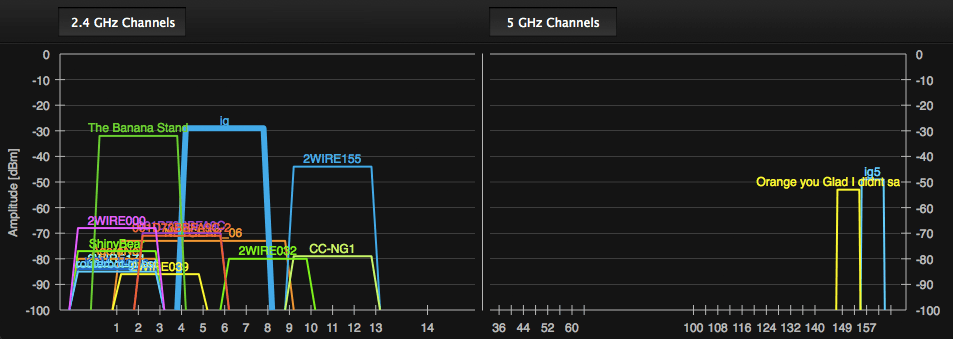

# Wifi

WiFi hoạt động trên phổ ISM không được cấp phép; việc triển khai bởi bất kỳ ai, ở bất kỳ đâu là chuyện nhỏ; và phần cứng cần thiết thì đơn giản và rẻ tiền. Không có gì ngạc nhiên khi nó đã trở thành một trong những tiêu chuẩn không dây phổ biến và được triển khai rộng rãi nhất.

Bản thân cái tên này là thương hiệu của WiFi Alliance, một hiệp hội thương mại được thành lập để quảng bá các công nghệ mạng LAN không dây cũng như cung cấp các tiêu chuẩn và thử nghiệm khả năng tương tác. Về mặt kỹ thuật, một thiết bị phải được gửi đến và được Liên minh WiFi chứng nhận để mang tên và biểu tượng WiFi, nhưng trên thực tế, tên này được dùng để chỉ bất kỳ sản phẩm nào dựa trên tiêu chuẩn IEEE 802.11.

Giao thức 802.11 đầu tiên được soạn thảo vào năm 1997, ít nhiều là sự thích ứng trực tiếp của tiêu chuẩn Ethernet (IEEE 802.3) với thế giới truyền thông không dây. Tuy nhiên, phải đến năm 1999, khi chuẩn 802.11b được giới thiệu, thị trường thiết bị WiFi mới cất cánh. Tính đơn giản tương đối của công nghệ, triển khai dễ dàng, thuận tiện và thực tế là nó hoạt động ở băng tần ISM 2,4 GHz không được cấp phép cho phép mọi người dễ dàng cung cấp "phần mở rộng không dây" cho mạng cục bộ hiện có của họ. Ngày nay, hầu hết mọi máy tính để bàn, máy tính xách tay, máy tính bảng, điện thoại thông minh mới và mọi thiết bị có kiểu dáng khác đều được kích hoạt WiFi.

## From Ethernet to a Wireless LAN
> Từ Ethernet đến mạng LAN không dây

Tiêu chuẩn không dây 802.11 chủ yếu được thiết kế như một sự thích nghi và mở rộng của tiêu chuẩn Ethernet (802.3) hiện có. Do đó, trong khi Ethernet thường được gọi là tiêu chuẩn LAN, thì họ 802.11 ( Hình 6-1 ) thường được gọi là LAN không dây (WLAN). Tuy nhiên, đối với những người đam mê lịch sử, về mặt kỹ thuật, phần lớn giao thức Ethernet được lấy cảm hứng từ giao thức ALOHAnet, đây là bản trình diễn công khai đầu tiên về mạng không dây được phát triển vào năm 1971 tại Đại học Hawaii. Nói cách khác, chúng ta đã đi hết một vòng tròn.

<figure markdown="span">
    
    <figcaption>Hình 6-1. Dữ liệu 802.3 (Ethernet) và 802.11 (WiFi) và các lớp vật lý</figcaption>
</figure>

Lý do tại sao sự phân biệt này lại quan trọng là do cơ chế về cách ALOHAnet, và do đó là các giao thức Ethernet và WiFi, lên lịch cho mọi giao tiếp. Cụ thể là, tất cả chúng đều coi phương tiện được chia sẻ, bất kể là dây hay sóng vô tuyến, là "kênh truy cập ngẫu nhiên", nghĩa là không có quy trình trung tâm hoặc trình lập lịch nào kiểm soát ai hoặc thiết bị nào được phép truyền dữ liệu tại bất kỳ thời điểm nào. Thay vào đó, mỗi thiết bị tự quyết định và tất cả các thiết bị phải hoạt động cùng nhau để đảm bảo hiệu suất kênh chia sẻ tốt.

Chuẩn Ethernet trước đây dựa trên giao thức truy cập đa sóng mang xác suất (CSMA), đây là tên gọi phức tạp của thuật toán "lắng nghe trước khi nói" đơn giản. Tóm lại, nếu bạn có dữ liệu để gửi:

- Kiểm tra xem có ai khác đang truyền dữ liệu không.
- Nếu kênh bận thì hãy nghe cho đến khi kênh rảnh.
- Khi kênh trống, hãy truyền dữ liệu ngay lập tức.

Tất nhiên, cần có thời gian để truyền bất kỳ tín hiệu nào; do đó va chạm vẫn có thể xảy ra. Vì lý do này, tiêu chuẩn Ethernet cũng bổ sung tính năng phát hiện xung đột (CSMA/CD): nếu phát hiện xung đột thì cả hai bên sẽ ngừng truyền ngay lập tức và ngủ trong một khoảng thời gian ngẫu nhiên (với độ trễ theo cấp số nhân). Bằng cách này, nhiều người gửi cạnh tranh sẽ không đồng bộ hóa và khởi động lại quá trình truyền của họ cùng một lúc.

WiFi hoạt động theo một mô hình rất giống nhưng hơi khác một chút: do hạn chế về phần cứng của sóng vô tuyến, nó không thể phát hiện xung đột trong khi gửi dữ liệu. Do đó, WiFi dựa vào tính năng tránh xung đột (CSMA/CA), trong đó mỗi người gửi cố gắng tránh xung đột bằng cách chỉ truyền khi kênh được cảm nhận là không hoạt động và sau đó gửi toàn bộ khung thông báo của nó. Sau khi khung WiFi được gửi, người gửi sẽ đợi xác nhận rõ ràng từ người nhận trước khi tiếp tục truyền tiếp theo.

Còn một số chi tiết nữa, nhưng tóm lại thì tất cả chỉ có vậy: sự kết hợp của các kỹ thuật này là cách cả Ethernet và WiFi điều chỉnh quyền truy cập vào phương tiện dùng chung. Trong trường hợp Ethernet, phương tiện là một dây vật lý và trong trường hợp WiFi, đó là kênh vô tuyến dùng chung.

Trên thực tế, mô hình truy cập xác suất hoạt động rất tốt đối với các mạng tải nhẹ. Trên thực tế, chúng tôi sẽ không trình bày phép toán ở đây, nhưng chúng tôi có thể chứng minh rằng để có được mức sử dụng kênh tốt (giảm thiểu số lượng va chạm), tải kênh phải được giữ dưới 10%. Nếu tải được giữ ở mức thấp, chúng tôi có thể có được thông lượng tốt mà không cần bất kỳ sự phối hợp hoặc lập lịch rõ ràng nào. Tuy nhiên, nếu tải tăng lên, thì số lượng va chạm sẽ nhanh chóng tăng lên, dẫn đến hiệu suất không ổn định của toàn bộ mạng.

!!! note "Note"
    Nếu bạn đã từng thử sử dụng mạng WiFi có tải cao, với nhiều thiết bị cạnh tranh để truy cập—ví dụ, tại một sự kiện công cộng lớn, như hội trường hội nghị—thì rất có thể bạn đã trực tiếp trải nghiệm "hiệu suất WiFi không ổn định". Tất nhiên, lịch trình xác suất không phải là yếu tố duy nhất, nhưng nó chắc chắn đóng một vai trò nào đó.

## WiFi Standards and Features
> Tiêu chuẩn và tính năng của WiFi

Chuẩn 802.11b đã đưa WiFi vào sử dụng hàng ngày, nhưng giống như bất kỳ công nghệ phổ biến nào, Ủy ban Tiêu chuẩn IEEE 802 không ngồi yên mà vẫn tích cực tiếp tục phát hành các giao thức mới ( Bảng 6-1 ) với thông lượng cao hơn, kỹ thuật điều chế tốt hơn, đa luồng và nhiều tính năng mới khác.

| Giao thức 802.11 | Giải phóng | Tần số (GHz) | Băng thông (MHz) | Tốc độ dữ liệu trên mỗi luồng (Mbit/s) | Luồng MIMO tối đa |
| :-: | :-: | :-: | :-: | :-: | :-: |
| b | Tháng 9 năm 1999 | 2.4 | 20 | 1, 2, 5.5, 11 | 1 |
| g | Tháng 6 năm 2003 | 2.4 | 20 | 6, 9, 12, 18, 24, 36, 48, 54 | 1 |
| N | Tháng 10 năm 2009 | 2.4 | 20 | 7,2, 14,4, 21,7, 28,9, 43,3, 57,8, 65, 72,2 | 4 |
| N | Tháng 10 năm 2009 | 5 | 40 | 15, 30, 45, 60, 90, 120, 135, 150 | 4 |
| AC | ~2014 | 5 | 20, 40, 80, 160 | lên tới 866,7 | số 8 |

_Bảng 6-1. Lịch sử phát hành WiFi và lộ trình_

Ngày nay, các tiêu chuẩn "b" và "g" là những tiêu chuẩn được triển khai và hỗ trợ rộng rãi nhất. Cả hai đều sử dụng băng tần ISM 2,4 GHz không được cấp phép, sử dụng băng thông 20 MHz và hỗ trợ nhiều nhất một luồng dữ liệu vô tuyến. Tùy thuộc vào quy định tại địa phương của bạn, công suất truyền cũng có thể được cố định ở mức tối đa là 200 mW. Một số bộ định tuyến sẽ cho phép bạn điều chỉnh giá trị này nhưng có khả năng sẽ ghi đè lên nó bằng mức tối đa theo khu vực.

Vậy làm thế nào để chúng ta tăng hiệu suất của mạng WiFi trong tương lai? Các chuẩn "n" và "ac" sắp ra mắt đang tăng gấp đôi băng thông từ 20 lên 40 MHz cho mỗi kênh, sử dụng điều chế bậc cao hơn và thêm nhiều radio để truyền nhiều luồng song song—nhiều đầu vào và nhiều đầu ra (MIMO). Tất cả kết hợp lại và trong điều kiện lý tưởng, điều này sẽ cho phép thông lượng gigabit cộng với chuẩn không dây "ac" sắp ra mắt.

## Measuring and Optimizing WiFi Performance
> Đo lường và tối ưu hóa hiệu suất WiFi

Đến thời điểm này bạn nên nghi ngờ khái niệm “điều kiện lý tưởng” và vì lý do chính đáng. Việc áp dụng rộng rãi và phổ biến mạng WiFi cũng tạo ra một trong những thách thức lớn nhất về hiệu suất của nó: nhiễu giữa các tế bào và giữa các tế bào. Chuẩn WiFi không có bất kỳ bộ lập lịch trung tâm nào, điều đó cũng có nghĩa là không có sự đảm bảo nào về thông lượng hoặc độ trễ cho bất kỳ khách hàng nào.

Tiện ích mở rộng Đa phương tiện WiFi (WMM) mới cho phép Chất lượng dịch vụ (QoS) cơ bản trong giao diện vô tuyến cho các ứng dụng nhạy cảm với độ trễ (ví dụ: giọng nói, video, nỗ lực tốt nhất), nhưng rất ít bộ định tuyến và thậm chí ít khách hàng được triển khai hơn biết được điều đó . Trong khi chờ đợi, tất cả lưu lượng truy cập cả trong mạng của bạn và trong các mạng WiFi lân cận phải cạnh tranh để truy cập vào cùng một tài nguyên vô tuyến được chia sẻ.

Bộ định tuyến của bạn có thể cho phép bạn đặt một số chính sách Chất lượng dịch vụ (QoS) cho các máy khách trong mạng của riêng bạn (ví dụ: tổng tốc độ dữ liệu tối đa cho mỗi máy khách hoặc theo loại lưu lượng truy cập), tuy nhiên, bạn không có quyền kiểm soát lưu lượng truy cập do người khác tạo ra, mạng WiFi lân cận. Thực tế là mạng WiFi rất dễ triển khai là điều khiến chúng trở nên phổ biến, nhưng việc áp dụng rộng rãi cũng tạo ra nhiều vấn đề về hiệu suất: trên thực tế, không có gì lạ khi tìm thấy hàng chục mạng WiFi khác nhau và chồng chéo ( Hình 6-2 ) trong bất kỳ môi trường văn phòng hoặc đô thị mật độ cao nào.

<figure markdown="span">
    \
    <figcaption>Hình 6-2. trực quan hóa inSSIDer của các mạng WiFi chồng chéo (băng tần 2,4 và 5 GHz)</figcaption>
</figure>

Băng tần 2,4 GHz được sử dụng rộng rãi nhất cung cấp ba kênh vô tuyến 20 MHz không chồng chéo: 1, 6 và 11 ( Hình 6-3 ). Mặc dù ngay cả sự phân công này cũng không nhất quán giữa tất cả các quốc gia. Ở một số kênh, bạn có thể được phép sử dụng các kênh cao hơn (13, 14) và ở những kênh khác, bạn có thể bị giới hạn một cách hiệu quả ở một tập hợp con thậm chí còn nhỏ hơn. Tuy nhiên, bất kể các quy định của địa phương, điều này có nghĩa là khi bạn có nhiều hơn hai hoặc ba mạng Wi-Fi ở gần, một số mạng phải chồng lên nhau và do đó cạnh tranh để giành cùng một băng thông dùng chung trong cùng dải tần.

<figure markdown="span">
        
    <figcaption>Hình 6-3. Minh họa Wikipedia về các kênh WiFi trong băng tần 2,4 GHz</figcaption>
</figure>

Máy khách và bộ định tuyến 802.11g của bạn có thể đạt tốc độ 54 Mbps, nhưng thời điểm hàng xóm của bạn, người đang sử dụng cùng một kênh WiFi, bắt đầu truyền phát video HD qua WiFi, băng thông của bạn sẽ bị giảm một nửa hoặc tệ hơn. Điểm truy cập của bạn không có tiếng nói trong sự sắp xếp này và đó là một tính năng, không phải lỗi!

Thật không may, hiệu suất độ trễ cũng không khá hơn. Không có đảm bảo nào về độ trễ của lần nhảy đầu tiên giữa máy khách của bạn và điểm truy cập WiFi. Trong môi trường có nhiều mạng chồng chéo, bạn không nên ngạc nhiên khi thấy độ biến thiên cao, được đo bằng hàng chục và thậm chí hàng trăm mili giây cho lần nhảy không dây đầu tiên. Bạn đang cạnh tranh để truy cập vào một kênh được chia sẻ với mọi đối tác không dây khác.

Tin tốt là, nếu bạn là người áp dụng sớm, thì có nhiều khả năng bạn có thể cải thiện đáng kể hiệu suất mạng WiFi của riêng mình. Băng tần 5 GHz, được sử dụng bởi các chuẩn 802.11n và 802.11ac mới, cung cấp cả dải tần rộng hơn nhiều và vẫn hầu như không bị nhiễu trong hầu hết các môi trường. Ít nhất là ở thời điểm hiện tại, và giả sử bạn không có quá nhiều bạn bè am hiểu công nghệ ở gần, giống như bạn! Một bộ định tuyến băng tần kép, có khả năng truyền cả trên băng tần 2,4 GHz và 5 GHz có thể sẽ cung cấp những điều tốt nhất của cả hai thế giới: khả năng tương thích với các máy khách cũ bị giới hạn ở 2,4 GHz và hiệu suất tốt hơn nhiều cho bất kỳ máy khách nào trên băng tần 5 GHz.

!!! info "Info"
    __Đo độ trễ bước nhảy đầu tiên của WiFi của bạn__

    Chạy ping tới cổng không dây của bạn là cách đơn giản để ước tính độ trễ của bước nhảy không dây đầu tiên. Kết quả của bạn sẽ khác, nhưng chỉ là một ví dụ, thực hiện thử nghiệm này trong môi trường tại nhà của tôi với bộ định tuyến 802.11n băng tần kép mang lại kết quả sau.

    | Tần số (GHz) | Trung bình (ms) | 95% (ms) | 99% (giây) |
    | :----------- | :-------------- | :------- | :--------- |
    | 2.4          | 6.22            | 34,87    | 58,91      |
    | 5            | 0,90            | 1,58     | 7,89       |

    Bảng 6-2. Độ trễ khác biệt giữa băng tần WiFi 2,4 GHz và 5 GHz

    Sự khác biệt đáng kể về hiệu suất giữa băng tần 2,4 GHz quá tải và băng tần 5 GHz hầu như không có sóng ( Hình 6-2 ): hơn một chục mạng chồng lấn trong băng tần 2,4 GHz đang gây ra độ trễ 35 ms (tính theo phần trăm thứ 95) cho lần chuyển tiếp đầu tiên từ máy tính xách tay đến bộ định tuyến không dây của tôi, cách đó chưa đầy 20 feet!

Tổng hợp tất cả lại, điều này cho chúng ta biết điều gì về hiệu suất của WiFi?

- WiFi không cung cấp băng thông hay đảm bảo độ trễ hoặc chỉ định cho người dùng.
- WiFi cung cấp băng thông thay đổi dựa trên tỷ lệ tín hiệu trên nhiễu trong môi trường của nó.
- Công suất phát WiFi được giới hạn ở 200 mW và có thể ít hơn ở khu vực của bạn.
- WiFi có phạm vi phổ tần hạn chế ở băng tần 2,4 GHz và băng tần 5 GHz mới hơn.
- Theo thiết kế, các điểm truy cập WiFi sẽ chồng chéo nhau về kênh được chỉ định.
- Các điểm truy cập WiFi và các thiết bị tương tự cạnh tranh để truy cập vào cùng một kênh vô tuyến.

Không có cái gọi là hiệu suất WiFi "điển hình". Phạm vi hoạt động sẽ thay đổi dựa trên tiêu chuẩn, vị trí của người dùng, thiết bị được sử dụng và môi trường vô tuyến cục bộ. Nếu bạn may mắn và bạn là người dùng WiFi duy nhất, thì bạn có thể mong đợi thông lượng cao, độ trễ thấp và độ biến thiên thấp ở cả hai. Nhưng một khi bạn đang cạnh tranh để truy cập với các đối tác khác hoặc các mạng WiFi gần đó, thì mọi cược đều không còn nữa—hãy mong đợi độ biến thiên cao về độ trễ và băng thông.

### Packet Loss in WiFi Networks
> Mất gói trong mạng WiFi

Việc lập lịch truyền WiFi theo xác suất có thể dẫn đến số lượng xung đột cao giữa nhiều mạng không dây ngang hàng trong khu vực. Tuy nhiên, ngay cả trong trường hợp đó, điều này không nhất thiết dẫn đến số lượng gói tin TCP bị mất được quan sát thấy cao hơn. Việc triển khai lớp vật lý và dữ liệu của tất cả các giao thức WiFi đều có cơ chế truyền lại và sửa lỗi riêng, giúp ẩn các xung đột không dây này khỏi các lớp cao hơn của ngăn xếp mạng.

Nói cách khác, trong khi mất gói tin TCP chắc chắn là mối quan tâm đối với dữ liệu được truyền qua WiFi, thì tỷ lệ tuyệt đối mà TCP quan sát được thường không cao hơn so với hầu hết các mạng có dây. Thay vì mất gói tin TCP trực tiếp, bạn có nhiều khả năng thấy sự thay đổi cao hơn về thời gian đến của gói tin do các va chạm và truyền lại cơ bản được thực hiện bởi các lớp liên kết và vật lý thấp hơn.

!!! note "Note"
    Trước 802.11n, giao thức WiFi cho phép tối đa một khung hình đang hoạt động tại bất kỳ thời điểm nào, khung này phải được lớp liên kết ACKed trước khi khung tiếp theo được gửi. Với 802.11n, tính năng "tổng hợp khung" mới đã được giới thiệu, cho phép gửi và ACK nhiều khung WiFi cùng một lúc.

## Optimizing for WiFi Networks

Các đặc tính hiệu suất trước đây của WiFi có thể vẽ ra một bức tranh quá rõ ràng về nó. Trong thực tế, nó dường như hoạt động "đủ tốt" trong hầu hết các trường hợp và khó có ai có thể vượt qua sự tiện lợi đơn giản mà WiFi mang lại. Trên thực tế, hiện tại, nhiều khả năng bạn có một thiết bị yêu cầu thêm thiết bị ngoại vi để có giắc Ethernet cho kết nối có dây hơn là tìm thấy một máy tính, điện thoại thông minh hoặc máy tính bảng không hỗ trợ WiFi.

Với suy nghĩ đó, bạn nên cân nhắc xem ứng dụng của mình có thể hưởng lợi từ việc tìm hiểu và tối ưu hóa mạng WiFi hay không.

### Leverage Unmetered Bandwidth
> Tận dụng băng thông không giới hạn

Trong thực tế, mạng WiFi thường là một phần mở rộng của mạng LAN có dây, mạng này được kết nối qua DSL, cáp hoặc cáp quang với mạng diện rộng. Đối với một người dùng trung bình ở Hoa Kỳ, điều này có nghĩa là băng thông biên là 8,6 Mbps và mức trung bình toàn cầu là 3,1 Mbps ( Bảng 1-2 ). Nói cách khác, hầu hết các máy khách WiFi vẫn có khả năng bị giới hạn bởi băng thông WAN có sẵn chứ không phải bởi chính WiFi. Đó là khi "thời tiết mạng vô tuyến" đẹp!

Tuy nhiên, ngoài tắc nghẽn băng thông sang một bên, điều này cũng thường có nghĩa là việc triển khai WiFi thông thường được hỗ trợ bởi kết nối WAN không được đáp ứng lượng dữ liệu—hoặc ít nhất là kết nối có giới hạn dữ liệu cao hơn nhiều và thông lượng tối đa. Mặc dù nhiều người dùng có thể nhạy cảm với các lượt tải xuống lớn qua kết nối 3G hoặc 4G của họ do chi phí liên quan và giới hạn băng thông, nhưng điều này thường không đáng lo ngại khi sử dụng WiFi.

Tất nhiên, giả định không giới hạn không đúng trong mọi trường hợp (ví dụ, thiết bị kết nối WiFi được hỗ trợ bởi kết nối 3G hoặc 4G), nhưng trên thực tế, nó thường đúng. Do đó, các trường hợp tải xuống, cập nhật và phát trực tuyến lớn tốt nhất nên thực hiện qua WiFi khi có thể. Đừng ngại nhắc người dùng chuyển sang WiFi trong những trường hợp như vậy!

!!! note "Note"
    Nhiều nhà mạng di động khuyến nghị "tắt Wi-Fi" như một chiến lược rõ ràng cho các ứng dụng sử dụng nhiều dữ liệu: nhắc người dùng chuyển sang WiFi hoặc tận dụng kết nối WiFi bất cứ khi nào có thể để thực hiện đồng bộ hóa nền và truyền dữ liệu lớn.

### Leverage Unmetered Bandwidth
> Tận dụng băng thông không giới hạn

Trong thực tế, mạng WiFi thường là một phần mở rộng của mạng LAN có dây, mạng này được kết nối qua DSL, cáp hoặc cáp quang với mạng diện rộng. Đối với một người dùng trung bình ở Hoa Kỳ, điều này có nghĩa là băng thông biên là 8,6 Mbps và mức trung bình toàn cầu là 3,1 Mbps ( Bảng 1-2 ). Nói cách khác, hầu hết các máy khách WiFi vẫn có khả năng bị giới hạn bởi băng thông WAN có sẵn chứ không phải bởi chính WiFi. Đó là khi "thời tiết mạng vô tuyến" đẹp!

Tuy nhiên, ngoài tắc nghẽn băng thông sang một bên, điều này cũng thường có nghĩa là việc triển khai WiFi thông thường được hỗ trợ bởi kết nối WAN không được đáp ứng lượng dữ liệu—hoặc ít nhất là kết nối có giới hạn dữ liệu cao hơn nhiều và thông lượng tối đa. Mặc dù nhiều người dùng có thể nhạy cảm với các lượt tải xuống lớn qua kết nối 3G hoặc 4G của họ do chi phí liên quan và giới hạn băng thông, nhưng điều này thường không đáng lo ngại khi sử dụng WiFi.

Tất nhiên, giả định không giới hạn không đúng trong mọi trường hợp (ví dụ, thiết bị kết nối WiFi được hỗ trợ bởi kết nối 3G hoặc 4G), nhưng trên thực tế, nó thường đúng. Do đó, các trường hợp tải xuống, cập nhật và phát trực tuyến lớn tốt nhất nên thực hiện qua WiFi khi có thể. Đừng ngại nhắc người dùng chuyển sang WiFi trong những trường hợp như vậy!

!!! note "Note"
    Nhiều nhà mạng di động khuyến nghị "tắt Wi-Fi" như một chiến lược rõ ràng cho các ứng dụng sử dụng nhiều dữ liệu: nhắc người dùng chuyển sang WiFi hoặc tận dụng kết nối WiFi bất cứ khi nào có thể để thực hiện đồng bộ hóa nền và truyền dữ liệu lớn.

### Adapt to Variable Bandwidth
> Thích ứng với băng thông thay đổi

Như chúng ta đã thấy, WiFi không cung cấp băng thông hoặc đảm bảo độ trễ. Bộ định tuyến của người dùng có thể có một số chính sách QoS cấp ứng dụng, có thể cung cấp một mức độ công bằng cho nhiều đối tác trên cùng một mạng không dây. Tuy nhiên, bản thân giao diện vô tuyến WiFi có hỗ trợ QoS rất hạn chế. Tệ hơn nữa, không có chính sách QoS nào giữa nhiều mạng WiFi chồng chéo.

Kết quả là, việc phân bổ băng thông khả dụng có thể thay đổi đáng kể, theo từng giây, dựa trên những thay đổi nhỏ về vị trí, hoạt động của các thiết bị ngang hàng không dây lân cận và môi trường vô tuyến chung.

Ví dụ, luồng video HD có thể yêu cầu băng thông vài megabit mỗi giây ( Bảng 6-3 ) và trong khi hầu hết các tiêu chuẩn WiFi đều đủ trong điều kiện lý tưởng, trên thực tế, bạn không nên ngạc nhiên khi thấy và nên dự đoán sự sụt giảm gián đoạn về thông lượng. Trên thực tế, do bản chất động của băng thông khả dụng, bạn không thể và không nên suy rộng tốc độ bit tải xuống trong quá khứ quá xa trong tương lai. Việc kiểm tra tốc độ băng thông ngay từ đầu video có thể dẫn đến tình trạng tạm dừng đệm gián đoạn khi điều kiện vô tuyến thay đổi trong quá trình phát lại.

| Thùng chứa | Độ phân giải video | Mã hóa | Tốc độ bit của video (Mbit/s) |
| :--------: | :----------------: | :----: | :---------------------------: |
|    mp4     |        360p        | H.264  |              0,5              |
|    mp4     |        480p        | H.264  |             1–1,5             |
|    mp4     |        720p        | H.264  |             2–2,9             |
|    mp4     |       1080p        | H.264  |             3–4.3             |

Bảng 6-3. Tốc độ bit mẫu của video YouTube cho codec video H.264

Thay vào đó, mặc dù chúng ta không thể dự đoán được băng thông khả dụng, chúng ta có thể và nên thích ứng dựa trên phép đo liên tục thông qua các kỹ thuật như phát trực tuyến tốc độ bit thích ứng.

!!! info "Info"
    __Truyền phát tốc độ bit thích ứng__

    Mặc dù truyền phát bitrate thích ứng không áp dụng được cho mọi loại tài nguyên, nhưng nó lại hoàn toàn phù hợp với các luồng dữ liệu dài như nội dung video và âm thanh.

    Trong trường hợp video, tài nguyên có thể được mã hóa và lưu trữ ở nhiều tốc độ bit, sau đó được phân chia thành nhiều phần (ví dụ: các đoạn 5–10 giây cho video YouTube). Sau đó, trong khi máy khách đang truyền dữ liệu, máy khách hoặc máy chủ có thể theo dõi tốc độ tải xuống của từng phân đoạn và tự động chuyển đổi tốc độ bit của phân đoạn tiếp theo để điều chỉnh băng thông khác nhau. Trên thực tế, trong thực tế, nhiều dịch vụ truyền phát video bắt đầu phát trực tuyến với phân đoạn tốc độ bit thấp để bắt đầu phát lại nhanh và sau đó liên tục điều chỉnh tốc độ bit của các phân đoạn sau dựa trên băng thông có sẵn.

    Bạn cần bao nhiêu mức bitrate khác nhau? Câu trả lời phụ thuộc vào ứng dụng của bạn! Nhưng ví dụ, Netflix mã hóa từng luồng thành hơn 120 phiên bản khác nhau để điều chỉnh cho các kích thước màn hình khác nhau và bitrate băng thông khả dụng. Việc cung cấp trải nghiệm video mượt mà theo yêu cầu không phải là một bài tập đơn giản.

### Adapt to Variable Latency
> Thích ứng với độ trễ thay đổi

Giống như không có đảm bảo về băng thông khi sử dụng WiFi, tương tự, không có đảm bảo nào về độ trễ của bước nhảy không dây đầu tiên. Hơn nữa, mọi thứ chỉ trở nên khó dự đoán hơn nếu cần nhiều bước nhảy không dây, chẳng hạn như trong trường hợp sử dụng điểm truy cập cầu nối không dây (rơle).

Trong trường hợp lý tưởng, khi có nhiễu tối thiểu và mạng không tải, bước nhảy không dây có thể mất ít hơn một phần nghìn giây với độ biến thiên rất thấp. Tuy nhiên, trên thực tế, trong môi trường văn phòng và đô thị mật độ cao, sự hiện diện của hàng chục điểm truy cập Wi-Fi cạnh tranh và các thiết bị ngang hàng tạo ra nhiều tranh chấp về cùng tần số vô tuyến. Do đó, bạn không nên ngạc nhiên khi thấy mức trung bình là 1–10 mili giây cho bước nhảy không dây đầu tiên, với độ trễ dài: thỉnh thoảng có độ trễ 10–50 mili giây và trong trường hợp xấu nhất, thậm chí có thể lên tới hàng trăm mili giây. mili giây.

Nếu ứng dụng của bạn nhạy cảm với độ trễ, thì bạn có thể cần phải suy nghĩ cẩn thận về việc điều chỉnh hành vi của ứng dụng khi chạy qua mạng WiFi. Trên thực tế, đây có thể là lý do chính đáng để cân nhắc WebRTC, cung cấp tùy chọn truyền tải UDP không đáng tin cậy. Tất nhiên, việc chuyển đổi truyền tải sẽ không khắc phục được mạng vô tuyến, nhưng nó có thể giúp giảm chi phí độ trễ do giao thức và ứng dụng gây ra.