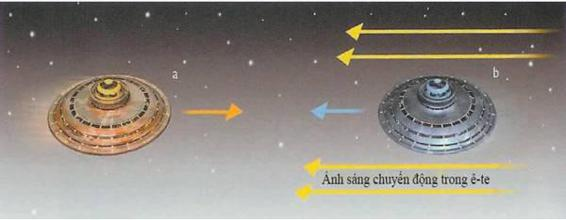
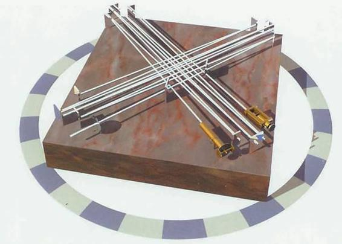
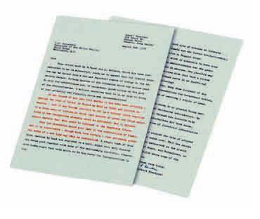
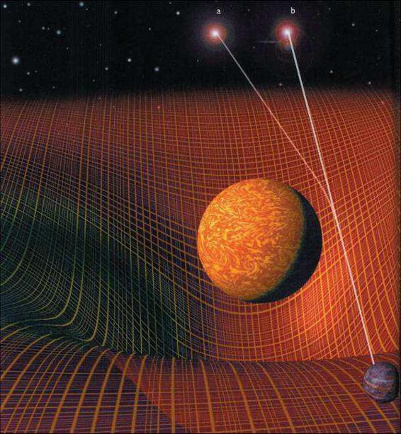

# CHƯƠNG 1 - LƯỢC SỬ VỀ THUYẾT TƯƠNG ĐỐI

> Eistein thiết lập hai lý thuyết căn bản của thế kỷ hai mươi: Lý thuyết tương đối rộng và lý thuyết lượng tử như thế nào?

Albert Einstein, cha đẻ của thuyết tương đối hẹp và thuyết tương đối rộng sinh ra ở Ulm, Đức vào năm 1879.

Một năm sau đó gia đình ông chuyển đến Munich, tại đó, cha ông - Herman và cậu ông - Jacob khởi sự kinh doanh về đồ điện nhưng không mấy thành công. Einstein không phải là thần đồng nhưng có người cho rằng ông là một học sinh cá biệt ở phổ thông thì lại là một sự cường điệu. Năm 1894 công việc làm ăn của cha ông bị đổ bể nên gia đình chuyển đến Milan. Gia đình quyết định ông nên ở lại để hoàn thành bậc học phổ thông, nhưng ông không thích chủ nghĩa độc đoán của trường học nên chỉ sau đó mấy tháng ông đoàn tụ với gia đình ở Ý. Sau đó ông tốt nghiệp phổ thông ở Zurich và tốt nghiệp đại học trường Bách khoa liên bang vào năm 1900. Bản tính hay tranh luận và và ác cảm với quyền lực đã không mang cho ông một chân giáo sư ở trường Bách khoa liên bang và không một giáo sư nào của trường mời ông làm trợ giảng, mà thời bấy giờ đó là con đường bình thường để theo đuổi sự nghiệp khoa học. Cuối cùng thì hai năm sau ông cũng xoay sở được một việc ở Văn phòng sáng chế ở Bern. Ông làm việc tại đó trong thời gian ông viết ba bài báo, trong đó hai bài đã đưa ông trở thành nhà khoa học hàng đầu thế giới và bắt đầu hai cuộc cách mạng về tư tưởng làm thay đổi hiểu biết của chúng ta về không gian, thời gian và bản thân thực tại vào năm 1905.

Gần cuối thế kỷ thứ 19, các nhà khoa học tin rằng họ gần như đã mô tả vũ trụ một cách toàn vẹn. Họ cho rằng không gian được lấp đầy bởi một loại vật chất liên tục gọi là _ete_. Ánh sáng và các tín hiệu vô tuyến là các sóng lan truyền trong _ete_ giống như sóng âm lan truyền trong không khí. Và tất cả các điều cần làm cho một lý thuyết hoàn thiện là phép đo chính xác để xác định tính đàn hồi của _ete_. Thực ra các phép đo như thế đã được xây dựng hoàn chỉnh tại phòng thí nghiệm Jefferson ở trường đại học Harvard mà không dùng đến một cái đinh sắt nào để tránh làm nhiễu các phép đo từ trường yếu. Tuy vậy những người xây dựng hệ đo đã quên rằng các viên gạch nâu đỏ xây nên phòng thí nghiệm và phần lớn các tòa nhà ở Harvard đều chứa một lượng lớn sắt. Ngày nay các tòa nhà đó vẫn được sử dụng, nhưng họ vẫn không chắc là nếu không có các đinh sắt thì sàn thư viện của trường có thể nâng đỡ được sức nặng là bao nhiêu.

Vào cuối thế kỷ 19, các ý tưởng trái ngược nhau về sự có mặt của _ete_ bắt đầu xuất hiện. Người ta tin rằng ánh sáng chuyển động với một tốc độ xác định so với _ete_ và nếu bạn chuyển động cùng hướng với ánh sáng trong _ete_ thì bạn sẽ thấy ánh sáng chuyển động chậm hơn, và nếu bạn chuyển động ngược hướng với ánh sáng thì bạn sẽ thấy ánh sáng di chuyển nhanh hơn. (hình 1.1)

<figure markdown="span">
        
    <figcaption>(Hình 1.1) LÝ THUYẾT _ETE_ CỐ ĐỊNH</figcaption>
</figure>

Nếu ánh sáng là sóng trong một loại vật chất đàn hồi được gọi là _ete_ thì vận tốc của ánh sáng đối với người ở trên tàu vũ trụ chuyển động ngược hướng ánh sáng (a) sẽ nhanh hơn vận tốc của ánh sáng đối với người trong con tàu chuyển động cùng hướng với ánh sáng (b).

<figure markdown="span">
        
    <figcaption>(Hình 1.2) Người ta không thấy sự khác biệt về vận tốc ánh sáng theo các hướng trong mặt phẳng quỹ đạo của trái đất và hướng vuông góc với mặt phẳng quỹ đạo đó.</figcaption>
</figure>

Và một loạt các thí nghiệm để chứng minh điều đó đã thất bại. Albert Michelson và Edward Morley của trường khoa học ứng dụng ở Cleveland, bang Ohio đã thực hiện các thí nghiệm cẩn thận và chính xác nhất vào năm 1887. Họ so sánh tốc độ ánh sáng của hai chùm sáng vuông góc với nhau. Vì trái đất tự quay quanh mình và quay quanh mặt trời nên dụng cụ thí nghiệm sẽ di chuyển trong _ete_ với tốc độ và hướng thay đổi. Nhưng Michelson và Morley cho thấy rằng không có sự khác biệt giữa hai chùm sáng đó. Hình như là ánh sáng truyền với tốc độ như nhau đối với người quan sát, không phụ thuộc vào tốc độ và hướng của người chuyển động. (hình 1.3)

<figure markdown="span">
    \
    <figcaption>(Hình 1.3) ĐO VẬN TỐC ÁNH SÁNG</figcaption>
</figure>

_Trong giao thoa kế Michenson-Morley, ánh sáng từ nguồn sáng được tách thành hai chùm bằng một gương bán mạ. Hai chùm sáng đi theo hai hướng vuông góc với nhau sau đó lại kết hợp thành một chùm sáng sau khi đập vào gương bán mạ một lần nữa. Sự sai khác về tốc độ ánh sáng của hai chùm sáng đi theo hai hướng có thể làm cho các đỉnh sóng của chùm sáng này trùng với đáy sóng của chùm sáng kia và chúng triệt tiêu nhau. Hình phải: sơ đồ thí nghiệm được vẽ lại từ sơ đồ được in trên tạp chí Scientific American năm 1887._

Dựa trên thí nghiệm Michelson-Morley, một nhà vật lý người Ai-len tên là George Fitzgerald và nhà vật lý người Hà Lan tên là Hendrik Lorentz giả thiết rằng các vật thể chuyển động trong _ete_ sẽ co lại và thời gian sẽ bị chậm đi. Sự co và sự chậm lại của đồng hồ làm cho tất cả mọi người sẽ đo được một tốc độ ánh sáng như nhau không phụ thuộc vào việc họ chuyển động như thế nào đối với _ete_ (George Fitzgerald và Hendrik Lorentz vẫn coi _ete_ là một loại vật chất có thực). Tuy vậy, năm 1905, Eistein đã viết một bài báo chỉ ra rằng nếu người ta không thể biết được người ta chuyển động trong không gian hay không thì khái niệm _ete_ không còn cần thiết nữa. Thay vào đó, ông bắt đầu bằng một giả thuyết rằng các định luật khoa học xuất hiện như nhau đối với tất cả những người quan sát chuyển động tự do. Đặc biệt là họ sẽ đo được tốc độ ánh sánh như nhau không phụ thuộc vào tốc độ chuyển động của họ. Tốc độ của ánh sáng độc lập với chuyển động của người quan sát và như nhau theo tất cả các hướng.

Ý tưởng này đòi hỏi phải từ bỏ ý nghĩ cho rằng tồn tại một đại lượng phổ quát được gọi là thời gian có thể đo được bằng tất cả các đồng hồ. Thay vào đó, mỗi người có một thời gian riêng của họ. Thời gian của hai người sẽ giống nhau nếu hai người đó đứng yên tương đối với nhau, nhưng thời gian sẽ khác nhau nếu hai người đó chuyển động tương đối với nhau.

Giả thuyết này được khẳng định bằng rất nhiều thí nghiệm, trong đó có một thí nghiệm gồm hai đồng hồ chính xác bay theo hướng ngược nhau vòng quanh trái đất và quay lại cho thấy thời gian có sai lệch chút ít. Giả thuyết gợi ý rằng nếu ai đó muốn sống lâu hơn thì người đó nên bay về hướng đông vì như thế thì tốc độ của trái đất sẽ bổ sung vào tốc độ của máy bay. Tuy vậy các bữa ăn trên máy bay sẽ rút ngắn cuộc sống của bạn nhiều hơn nhiều lần một phần nhỏ của giây mà bạn có được.

<figure markdown="span">
    
    <figcaption>(Hình 1.4) Một phiên bản về nghịch lý anh em sinh đôi (hình 1.5) đã được kiểm tra bằng thực nghiệm từ hai chiếc đồng hồ chính xác bay ngược chiều nhau vòng quanh Trái Đất. Khi chúng gặp nhau thì đồng hồ bay về hướng đông đã ghi lại thời gian ngắn hơn chút ít.</figcaption>
</figure>

<figure markdown="span">
        
    <figcaption>(Hình 1.5) NGHỊCH LÝ ANH EM SINH ĐÔI</figcaption>
</figure>

- _Trong thuyết tương đối, mỗi người quan sát sẽ đo thời gian khác nhau. Điều này có thể dẫn đến nghịch lý anh em sinh đôi (twin paradox)._
- _Một người trong cặp anh em sinh đôi (a) trong một phi thuyền thám hiểm không gian chuyển động với vận tốc gần bằng vận tốc ánh sáng (c) trong khi người anh em của anh ta (b) vẫn trên mặt đất._
- _Vì thời gian của (a) trong phi thuyền chậm hơn thời gian của (b) trên trái đất. Nên khi người (a) trở về (a2) anh ta sẽ thấy người anh em của anh ta trên trái đất (b2) già hơn anh ta._
- _Mặc dù nó có vẻ chống lại cảm nhận chung của chúng ta, rất nhiều thí nghiệm chứng minh trong kịch bản này, người du hành vũ trụ sẽ trẻ hơn người còn lại._

Giả thuyết của Einstein cho rằng các định luật khoa học xuất hiện như nhau đối với tất cả các người quan sát chuyển động tự do là cơ sở của thuyết tương đối. Gọi như vậy vì nó ngụ ý rằng chỉ có chuyển động tương đối là quan trọng. Vẻ đẹp và sự đơn giản của giả thuyết này đã thuyết phục rất nhiều các nhà tư tưởng, tuy nhiên, vẫn có rất nhiều các ý kiến trái ngược. <mark>Einstein đã vứt bỏ hai khái niệm tuyệt đối của khoa học thế kỷ 19: đứng yên tuyệt đối - đại diện là _ete_ và thời gian tuyệt đối và phổ quát mà tất cả các đồng hồ đo được.</mark> Rất nhiều người thấy rằng đây là một khái niệm không bình thường. Họ hỏi, giả thuyết ngụ ý rằng tất cả mọi thứ đều tương đối, rằng không có một tiêu chuẩn đạo đức tuyệt đối? Sự bứt rứt này tiếp diễn trong suốt những năm 20 và 30 của thế kỷ 20. Khi Einstein được trao giải Nobel vào năm 1921 về một công trình kém quan trọng hơn cũng được ông cho ra đời vào năm 1905. Lúc đó, thuyết tương đối không được nhắc đến vì nó vẫn còn gây nhiều tranh cãi (đến bây giờ tôi vẫn nhận được vài ba bức thư hàng tuần nói rằng Einstein đã sai). Tuy vậy, hiện nay, các nhà vật lý hoàn toàn chấp nhận thuyết tương đối, và các tiên đoán của nó đã được kiểm chứng trong vô vàn ứng dụng.

Một hệ quả quan trọng của thuyết tương đối là hệ thức giữa khối lượng và năng lượng. <mark>Giả thiết của Einstein về tốc độ của ánh sáng là như nhau đối với tất cả các người quan sát ngụ ý rằng không có gì có thể chuyển động nhanh hơn ánh sáng.</mark> Nếu ta dùng năng lượng để gia tốc một vật nào đó, dù là một hạt hay một tàu vũ trụ, thì khối lượng của vật đó sẽ gia tăng cùng với tốc độ và do đó sẽ khó có thể gia tốc thêm được nữa. Ta không thể gia tốc một hạt đến tốc độ ánh sáng vì ta cần một năng lượng lớn vô cùng để làm điều đó. Khối lượng và năng lượng là tương đương và điều đó được tổng kết trong một phương trình nổi tiếng $E = mc^{2}$. Có lẽ đây là phương trình vật lý duy nhất mà chúng ta có thể nhìn thấy nó được viết trên đường phố. Một trong số các hệ quả của phương trình trên là hạt nhân của nguyên tử Uranium phân rã thành 2 hạt nhân nhỏ hơn có tổng khối lượng nhỏ hơn khối lượng của hạt nhân ban đầu, việc này sẽ giải tỏa một năng lượng vô cùng lớn. (hình 1.8)

> Lược bỏ hình 1.7

<figure markdown="span">
    \
        
    <figcaption>(Hình 1.8) NĂNG LƯỢNG LIÊN KẾT HẠT NHÂN</figcaption>
</figure>

_Hạt nhân được tạo thành từ proton và neutron liên kết với nhau nhờ lực hạt nhân mạnh. Nhưng khối lượng của hạt nhân luôn nhỏ hơn tổng khối lượng của các proton và neutron riêng lẻ tạo nên chúng. Sự khác nhau chính là một phép đo năng lượng liên kết hạt nhân mà giữ hạt nhân lại với nhau._

_Năng lượng liên kết này có thể được tính từ hệ thức Einstein: năng lượng liên kết hạt nhân = ∆mc2 trong đó ∆m là sự khác nhau giữa khối lượng hạt nhân và tổng các thành phần._

_Nó giải thoát một lượng năng lượng đủ để tạo nên một sức công phá khổng lồ._

_Vào năm 1939, khi mà khả năng một cuộc chiến tranh thế giới nữa đang lờ mờ xuất hiện, một nhóm các nhà khoa học đã nhận ra tầm quan trọng và đã thuyết phục Einstein vượt qua sự lưỡng lự của bản thân để điền tên của ông vào một bức thư gửi Tổng thống Roosevelt nhằm thúc giục Hoa Kỳ khởi động chương trình nghiên cứu hạt nhân._

__Bức thư tiên đoán của Einstein gửi tổng thống Roosevelt năm 1939:__

_“Trong thời gian bốn tháng qua, thông qua các công trình của Joliot ở Pháp cũng như Fermi và Szilard ở Hoa Kỳ, chúng ta có thể xây dựng một phản ứng hạt nhân với một khối lượng lớn Uranium, nhờ đó mà sinh ra một nguồn năng lượng lớn. Bây giờ, chúng ta có thể làm điều này trong một tương lai gần._

<figure markdown="span">
    
    <figcaption>Mặc dù chưa chắc chắn, nhưng hiện tượng mới này có khả năng dẫn đến việc tạo ra các quả bom có sức công phá cực lớn.”</figcaption>
</figure>

Việc này dẫn đến dự án Manhattan và kết quả của nó là <mark>2 quả bom nguyên tử được ném xuống Hiroshima và Nagasaki vào năm 1945</mark>. Một số người đã đổ tội cho Einstein về bom nguyên tử bởi vì ông đã khám phá ra mối liên hệ giữa khối lượng và năng lượng; nhưng điều này giống như là đổ tội cho Newton đã gây ra các vụ tai nạn máy bay vì đã phát hiện ra định luật hấp dẫn. Sau các bài báo gây chấn động vào năm 1905, Einstein trở lên nổi tiến trên thế giới. Nhưng đến tận năm 1909 ông mới được mời vào làm việc tại trường đại học Zurich và do đó, ông có thể từ bỏ công việc ở văn phòng sáng chế Thụy Sỹ. Hai năm sau ông chuyển sang đại học Đức ở Prague, nhưng ông quay trở lại Zurich vào năm 1912, nhưng lần này ông về trường Bách khoa liên bang. Mặc dù chủ nghĩa chống bài Do thái (anti-semitism) đang phổ biến ở châu Âu, ngay cả ở trong các trường đại học, nhưng ông vẫn là một tài sản quý của trường đại học. Có nhiều đề nghị làm việc đến từ Vienna và Utrecht, nhưng ông đã chấp nhận một vị trí ở Viện hàn lâm khoa học Prussian ở Berlin vì ở đó ông không phải đảm nhiệm công việc giảng dạy. Ông chuyển đến Berlin vào tháng 4 năm 1914 và sau đó ít lâu vợ và hai con của ông cũng chuyển đến đó với ông. Cuộc hôn nhân của ông gặp nhiều sóng gió, do vậy, vợ và các con ông nhanh chóng trở lại Zurich. Mặc dầu thỉnh thoảng ông vẫn trở lại thăm họ nhưng cuối cùng cuộc hôn nhân của họ cũng tan vỡ. Sau đó Einstein lấy một người em họ tên là Elsa sống ở Berlin. Trong những năm chiến tranh ông đã sống độc thân và không có ràng buộc về gia đình, có lẽ chính vì thế đây là thời kỳ thăng hoa nhất của ông về mặt khoa học.

<mark>Mặc dầu thuyết tương đối rất phù hợp với các định luật điện và từ nhưng nó lại không tích hợp với định luật hấp dẫn của Newton. Định luật của Newton nói rằng nếu một lượng vật chất trong một vùng của không gian bị thay đổi thì trường hấp dẫn mà nó tạo ra trong toàn vũ trụ cũng thay đổi ngay lập tức. Điều này có nghĩa là người ta có thể gửi các tín hiệu nhanh hơn ánh sáng (mâu thuẫn với thuyết tương đối); để hiểu tức thời có nghĩa là gì, người ta lại cần đến khái niệm thời gian tuyệt đối và phổ quát, chính điều này lại loại bỏ thời gian cá nhân.</mark>

Năm 1907, Einstein nhận ra khó khăn này khi ông còn làm việc ở văn phòng sáng chế ở Bern, nhưng phải đến khi ông ở Prague vào năm 1911 ông mới suy nghĩ về vấn đề này một cách nghiêm túc. Ông nhận ra rằng có một mối liên hệ mật thiết giữa gia tốc và trường hấp dẫn. Một người nào đó ở trong một cái hộp đóng kín như là trong một cái thang máy chẳng hạn không thể nhận biết được cái hộp đó đang đứng yên trong trường hấp dẫn của trái đất hay đang bị gia tốc bởi một tên lửa trong không gian (tất nhiên lúc này là trước kỷ nguyên của Star Trek, và Einstein nghĩ về những người đứng trong thang máy hơn là về những con tàu vũ trụ). Nhưng người ta không thể gia tốc hoặc rơi tự do lâu được trong cái thang máy trước khi tai nạn xảy ra! (hình 1.9)

<figure markdown="span">
        
    <figcaption>(Hình 1.9) Một người quan sát đứng trong một cái hộp không thể nhận ra sự khác nhau khi đứng trong một chiếc thang máy tĩnh trên trái đất (a) hoặc bị gia tốc bởi một tên lửa trong không gian tự do (b). Nếu người ta tắt động cơ của tên lửa (c) cảm giác sẽ giống như trong một chiếc thang máy rơi tự do xuống đất.</figcaption>
</figure>

Nếu trái đất phẳng thì ta có thể nói rằng quả táo rơi xuống đầu Newton là do hấp dẫn hoặc Newton và bề mặt trái đất bị gia tốc lên trên, hai cách nói trên là tương đương (hình 1.10). Sự tương ứng giữa gia tốc và hấp dẫn không sẽ còn đúng khi trái đất là hình cầu, tuy vậy - người ở mặt kia trái đất có thể bị gia tốc theo các chiều ngược lại nhưng vẫn đứng ở những khoảng cách không đổi với nhau. (hình 1.11)

<figure markdown="span">
    
    <figcaption>(Hình 1.11)</figcaption>
</figure>

Nhưng khi ông quay lại Zurich vào năm 1912, ông đã có một bước đột phá khi nhận ra rằng sự tương ứng đó là đúng nếu hình dáng của không thời gian bị bẻ cong chứ không thẳng như người ta vẫn nghĩ cho tới thời điểm đấy. Ý tưởng của ông là khối lượng và năng lượng đã làm cong không thời gian theo một cách có thể xác định được. Các vật thể như là quả táo hoặc là hành tinh sẽ cố gắng chuyển động thẳng trong không thời gian, nhưng quỹ đạo của chúng sẽ bị bẻ cong bởi một trường hấp dẫn do không thời gian bị cong. (hình 1.12)

<figure markdown="span">
    
    <figcaption>(Hình 1.12) ĐỘ CONG CỦA KHÔNG THỜI GIAN</figcaption>
</figure>

- _Gia tốc và hấp dẫn chỉ có thể tương đương với nhau nếu một vật thể có khối lượng lớn bẻ cong không thời gian, do đó bẻ cong cả lộ trình của các vật thể xung quanh nó._
- _Nếu trái đất phẳng (hình 1.10) thì người ta có thể giải thích bằng một trong hai cách tương đương sau: quả táo rơi xuống đầu Newton do lực hấp dẫn hoặc do Newton gia tốc lên phía trên. Sự tương đương này không còn đúng khi trái đất hình cầu (hình 1.11) vì những người ở mặt kia của trái đất sẽ rời xa nhau. Einstein đã giải quyết bài toán này bằng việc giả thiết không gian và thời gian bị cong._

Với sự giúp đỡ của Marcel Grossmann, <mark>Einstein nghiên cứu lý thuyết không gian và mặt phẳng cong do George Friedrich Riemann phát triển trước đó. Tuy vậy, Riemann nghĩ rằng chỉ có không gian bị bẻ cong. Điều đó làm cho Einstein nghĩ rằng không thời gian cũng bị bẻ cong. Einstein và Grossmann đã viết chung một bài báo vào năm 1913, trong đó họ đã đẩy ý tưởng mà chúng ta nghĩ về lực hấp dẫn chỉ là những biểu hiện của sự cong của không thời gian</mark>. Tuy vậy, vì một sai lầm do Einstein gây ra (Einstein cũng rất con người và có thể nhầm lẫn), <mark>họ không thể tìm ra các phương trình liên hệ độ cong của không gian với khối lượng và năng lượng trong đó</mark>. Einstein vẫn tiếp tục nghiên cứu vấn đề này ở Berlin, không bị ảnh hưởng bởi các vấn đề gia đình và chủ yếu là không bị ảnh hưởng bởi chiến tranh, cho đến khi ông tìm thấy các phương trình đó vào tháng 11 năm 1915. Ông đã trao đổi các ý tưởng của ông với nhà toán học David Hilbert trong chuyến thăm trường đại học Gottingen vào mùa hè năm 1915, và Hilbert cũng tìm ra các phương trình tương tự một cách độc lập trước Einstein vài ngày. Tuy nhiên, ngay cả bản thân Hilbert cũng thừa nhận, tác quyền của lý thuyết mới là thuộc về Einstein. Ý tưởng liên hệ hấp dẫn với độ cong của không thời gian chính là của ông. Đây cũng là một lời khen cho nước Đức vào thời điểm đó khi các cuộc trao đổi và thảo luận khoa học có thể diễn ra mà không bị ảnh hưởng bởi chiến tranh. Điều này hoàn toàn trái ngược với kỷ nguyên Đức quốc xã (Nazi) 20 năm sau đó.

Lý thuyết mới về sự cong của không thời gian được gọi là thuyết tương đối rộng để phân biệt với lý thuyết ban đầu không có lực hấp dẫn được mọi người biết đến với cái tên là thuyết tương đối hẹp. Lý thuyết này được khẳng định trong một thí nghiệm rất ấn tượng vào năm 1919, trong một cuộc thám hiểm của các nhà khoa học người Anh về phía Tây châu Phi đã quan sát được độ lệch rất nhỏ của ánh sáng đến từ một ngôi sao đi gần mặt trời trong quá trình nhật thực (hình 1.13). Đây là một bằng chứng trực tiếp cho thấy rằng không thời gian bị bẻ cong, và nó đã khích lệ sự thay đổi lớn nhất của con người trong nhận thức của chúng ta về vũ trụ mà chúng ta đang sống từ khi Euclid viết cuốn sách Hình học cơ sở vào khoảng 300 năm trước Công nguyên.

<figure markdown="span">
        
    <figcaption>(Hình 1.13) ÁNH SÁNG BỊ BẺ CONG</figcaption>
</figure>

_Ánh sáng từ các ngôi sao đi đến gần mặt trời lệch hướng do khối lượng của mặt trời làm cong không thời gian (a). Điều này làm dịch chuyển vị trí biểu kiến của ngôi sao khi nhìn từ trái đất (b). Hiện tượng này có thể quan sát khi nhật thực._

<mark>Thuyết tương đối rộng của Einstein đã biến không thời gian từ vai trò là một khung nền thụ động trong đó các hiện tượng xảy ra trở thành một tác nhân chủ động trong chuyển động của vũ trụ</mark>. Điều đó dẫn tới một bài toán rất lớn và là mối quan tâm hàng đầu của vật lý ở thế kỷ 20. Vũ trụ tràn đầy vật chất và vật chất bẻ cong không thời gian theo một cách làm cho các vật thể rơi vào nhau. Einstein thấy rằng các phương trình của ông không có nghiệm mô tả một vũ trụ tĩnh tại và không thay đổi theo thời gian. Thay vì việc từ bỏ một vũ trụ vĩnh cửu mà ông và phần lớn những người khác tin, ông đã thêm vào một số hạng gọi là hằng số vũ trụ một cách khiên cưỡng. Hằng số này làm cong không thời gian theo hướng ngược lại, do đó các vật thể sẽ chuyển động ra xa nhau. Hiệu ứng đẩy của hằng số vũ trụ có thể cân bằng với hiệu ứng hút của vật chất, cho phép ông thu được một vũ trụ tĩnh tại. Đây là một trong những cơ may bị mất đáng tiếc nhất trong vật lý thuyết. Nếu Einstein dừng lại ở các phương trình ban đầu của ông, ông có thể tiên đoán rằng vũ trụ sẽ giãn nở hoặc co lại. Khả năng vũ trụ thay đổi theo thời gian chỉ được xem xét một cách nghiêm túc cho đến khi có được những quan sát thu được từ kính thiên văn 2,5 m đặt trên đỉnh Wilson vào những năm 1920.

<mark>Những quan sát này cho thấy rằng các thiên hà ở càng xa nhau thì chuyển động ra xa nhau càng nhanh. Vũ trụ đang giãn nở với khoảng cách giữa 2 thiên hà tăng dần theo thời gian (hình 1.14). Phát hiện này đã loại bỏ sự có mặt của hằng số vũ trụ để có được một vũ trụ tĩnh. Sau này Einstein nói rằng hằng số vũ trụ là sai lầm lớn nhất của đời ông. Tuy vậy, ngày nay, người ta thấy rằng hằng số vũ trụ hoàn toàn không phải là một sai lầm: những quan sát gần đây sẽ được mô tả trong chương 3 gợi ý rằng thực ra là có một hằng số vũ trụ rất nhỏ.</mark>

<figure markdown="span">
        
    <figcaption>(Hình 1.14) Quan sát về các thiên hà chỉ ra rằng vũ trụ đang giãn nở: khoảng cách giữa hầu hết các cặp thiên hà đang gia tăng.</figcaption>
</figure>

<mark>Thuyết tương đối rộng đã thay đổi hoàn toàn việc bàn luận nguồn gốc và số phận của vũ trụ. Một vũ trụ tĩnh tại có thể tồn tại mãi mãi hoặc có thể được tạo ra với hình dạng hiện nay của nó tại một thời điểm trong quá khứ. Tuy vậy, nếu bây giờ các thiên hà đang rời xa nhau, điều đó có nghĩa là trong quá khứ chúng đã từng rất gần nhau. Khoảng 15 tỷ năm trước đây, chúng đã từng chập lại với nhau và mật độ rất lớn. Trạng thái này được một linh mục Công giáo tên là Georges Lemaitre, người đầu tiên nghiên cứu về nguồn gốc của vũ trụ gọi là “nguyên tử nguyên thủy” mà ngày nay chúng ta gọi là vụ nổ lớn _(Big Bang)_.</mark>

<figure markdown="span">
        
    <figcaption>Kính viễn vọng 100-inch tại đài quan sát Mount Wilson.</figcaption>
</figure>

Dường như Einstein chưa bao giờ nghiên cứu vụ nổ lớn một cách nghiêm túc. Rõ ràng là ông nghĩ rằng mô hình đơn giản về vũ trụ giãn nở đồng nhất sẽ không đúng nếu người ta theo dõi chuyển động của các thiên hà trong quá khứ và rằng các vận tốc biên của các thiên hà có thể làm cho chúng không chạm vào nhau. Ông nghĩ rằng trước đó vũ trụ ở pha co lại và trượt qua nhau để chuyển sang pha dãn nở hiện nay với một mật độ trung bình. Tuy vậy, bây giờ chúng ta biết rằng để cho các phản ứng hạt nhân ở trong vũ trụ ban đầu tạo ra một lượng lớn các nguyên tố nhẹ mà chúng ta quan sát được xung quanh, thì mật độ cần phải lớn hơn 0.64 tấn/ cm3 và nhiệt độ phải trên một tỷ độ. Hơn nữa các quan sát về phông vi sóng chỉ ra rằng có thể mật độ đạt đến 1026 tấn/cm3. Ngày nay chúng ta biết rằng thuyết tương đối rộng của Eistein không cho phép vũ trụ trượt qua nhau để đến pha dãn nở hiện tại. Như sẽ được thảo luận trong chương 2, Roger Pensose và tôi đã có thể chỉ ra rằng thuyết tương đối rộng tiên đoán vũ trụ bắt đầu bằng một vụ nổ lớn. Do đó, lý thuyết của Einstein tiên đoán rằng thời gian, có sự khởi đầu mặc dù ông không thích ý tưởng này cho lắm.

Thậm chí Einstein còn miễn cưỡng hơn thừa nhận rằng thuyết tương đối rộng tiên đoán thời gian sẽ kết thúc đối với các ngôi sao nặng khi chúng ở giai đoạn cuối của cuộc đời và khi chúng không còn đủ nhiệt lượng để cân bằng với lực hấp dẫn của bản thân chúng. Lực hấp dẫn này đang cố làm chúng nhỏ đi. Einstein nghĩ rằng, các ngôi sao như vậy sẽ kết thúc cuộc đời ở một trạng thái cuối cùng, nhưng <mark>ngày nay chúng ta biết rằng sẽ không có trạng thái cuối cùng cho các ngôi sao có khối lượng lớn hơn hai lần khối lượng mặt trời. Các ngôi sao như vậy sẽ tiếp tục co lại cho đến khi chúng trở thành các hố đen, những vùng mà không thời gian bị bẻ cong đến nỗi ánh sáng không thể thoát ra khỏi đó được.</mark> (hình 1.15)

<figure markdown="span">
    
    <figcaption>(Hình 1.15) Một ngôi sao lớn cạn kiệt nguyên liệu hạt nhân sẽ mất đi nhiệt lượng và co lại. Độ cong của không gian sẽ trở lên lớn đến mức tạo ra một hố đen mà ánh sáng không thể thoát ra được. Thời gian kết thúc trong lòng hố đen.</figcaption>
</figure>

Penrose và tôi cho thấy rằng thuyết tương đối rộng tiên đoán thời gian sẽ kết thúc trong một hố đen, đối với bản thân ngôi sao và đối với một nhà du hành vũ trụ không may bị rơi vào nó. Nhưng cả điểm khởi đầu và kết thúc của thời gian là những nơi mà các phương trình của thuyết tương đối rộng không thể được xác định. Do đó lý thuyết không tiên đoán được cái gì tham gia vụ nổ lớn. Một số người thấy rằng đây là biểu hiện cho tự do của Chúa sáng tạo thế giới theo bất lỳ cách nào mà ngài muốn, nhưng những người khác (trong đó có tôi) cảm thấy rằng sự khởi đầu của vũ trụ cũng được điều khiển bởi các định luật khoa học mà điều khiển vũ trụ tại các thời điểm sau khi vũ trụ hình thành. Chúng ta đã đạt được một số tiến bộ trong vấn đề này, như sẽ được mô tả trong chương 3, <u>nhưng chúng ta vẫn chưa hiểu hoàn toàn nguồn gốc của vũ trụ</u>.

<u>Lý do mà thuyết tương đối không còn đúng tại thời điểm vụ nổ lớn là thuyết tương đối không tích hợp được với lý thuyết lượng tử, một cuộc cách mạng khác về tư tưởng vào thời điểm đầu thế kỷ 20</u>. Bước đầu tiến tới thuyết lượng tử được thực hiện vào năm 1900, khi Max Plank ở Berlin khám phá ra rằng <mark>bức xạ phát ra từ các vật thể nóng đỏ có thể được giải thích nếu ánh sáng chỉ có thể được phát ra hoặc bị hấp thụ theo những lượng rời rạc được gọi là các lượng tử (quanta)</mark>. Một trong số các bài báo cách mạng của ông được viết năm 1905, khi ông còn làm việc ở văn phòng sáng chế, Einstein đã chứng minh rằng giả thuyết lượng tử của Plank có thể giải thích một hiệu ứng gọi là hiệu ứng quang điện, trong hiệu ứng này, các kim loại sẽ phát ra các điện tử khi bị ánh sáng chiếu vào. Hiệu ứng là là cơ sở của các đầu thu ánh sáng và vô tuyến, và cũng nhờ công trình này Einstein được trao giải Nobel vật lý.

<mark>Einstein tiếp tục nghiên cứu lý thuyết lượng tử cho đến những năm 1920, nhưng ông rất băn khoăn về công trình của Heisenberg ở Copenhagen, Paul Dirac ở Cambridge và Erwin Schrodinger ở Zurich, đó là những người đã phát triển một bức tranh mới về thực tại được gọi là cơ học lượng tử. Những hạt tí hon không còn có vị trí và tốc độ chính xác nữa. Thay vào đó, nếu người ta xác định vị trí của hạt càng chính xác bao nhiêu thì người ta càng khó xác định vận tốc của nó bấy nhiêu và ngược lại. Einstein rất khó chịu về những yếu tố ngẫu nhiên, bất định trong các định luật cơ bản và ông chưa bao giờ chấp nhận hoàn toàn cơ học lượng tử. Suy nghĩ của ông được thể hiện trong câu châm ngôn “chúa không chơi trò xúc sắc”</mark>. Tuy vậy, phần lớn các nhà khoa học chấp nhận tính đúng đắn của lý thuyết lượng tử mới này bởi vì chúng đã giải thích được một loạt các hiện tượng khó hiểu trước đó và rất phù hợp với các quan sát. Các quy luật lượng tử là cơ sở cho sự phát triển của hóa học, sinh học phân tử, và điện tử hiện đại và là cơ sở cho nền công nghệ đã thay đổi thế giới trong 50 năm qua.

Tháng 12 năm 1932, nhận thấy Đức quốc xã và Hitler sắp lên nắm quyền, Eistein rời nước Đức và 4 tháng sau đó ông từ bỏ quyền công dân để giành trọn 20 năm cuộc đời còn lại của mình cho Viện nghiên cứu cấp cao ở Princeton, bang New Jersey.

Ở Đức, đảng quốc xã đã tiến hành một chiến dịch chống lại “khoa học Do thái” và vì rất nhiều các nhà khoa học Đức là người Do thái, nên đây cũng là một nguyên nhân làm cho người Đức không chế tạo được bom nguyên tử. Einstein và thuyết tương đối của ông là đối tượng chính của chiến dịch này. Khi được hỏi về một cuốn sách được xuất bản với tiêu đề 100 tác giả chống lại Einstein thì ông trả lời: “Tại sao lại một trăm? Nếu tôi sai thì một cũng đủ”. Sau thế chiến hai, ông thúc giục các nước đồng minh thiết lập một tổ chức quốc tế kiểm soát bom nguyên tử. Năm 1948, ông được mời làm tổng thống của nhà nước Israel non trẻ nhưng ông đã từ chối. Một lần ông nói: “chính trị là nhất thời, chỉ có các phương trình mới là vĩnh cửu”. Các phương trình thuyết tương đối của Einstein là tấm bia ghi nhận công lao của ông. Chúng sẽ tồn tại mãi mãi cùng vũ trụ. Trong vài trăm năm qua, thế giới đã thay đổi nhiều hơn bất kỳ thế kỷ nào trước đó. Nguyên nhân không phải là các thành tựu về kinh tế hay chính trị mà là sự phát triển vượt bậc về công nghệ được xây dựng trên nền khoa học cơ bản. Vậy thì ai xứng đáng là biểu tượng cho sự tiến bộ đó hơn Einstein?