# CHƯƠNG 2 - HÌNH DÁNG CỦA THỜI GIAN

> Thuyết tương đối rộng của Einstein cho thời gian một hình dáng Nó có thể tích hợp với thuyết lượng tử như thế nào?

<figure markdown="span">
    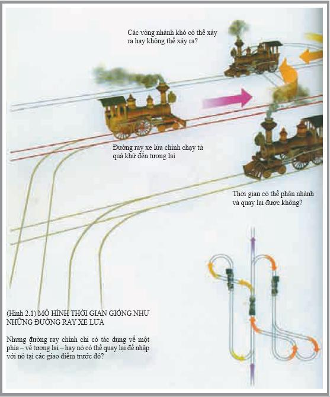
    <figcaption>Hình 2.1</figcaption>
</figure>

Thời gian là gì? Một bài thánh ca nói: thời gian là một luồng chảy vô tận cuốn theo bao mơ ước của chúng ta. Nó có phải là một tuyến đường ray xe lửa hay không? Có thể thời gian có những vòng lặp và phân nhánh và nhờ đó chúng ta có thể đi tới và lại còn có thể quay lại một ga nào trước đó trên đường ray. (hình 2.1) Một tác giả thế kỷ 19 tên là Charles Lamb viết: “Không có gì làm tôi bối rối hơn thời gian và không gian, bởi vì tôi chưa bao giờ nghĩ về nó”. Hầu hết mọi người trong chúng ta chẳng mất thì giờ bận tâm về thời gian và không gian, chúng là gì cũng được, nhưng đôi lúc tất cả chúng ta tự hỏi thời gian là gì, nó bắt đầu thế nào và nó đang dẫn chúng ta về đâu.

Theo tôi, bất kỳ một lý thuyết mang tính khoa học nào về thời gian hoặc về bất kỳ một khái niệm nào khác đều dựa trên một triết lý khoa học hiệu quả nhất: <mark>phương pháp thực chứng (positivism)</mark> do nhà triết học Karl Popper và cộng sự đưa ra. Theo phương pháp tư duy này thì một lý thuyết khoa học là một mô hình toán học mô tả và giải mã các quan sát mà chúng ta thu được. Một lý thuyết tốt sẽ mô tả được nhiều hiện tượng dựa trên một số ít các giả thiết và sẽ tiên đoán được các hiện tượng có thể kiểm chứng được. Nếu các tiên đoán phù hợp với thực nghiệm thì lý thuyết đó sẽ vượt qua được đợt kiểm chứng mặc dù có thể người ta không bao giờ chứng minh rằng lý thuyết đó là chính xác. Mặt khác, nếu các lý thuyết đó không phù hợp với các tiên đoán thì chúng ta cần loại bỏ hoặc sửa đổi lý thuyết (ít nhất đó là những điều cần xảy ra. Trên thực tế, người ta thường đặt câu hỏi về độ chính xác của các quan sát và khía cạnh đạo đức của những người thực hiện các quan sát đó). Nếu người ta đứng trên quan điểm thực chứng giống như tôi thì người ta không thế nói thực sự thời gian là gì. Tất cả những việc mà người ta có thể là mô tả các sự kiện đã được tìm ra phù hợp tốt với các mô hình toán học về thời gian và tiên đoán các sự kiện mới.

<figure markdown="span">
    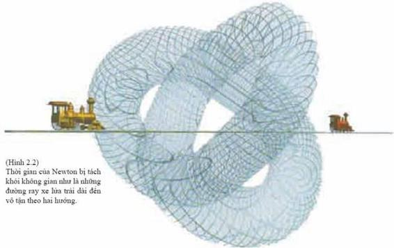
    <figcaption>Hình 2.2 Thời gian của Newton bị tách khỏi không gian như là những đường ray xe lửa trải dài đến vô tận theo hai hướng.</figcaption>
</figure>
<figure markdown="span">
    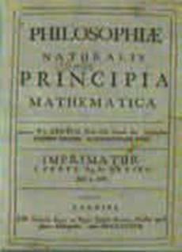    
    <figcaption>Isaac Newton đã xuất bản mô hình toán học về không gian và thời gian cách đây đã 300 năm.</figcaption>
</figure>

Isaac Newton đã cho chúng ta mô hình toán học đầu tiên về thời gian và không gian trong cuốn Các nguyên lý toán học (Principia Mathematica), xuất bản năm 1687. Newton từng giữ ghế giáo sư Lucasian tại trường đại học Cambridge, vị trí mà tôi đang giữ hiện nay, mặc dù, lúc đó chiếc ghế của Newton không được điều khiển bằng điện như của tôi! Trong mô hình của Newton, thời gian và không gian là khung nền cho các sự kiện xảy ra và không gian và thời gian không làm ảnh hưởng đến các sự kiện xảy ra trong đó. Thời gian tách biệt khỏi không gian và được coi là đơn tuyến, hoặc được coi là đường ray tàu hỏa dài vô tận theo hai hướng (hình 2.2). Bản thân thời gian được xem là vĩnh cửu theo nghĩa nó đã tồn tại, và nó sẽ tồn tại mãi mãi. Nhưng ngược lại, phần lớn mọi người đều nghĩ rằng vũ trụ với trạng thái gần giống hiện tại được sáng tạo cách đây vài ngàn năm. Điều này làm các nhà triết học ví như Immanuel Kant, một nhà tư tưởng người Đức, trăn trở. <mark>Nếu thực sự vũ trụ được sáng tạo tại một thời điểm thì tại sao lại phải đợi một khoảng thời gian vô tận trước đó? Mặt khác, nếu vũ trụ tồn tại mãi mãi thì tại sao những sự kiện sẽ xảy ra trong tương lai lại không xảy ra trong quá khứ, ngụ ý lịch sử đã kết thúc? Đặc biệt là, tại sao vũ trụ lại không đạt đến trạng thái cân bằng nhiệt trong đó mọi vật đều có cùng nhiệt độ?</mark>

Kant gọi vấn đề này là một “sự tự mâu thuẫn của lý tính thuần túy” (antinomy of pure reason), bởi vì dường như đó là một mâu thuẫn _logic_; nó không có lời giải. Nhưng nó chỉ là một mâu thuẫn trong bối cảnh của mô hình toán học của Newton, trong đó thời gian là một đường thẳng, độc lập với các sự kiện xảy ra trong vũ trụ. Tuy nhiên, như chúng ta đã thấy trong chương 1, Einstein đã đề xuất một mô hình toán học hoàn toàn mới: thuyết tương đối rộng. Kể từ khi bài báo của Einstein ra đời, chúng ta đã bổ sung một vài sửa đổi nhưng mô hình về không gian và thời gian vẫn dựa trên mô hình mà Einstein đã đề xuất. Chương này và các chương sau sẽ mô tả các tư tưởng của chúng ta đã phát triển như thế nào kể từ khi bài báo cách mạng của Einstein. Đó là câu chuyện về thành công của rất nhiều người, và tôi tự hào đã đóng góp một phần nhỏ công sức vào câu chuyện đó.

Thuyết tương đối rộng đã kết hợp chiều thời gian với ba chiều của không gian để tạo thành cái gọi là không thời gian (spacetime - hình 2.3). Lý thuyết giải thích hiệu ứng hấp dẫn là sự phân bố của vật chất và năng lượng trong vũ trụ làm cong và biến dạng không thời gian, do đó không thời gian không phẳng. Các vật thể trong không thời gian cố gắng chuyển động theo các đường thẳng, nhưng vì không thời gian bị cong nên các quĩ đạo của chúng bị cong theo. Các vật thể chuyển động như thể chúng bị ảnh hưởng bởi trường hấp dẫn.

<figure markdown="span">
        
    <figcaption>(Hình 2.3) HÌNH DÁNG VÀ HƯỚNG CỦA THỜI GIAN</figcaption>
</figure>

_Thuyết tương đối của Einstein - lý thuyết phù hợp với rất nhiều thực nghiệm - cho thấy rằng thời gian và không gian liên hệ chặt chẽ với nhau._

_Người ta không thể bẻ cong không gian mà không ảnh hưởng đến thời gian. Do đó, thời gian có một hình dáng. Tuy vậy, dường như nó chỉ có một hướng giống như các đầu máy xe lửa trong hình minh họa ở trên_

Một cách hình dung thô thiển, không thời gian giống như một tấm cao su. Khi ta đặt một viên bi lớn tượng trưng cho mặt trời lên tấm cao su đó. Trọng lượng của viên bi sẽ kéo tấm cao su và làm cho nó bị cong gần mặt trời. Nếu bây giờ ta lăn các viên bi nhỏ lên tấm cao su đó thì chúng sẽ không lăn thẳng qua chỗ viên bi lớn mà thay vào đó chúng sẽ di chuyển xung quanh nó, giống như các hành tinh chuyển động xung quanh mặt trời. hình 2.4)

<figure markdown="span">
    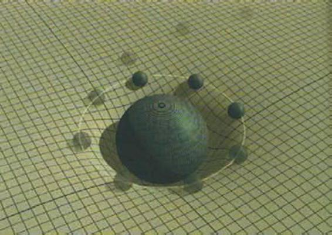
    <figcaption>(Hình 2.4) TẤM CAO SU VŨ TRỤ</figcaption>
</figure>

_Hòn bi lớn ở trung tâm đại diện cho một vật thể nặng như là một ngôi sao. Khối lượng của nó làm cong tấm cao su ở xung quanh. Những hòn bi khác lăn trên tấm cao su sẽ bị ảnh hưởng bởi độ cong và chuyển động xung quanh hòn bi lớn, các hành tinh trong trường hấp dẫn của một ngôi sao cũng chuyển động xung quanh nó giống như trên._

`Sự hình dung đó không hoàn toàn đúng` bởi vì chỉ một phần hai chiều của không gian bị bẻ cong, và thời gian không bị biến đổi giống như trong lý thuyết của Newton. Trong thuyết tương đối rộng, lý thuyết phù hợp với rất nhiều thực nghiệm, <mark>thời gian và không gian gắn liền với nhau. Người ta không thể làm cong không gian mà không làm biến đổi thời gian</mark>. Do đó thời gian có một hình dáng. Bằng cách làm cong không gian và thời gian, thuyết tương đối đã biến chúng từ khung nền thụ động mà trong đó các sự kiện xảy ra thành tác nhân năng động tham gia vào các sự kiện đó. Trong lý thuyết của Newton thời gian tồn tại độc lập với tất cả mọi sự vật khác, ta có thể hỏi: Chúa đã làm gì trước khi sáng tạo ra vũ trụ? Như thánh Augustin trả lời rằng, ta không nên nói đùa về điều đó, nếu có ai trót hỏi vậy thì ông trả lời “Ngài đã chuẩn bị địa ngục cho những kẻ quá tò mò”. Đó là một câu hỏi nghiêm túc mà con người suy nghĩ trong nhiều thế kỷ. Theo thánh Augustin, trước khi Chúa tạo thiên đường và trái đất, Ngài không làm gì cả. Thực ra ý tưởng này rất gần với các tư tưởng hiện đại.

> Thánh Augustine, nhà tư tưởng thế kỷ thứ năm cho rằng thời gian không tồn tại trước khi thế giới ra đời.

<mark>Trong thuyết tương đối rộng, không thời gian và vũ trụ không tồn tại độc lập với nhau</mark>. Chúng được các định bằng các phép đo trong vũ trụ như là số các dao động của tinh thể thạnh anh trong đồng hồ hoặc chiều dài của một cái thước. Trong vũ trụ thời gian được định nghĩa như thế này cũng là điều dễ hiểu, nó cần có một giá trị bé nhất và lớn nhất - hay nói cách khác, có một sự khởi đầu và kết thúc. Việc hỏi cái gì đã xảy ra trước khi thời gian bắt đầu và cái gì sẽ xảy ra sau khi thời gian kết thúc là vô nghĩa vì lúc đó nó không được xác định.

Việc xác định mô hình toán học của thuyết tương đối rộng tiên đoán vũ trụ và bản thân thời gian có bắt đầu hay kết thúc hay không hiển nhiên là một vấn đề quan trọng. Định kiến cho rằng thời gian là vô tận theo hai hướng là phổ biến đối với các nhà vật lý lý thuyết trong đó có Einstein. Mặt khác, có nhiều câu hỏi rắc rối về sự sáng thế, các câu hỏi này có vẻ nằm ngoài phạm vi nghiên cứu của khoa học. Trong các nghiệm của các phương trình của Einstein, thời gian có bắt đầu và có kết thúc, nhưng tất cả các nghiệm đó đều rất đặc biệt, có nhiều phép đối xứng. Người ta đã cho rằng, <mark>trong một vật thể đang suy sụp dưới lực hấp dẫn của chính bản thân nó, thì các áp lực hoặc các vận tốc biên (sideway) tránh cho vật chất không cùng nhau rơi vào một điểm mà ở đó mật độ vật chất sẽ trở nên vô hạn</mark>. Tương tự như thế, nếu người ta theo dõi sự dãn nở của vũ trụ trong quá khứ, người ta sẽ thấy rằng <mark>vật chất của vũ trụ không xuất phát từ một điểm có mật độ vô hạn. Một điểm có mật độ vô hạn như vậy được gọi là một điểm kỳ dị và nó là điểm khởi đầu và kết thúc của thời gian.</mark>

Năm 1963, hai nhà khoa học người Nga là Evgenii Lifshitz và Isaac Khalatnikov khẳng định đã chứng minh tất cả các nghiệm của phương trình của Einstein cho thấy vật chất và vận tốc được sắp xếp một cách đặc biệt. Xác xuất để vũ trụ sắp xếp đặc biệt như thế gần như bằng không. Hầu hết tất cả các nghiệm biểu diễn trạng thái của vũ trụ đều tránh được điểm kỳ dị với mật độ vô hạn: trước pha giãn nở, vũ trụ cần phải có một pha co lại trong đó vật chất bị kéo vào nhau nhưng không va chạm với nhau sau đó rời nhau trong pha giãn nở hiện nay. Nếu đúng như thế thì thời gian liên tục mãi mãi từ vô tận trong quá khứ tới vô tận trong tương lai. Luận cứ của Lifshitz và Khalatnikov không thuyết phục được tất cả mọi người. Thay vào đó, Roger Penrose và tôi đã chấp nhận một cách tiếp cận khác không dựa trên nghiên cứu chi tiết các nghiệm của phương trình Einstein mà dựa trên một cấu trúc bao trùm của không thời gian. Trong thuyết tương đối, không thời gian không chỉ bị cong bởi khối lượng của các vật thể mà còn bị cong bởi năng lượng trong đó nữa. Năng lượng luôn luôn dương, do đó không thời gian bị uốn cong và bẻ cong hướng của các tia sáng lại gần nhau hơn.

<figure markdown="span">
    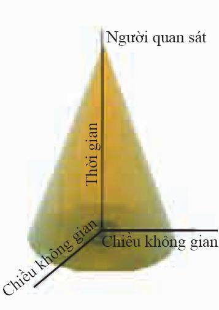\
    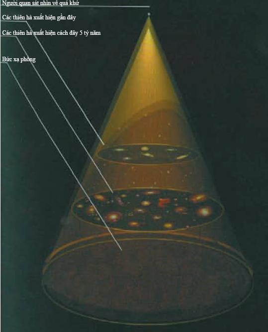
    <figcaption>(Hình 2.5) NÓN ÁNH SÁNG QUÁ KHỨ CỦA CHÚNG TA</figcaption>
</figure>

_Khi chúng ta nhìn các thiên hà xa xôi, chúng ta đang nhìn vũ trụ trong quá khứ vì ánh sáng chuyển động với vận tốc hữu hạn. Nếu chúng ta biểu diễn thời gian bằng trục thẳng đứng và hai trong ba chiều của không gian bằng trục nằm ngang thì những tia sáng đến với chúng ta ngày nay nằm ở đỉnh nón._

Bây giờ chúng ta xem xét nón ánh sáng quá khứ (hình 2.5), đó là các đường trong không thời gian mà các tia sáng từ các thiên hà xa xôi đi đến chúng ta hôm nay. Trong giản đồ thể hiện nón áng sáng, thời gian được biểu diễn bằng phương thẳng đứng và không gian được biểu diễn bằng phương nằm ngang, vị trí của chúng ta trong đó là ở đỉnh của nón áng sáng đó. Khi chúng ta đi về quá khứ, tức là đi từ đỉnh xuống phía dưới của nón, chúng ta sẽ thấy các thiên hà tại các thời điểm rất sớm của vũ trụ. Vì vũ trụ đang giãn nở và tất cả mọi thứ đã từng ở rất gần nhau, nên khi chúng ta nhìn xa hơn về quá khứ thì chúng ta đang nhìn lại vùng không gian có mật độ vật chất lớn hơn. Chúng ta quan sát thấy một phông bức xạ vi sóng (microwave background) lan tới chúng ta dọc theo nón ánh sáng quá khứ từ các thời điểm rất xa xưa khi mà vũ trụ rất đặc, rất nóng hơn bây giờ. Bằng cách điều khiển các máy đo về các tần số vi sóng khác nhau, chúng ta có thể đo được phổ của bức xạ này (sự phân bố của năng lượng theo tần số). Chúng ta đã tìm thấy một phổ đặc trưng cho bức xạ từ một vật thể với nhiệt độ 2,7 độ K. Bức xạ vi sóng này không đủ mạnh để làm nóng chiếc bánh piza, nhưng phổ này phù hợp một cách chính xác với phổ của bức xạ từ một vật có nhiệt độ 2,7 độ K, điều đó nói với chúng ta rằng bức xạ cần phải đến từ các vùng có vật chất làm tán xạ vi sóng. (hình 2.6)

<figure markdown="span">
    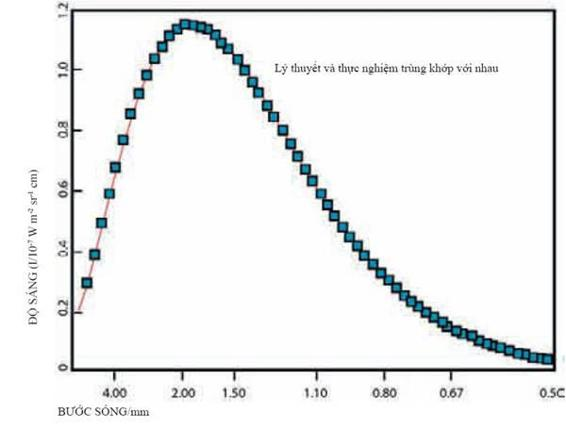    
    <figcaption>(Hình 2.6) KẾT QUẢ PHÉP ĐO PHỔ PHÔNG VI SÓNG</figcaption>
</figure>

_Phổ (phân bố cường độ theo tần số) của bức xạ phông vi sóng giống phổ phát ra từ một vật nóng. Đối với bức xạ trong trạng thái cân bằng nhiệt, vật chất làm tán xạ bức xạ đó nhiều lần. Điều này cho thấy rằng có đủ một lượng vật chất trong nón ánh sáng quá khứ để bẻ cong ánh sáng._

<mark>Do đó chúng ta có thể kết luận rằng nón ánh sáng quá khứ của chúng ta cần phải vượt qua một lượng vật chất khi người ta đi ngược lại thời gian.</mark> Lượng vật chất này đủ để làm cong không thời gian, do đó các tia sáng trong nón ánh sáng quá khứ của chúng ta bị bẻ cong vào với nhau. (hình 2.7)

<figure markdown="span">  
    
    <figcaption>(Hình 2.7) LÀM CONG KHÔNG THỜI GIAN</figcaption>
</figure>

_Vì lực hấp dẫn là lực hút nên vật chất luôn làm cong không thời gian sao cho các tia sáng bị bẻ cong lại với nhau._

Khi chúng ta đi ngược lại thời gian, các mặt cắt của nón ánh sáng quá khứ đạt đến một kích thước cực đại và sau đó lại trở lên nhỏ hơn. Quá khứ của chúng ta có hình quả lê. (hình 2.8)

<figure markdown="span">
    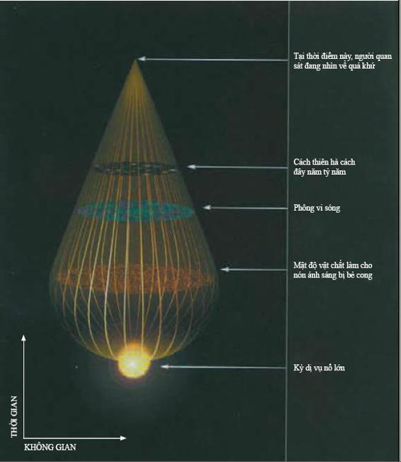    
    <figcaption>(Hình 2.8) THỜI GIAN CÓ HÌNH QUẢ LÊ</figcaption>
</figure>

_Nếu ta đi theo nón ánh sáng về quá khứ thì chiếc nón này bị bẻ cong do vật chất ở những giai đoạn rất sớm của vũ trụ. Toàn bộ vũ trụ mà chúng ta quan sát nằm trong một vùng mà biên của nó nhỏ lại bằng không tại thời điểm vụ nổ lớn. Đây có thể là một điểm kỳ dị, ở đó mật độ vật chất lớn vô hạn và thuyết tương đối cổ điển không còn đúng nữa._

Khi ta tiếp tục đi theo nón ánh sáng về quá khứ thì mật độ vật chất năng lượng dương sẽ làm cho các tia sáng bị bẻ cong vào với nhau mạnh hơn nữa. Mặt cắt của nón ánh sáng sẽ co lại về 0 tại một thời điểm hữu hạn. Điều này có nghĩa là tất cả vật chất trong nón ánh sáng quá khứ của chúng ta bị bẫy trong một vùng không thời gian mà biên của nó co lại về 0. Do đó, không ngạc nhiên khi Penrose và tôi có thể chứng minh bằng các mô hình toán học của thuyết tương đối rộng rằng thời gian cần phải có một thời điểm bắt đầu được gọi là vụ nổ lớn. Lý luận tương tự cho thấy thời gian cũng có điểm kết thúc khi các ngôi sao hoặc các thiên hà suy sập dưới lực hấp dẫn của bản thân chúng để tạo thành các hố đen. Bây giờ chúng ta phải quay lại một giả thuyết ngầm của Kant về sự tự mâu thuẫn của lý tính thuần túy mà theo đó thời gian là một thuộc tính của vũ trụ. Bài tiểu luận của chúng tôi chứng minh thời gian có một điểm khởi đầu đã đạt giải nhì trong một cuộc thi do Quỹ nghiên cứu về hấp dẫn tài trợ vào năm 1968. Roger và tôi cùng chia nhau số tiền thưởng 300 USD. Tôi không nghĩ rằng vào năm đó các bài luận đạt giải khác có giá trị lâu dài hơn bài của chúng tôi.

Đã có rất nhiều những phản ứng khác nhau về công trình của chúng tôi. Công trình của chúng tôi làm buồn lòng nhiều nhà vật lý, nhưng nó lại làm hài lòng các nhà lãnh đạo tôn giáo, những người tin vào hành vi sáng thế và cho đây là một minh chứng khoa học. Trong khi đó, Lifshitz và Khalatnikov đang ở trong một tình trạng rất khó xử. Họ không thể tranh luận với các định lý toán học mà chúng tôi đã chứng minh, nhưng dưới hệ thống Xô Viết họ không thể chấp nhận là họ đã sai và khoa học phương Tây đã đúng. Tuy vậy, họ đã thoát được tình trạng đó bằng cách tìm ra một họ nghiệm với một điểm kỳ dị tổng quát hơn, những nghiệm này cũng không đặc biệt hơn các nghiệm trước đó mà họ đã tìm ra. Điều này cho phép họ khẳng định các kỳ dị và sự khởi đầu hoặc kết thúc của thời gian là phát minh của những người Xô Viết.

Phần lớn các nhà vật lý đều cảm thấy không thích ý tưởng về sự khởi đầu và kết thúc của thời gian. Do đó, họ chỉ ra rằng các mô hình toán học sẽ không mô tả tốt không thời gian gần điểm điểm kỳ dị. Lý do là thuyết tương đối rộng mô tả lực hấp dẫn là một lý thuyết cổ điển và không tích hợp với nguyên lý bất định của lý thuyết lượng tử điểu khiển các lực khác mà chúng ta biết. Sự mâu thuẫn này không quan trọng đối với phần lớn vũ trụ và thời gian vì không thời gian bị bẻ cong trên một phạm vi rất lớn còn các hiệu ứng lượng tử chỉ quan trọng trên phạm vi rất nhỏ. Nhưng ở gần một điểm kỳ dị, hai phạm vi này gần bằng nhau và các hiệu ứng hấp dẫn lượng tử (quantum gravity) sẽ trở lên quan trọng. Do đó các định lý về điểm kỳ dị do Penrose và tôi thiết lập là vùng không thời gian cổ điển của chúng ta liên hệ với quá khứ và có thể là cả tương lai nữa bởi các vùng không thời gian mà ở đó hấp dẫn lượng tử đóng vai trò quan trọng. Để hiểu nguồn gốc và số phận của vũ trụ, chúng ta cần một lý thuyết lượng tử về hấp dẫn (quantum theory of gravity), và đây sẽ là chủ đề của phần lớn cuốn sách này.

<figure markdown="span">
    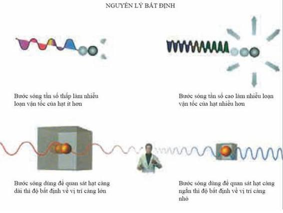\
    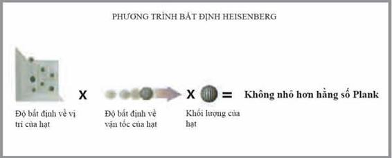
    <figcaption></figcaption>
</figure>

Một bước tiến quan trọng trong thuyết lượng tử là đề xuất của Max Plank vào năm 1900 là ánh sáng truyền đi với từng bó nhỏ gọi là lượng tử. Mặc dù giả thuyết lượng tử của Plank giải thích rất tốt tốc độ bức xạ của các vật nóng nhưng phải đến tận giữa những năm 1920 khi nhà vật lý người Đức Werner Heisenberg tìm ra nguyên lý bất định nổi tiếng của ông thì người ta mới nhận thấy hết ý nghĩa của nó. <mark>Theo Heisenberg thì giả thuyết của Plank ngụ ý rằng nếu ta muốn đo vị trí của hạt càng chính xác bao nhiêu thì phép đo vận tốc càng kém chính xác bấy nhiêu và ngược lại. Nói chính xác hơn, Heisenberg chứng minh rằng độ bất định về vị trí của hạt nhân với độ bất định về _moment_ của nó luôn lớn hơn hằng số Plank - một đại lượng liên hệ chặt chẽ với năng lượng của một lượng tử ánh sáng.</mark>

Lý thuyết lượng tử của các hệ như nguyên tử với một số lượng hữu hạn các hạt đã được xây dựng vào những năm 1920 do công của Heisenberg, Schrodinger, và Dirac _(Dirac cũng là một người từng giữ chế mà hiện nay tôi đang giữ, nhưng đó không phải là chiếc ghế tự động!)_. Mặc dù vậy, con người vẫn gặp khó khăn khi cố gắng mở rộng ý tưởng lượng tử vào trường điện, từ, và ánh sáng của Maxwell.

## TRƯỜNG MAXWELL
Năm 1865, nhà vật lý người Anh Clerk Maxwell đã kết hợp các định luật điện và từ đã biết. Lý thuyết của Maxwell dựa trên sự tồn tại của các “trường”, các trường truyền tác động từ nơi này đến nơi khác. Ông nhận thấy rằng các trường truyền nhiễu loạn điện và từ là các thực thể động: chúng có thể dao động và truyền trong không gian. Tổng hợp điện từ của Maxwell có thể gộp lại vào hai phương trình mô tả động học của các trường này. Chính ông cũng đi đến một kết luận tuyệt vời: tất cả các sóng điện từ với tất cả các tần số đều truyền trong không gian với một vận tốc không đổi - vận tốc ánh sáng. Ta có thể xem trường của Maxwell tạo thành từ các sóng với các bước sóng (khoảng cách giữa hai đỉnh sóng) khác nhau. Trong một sóng, trường đó sẽ dao động từ giá trị này đến giá trị khác giống như một con lắc. (hình 2.9)

<figure markdown="span">
    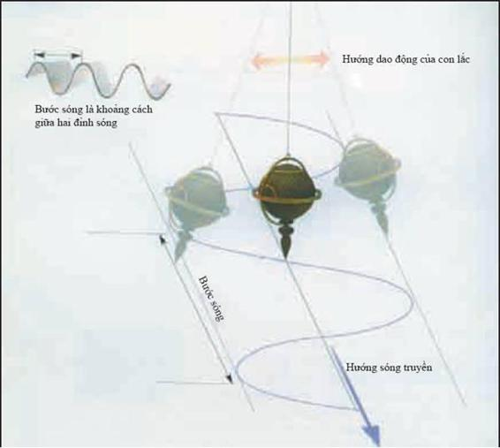    
    <figcaption>(Hình 2.9) SÓNG LAN TRUYỀN VỚI CON LẮC DAO ĐỘNG</figcaption>
</figure>

_Bức xạ điện từ lan truyền trong không gian giống như một sóng với điện trường và từ trường dao động giống như một con lắc và hướng truyền thì vuông góc với hướng chuyển động của sóng._

_Bức xạ cũng có thể được tạo thành từ nhiều trường với các bước sóng khác nhau._

Theo lý thuyết lượng tử, trạng thái cơ bản hay trạng thái năng lượng thấp nhất của con quay không chỉ là điểm năng lượng thấp nhất hướng thẳng từ trên xuống. Vị trí đó có vị trí và vận tốc xác định là bằng không. Điều này vi phạm nguyên lý loại trừ, nguyên lý không cho phép đo một cách chính xác vị trí và vận tốc tại một thời điểm. Độ bất định về vị trí nhân với độ bất định về _moment_ cần phải lớn hơn một đại lượng xác định được biết với cái tên là hằng số Plank - một con số nếu viết ra sẽ rất dài, do đó chúng ra dùng một biểu tượng cho nó: ħ.

Do đó, năng lượng của con quay ở trạng thái cơ bản hay trạng thái có năng lượng cực tiểu không phải bằng không như người ta trông đợi. Thay vào đó, ngay cả ở trạng thái cơ bản của nó, một con quay hay bất kỳ một hệ dao động nào cũng có một lượng năng lượng cực tiểu nhất định của cái mà ta gọi là thăng giáng điểm không (zero point fluctuation). Điều này có nghĩa là con quay không nhất thiết phải nằm theo hướng thẳng từ trên xuống mà nó sẽ làm với phương thẳng đứng một góc nhỏ với một xác xuất nhất định (hình 2.10). Tương tự như vậy, ngay cả trong chân không hoặc trạng thái năng lượng thấp nhất, các sóng trong trường Maxwell sẽ không bằng không mà có thể có một giá trị nhỏ nào đó. Tần số (số dao động trong một phút) của con quay hay sóng càng lớn thì năng lượng trạng thái cơ bản càng lớn.

<figure markdown="span">
        
    <figcaption>(Hình 2.10) CON LẮC VÀ PHÂN BỐ XÁC SUẤT</figcaption>
</figure>

_Theo nguyên lý bất định Heisenberg, con lắc không thể hướng thẳng đứng tuyệt đối từ trên xuống dưới với vận tốc bằng không được. Thay vào đó, cơ học lượng tử cho thấy rằng, ngay cả ở trạng thái năng lượng thấp nhất con lắc cũng có một lượng thăng giáng cực tiểu._

_Điều này có nghĩa là vị trí của con lắc sẽ được cho bởi một phân bố xác suất. Ở trạng thái cơ bản, trạng thái khả dĩ nhất là hướng thẳng từ trên xuống, nhưng cũng có xác suất tìm thấy con lắc làm một góc nhỏ với phương thẳng đứng._

Các tính toán thăng giáng trạng thái cơ bản trong trường Maxwell cho thấy khối lượng và điện tích biểu kiến của điện tử lớn vô cùng, điều này không phù hợp với các quan sát. Tuy vậy, vào những năm 1940, các nhà vật lý Richard Feynman, Julian Schwinger và Shinichiro Tomonaga đã phát triển một phương pháp chặt chẽ để loại bỏ giá trị vô hạn và thu được giá trị hữu hạn của khối lượng và điện tích giống như quan sát. Tuy nhiên, các thăng giáng trạng thái cơ bản vẫn gây các hiệu ứng nhỏ có thể đo được và phù hợp với thực nghiệm. Các sơ đồ loại trừ các giá trị lớn vô hạn tương tự cũng đúng đối với các trường Yang-Mills trong lý thuyết do Chen Ning Yang (Yang Chen Ning - Dương Chấn Ninh) và Robert Mills xây dựng. <mark>Lý thuyết Yang-Mills là mở rộng của lý thuyết Maxwell để mô tả tương tác của hai lực khác gọi là lực hạt nhân yếu và lực hạt nhân mạnh. Tuy vậy các thăng giáng trạng thái cơ bản có hiệu ứng đáng kể hơn trong lý thuyết lượng tử về hấp dẫn.</mark> Lại nữa, một bước sóng có một năng lượng trạng thái cơ bản. Vì bước sóng của trường Maxwell có thể nhỏ bao nhiêu cũng được nên có một số vô hạn các bước sóng khác nhau và một số vô hạn các năng lượng trạng thái cơ bản trong bất kỳ vùng nào của không thời gian. Vì mật độ năng lượng cũng giống như vật chất là nguồn gốc của hấp dẫn nên mật độ năng lượng vô hạn này có nghĩa là có đủ lực hút hấp dẫn trong vũ trụ để làm cong không thời gian thành một điểm mà điều đó rõ ràng là đã không xảy ra.

Người ta cũng có thể hy vọng giải quyết bài toán có vẻ mâu thuẫn giữa lý thuyết và thực nghiệm này bằng cách cho rằng các thăng giáng trạng thái cơ bản không có hiệu ứng hấp dẫn, nhưng giả thiết này không đúng. Người ta có thể ghi nhận năng lượng của thăng giáng trạng thái cơ bản bằng `hiệu ứng Casimir`. <mark>Nếu bạn đặt hai tấm kim loại song song với nhau và rất gần nhau thì sự có mặt của hai tấm kim loại sẽ làm giảm số các bước sóng có thể khớp giữa hai tấm kim loại so với số các bước sóng ở bên ngoài hai tấm một chút ít.</mark> Điều này có nghĩa là mật độ năng lượng của thăng giáng trạng thái cơ bản giữa hai tấm, mặc dù vẫn là vô hạn, vẫn nhỏ hơn mật độ năng lượng ở bên ngoài hai tấm một lượng hữu hạn (hình 2.11). Sự khác biệt về mật độ năng lượng này làm xuất hiện một lực kéo hai tấm kim loại vào với nhau và lực này đã được quan sát bằng thực nghiệm. Trong thuyết tương đối, giống như vật chất các lực gây cũng nên hấp dẫn, do đó, chúng ta không thể bỏ qua hiệu ứng hấp dẫn của sự khác biệt về năng lượng này.

<figure markdown="span">
    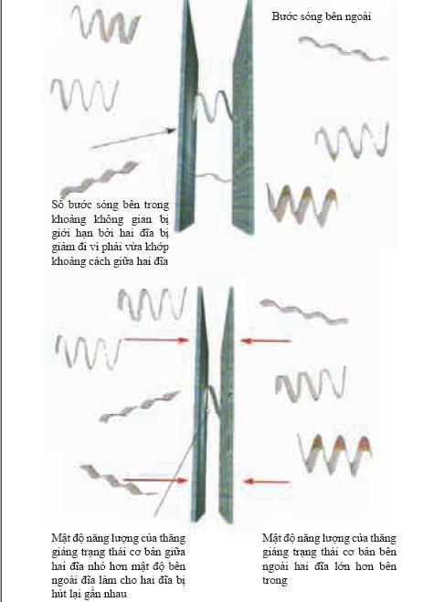
    <figcaption>(Hình 2.11) HIỆU ỨNG CASIMIR</figcaption>
</figure>

_Sự tồn tại của thăng giáng trạng thái cơ bản được khẳng định bằng thực nghiêm thông qua hiệu ứng Casimir về sự có mặt của một lực nhỏ giữa hai tấm kim loại song song._

Một nghiệm khác của bài toán mà có thể đòi hỏi có một `hằng số vũ trụ` giống như Einstein đã đưa ra để có được mô hình vũ trụ tĩnh. Nếu hằng số này có giá trị âm vô cùng thì nó có thể loại trừ chính xác giá trị dương vô cùng của năng lượng trạng thái cơ bản trong không gian tự do, nhưng hằng số này có vẻ như không được dự tính trước (ad hoc) và nó có thể được điều chỉnh một cách cực kỳ chính xác.

Thật may mắn, người ta đã phát hiện một loại đối xứng hoàn toàn mới vào những năm 1970, nó cung cấp một cơ chế vật lý tự nhiên để loại trừ các giá trị vô hạn xuất hiện từ thăng giáng trạng thái cơ bản. Siêu đối xứng là một đặc điểm của các mô hình toán học hiện đại của chúng ta mà có thể được mô tả theo nhiều cách. Một trong những cách đó nói rằng không thời gian có thêm các chiều khác bên cạnh các chiều mà chúng ta đang trải nhiệm. Những chiều này được gọi là những chiều Grassmann bởi vì chúng được đo bằng các con số được gọi là các biến số Grassmann chứ không phái là những con số thực bình thường. Các số bình thường giao hoán với nhau; tức là; bạn có thể nhân chúng theo một trật tự nào cũng được: 6 nhân với 4 cũng bằng 4 nhân với 6. Nhưng những biến Grassmann thì lại phản giao hoán (anticommute) với nhau: x nhân với y bằng -y nhân với x.

Lần đầu tiên, siêu đối xứng được nghiên cứu khi loại trừ các giá trị vô hạn trong các trường vật chất và trường Yan-Mills trong không thời gian ở đó cả các chiều số thực và các chiều Grassmann đều phẳng, không bị cong. Việc mở rộng siêu đối xứng vào các chiều số thực và chiều Grassmann khi các chiểu này bị uốn cong là một điều rất tự nhiên. Sự mở rộng này dẫn đến một số các lý thuyết được gọi là siêu hấp dẫn (supergravity) với số lượng các đối xứng khác nhau. Một hệ quả của siêu đối xứng là mỗi trường hoặc mỗi hạt đều có một siêu đối tác (superpartner) có spin lớn hơn hoặc nhỏ hơn spin của nó ½. (hình 2.12)

<figure markdown="span">
    \
    
    <figcaption>(Hình 2.12) SPIN</figcaption>
</figure>

- _Tất cả các hạt có một tính chất gọi là spin, tác dụng của spin là làm cho các hạt được thấy như nhìn từ các hướng khác nhau. Người ta có thể minh họa điều này bằng một bộ bài. Trước tiên hãy xem con át pích, nếu bạn quay đúng một vòng hay 360 độ thì bạn sẽ thấy nó giống như trước khi quay. Do đó, con át pích có spin bằng 1._
- _Ngược lại, con qui cơ có hai đầu. Nếu bạn quay một nửa vòng hay 180 độ bạn sẽ thấy nó giống như ban đầu. Con qui cơ có spin bằng hai. Tương tự, ta có thể tưởng tượng các vật thể có spin bằng 3 hoặc nhiều hơn nếu hình dáng của nó giống như ban đầu khi quay một phần nhỏ hơn của một vòng quay._
- _Spin càng cao thì góc quay để vật thể có hình dáng ban đầu càng nhỏ. Nhưng có một điều đáng chú ý là có các hạt mà hình dáng của chúng giống như ban đầu chỉ khi bạn quay đủ hai vòng. Người ta gọi những hạt như vậy có spin bằng 1/2._

Năng lượng trạng thái cơ bản của các hạt boson, trường có spin là một số nguyên (0, 1, 2, v.v.), là dương. Ngược lại năng lượng trạng thái cơ bản của các hạt fermion, trường có spin bán nguyên (1/2, 3/2, v.v.), là âm. Vì có một lượng lớn các hạt boson và fermion bằng nhau, các giá trị vô hạn lớn nhất triệt tiêu nhau trong các lý thuyết siêu hấp dẫn. (hình 2.13)

<figure markdown="span">
    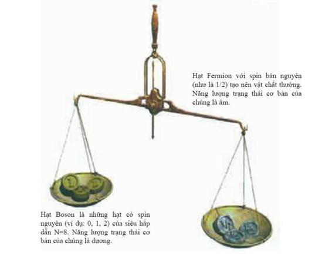    
    <figcaption>(Hình 2.13) SIÊU ĐỐI TÁC</figcaption>
</figure>

- _Tất cả các hạt trong vũ trụ đều thuộc một trong hai nhóm: Fermion hoặc Boson. Hạt Fermion là các hạt có spin bán nguyên (như là 1/2) tạo nên vật chất thường. Năng lượng trạng thái cơ bản của chúng là âm._
- _Hạt Boson là những hạt có spin nguyên (ví dụ: 0, 1, 2) làm tăng lực xuất hiện giữa các hạt Fermion như là lực hấp dẫn và ánh sáng chẳng hạn. Năng lượng trạng thái cơ bản của chúng là dương. Thuyết siêu hấp dẫn giả thuyết rằng tất cả các hạt Fermion và Boson đều có một siêu đối tác có spin lớn hơn hoặc nhỏ hơn spin của hạt đó 1/2. Ví dụ một photon (là hạt boson) có spin là 1, năng lượng trạng thái cơ bản là dương. Siêu đối tác của photon là photion có spin bằng 1/2 là một fermion. Do đó năng lượng trạng thái cơ bản là âm._
- _Trong sơ đồ siêu hấp dẫn này, chúng ta sẽ có số các hạt fermion và boson bằng nhau. Năng lượng trạng thái cơ bản của các hạt boson làm nghiêng cán cân về phía dương và năng lượng trạng thái cơ bản của các hạt fermion làm nghiêng cán cân về phía năng lượng âm, năng lượng trạng thái cơ bản sẽ triệt tiêu lẫn nhau và loại bỏ giá trị lớn vô hạn._

Vẫn còn lại xác xuất để có giá trị vô hạn mặc dù rất nhỏ nhưng vẫn tồn tại. Không ai có đủ sự kiên nhẫn cần thiết để tính toán xem các lý thuyết này có thực sự là hoàn toàn hữu hạn hay không. Người ta tính rằng đề làm điều đó một sinh viên giỏi phải mất 200 năm, và làm sao bạn có biết sinh viên đó không phạm phải sai lầm ngay ở trang thứ hai? Đến năm 1985, phần lớn mọi người vẫn tin rằng hầu hết các lý thuyết siêu hấp dẫn siêu đối xứng (supersymetric) không có chứa các giá trị vô hạn.

Sau đó thì đột nhiên mốt đó thay đổi. Người ta tuyên bố rằng không có lý do gì để không trông đợi các giá trị vô hạn trong các lý thuyết siêu hấp dẫn, điều này có ngụ ý rằng các lý thuyết siêu hấp dẫn đó cũng có các sai lầm chết người như các lý thuyết khác. Thay vào đó, người ta quả quyết rằng một lý thuyết được gọi là lý thuyết dây siêu đối xứng là cách duy nhất để kết hợp lý thuyết hấp dẫn và lý thuyết lượng tử. Các dây, giống như các dây trong kinh nghiệm hàng ngày, là các vật thể một chiều. Chúng chỉ có chiều dài. Các dây trong lý thuyết dây chuyển động trong không thời gian. Các sự dao động của dây thể hiện cho các hạt. (hình 2.14)

<figure markdown="span">
    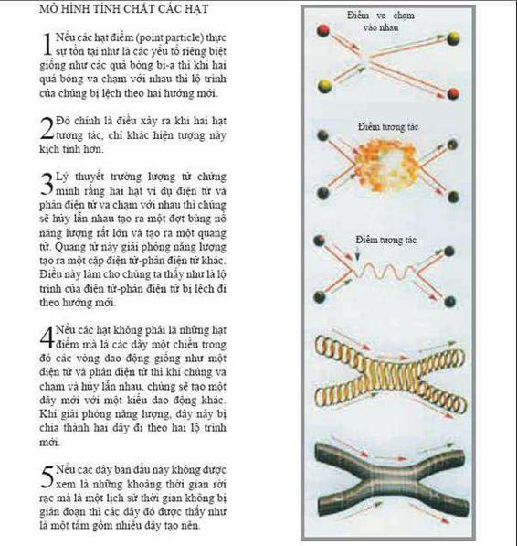    
    <figcaption>(Hình 2.14) DAO ĐỘNG CỦA DÂY</figcaption>
</figure>

- _Trong lý thuyết dây, các thực thể cơ bản không phải là các hạt chiếm một điểm trong không gian mà là các dây một chiều. Các dây này có các đầu khác nhau hoặc các đầu đó có thể nối với nhau để tạo thành các vòng dây._
- _Giống như các sợi dây của đàn violon, các dây trong lý thuyết dây có các kiểu dao động hoặc tần số cộng hưởng nhất định, bước sóng của các kiểu dao động này trùng khớp chính xác với khoảng cách giữa hai đầu dây._
- _Nhưng trong khi các tần số cộng hưởng của dây đàn khác nhau tạo nên các nốt nhạc khác nhau thì dao động cộng hưởng của một dây sẽ tạo ra khối lượng, lực khác nhau - những thực thể được giải thích là các hạt cơ bản. Nói nôm na là bước sóng dao động của dây càng nhỏ thì khối lượng của hạt càng lớn._

Nếu các dây này có các chiều Grassmann và các chiều số thường thì các dao động sẽ tương ứng với các hạt boson và fermion. Trong trường hợp này, năng lượng trạng thái cơ bản âm và dương triệt tiêu một cách chính xác đến nỗi sẽ hoàn toàn không có các giá trị vô hạn. Các siêu dây (`superstring`) được gọi là lý thuyết về mọi thứ (`theory of everything`).

Các nhà viết lịch sử khoa học trong tương lai sẽ thấy rất thú vị khi lập biểu đồ biểu diễn xu hướng thay đổi tư tưởng của các nhà vật lý lý thuyết. Chỉ trong vài năm, lý thuyết dây đã ngự trị tuyệt đối và thuyết siêu hấp dẫn bị giáng xuống thành một lý thuyết gần đúng, chỉ phù hợp ở năng lượng thấp. Đại lượng “năng lượng thấp” bị coi như một sự chê bai, dù là trong ngữ cảnh này các năng lượng thấp ngụ ý các hạt với năng lượng nhỏ hơn hàng tỷ tỷ lần so với các hạt trong một vụ nổ TNT. Nếu siêu hấp dẫn chỉ là một phép gần đúng năng lượng thấp thì nó không thể là lý thuyết cơ bản cho vũ trụ được. Mà thay vào đó, lý cơ bản được đề xuất có thể là một trong năm lý thuyết siêu dây. Nhưng lý thuyết nào trong năm lý thuyết siêu dây mô tả vũ trụ của chúng ta? Và thuyết dây sẽ được phát biểu như thế nào để vượt qua được phép gần đúng trong đó các dây được mô tả như là các mặt với một chiều không gian và một chiều thời gian dao động trong một phông không thời gian phẳng. Liệu các dây có làm cong phông không thời gian hay không?

Vào những năm sau 1985, người ta dần nhận thấy rằng, thuyết dây không phải là một bức tranh hoàn hảo. Khởi đầu là việc người ta nhận ra rằng các dây chỉ là một thành phần của một lớp các thực thể bao quát hơn, các thực thể này có thể được mở rộng vào nhiều hơn một chiều. Paul Townsend, một người cũng là thành viên của khoa Toán ứng dụng và Vật lý lý thuyết giống như tôi ở Đại học Cambridge, một người đã thực hiện nhiều công trình cơ bản về các thực thể này, đặt cho chúng một cái tên là các “màng-p” (p-brane). Một màng-p có chiều dài theo p hướng. Do đó, màng có p=1 là một dây, màng có p=2 là một mặt hay một màng bình thường, và v.v. (hình 2.15). Các màng với p=1 trong trường hợp của các dây có vẻ như không được ưu tiên hơn so với các giá trị có thể khác của p. Thay vào đó, chúng ta thông qua một nguyên tắc dân chủ cho các màng-p: tất cả các màng-p sinh ra đều có quyền bình đẳng.

<figure markdown="span">
    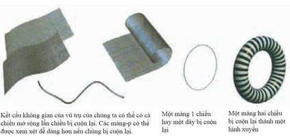\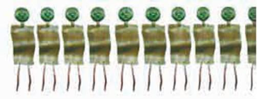    
    <figcaption>(Hình 2.15) MÀNG-P</figcaption>
</figure>

_Các màng-p là các thực thể kéo dài theo p chiều. Trường hợp đặc biệt là các dây với p=1 và các tấm với p=2, nhưng các giá trị khả dĩ của p có thể lớn hơn tới 10 hoặc 11 chiều. Nhưng thường thì một số hoặc tất cả p chiều đó bị cuộn lại giống như những vòng xuyến._

_Chúng ta tin một sự thật hiển nhiên là tất cả các màng-p sinh ra đều có quyền bình đẳng._

Tất cả các màng-p đều được tìm thấy là nghiệm của các phương trình trong thuyết siêu hấp dẫn với 10 hoặc 11 chiều. 10 hoặc 11 chiều có vẻ như không giống không thời gian mà chúng ta đang trải nghiệm nhưng ý tưởng là 6 hoặc 7 chiều trong số các chiều đó bị cuộn lại nhỏ đến nỗi ta không thể thấy chúng, chúng ta chỉ có thể nhận ra 4 chiều lớn và gần như phẳng còn lại mà thôi.

Với tư cách cá nhân mà nói, tôi rất miễn cưỡng khi tin vào các chiều bổ sung. Nhưng vì tôi là một người theo chủ nghĩa thực chứng nên câu hỏi “Các chiều bố sung có thực sự tồn tại hay không?” không có ý nghĩa gì cả. Tất cả những điều mà người ta có thể hỏi đó là mô hình toán học với các chiều bổ sung đó có mô tả tốt vũ trụ của chúng ta hay không. Chúng ta vẫn chưa có quan sát nào mà để giải thích nó người ta cần đến các chiều bổ sung. Tuy vậy, chúng ta có thể có cơ hội quan sát chúng trong máy va chạm Hadron (Large Hadron Collider) ở Geneva. Nhưng điều đã thuyết phục nhiều người trong đó có tôi nghiêm túc chọn các mô hình với các chiều bố sung là có một mớ các mối liên hệ không ngờ được gọi là tính đối ngẫu (duality) giữa các mô hình. Tính đối ngẫu này cho thấy rằng tất cả các mô hình đều tương đương; tức là, chúng chỉ là những khía cạnh khác nhau của cùng một lý thuyết cơ bản được gọi với cái tên là thuyết-M (M-theory). Nếu không lấy tính đối ngẫu làm dấu hiệu cho thấy chúng ta đi đúng hướng thì điều đó cũng gần giống như cho rằng Chúa đã đặt các hóa thạch vào trong đá để làm Darwin nhầm lẫn về sự tiến hóa của cuộc sống.

<figure markdown="span">
    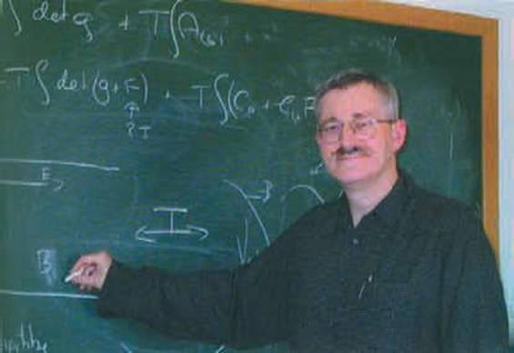
    <figcaption>Paul Townsend, chuyên gia về màng-p</figcaption>
</figure>

Tính đối ngẫu cho thấy rằng cả 5 lý thuyết siêu dây đều mô tả các bản chất vật lý giống nhau và chúng cho thấy rằng về mặt vật lý chúng cũng tương đương với lý thuyết siêu hấp dẫn (hình 2.16). Ta không thể nói rằng các siêu dây cơ bản hơn siêu hấp dẫn hoặc ngược lại. Đúng hơn, chúng chỉ là những biểu diễn khác nhau của cùng một lý thuyết cơ bản, mỗi lý thuyết đều tính toán một cách hiệu quả trong các tình huống khác nhau. Vì các lý thuyết dây không có chứa các giá trị vô hạn, chúng được dùng để tính các kết quả có thể xảy ra khi một số ít các hạt năng lượng cao va chạm và tán xạ với nhau. Tuy vậy chúng không hay được sử dụng để mô tả năng lượng của một số lớn các hạt làm cong vũ trụ như thể nào hoặc hình thành các trạng thái bị trói buộc (bound state), giống như một hố đen, ra sao. Với các trường hợp này, người ta cần đến thuyết siêu hấp dẫn, về cơ bản lý thuyết này dựa trên lý thuyết Einstein về không thời gian cong với một số loại vật chất bổ sung.

Đây chính là bức tranh tôi sẽ dùng chủ yếu trong các phần sau.

<figure markdown="span">
    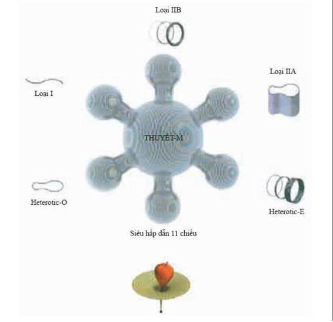    
    <figcaption>(Hình 2.16) MÔ HÌNH THỐNG NHẤT</figcaption>
</figure>

- _Có một mạng lưới các mối liên hệ được gọi là tính đối ngẫu kết nối năm lý thuyết dây và siêu hấp dẫn mười một chiều. Tính đối ngẫu cho thấy rằng các lý thuyết dây khác nhau chỉ là những biểu diễn khác nhau của một lý thuyết cơ bản được gọi là thuyết-M._
- _Trước thập niên 90 người ta cho rằng 5 lý thuyết dây là các lý thuyết riêng biệt và hoàn toàn không liên hệ với nhau. Thuyết-M thống nhất 5 lý thuyết dây vào một mô hình lý thuyết duy nhất, nhưng người ta vẫn chưa hiểu rất nhiều tính chất của mô hình này._

Có một mạng lưới các mối liên hệ được gọi là tính đối ngẫu kết nối năm lý thuyết dây và siêu hấp dẫn mười một chiều. Tính đối ngẫu cho thấy rằng các lý thuyết dây khác nhau chỉ là những biểu diễn khác nhau của một lý thuyết cơ bản được gọi là thuyết-M.

Trước thập niên 90 người ta cho rằng 5 lý thuyết dây là các lý thuyết riêng biệt và hoàn toàn không liên hệ với nhau. Thuyết-M thống nhất 5 lý thuyết dây vào một mô hình lý thuyết duy nhất, nhưng người ta vẫn chưa hiểu rất nhiều tính chất của mô hình này.

<figure markdown="span">
    
    <figcaption>Thuyết-M thống nhất 5 lý thuyết dây thành một lý thuyết cơ bản duy nhất, nhưng người ta vẫn chưa hiểu rất nhiều tính chất của lý thuyết này.</figcaption>
</figure>

Để mô tả lý thuyết lượng tử tạo hình dáng cho không thời gian như thế nào, việc đưa ý tưởng thời gian ảo sẽ rất hiệu quả. Thời gian ảo nghe có vẻ như một cái gì đó đến từ những câu chuyện viễn tưởng khoa học, nhưng nó là một khái niệm toán học được định nghĩa rất rõ ràng: thời gian được đo bằng các số mà ta gọi là các số ảo. Ta có thể nghĩ về các số thực bình thường như các số 1, 2, -3,5, v. v. tương ứng với các vị trí trên một đường thẳng kéo dài từ trái sang phải: điểm 0 ở giữa, các số thực dương nằm ở bên phải và các số thực âm nằm ở bên trái. (hình 2.17)

<figure markdown="span">
    
    <figcaption>(Hình 2.17) Ta có thể xây dựng một mô hình trong đó trục thời gian ảo nằm vuông góc với trục thời gian thực. Các qui tắc của mô hình này sẽ xác định lịch sử thời gian ảo dựa theo thời gian thực và ngược lại.</figcaption>
</figure>

Các số ảo có thể được biểu diễn là các vị trí nằm trên một đường thẳng vuông góc: điểm 0 vẫn nằm ở giữa, các số ảo dương nằm ở phía trên và các số ảo âm được vẽ ở phía dưới. Do đó, các số ảo có thể được coi như một loại số mới nằm vuông góc với các số thực bình thường. Vì chúng là các thành phần toán học nên chúng không cần phải tương ứng với thực tại vật lý nào; chúng ta không thể có một số ảo các quả cam hoặc một hóa đơn điện thoại ảo được. (hình 2.18)

<figure markdown="span">
    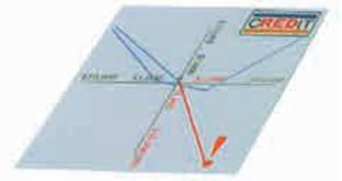
    <figcaption>(Hình 2.18) Số ảo là một khái niệm toán học. Bạn không thể có một hóa đơn thẻ tín dụng ảo.</figcaption>
</figure>

Người ta có thể nghĩ điều này ngụ ý rằng các số ảo chỉ là một trò chơi toán học mà chẳng có gì liên quan đến thực tại. Tuy vậy, trên quan điểm triết học thực chứng, người ta không thể định nghĩa thực tại là gì. Tất cả những điều mà người ta có thể làm là tìm ra mô hình toán học nào là mô hình mô tả vũ trụ mà chúng ta đang sống. Hóa ra là một mô hình toán học có chứa thời gian ảo không chỉ tiên đoán các hiệu ứng mà chúng ta đã quan sát được mà còn tiên đoán cả những hiệu ứng mà chúng ta vẫn chưa thể đo được. Tuy chưa đo được nhưng vì các lý do khác mà chúng ta vẫn tin vào các hiệu ứng đó. Vậy thì thực tại là gì và ảo ảnh là gì? Liệu sự khác biệt giữa chúng chỉ có ở trong đầu óc của chúng ta hay không?

Lý thuyết tương đối rộng cổ điển (tức là không có tính lượng tử) của Einstein đã kết hợp thời gian thực và ba chiều khác của không gian thành một không thời gian bốn chiều. Nhưng chiều thời gian thực vẫn khác biệt với ba chiều của không gian. Vũ trụ tuyến (world line) hay lịch sử của người quan sát luôn tăng theo thời gian thực (tức là thời gian luôn chuyển động từ quá khứ đến tương lai), nhưng vũ trụ tuyến lại có thể tăng hoặc giảm theo bất kỳ chiều nào của không gian. Nói cách khác, người ta chỉ có thể quay ngược lại trong không gian chứ không thể quay ngược lại trong thời gian. (hình 2.19)

<figure markdown="span">
    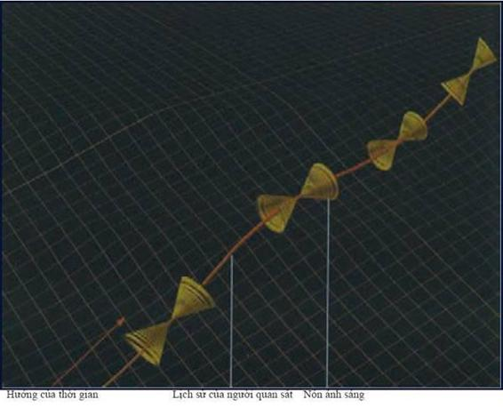
    <figcaption>(Hình 2.19) Trong không thời gian của thuyết tương đối rộng cổ điển, thời gian khác biệt với các hướng của không gian vì nó chỉ tăng theo lịch sử của người quan sát chứ không giống như các chiều của không gian có thể tăng hoặc giảm theo lịch sử đó. Ngược lại, hướng của thời gian ảo giống như một trục không gian, có thể tăng hoặc giảm.</figcaption>
</figure>

Mặt khác, vì thời gian ảo vuông góc với thời gian thực, nên thời gian hành xử như một trục không gian thứ tư. Do vậy, thời gian này có rất nhiều sự kiện có thể xảy ra hơn đường ray xe lửa của thời gian thực (thời gian thực chỉ có một điểm khởi đầu hoặc kết thúc hoặc đi thành các đường vòng). Với ý nghĩa ảo này, thời gian có một hình dáng.

Để thấy các sự kiện có thể xảy ra, hãy coi không thời gian ảo như một quả cầu, giống như bề mặt trái đất. Giả thiết rằng thời gian ảo là độ của các đường vĩ tuyến (hình 2.20). Khi ấy lịch sử của vũ trụ trong thời gian ảo sẽ bắt đầu tại Nam Cực. Câu hỏi “Cái gì đã xảy ra trước khi vũ trụ hình thành?” sẽ trở nên vô nghĩa. Đơn giản là thời gian trước khi vũ trụ hình thành không được định nghĩa, giống như không có điểm nào nằm ở phía nam của Nam Cực. Nam Cực là một điểm hoàn toàn bình thường trên bề mặt trái đất, và các định luật khoa học cũng đúng ở Nam Cực giống như đúng ở các điểm khác trên trái đất. Điều này gợi ý rằng sự khởi đầu của vũ trụ trong thời gian ảo có thể là một điểm bình thường của không thời gian, và nó cũng gợi ý rằng các định luật khoa học cũng đúng tại điểm khởi đầu của thời gian giống như tại các thời điểm khác của vũ trụ (nguồn gốc lượng tử và sự tiến hóa của vũ trụ sẽ được thảo luận trong chương sau).

<figure markdown="span">
    
    <figcaption>(Hình 2.20) THỜI GIAN ẢO</figcaption>
</figure>

_Không thời gian ảo là một hình cầu, trong đó, hướng thời gian ảo được biểu diễn là khoảng cách từ cực nam. Nếu ta đi về hướng bắc thì các vĩ tuyến (những điểm nằm trên đó cách đều cực nam) sẽ lớn dần tương đương với vũ trụ giãn nở trong thời gian ảo._

_Vũ trụ sẽ đạt kích thước cực đại tại xích đạo và sau đó nếu ta tiếp tục tăng thời gian ảo thì vũ trụ sẽ co lại cho đến kích thước bằng không tại cực bắc. Mặc dù kích thước của vũ trụ bằng không tại các cực, nhưng những điểm này không phải là những điểm kỳ dị, cũng giống như bắc cực và nam cực của trái đất là những điểm hoàn toàn bình thường. Điều này gợi ý rằng, nguồn gốc của vũ trụ trong thời gian ảo có thể là những điểm bình thường trong không thời gian._

<figure markdown="span">
    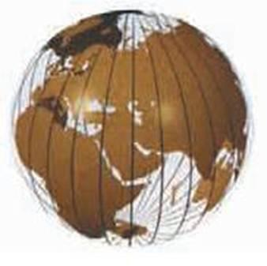
    <figcaption>(Hình 2.21)</figcaption>
</figure>

_Thay cho vĩ độ, ta có thể tưởng tượng hướng thời gian ảo trong hình cầu không thời gian giống như các kinh độ. Vì tất cả các đường kinh tuyến đều gặp nhau tại cực bắc và cực nam nên thời gian sẽ dừng tại các cực, nếu ta muốn tăng thời gian ảo tại đó thì ta đứng yên tại chỗ, giống như ta đứng ở bắc cực của trái đất và đi về hướng tây thì ta vẫn sẽ ở nguyên chỗ đó._

Ta có thể thấy một sự kiện khác có thể xảy ra khi coi thời gian ảo là độ của các đường kinh tuyến trên trái đất. Tất cả các đường kinh tuyến đều gặp nhau ở Bắc Cực và Nam Cực (hình 2.21). Do đó, tại các cực, thời gian sẽ dừng nếu ta coi thời gian ảo trôi tương tự như độ của các kinh tuyến tăng lên. Hình dung một người đứng ở một trong hai cực và đi về hướng đông hoặc hướng tây (theo hướng kinh tuyến tăng) thì anh ta sẽ tự quay quanh mình và đứng yên một chỗ. Điều này tương tự như cách mà thời gian thực dừng lại ở chân trời của hố đen. Chúng ta cần nhận thấy rằng sự dừng lại của thời gian thực và ảo (hoặc cả thời gian thực và ảo cùng dừng, hoặc không có thời gian nào dừng) có nghĩa là không thời gian có một nhiệt độ, giống như tôi đã phát hiện ra điều đó cho hố đen. Hố đen không chỉ có nhiệt độ mà nó còn hành xử như là nó có một đại lượng gọi là entropy. Entropy đo số các trạng thái nội (số các cách mà bên trong hố đen được định hình) mà hố đen có thể có. Một người quan sát bên ngoài không nhận thấy có sự khác biệt nào về số các trạng thái nội này của hố đen. Người quan sát này chỉ có thể quan sát được khối lượng, sự quay và điện tích của hố đen mà thôi. Entropy của hố đen này được cho bởi một công thức rất đơn giản mà tôi dã tìm ra vào năm 1974. Nó tỷ lệ với diện tích của chân trời của hố đen: có một chút thông tin về trạng thái nội của hố đen đối với mỗi đơn vị diện tích cơ bản của chân trời. Điều này cho thấy rằng có một mối quan hệ sâu sắc giữa hấp dẫn lượng tử và nhiệt động học - một môn khoa học về nhiệt (môn này có nghiên cứu về entropy). Nó cũng gợi ý rằng hấp dẫn lượng tử có thể cho biết một cái mà người ta gọi là phương pháp chụp ảnh ba chiều (`holography`). (hình 2.22)

<figure markdown="span">
        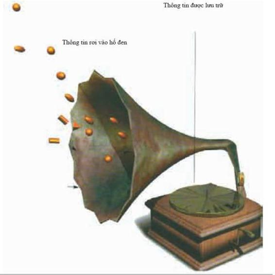
    <figcaption>Công thức diện tích entropy - hay là số các trạng thái nộicủa một hố đen gợi ý rằng thông tin bị rơi vào trong một hốđen có thể được lưu trữ trong đó giống như một máy ghiâm và được phục hồi khi hố đen bay hơi.</figcaption>
</figure>

- ___S___ = Akc3/4hG

Công thức tính Entropy của hố đen:

- ___A___: diện tích chân trời sự kiện của hố đen
- ___h___: hằng số Plank
- ___k___: hằng số Boltzman
- ___G___: hằng số hấp dẫn Newton
- ___c___: vận tốc ánh sáng
- ___S___: entropy

<figure markdown="span">
    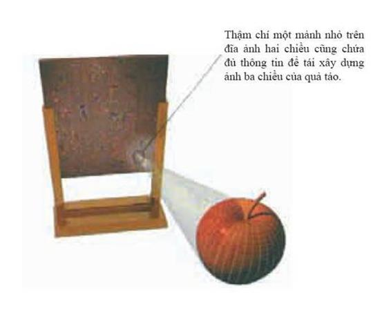
    <figcaption>NGUYÊN LÝ ẢNH ĐA CHIỀU</figcaption>
</figure>

_Người ta thấy rằng diện tích bề mặt chân trời bao xung quanh hố đen là một phép đo entropy của hố đen. Điều này làm cho người ta giả thiết rằng entropy cực đại của bất kỳ vùng không gian đóng nào cũng không thể vượt quá một phần tư diện tích bề mặt giới hạn vùng không gian đó. Vì entropy không là gì khác hơn là phép đo thông tin toàn phần có trong hệ, do đó, thông tin liên quan đến tất cả mọi hiện tượng trong thế giới ba chiều có thể được lưu trữ trên biên hai chiều của nó giống như một bức ảnh đa chiều. Theo một ý nghĩa nhất định, thế giới có thể là hai chiều._

<figure markdown="span">
    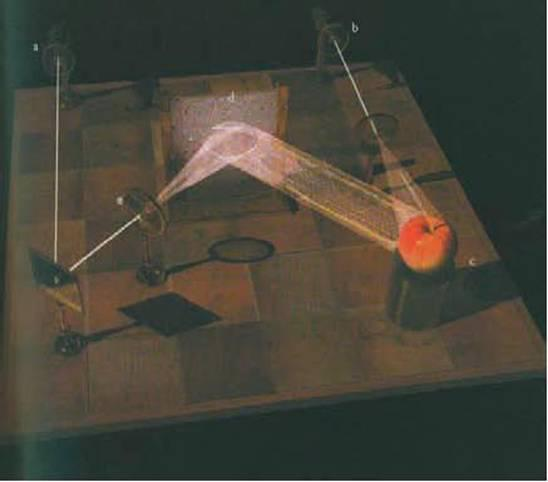
    <figcaption>(Hình 2.22)</figcaption>
</figure>

- _Về nguyên tắc, ảnh đa chiều là một hiện tượng giao thoa của các loại sóng. Ảnh được tạo ra khi ánh sáng từ một chùm laser đơn bị tách thành hai chùm (a) và (b). Chùm (b) đập vào vật thể (c) và phản xạ lên đĩa nhạy ánh sáng (d). Chùm (a) sẽ đi qua một thấu kính (e) và chạm vào ánh sáng phản xạ (b) tạo ra vân giao thoa trên đĩa._
- _Khi một chùm laser được chiếu qua đĩa thì người ta thu được hình ảnh ba chiều đầy đủ của vật thể. Một nhà quan sát có thể nghiên cứu bức ảnh đa chiều này và có thể nhìn thấy những mặt mà những bức ảnh thường không thể cho thấy được._
- _Bề mặt hai chiều của đĩa bên trái, không giống như một bức ảnh bình thường, có một tính chất đáng chú ý là bất kỳ một phần nhỏ nào trên bề mặt của nó đều chứa tất cả các thông tin cần thiết để tái cấu trúc toàn bộ hình ảnh._

Vì một lý do nào đó mà thông tin về các trạng thái lượng tử trong một vùng không thời gian có thể được mã hóa ở biên của vùng không thời gian đó. Số chiều ở biên của không thời gian ít hơn hai chiều so với vùng bên trong. Điều này giống như việc chụp ảnh ba chiều trên một mặt phẳng hai chiều. Nếu hấp dẫn lượng tử kết hợp chẽ với nguyên lý chụp ảnh ba chiều thì điều này có thể cho phép ta theo dõi các sự kiện bên trong hố đen. Việc chúng ta có thể tiên đoán bức xạ thoát ra khỏi hố đen hay không là điều rất quan trọng. Nếu ta không làm được điều đó thì chúng ta không thể tiên đoán được tương lai một cách đầy đủ như chúng ta đã nghĩ. Vấn đề này sẽ được thảo luận trong chương 4. Kỹ thuật chụp ảnh ba chiều sẽ được bàn luận lại trong chương 7. Dường như là chúng ta đang sống trong một một màng-3 chiều (3-brane) - đó là một mặt bốn chiều (ba chiều không gian và một chiều thời gian). Mặt bốn chiều này lại là biên của một vùng năm chiều với chiều còn lại bị cuộn lại rất nhỏ. Trạng thái của vũ trụ trên một màng sẽ giải mã những sự kiện xảy ra trong một vùng năm chiều.