# CHƯƠNG 5 - BẢO VỆ QUÁ KHỨ

<figure markdown="span">
    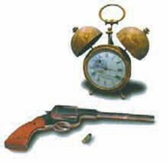\
    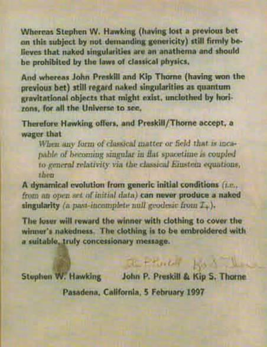\
    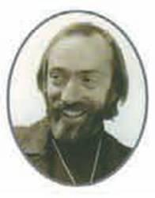
    <figcaption>Liệu có thể du hành thời gian được không?</figcaption>
    <figcaption>Một nền văn minh tiên tiến có thể quay lại và thay đổi quá khứ được không?</figcaption>
    <figcaption>Kip Thorne</figcaption>
</figure>

Tôi đã đánh cuộc nhiều lần với một người bạn và là một người đồng nghiệp của tôi Kip Thorne, anh không phải là một người theo xu hướng được chấp nhận trong vật lý chỉ vì những người khác chấp nhận. Điều này làm cho anh có can đảm trở thành nhà khoa học nghiêm túc đầu tiên nghiên cứu về du hành thời gian như là một khả năng hiện thực.

<figure markdown="span">
    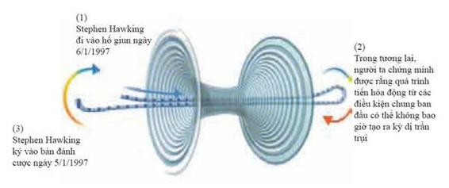    
    <figcaption></figcaption>
</figure>

Nghiên cứu công khai về du hành thời gian đòi hỏi phải rất khéo léo. Ta có nguy cơ vấp phải, hoặc là, sự phản đối kịch liệt về việc lãng phí tiền công vào những thứ vô bổ, hoặc là, yêu cầu việc nghiên cứu phải được xếp vào mục tiêu quân sự. Sau hết là làm thế nào mà chúng ta có thể tự bảo vệ khỏi những người có chiếc máy thời gian? Họ có thể thay đổi lịch sử và điều khiển thế giới. Chỉ có vài người trong chúng ta đủ điên rồ để nghiên cứu về một vấn đề quá không đứng đắn về mặt chính trị như thế trong thế giới vật lý. Chúng ta che đậy thực tế này bằng các thuật ngữ khoa học để mã hóa cho việc du hành thời gian.

<figure markdown="span">
    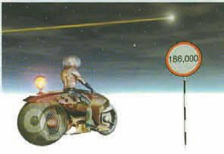
    <figcaption></figcaption>
</figure>

Cơ sở cho tất cả thảo luận về du hành thời gian đó là thuyết tương đối rộng của Einstein. Như chúng ta đã thấy trong các chương trước, các phương trình Einstein đã làm cho không gian và thời gian trở nên động bằng việc mô tả cách mà chúng bị cong và biến dạng bởi vật chất và năng lượng trong vũ trụ. Trong thuyết tương đối rộng, thời gian cá nhân của một người nào đó được đo bởi đồng hồ đeo tay của họ và thời gian đó luôn tăng giống như việc thời gian tăng trong lý thuyết Newton hay không thời gian phẳng trong thuyết tương đối hẹp. Nhưng bây giờ có khả năng không thời gian bị bẻ cong đến nỗi bạn không thể thoát ra khỏi phi thuyền và trở lại trước khi bạn được gửi đi (hình 5.1).

<figure markdown="span">
    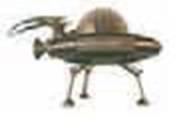\
    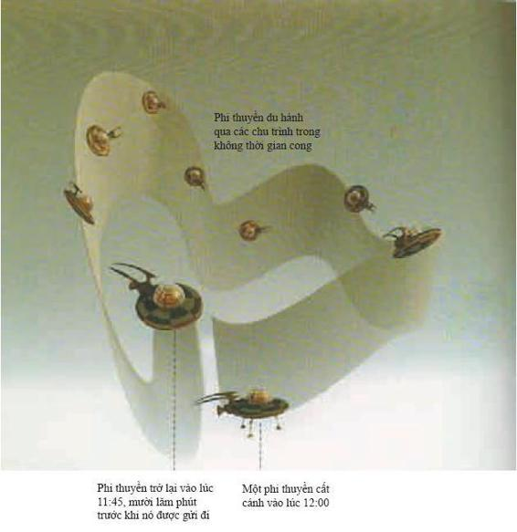
    <figcaption>(Hình 5.1)</figcaption>
</figure>

Có một cách để điều này có thể xảy ra nếu có các hố giun - các đường ống của không thời gian được nhắc đến trong chương 4 - nối các vùng khác nhau của không gian và thời gian. Ý tưởng là bạn lái phi thuyền của bạn vào một miệng của hố giun và đi ra miệng kia đến một nơi khác và tại thời điểm khác (hình 5.2).

<figure markdown="span">
    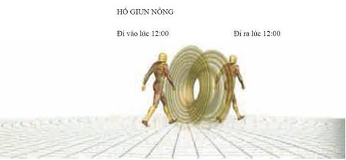\
    
    <figcaption>(Hình 5.2)</figcaption>
    <figcaption>PHIÊN BẢN THỨ HAI CỦA NGHỊCH LÝ ANH EM SINH ĐÔI</figcaption>
</figure>

- _(1) Nếu một hố giun nông, bạn có thể đi vào hố giun và đi ra cùng một thời điểm._
- _(2) Ta có thể hình dung lấy một đầu của hố giun sâu đặt ở phi thuyền và đầu kia ở trái đất._
- _(3) Vì hiệu ứng nghịch lý anh em sinh đôi (*thời gian ở trên phi thuyền đang chuyển động với vận tốc lớn sẽ chậm hơn thời gian ở trên trái đất - ND*), khi chiếc phi thuyền trở lại, thời gian trôi đi ở đầu phi thuyền chậm hơn thời gian ở đầu trái đất. Điều đó có nghĩa là nếu bạn bước vào đầu trái đất và bước ra đầu phi thuyền tại thời điểm sớm hơn._

Nếu các hố giun tồn tại thì chúng sẽ là lời giải cho vấn đề giới hạn tốc độ trong không gian: phải mất mười ngàn năm để đi ngang qua thiên hà bằng một phi thuyền chuyển động chậm hơn ánh sáng như yêu cầu của thuyết tương đối. Nhưng bạn có thể đi qua hố giun để đến lề bên kia của thiên hà và trở lại đúng vào bữa tối. Tuy nhiên, nếu ta chứng minh rằng hố giun tồn tại thì bạn cũng có thể để quay lại trước khi bạn được gửi đi. Vậy nên, bạn có thể nghĩ rằng bạn có khả năng làm điều gì đó như là cho nổ tên lửa trên bệ phóng để tránh không phải lên đường ở vị trí đầu tiên. Đây là một biến đổi của nghịch lý người ông (grandfather paradox): điều gì sẽ xảy ra nếu bạn quay trở lại và giết ông bạn trước khi bố bạn ra đời (hình 5.3)?

<figure markdown="span">
    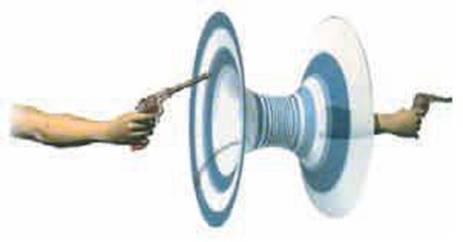    
    <figcaption>(Hình 5.3) Một viên đạn bắn vào quá khứ qua một hố giun có ảnh hưởng đến xạ thủ hay không?</figcaption>
</figure>

Tất nhiên, đây chỉ là nghịch lý nếu bạn tin rằng bạn có ý chí tự do để làm điều bạn muốn khi bạn quay trở lại quá khứ. Cuốn sách này sẽ không đi vào thảo luận triết học về ý chí tự do. Mà thay vào đó, cuốn sách sẽ tập trung vào việc các định luật vật lý có cho phép không thời gian bị bẻ cong đến mức mà các vật thể vĩ mô như là một chiếc phi thuyền có thể quay trở lại quá khứ của chính nó được hay không. Theo lý thuyết Einstein, một chiếc phi thuyền cần phải chuyển động chậm hơn vận tốc ánh sáng địa phương và đi theo một cái gọi là lộ trình thời gian (timelike path) trong không thời gian. Do đó, ta có thể phát biểu câu hỏi trên bằng các thuật ngữ chuyên môn: không thời gian có chấp nhận các đường cong thời gian đóng (closed timelike curve) hay không - tức là các lộ trình trở lại điểm xuất phát của nó nhiều lần? Tôi sẽ gọi những đường như thế là “chu trình thời gian” (time loop).

Chúng ta có thể cố gắng trả lời câu hỏi này theo ba mức độ. Mức độ thứ nhất là lý thuyết tương đối rộng của Einstein, lý thuyết cho rằng vũ trụ có một lịch sử tất định mà không có bất kỳ độ bất định nào. Đối với lý thuyết cổ điển này, chúng ta có một bức tranh khá hoàn thiện. Tuy nhiên, như chúng ta đã thấy, lý thuyết này không thể đúng hoàn toàn vì chúng ta thấy vật chất tuân theo nguyên lý bất định và các thăng giáng lượng tử. Do đó, chúng ta có thể đặt câu hỏi về du hành thời gian trên một mức độ thứ hai, mức độ của lý thuyết bán cổ điển. Trong lý thuyết này, chúng ta xem xét vật chất hành xử theo thuyết lượng tử, với tính bất định và thăng giáng lượng tử, nhưng không thời gian hoàn toàn tất định và cổ điển. Ở đây, bức tranh kém hoàn thiện hơn, nhưng ít nhất chúng ta có một vài ý tưởng về việc sẽ tiếp tục như thế nào.

Cuối cùng, có một lý thuyết lượng tử hấp dẫn đầy đủ, dù nó có thể là gì đi chăng nữa. Trong lý thuyết này, không chỉ có vật chất mà cả không gian và thời gian đều bất định và thăng giáng, ngay cả việc làm thế nào để đặt ra câu hỏi là du hành thời gian có khả thi hay không vẫn còn chưa rõ ràng. Có lẽ điều tốt nhất chúng ta có thể làm là hỏi xem những người trong các vùng không thời gian gần cổ điển và không có tính bất định giải thích các phép đo của họ như thế nào. Họ có nghĩ rằng du hành thời gian có thể xảy ra trong những vùng hấp dẫn mạnh và thăng giáng lượng tử lớn hay không?

Để bắt đầu với lý thuyết cổ điển: không thời gian phẳng của thuyết tương đối hẹp (tương đối không có hấp dẫn) không cho phép du hành thời gian và cũng không cho phép không thời gian bị bẻ cong mà ta đã biết trước đây. Chính vì thế mà Einstein rất sửng sốt khi Kurt Godel phát hiện ra một không thời gian - một vũ trụ tràn đầy vật chất đang quay với các chu trình thời gian xuyên qua tại mỗi điểm (hình 5.4) - định lý Godel.

<figure markdown="span">
    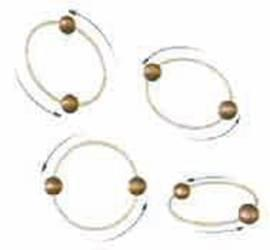    
    <figcaption>(Hình 5.4) Không thời gian có được phép đóng, tức là trở lại điểm xuất phát ban đầu của chúng nhiều lần hay không?</figcaption>
    <figcaption>ĐỊNH LÝ KHÔNG ĐỦ CỦA GODEL</figcaption>
</figure>

_Vào năm 1931, nhà toán học Kurt Godel chứng minh định lý không đủ nổi tiếng của ông về bản chất của toán học. Định lý phát biểu rằng trong bất kỳ một hệ tiên đề hình thức nào, giống như toán học ngày nay, các câu hỏi về việc chứng minh hoặc bác bỏ các tiên đề xác định các hệ, luôn luôn tồn tại. Nói cách khác là Godel đã chứng minh rằng luôn tồn tại những bài toán không thể giải bằng bất kỳ tập hợp các quy tắc hoặc quá trình._

_Định lý Godel đặt giới hạn cho toán học. Điều này đã gây sửng sốt cho giới khoa học vì nó đã đạp đổ niềm tin bấy lâu cho rằng toán học là một hệ thống chặt chẽ và hoàn thiện dựa trên các chuyên tắc _logic_._

_Định lý Godel, nguyên lý bất định Heisenberg và việc không thể tiên đoán sự tiến hóa ngay cả ở trong các hệ quyết định luận (trở thành hỗn loạn) tạo nên một tập hợp các giới hạn cho tri thức khoa học, điều đó chỉ có thể được nhận thấy vào thế kỷ hai mươi._

Lời giải Godel cần một hằng số vũ trụ, hằng số đó có thể hoặc không thể tồn tại trong tự nhiên, nhưng rồi các lời giải khác được tìm thấy mà không cần một hằng số vũ trụ. Một trường hợp đặc biệt lý thú là trường hợp khi hai dây vũ trụ (cosmic string) chuyển động với tốc độ cao đi qua nhau.

DÂY VŨ TRỤ

_Các dây vũ trụ là các vật thể dài, nặng và có thiết diện rất nhỏ. Các dây này có lẽ được tạo ra tại các thời kỳ sơ khai của vũ trụ. Một khi các dây được hình thành, chúng bị kéo dài ra do vũ trụ giãn nở, và bây giờ, một dây vũ trụ có thể kéo dài theo toàn bộ vùng vũ trụ có thể quan sát._

_Sự xuất hiện của các dây vũ trụ đến từ các lý thuyết mới về hạt cơ bản. Chúng tiên đoán rằng, tại các giai đoạn ban đầu nóng bỏng, vật chất ở trong một pha đối xứng, rất giống nước ở trạng thái lỏng - rất đối xứng: giống nhau tại mọi điểm và theo mọi hướng - chứ không giống trong tinh thể nước đóng băng có các cấu trúc rời rạc._

_Khi vũ trụ lạnh đi, tính đối xứng của pha ban đầu này có thể đã bị phá vỡ theo các cách khác nhau ở các vùng xa nhau. Kết quả là vật chất vũ trụ ở các vùng đó có các trạng thái cơ bản khác nhau. Do đó, sự hình thành của chúng là một hệ quả không thể tránh khỏi của việc các vùng khác nhau có các trạng thái cơ bản khác nhau._

Không nên nhầm lẫn các dây vũ trụ với các dây của lý thuyết dây mặc dù chúng không phải là hoàn toàn không có liên hệ gì với nhau. Chúng là các vật thể có độ dài với thiết diện rất nhỏ. Sự có mặt của chúng được tiên đoán trong một số lý thuyết hạt sơ cấp. Không thời gian bên ngoài một dây vũ trụ đơn là phẳng. Nhưng đó là một không thời gian phẳng với một góc hình cái nêm bị cắt đi, đầu nhọn của cái nêm là dây vũ trụ. Nó giống như một cái nón: lấy một hình tròn lớn bằng giấy và cắt đi một cung tròn giống như cắt đi một góc bánh ngọt, ta có một góc bánh hình cái nêm với cạnh nhọn của miếng bánh chính là tâm của hình tròn. Sau đó vứt phần cung tròn bị cắt đi và dán hai đường cắt của phần giấy còn lại với nhau và bạn sẽ có một cái nón. Cái nón này biểu diễn không thời gian mà trong đó dây vũ trụ tồn tại (hình 5.5).

<figure markdown="span">
    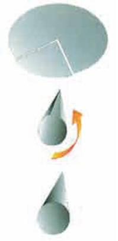    
    <figcaption>(Hình 5.5)</figcaption>
</figure>

Lưu ý rằng vì bề mặt của nón chính là tấm giấy phẳng ban đầu (trừ đi phần giấy hình cái nêm), bạn vẫn có thể gọi nó là phẳng ngoại trừ cái đỉnh. Bạn có thể nhận ra rằng có độ cong ở đỉnh nón nhờ vào một hình tròn xung quanh đỉnh nón có đường kính nhỏ hơn hình tròn được vẽ trên tấm giấy tròn ban đầu với cùng khoảng cách từ tâm hình tròn. Nói cách khác, một hình tròn xung quanh đỉnh sẽ có chu vi ngắn hơn hình tròn có cùng bánh kính được vẽ trên không gian phẳng vì một cung tròn của nó bị mất đi (hình 5.6).

<figure markdown="span">
    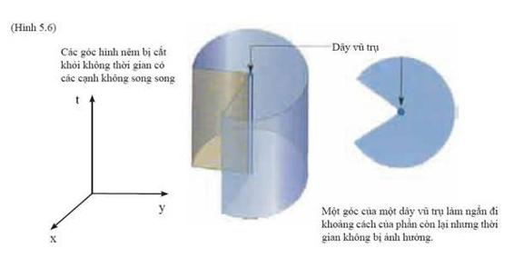    
    <figcaption></figcaption>
</figure>

Tương tự như vậy, trong trường hợp dây vũ trụ, phần không thời gian hình cái nêm bị cắt khỏi không thời gian phẳng làm ngắn đi các hình tròn xung quanh dây vũ trụ nhưng không ảnh hưởng đến thời gian và khoảng cách dọc theo các dây đó. Điều này có nghĩa là không thời gian xung quanh một dây vũ trụ đơn lẻ sẽ không có bất kỳ chu trình thời gian nào, thế nên ta không thể du hành về quá khứ. Tuy nhiên, nếu có một dây vũ trụ thứ hai chuyển động tương đối với chiếc dây thứ nhất thì hướng thời gian của dây thứ hai sẽ là tổ hợp của các hướng thời gian và không gian của dây thứ nhất. Tức là, phần không gian hình cái nêm được cắt cho cái dây thứ hai sẽ làm ngắn đi khoảng thời gian và không gian đối với ai đó chuyển động cùng cái dây thứ nhất (hình 5.7). Nếu các dây vũ trụ chuyển động với vận tốc gần bằng vận tốc ánh sáng tương đối với nhau thì khoảng thời gian tiết kiệm được xung quanh cả hai dây có thể lớn đến mức ta có thể trở về trước khi ta được gửi đi. Nói cách khác, sẽ có các chu trình thời gian mà ta có thể theo nó mà du hành về quá khứ.

<figure markdown="span">
    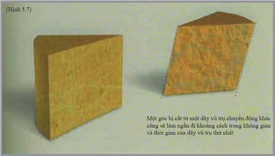    
    <figcaption></figcaption>
</figure>

Không thời gian của các giây vũ trụ có chứa vật chất với mật độ năng lượng dương và phù hợp với nền vật lý mà ta biết. Tuy vậy, sự cong của không thời gian mà tạo nên các chu trình thời gian trải dài cho đến vô tận trong không gian và trở lại đến quá khứ vô tận trong thời gian. Do vậy, ta có thể du hành thời gian trong các không thời gian đó từ khi chúng được tạo ra. Ta không có lý do gì để tin rằng vũ trụ của riêng chúng ta được tạo ra theo một cách bị bẻ cong như vậy, và chúng ta cũng không có các bằng chứng đáng tin cậy về các vị khách của tương lai (Tôi không tính đến giả thuyết im lặng cho rằng các vật thể bay không xác định - UFO đến từ tương lai và các chính phủ biết nhưng che dấu đi. Hồ sơ che giấu chuyện đó không thể kín như thế được). Do đó, tôi sẽ giả thiết rằng không có các chu trình thời gian trong quá khứ xa xôi, hay là một cách chính xác hơn, không có các chu trình thời gian trong quá khứ của một số mặt phẳng trong không thời gian mà tôi gọi là S. Lúc đó câu hỏi sẽ là: liệu các nền văn minh tiên tiến có thể xây dựng một chiếc máy thời gian hay không? Tức là liệu nó có thể thay đổi không thời gian của tương lai của S (phía trên mặt S trên giản đồ), làm cho các chu trình thời gian được xuất hiện trong một vùng hữu hạn hay không? Tôi nói một vùng hữu hạn bởi vì dù nền văn minh đó có trở thành tiên tiến đến bao nhiêu đi chăng nữa thì nền văn minh đó có lẽ chỉ có thể điều khiển một phần hữu hạn của vũ trụ mà thôi.

Trong khoa học, việc trình bày một cách chính xác một vấn đề thường là chìa khóa để giải quyết vấn đề đó, và đây là một ví dụ tốt. Để định nghĩa máy thời gian hữu hạn có nghĩa gì, tôi quay trở lại với một số công trình trước đây của tôi. Có thể du hành thời gian trong một vùng không thời gian có các chu trình thời gian - các lộ trình chuyển động chậm hơn tốc độ ánh sáng, nhưng tuy vậy, chúng lại có thể trở lại thời gian và địa điểm mà chúng khởi đầu nhờ vào độ cong của không thời gian. Vì tôi giả thiết rằng không có các chu trình thời gian trong không gian xa xôi, nên cần phải có một cái gọi là “chân trời” du hành thời gian (time travel horizon) - biên giới phân cách vùng có và không có chu trình thời gian (hình 5.8).

<figure markdown="span">
    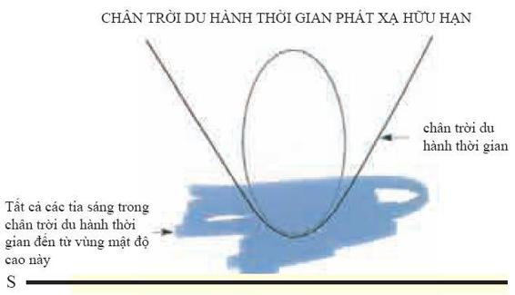    
    <figcaption>(Hình 5.8) Nền văn minh tiên tiến nhất có thể bẻ cong không thời gian trong một vùng hữu hạn. Chân trời du hành thời gian là biên giới ngăn cách vùng không thời gian, nó được hình thành bởi các tia sáng phát ra từ các vùng hữu hạn. Trong vùng đó, ta có thể du hành vào quá khứ.</figcaption>
</figure>

Các chân trời du hành thời gian khá giống các chân trời hố đen. Trong khi chân trời hố đen được hình thành bởi các tia sáng suýt bị rơi vào hố đen thì chân trời du hành thời gian được hình thành bởi các tia sáng suýt gặp nhau. Vậy nên tôi chọn tiêu chuẩn của tôi về máy thời gian - cái mà tôi gọi là chân trời phát sinh hữu hạn (finitly generated horizon) là một chân trời được hình thành bởi các tia sáng xuất hiện từ một vùng không thời gian bó buộc. Nói cách khác, các tia sáng không đến từ vô tận hoặc từ điểm kỳ dị mà từ một vùng hữu hạn có chứa các chu trình thời gian - vùng không thời gian mà ta giả thiết nền văn minh tiên tiến của chúng ta được sinh ra.

<figure markdown="span">
    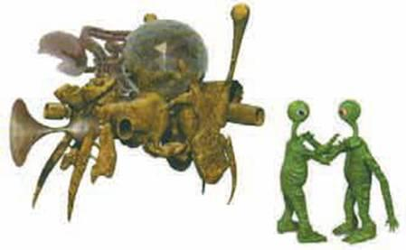    
    <figcaption>Câu hỏi là: một số nền văn minh tiên tiến có thể xây được máy thời gian hay không?</figcaption>
</figure>

Khi chọn định nghĩa này làm cơ sở của máy thời gian, chúng ta có lợi thế để có thể sử dụng chiếc máy mà Roger Penrose và tôi đã phát triển để nghiên cứu các kỳ dị và các hố đen. Thậm chí không sử dụng các phương trình Einstein, tôi có thể chứng minh rằng, nói chung, một chân trời phát sinh hữu hạn sẽ có chứa một tia sáng mà thực ra tự gặp chính nó - tức là một tia sáng cứ quay đi quay lại một điểm. Mỗi lần tia sáng quay lại nó sẽ bị dịch chuyển về phía ánh sáng xanh, và dần dần nó sẽ trở lên xanh hơn. Các đỉnh sóng của xung ánh sáng sẽ dần dần gần nhau hơn và ánh sáng sẽ quay vòng trong một khoảng thời gian ngắn hơn. Trên thực tế, một hạt ánh sáng chỉ có một lịch sử hữu hạn và được xác định bởi phép đo thời gian riêng của nó, mặc dù nó quay đi quay lại trong một vùng không thời gian hữu hạn và không va phải một điểm kỳ dị.

Người ta có thể không quan tâm đến chuyện một hạt ánh sáng có chấm dứt lịch sử của nó hay không. Nhưng tôi vẫn có thể chứng minh rằng có những lộ trình chuyển động chậm hơn vận tốc ánh sáng và có thời gian sống hữu hạn. Các lộ trình này có thể là những lịch sử của người quan sát, người quan sát lại bị bẫy trong một vùng không thời gian hữu hạn ngay trước chân trời và sẽ bay vòng quanh, nhanh dần nhanh dần cho đến khi đạt đến tốc độ ánh sáng trong một thời gian hữu hạn. Do đó, nếu có một người ngoài hành tinh xinh đẹp ở trong một đĩa bay mời bạn vào chiếc mày thời gian của cô ta thì bạn phải cẩn thận khi bước chân vào đấy. Bạn có thể bị rơi vào một trong những lịch sử tuần hoàn bị bẫy có thời gian hữu hạn (hình 5.9).

<figure markdown="span">
    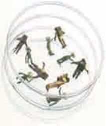    
    <figcaption>(Hình 5.9) Sự nguy hiểm khi du hành thời gian.</figcaption>
</figure>

Các kết quả này không phụ thuộc vào các phương trình Einstein mà chỉ phụ thuộc vào cách mà không thời gian bị cong để tạo ra các chu trình thời gian trong một vùng hữu hạn. Tuy nhiên, bây giờ chúng ta có thể hỏi liệu nền văn minh tiên tiến phải sử dụng loại vật chất gì để bẻ cong không thời gian để có thể xây dựng được một chiếc máy thời gian có kích thước hữu hạn? Vật chất đó có thể có mật độ năng lượng dương ở khắp nơi giống như trong không thời gian dây vũ trụ mà tôi mô tả trước đây hay không? Không thời gian dây vũ trụ đã không thỏa mãn yêu cầu của tôi là các chu trình thời gian xuất hiện trong một vùng hữu hạn. Tuy nhiên, người ta có thể nghĩ rằng yêu cầu đó chỉ là do các dây vũ trụ dài vô hạn. Người ta có thể tưởng tượng rằng người ta có thể xây một cái mày thời gian hữu hạn sử dụng các vòng dây vũ trụ hữu hạn và có mật độ năng lương dương ở khắp mọi nơi. Thật đáng tiếc khi phải làm thất vọng những người muốn quay lại quá khứ giống như Kip, nhưng điều đó không thể thực hiện được khi mà mật độ năng lượng là dương ở khắp mọi nơi. Tôi có thể chứng minh rằng, để xây một máy thời gian hữu hạn, bạn cần năng lượng âm.

Trong lý thuyết cổ điển thì mật độ năng lượng luôn luôn dương, do đó, loại trừ máy thời gian với kích thước hữu hạn ra khỏi mức độ này. Tuy nhiên, tình huống lại khác trong lý thuyết bán cổ điển, khi mà ta coi vật chất tuân theo thuyết lượng tử nhưng không thời gian lại tất định và cổ điển. Như chúng ta đã thấy, nguyên lý bất định của cơ học lượng tử nói rằng các trường luôn thăng giáng lên xuống ngay cả trong chân không và có mật độ năng lượng vô hạn. Do đó, ta phải loại trừ đại lượng vô hạn để nhận được mật độ năng lượng hữu hạn mà ta quan sát được trong vũ trụ. Việc loại trừ này có thể làm năng lượng âm, ít nhất là âm cục bộ. Ngay cả trong không gian phẳng, ta có thể tìm thấy các trạng thái lượng tử có năng lượng âm cục bộ mặc dù năng lượng toàn phần là dương. Ta có thể tự hỏi là các giá trị âm này có thực sự làm không thời gian bị bẻ cong một cách thích hợp để xây một máy thời gian hữu hạn hay không, dường như là có. Như chúng ta đã thấy trong chương 4, thăng giáng lượng tử có nghĩa là ngay trong chân không trống rỗng cũng đầy ắp các cặp hạt ảo, cùng xuất hiện, rời xa nhau rồi quay trở lại để hủy lẫn nhau (hình 5.10). Một thành viên của cặp hạt ảo có năng lượng dương và thành viên kia có năng lượng âm. Khi có mặt hố đen thành viên có năng lượng âm có thể bị rơi vào hố đen và thành viên có năng lượng dương có thể thoát vào vô tận, ở đó, thành viên có năng lượng dương được quan sát như là bức xạ mang năng lượng dương ra khỏi hố đen. Các hạt có năng lượng âm rơi vào hố đen sẽ làm cho hố đen mất khối lượng và từ từ bay hơi, kích thước của chân trời sự kiện sẽ bị suy giảm (hình 5.11).

<figure markdown="span">
    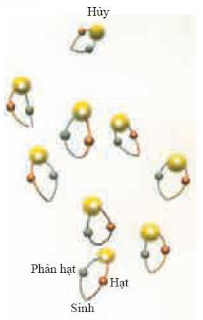    
    <figcaption>(Hình 5.10) Việc tiên đoán hố đen phát xạ và mất đi khối lượng ngụ ý rằng thuyết lượng tử tạo ra các năng lượng âm đi vào hố đen qua chân trời sự kiện. Đối với hố đen co lại đến không, mật độ năng lượng trên chân trời sự kiện phải là âm, đó là dấu hiệu cần có để xây dựng máy thời gian.</figcaption>
</figure>

<figure markdown="span">
    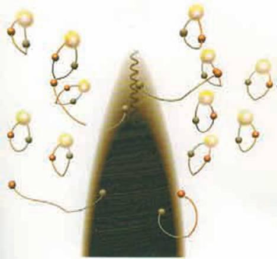    
    <figcaption>(Hình 5.11)</figcaption>
</figure>

Vật chất thường với mật độ năng lượng dương gây ra hiệu ứng hấp dẫn âm và bẻ cong không thời gian làm cho ác tia sáng đi lại gần nhau - giống như hòn bi trên tấm cao su trong chương hai bẻ cong đường đi của các hòn bi nhỏ hơn lại gần nhau chứ không bao giờ làm cho chúng xa nhau.

Điều này ngụ ý rằng diện tích của chân trời hố đen luôn tăng theo thời gian chứ không bao giờ bị giảm đi. Đối với chân trời của hố đen đang giảm kích thước thì mật độ năng lượng trên chân trời phải là âm và bẻ cong không thời gian để làm cho các tia sáng đi ra xa nhau. Đó là điều tôi nhận ra đầu tiên khi tôi đi về buồng ngủ ngay sau khi con gái tôi ra đời. Tôi sẽ không nói khi đó cách đây bao lâu, chỉ biết rằng nay tôi đã có cháu ngoại rồi.

<figure markdown="span">
        
    <figcaption>Cháu ngoại tôi, William Mackenzie Smith.</figcaption>
</figure>

Việc các hố đen bay hơi cho thấy rằng trên mức độ lượng tử, đôi khi mật độ năng lượng có thể là âm và làm bẻ cong không thời gian theo hướng cần thiết để xây dựng một máy thời gian. Do đó chúng ta có thể tưởng tượng rằng, một số nền văn minh rất cao có thể bố trí mật độ năng lượng đủ âm để tạo nên một máy thời gian có thể sử dụng cho các vật thể vĩ mô như là các phi thuyền. Tuy nhiên, có một sự khác biệt quan trọng giữa chân trời hố đen - được hình thành bởi các tia sáng bay vòng quanh hố đen, và chân trời của máy thời gian - có chứa các tia sáng quay đi quay lại. Do đó, ta có thể trông đợi mật độ năng lượng vô hạn trên chân trời - biên của máy thời gian - vùng không thời gian mà ta có thể đi về quá khứ. Điều này được xác định bởi các tính toán rất tường minh trên một số nền tảng đủ đơn giản cho các tính toán chính xác. Điều đó có nghĩa là một người hay một máy dò không gian khi thử vượt qua chân trời đi vào trong máy thời gian sẽ bị phá hủy bởi một vành đai bức xạ (hình 5.12). Nên tương lai có vẻ như là một màu đen với việc du hành thời gian - hay là một màu trắng chết chóc nhỉ?

<figure markdown="span">
    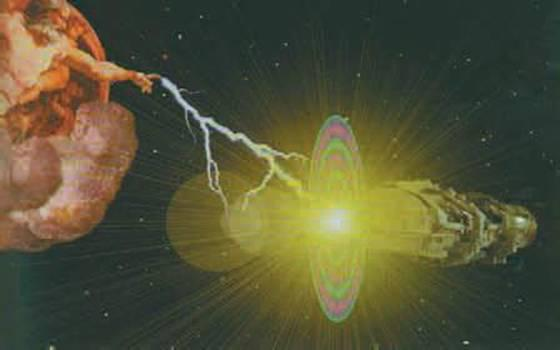    
    <figcaption>(Hình 5.12) Ta có thể bị một vành đai bức xạ xóa sổ khi bước chân vào chân trời du hành thời gian.</figcaption>
</figure>

Mật độ năng lượng của vật chất phụ thuộc vào trạng thái của nó nên có thể một nền văn minh tiên tiến có khả năng tạo ra mật độ vật chất hữu hạn ở trên biên của máy thời gian bằng việc “vứt bỏ” hoặc loại trừ các hạt ảo cứ quay đi quay lại trong một chu trình kín. Tuy vậy, vẫn chưa rõ một chiếc máy thời gian như thế có thể ổn định hay không: một nhiễu loạn nhỏ nhất như là việc ai đó đi ngang qua chân trời để vào trong máy thời gian sẽ làm tăng các hạt ảo chuyển động tuần hoàn và khởi động vành đai ánh sáng. Đây là một câu hỏi mà các nhà vật lý nên tự do thảo luận, không nên cười khinh thường. Thậm chí ngay cả khi du hành thời gian là bất khả thể thì việc tìm hiểu tại sao nó bất khả thể là điều rất quan trọng.

Để trả lời dứt khoát câu hỏi này chúng ta cần xem xét các thăng giáng lượng tử không chỉ của các trường vật chất mà cả của bản thân thời gian nữa. Ta có thể trông đợi các thăng giáng gây ra một độ mờ nhất định trong các lộ trình thời gian và trong toàn bộ khái niệm thời gian trật tự. Thực vậy, ta có thể coi bức xạ từ các hố đen giống như một sự rò gỉ ra ngoài nhờ các thăng giáng lượng tử của không thời gian, có nghĩa là chân trời không hoàn toàn xác định một cách chính xác. Vì chúng ta vẫn chưa có một lý thuyết hấp dẫn lượng tử hoàn thiện nên thật khó có thể nói các hiệu ứng của thăng giáng không thời gian là gì. Tuy nhiên, chúng ta có thể hy vọng có được một số gợi ý từ tổng theo các lịch sử của Feynman mà đã được mô tả trong chương 3.

<figure markdown="span">
    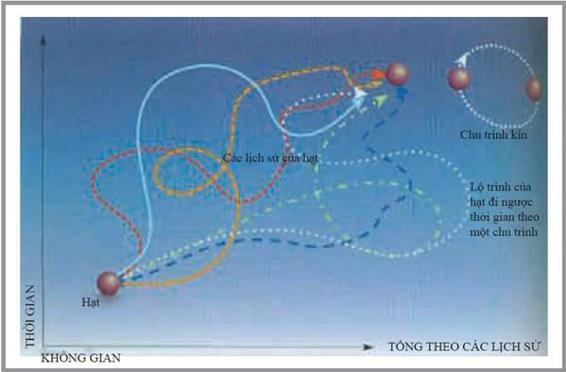    
    <figcaption>(Hình 5.13) Lấy tổng theo các lịch sử của Feynman đã tính đến các lịch sử trong đó các hạt quay ngược lại thời gian và ngay cả các lịch sử là các vòng đóng trong thời gian và không gian.</figcaption>
</figure>

Mỗi lịch sử sẽ có một không thời gian cong với các trường vật chất trong đó. Vì chúng ta đã giả thiết lấy tổng theo tất cả các lịch sử khả dĩ, không chỉ các lịch sử thỏa mãn một số phương trình mà tổng cần bao gồm các không thời gian đủ cong để du hành về quá khứ (hình 5.13). Do đó, câu hỏi là tại sao du hành thời gian không xảy ra ở khắp nơi? Câu trả lời là thực ra du hành thời gian xảy ra ở cấp độ vi mô, nhưng chúng ta không chú ý đến nó. Nếu người ta áp dụng ý tưởng lấy tổng theo các lịch sử của Feynman đối với một hạt, người ta phải lấy cả các lịch sử trong đó các hạt chuyển động nhanh hơn ánh sáng thậm chí còn quay ngược trong thời gian. Đặc biệt là sẽ có các lịch sử mà trong đó các hạt theo những lộ trình tuần hoàn trên một chu trình thời gian và không gian. Điều này giống như trong phim Groundbog Day, trong đó một phóng viên phải sống trong một ngày được lặp đi lặp lại nhiều lần (hình 5.14).

<figure markdown="span">
    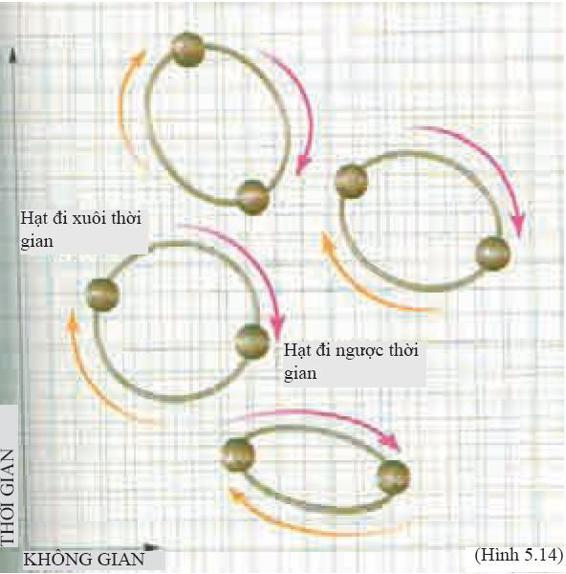    
    <figcaption></figcaption>
</figure>

Người ta không thể quan sát một cách trực tiếp các hạt với các lịch sử có chu trình kín như thế bằng các máy đo hạt. Tuy vậy, các hiệu ứng gián tiếp của chúng đã được thấy trong rất nhiều thí nghiệm. Một trong những thí nghiệm đó là có một dịch chuyển nhỏ trong ánh sáng phát ra từ các nguyên tử hydro, gây ra bởi các điện tử chuyển động trong các chu trình kín. Một thí nghiệm khác nữa đó là có một lực nhỏ xuất hiện giữa các tấm kim loại song song gây ra do có ít hơn các lịch sử chu trình kín có thể khớp vào giữa các tấm kim loại so với các vùng bên ngoài - đó là một lời giải thích tương đương khác cho hiệu ứng Casimir. Vậy nên sự tồn tại của các lịch sử chu trình kín đã được khẳng định bằng thực nghiệm (hình 5.15).

<figure markdown="span">
    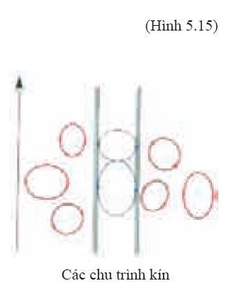    
    <figcaption></figcaption>
</figure>

Người ta có thể nghi ngờ việc các lịch sử chu trình kín liệu có liên quan gì đến việc bẻ cong không thời gian hay không vì chúng xuất hiện ngay cả trong khung nền cố định như là không gian phẳng. Nhưng những năm gần đây chúng ta đã tìm ra rằng các hiện tượng vật lý thường có thể được mô tả theo hai cách tương đương nhau. Người ta hoàn toàn có thể nói rằng một hạt chuyển động trên một chu trình kín trong một khung nền cố định hoặc người ta cũng có thể nói rằng hạt nằm trong trạng thái cố định và không gian và thời gian thăng giáng xung quanh nó. Câu hỏi chỉ là bạn lấy tổng theo các lộ trình của hạt trước rồi sau đó lấy tổng theo không thời gian cong hoặc ngược lại.

Vậy nên, dường như thuyết lượng tử cho phép du hành thời gian ở cấp độ vi mô. Nhưng điều này không có nhiều tác dụng lắm với mục đích viễn tưởng khoa học như là việc quay lại quá khứ và giết người ông chẳng hạn. Vậy câu hỏi là: xác xuất trong việc lấy tổng theo các lịch sử xung quanh không thời gian với các chu trình thời gian vĩ mô có cao hay không?

Người ta có thể xem xét câu hỏi này khi nghiên cứu tổng theo các lịch sử của các trường vật chất trong một chuỗi các không thời gian nền (background spacetime) đang xích lại gần nhau để có các chu trình thời gian. Người ta trông đợi cái gì đó kịch tính xảy ra khi các chu trình thời gian xuất hiện đầu tiên, và điều này đã được xác nhận trong một thí nghiệm đơn giản mà tôi đã khảo cứu với một sinh viên của tôi là Micheal Cassidy. Các không thời gian nền trong chuỗi mà tôi nghiên cứu có liên hệ rất mật thiết đối với cái được gọi là vũ trụ Einstein, không thời gian mà Einstein đưa ra khi ông tin rằng vũ trụ là tĩnh tại và không đổi theo thời gian, không giãn nở mà cũng không co lại (xem chương 1). Trong vũ trụ của Einstein, thời gian chạy từ quá khứ vô cùng đến tương lai vô cùng. Tuy nhiên, các hướng không gian lại hữu hạn và tự đóng, giống như bề mặt trái đất nhưng có nhiều hơn một chiều. Ta có thể mường tượng không thời gian này giống như một hình trụ với trục thẳng đứng là hướng thời gian và mặt cắt là ba chiều của không gian (hình 5.16).

<figure markdown="span">
    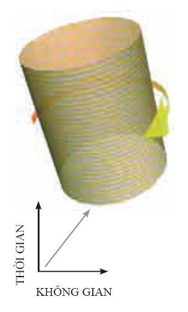    
    <figcaption>(Hình 5.16) Vũ trụ của Einstein giống như một hình trụ, nó hữu hạn theo không gian và không đổi theo thời gian, mọi nơi trong vũ trụ có thể quay với tốc độ nhỏ hơn tốc độ ánh sáng.</figcaption>
</figure>

Vũ trụ của Einstein không thể hiện vũ trụ mà chúng ta đang sống vì nó không giãn nở. Tuy vậy, nó là một khung nền rất thuận tiện trong việc sử dụng khi nghiên cứu du hành thời gian vì vũ trụ đó đủ đơn giản khi ta lấy tổng theo các lịch sử. Bây giờ ta bỏ qua chuyện du hành thời gian, hãy xem xét vật chất trong vũ trụ của Einstein quay xung quanh một số trục nào đó. Nếu bạn đứng trên một cái trục quay, bạn có thể vẫn ở tại một điểm trong không gian, giống như bạn đứng ở trung tâm của trò chơi ngựa quay của trẻ con. Nhưng nếu bạn không đứng ở tâm thì bạn sẽ chuyển động trong không gian khi bạn quay quanh trục. Bạn ở càng xa trục quay thì bạn chuyển động càng nhanh (hình 5.17). Do đó, nếu vũ trụ là vô hạn trong không gian, thì các điểm đủ xa trục quay sẽ quay nhanh hơn vận tốc ánh sáng. Tuy nhiên, vì vũ trụ của Einstein là hữu hạn theo các hướng trong không gian, nên sẽ có một tốc độ quay tới hạn mà dưới nó không có phần nào của vũ trụ quay nhanh hơn vận tốc ánh sáng.

<figure markdown="span">
    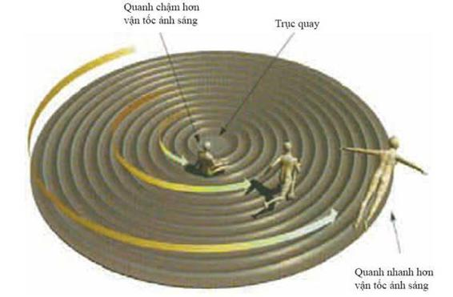    
    <figcaption>(Hình 5.17) Trong không gian phẳng, phần ở xa trục quay của một đĩa cứng có thể quay nhanh hơn vận tốc ánh sáng.</figcaption>
</figure>

Bây giờ ta hãy nghiên cứu việc lấy tổng theo các lịch sử hạt trong một vũ trụ Einstein quay. Khi quay chậm, một hạt có thể theo rất nhiều lộ trình khi dùng một lượng năng lượng đã cho. Do đó, tổng theo tất cả các lịch sử của hạt trong khung nền này sẽ có biên độ lớn. Điều này muốn nói rằng xác xuất của khung nền này sẽ cao khi lấy tổng theo tất cả lịch sử không thời gian bị uốn cong - tức là, nó là một trong những lịch sử có xác xuất cao hơn. Tuy vậy, khi tốc độ quay của vũ trụ Einstein đạt đến giá trị tới hạn, thì ở rìa ngoài của vũ trụ chuyển động với vận tốc tiến đến vận tốc ánh sáng. Chỉ có một lộ trình được phép trong khuôn khổ cổ điển trên rìa vũ trụ, là lộ trình cho hạt chuyển động với vận tốc ánh sáng. Điều này có nghĩa là tổng theo tất cả các lịch sử hạt sẽ nhỏ nên xác xuất của các khung nền này sẽ thấp hơn xác xuất khi lấy tổng theo tất cả các lịch sử không gian cong. Tức là, chúng có xác xuất thấp nhất.

Vũ trụ Einstein quay thì có liên quan gì đến du hành thời gian và các chu trình thời gian? Câu trả lời là về mặt toán học chúng tương đương với các khung nền khác cho phép tồn tại các chu trình thời gian. Các khung nền khác này là các vũ trụ đang giãn nở theo hai chiều không gian. Vũ trụ không giãn nở theo chiều thứ ba mà chiều này là tuần hoàn. Điều đó nói rằng nếu bạn đi một khoảng cách nhất định theo chiều này thì bạn sẽ quay trở lại nơi bạn đã xuất phát. Tuy vậy, mỗi lần bạn đi vòng quanh theo chiều không gian thứ ba này thì tốc độ của bạn trong chiều thứ nhất và thứ hai sẽ được tăng thêm (hình 5.18).

<figure markdown="span">
    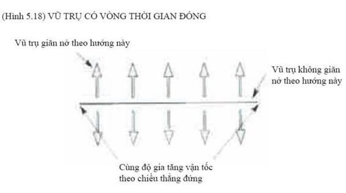    
    <figcaption></figcaption>
</figure>

Nếu sự gia tốc này nhỏ thì sẽ không có các chu trình thời gian. Nhưng hãy xem xét một chuỗi các khung nền với gia tốc tăng dần. Tại một gia tốc tới hạn nhất định, các chu trình thời gian sẽ xuất hiện. Điều dễ hiểu là sự gia tốc tới hạn này tương ứng với tốc độ quay tới hạn của các vũ trụ Einstein. Vì các tính toán tổng theo các lịch sử trong các khung nền này là tương đương nhau về mặt toán học nên ta có thể kết luận rằng xác xuất của các khung nền này tiến đến không khi chúng tiến đến độ cong cần thiết cho các chu trình thời gian. Nói cách khác, xác xuất để có đủ độ cong cho một máy thời gian là bằng không. Điều này củng cố cái mà tôi gọi là `Phỏng đoán bảo toàn lịch sử (Chronology Protection Conjecture)`: đó là các định luật vật lý cố gắng tránh du hành thời gian đối với các vật thể vĩ mô. Mặc dù các chu trình thời gian có thể xảy ra nhờ việc lấy tống theo các lịch sử, nhưng các xác xuất lại cực kỳ nhỏ. Dựa trên luận cứ lưỡng tính tôi đã nói trước đây, tôi ước tính xác xuất mà Kip Thorne có thể quay lại và giết chết người ông của anh ta là một phần mười tỷ tỷ tỷ tỷ tỷ tỷ tỷ tỷ tỷ tỷ.

<figure markdown="span">
    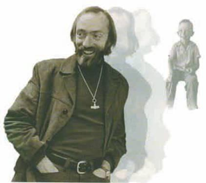    
    <figcaption></figcaption>
</figure>

_Xác suất mà Kip có thể quay lại quá khứ và giết người ông của anh ta là một phần mười mũ mười mũ sáu mươi ($1/{10^{{10}^{60}}}$)_

Nói cách khác xác suất đó nhỏ hơn một phần ngàn tỷ ngàn tỷ ngàn tỷ ngàn tỷ ngàn tỷ.

Đấy là một con số rất nhỏ, nhưng nếu bạn nhìn gần vào bức tranh của Kip thì bạn có thể nhìn thấy những đường mờ ở rìa bức tranh. Nó tương ứng với xác suất khi một kẻ vô lại nào đó từ tương lai quay lại quá khứ và giết chết người ông của anh ta để anh ta không thể có mặt ở đây được nữa.

Như những tay cờ bạc, Kip và tôi đã đánh bạc về điều đó. Nhưng vấn đề là chúng tôi không thể cá cược với nhau vì bây giờ chúng tôi ở cùng một phía. Mặt khác, tôi sẽ không đánh bạc với bất kỳ ai nữa. Anh ta có thể đến từ tương lai và biết rằng máy thời gian đã hoạt động. Bạn có thể tự hỏi chương sách này có phải là một phần biện pháp che đậy máy thời gian của chính phủ hay không. Có thể bạn đúng đấy.