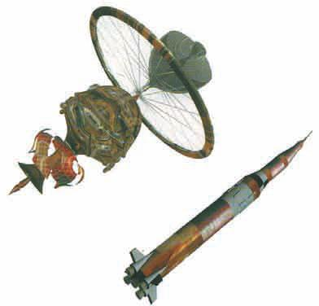
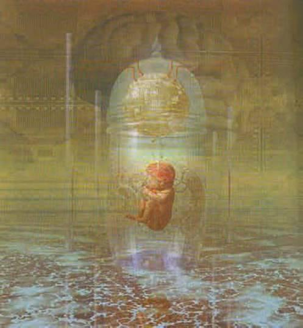
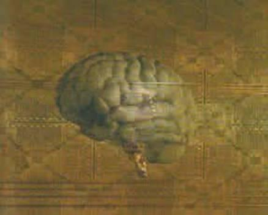

# CHƯƠNG 6 - TƯƠNG LAI CỦA CHÚNG TA? CÓ THỂ LÀ STARTREK HAY KHÔNG?

<figure markdown="span">
    
    <figcaption>Làm thế nào mà cuộc sống sinh học và điện tử sẽ tiếp tục phát triển độ phức tạp với một tốc độ chưa từng thấy?_</figcaption>
</figure>

Lý do mà Star Trek phổ biến đến thế là vì đó là một viễn cảnh tương lai an ủi và dễ chịu. Bản thân tôi cũng là một người khá yêu thích Star Trek, do đó tôi dễ dàng bị thuyết phục tham gia vào một đoạn phim trong đó tôi chơi bài với Newton, Einstein và thuyền trưởng Data. Tôi đã thắng họ, nhưng thật không may, có báo hiệu khẩn cấp nên tôi không bao giờ lấy được số tiền thắng cược.

<figure markdown="span">
    
    <figcaption>Một cảnh trong phim Star Trek: The Next Genearation, 2001.</figcaption>
    <figcaption>Newton, Einstein, thuyền trưởng Data và tôi đang chơi bài trong một cảnh phim Star Trek.</figcaption>
</figure>

Star Trek cho thấy một xã hội có trình độ khoa học, kỹ thuật và tổ chức chính trị phát triển rất xa với chúng ta (về tổ chức chính trị có thể không khó khăn lắm). Sẽ phải có những thay đổi lớn với những căng thẳng và xáo trộn đi kèm trong thời gian giữa bây giờ và thời điểm đó, nhưng trong giai đoạn mà chúng ta đã thấy, khoa học, kỹ thuật và tổ chức xã hội được giả thiết là đạt đến mức độ gần như hoàn hảo.

Tôi muốn đặt nghi vấn về bức tranh này và hỏi rằng liệu chúng ta sẽ đạt đến một trạng thái ổn định cuối cùng chưa từng có về khoa học và công nghệ hay không. Chưa lúc nào trong vòng khoảng mười ngàn năm kể từ kỷ băng hà, loài người ở trong một tình trạng mà tri thức bất biến và công nghệ cố định không thay đổi. Có đôi lúc thụt lùi như là thời kỳ trung cổ sau khi đế chế La Mã sụp đổ. Nhưng dân số thế giới - một phép đo khả năng công nghệ của chúng ta để bảo tồn cuộc sống và nuôi sống bản thân chúng ta, đã tăng một cách vững chắc trừ một vài lần gián đoạn như thời kỳ cái chết đen mà thôi (hình 6.1).

<figure markdown="span">
    
    <figcaption></figcaption>
</figure>

Trong hai trăm năm vừa qua, tốc độ phát triển dân số trở lên cấp số mũ; tức là dân số phát triển với một số phần trăm giống nhau hàng năm. Hiện nay tốc độ đó là 1,9 phần trăm một năm. Điều này nghe có vẻ không thích thú lắm nhưng nó có nghĩa là dân số thế giới cứ bốn mươi năm lại tăng gấp đôi (hình 6.2).

<figure markdown="span">
    
    <figcaption>(Hình 6.2)</figcaption>
</figure>

- _(Trái) Mức tiêu thụ năng lượng toàn cầu (đơn vị tỷ tấn BCU, trong đó một tấn bằng một đơn vị than bitu = 8.13 MW-giờ)_
- _(Phải) Số bài báo khoa học xuất bản hàng năm, trục tung theo đơn vị ngàn bài. Năm 1900 có 9 000 bài, năm 1950 có 90 000 bài và năm 2000 có 900 000 bài._

Các phép đo sự phát triển công nghệ khác trong thời gian gần đây là mức tiêu thụ điện năng và số các bài báo khoa học. Chúng cũng tăng theo hàm mũ và thời gian tăng gấp đôi thì ít hơn bốn mươi năm. Trong tương lai gần - tất nhiên là không phải thời đại Star Trek - thời đại được giả thiết không quá xa so với chúng ta, không có tín hiệu nào cho thấy sự phát triển của khoa học và công nghệ sẽ chậm dần và dừng hẳn. Nhưng nếu tốc độ tăng dân số và sự gia tăng về tiêu thụ điện năng tiếp tục với tốc độ như hiện nay thì đến năm 2600 dân số thế giới sẽ tăng đến mức mọi người đứng sát vai kề vai và phủ kín trái đất và điện năng sẽ làm cho trái đất sẽ trở nên nóng đỏ (xem hình minh họa trang kế).

<figure markdown="span">
        
    <figcaption>Vào năm 2600, dân số thế giới đông đến mức phải đứng sát vào nhau và điện năng tiêu thụ có thể làm trái đất phát sáng đỏ.</figcaption>
</figure>

Nếu bạn xếp tất cả các cuốn sách mới được xuất bản sát lại với nhau thì bạn phải chuyển động với vận tốc một trăm năm mươi km một giờ để có thể bắt kịp phần cuối của hàng sách. Tất nhiên là vào năm 2600 thì các công trình nghệ thuật và khoa học phát hành theo dạng điện tử chứ không phải theo dạng sách báo vật lý. Tuy nhiên, nếu độ tăng theo hàm mũ cứ tiếp tục thì sẽ có mười bài báo về ngành vật lý lý thuyết của tôi ra đời trong một giây và chẳng có thời gian để đọc chúng.

Rõ ràng là tốc độ tăng theo hàm mũ như hiện nay không thể tiếp tục mãi mãi. Thế thì cái gì sẽ xảy ra? Một khả năng là chúng ta tự xóa bỏ hoàn toàn bản thân chúng ta bằng một số thảm họa như chiến tranh hạt nhân chẳng hạn. Có một chuyện đùa chán ngấy là lý do mà người ngoài trái đất không liên lạc với chúng ta đó là khi nền văn minh đạt đến giai đoạn phát triển của chúng ta thì nó trở lên bất ổn và tự hủy hoại bản thân. Tuy vậy, tôi vẫn là một người lạc quan. Tôi không tin là loài người đi quá xa để tự chấm dứt bản thân khi mọi thứ đang trở nên đáng quan tâm.

Viễn cảnh tương lai Star Trek mà chúng ta đạt đến một mức độ tiên tiến nhưng hầu như tĩnh tại có thể trở thành hiện thực theo tri thức của chúng ta về các định luật cơ bản điều khiển vũ trụ. Như tôi sẽ mô tả trong chương kế tiếp, có thể có một lý thuyết tối thượng mà chúng ta sẽ tìm ra trong một tương lai không xa. Lý thuyết tối thượng này, nếu tồn tại, sẽ quyết định giấc mơ Star Trek về di chuyển theo độ cong không gian có thành hiện thực hay không. Theo các ý tưởng hiện nay, chúng ta sẽ phải khám phá thiên hà theo một cách chậm chạm và buồn tẻ sử dụng phi thuyền chuyển động chậm hơn vận tốc ánh sáng, nhưng vì chúng ta chưa có lý thuyết thống nhất hoàn toàn nên chúng ta không thể loại trừ khả năng di chuyển theo độ cong không gian (hình 6.3).

<figure markdown="span">
        
    <figcaption>(Hình 6.3)</figcaption>
</figure>

Mạch chuyện của Star Trek phụ thuộc vào phi thuyền Enterprise và các phi thuyền giống như thế có thể di chuyển với vận tốc cong nhanh hơn rất nhiều vận tốc ánh sáng. Tuy nhiên, nếu Giả định bảo toàn lịch sử (Chronology Protection Conjecture) là đúng thì chúng ta sẽ phải khám phá vũ trụ bằng các phi thuyền có tên lửa đẩy với vận tốc chậm hơn vận tốc ánh sáng.

Mặt khác, chúng ta đã biết các định luật đúng trong tất cả các trường hợp nhưng không đúng trong các tình huống tới hạn nhất: các định luật điều khiển phi hành đoàn của Enterprise, và cả bản thân chiếc phi thuyền nữa. Nếu cứ theo phương pháp mà chúng ta tìm ra các định luật này hoặc cứ theo phương pháp mà chúng ta xây dựng nên độ phức tạp của các hệ như hiện nay thì chẳng có vẻ gì là chúng ta sẽ đạt đến một trạng thái ổn định. Chúng ta sẽ đề cập đến sự phức tạp đó trong phần còn lại của chương này.

Cho tới nay, hệ thống phức tạp nhất mà chúng ta có đó chính là cơ thể chúng ta. Dường như sự sống có nguồn gốc từ đại dương nguyên thủy bao phủ bề mặt trái đất bốn tỷ năm trước. Chúng ta không biết điều này diễn ra thế nào. Có thể là sự va chạm ngẫu nhiên giữa các nguyên tử đã tạo ra các đại phân tử. Các đại phân tử này có thể tự tái tạo bản thân chúng và liên kết với nhau để tạo ra các cấu trúc phức tạp hơn. Điều mà chúng ta biết đó là cách đây ba tỷ năm rưỡi, phân tử có độ phức tạp rất cao ADN đã xuất hiện.

ADN là cơ sở của sự sống trên trái đất. Đó là một cấu trúc hình xoắn kép giống như cầu thang xoáy, cấu trúc này được Francis Crick và James Watson ở phòng thí nghiệm Cavendish tại Cambridge phát hiện ra vào năm 1953. Hai nhánh của chuỗi xoắn kép này được liên kết với nhau nhờ các cặp ba-zơ giống như bậc thang trên cầu thang xoắn. Trong ADN có bốn loại ba-zơ: adenine, guanine, thymine và cytosine. Trật tự các ba-zơ xuất hiện dọc theo cầu thang xoắn mang các thông tin di truyền cho phép ADN liên kết với một cơ quan xung quanh nó để tái sinh chính nó. Vì ADN tự tạo ra các phiên bản của chính nó nên đôi lúc có các sai sót trong tỷ lệ hoặc trật tự của các ba-zơ trên chuỗi xoắn kép. Trong phần lớn các trường hợp, các sai sót trong việc sao chép không thể hoặc rất ít có khả năng tự tái tạo chính nó, có nghĩa là các sai sót di truyền hay thường gọi là các đột biến sẽ bị loại bỏ. Nhưng trong một số trường hợp, các sai sót hay các đột biến sẽ làm tăng khả năng sống sót và tái sinh của ADN. Các thay đổi về mã di truyền như thế sẽ được ưu tiên. Đó là cách mà thông tin được lưu trữ trong chuỗi ADN tiến hóa dần dần và làm tăng độ phức tạp (hình 6.4).

<figure markdown="span">
    \
        
    <figcaption>(Hình 6.4) TIẾN HÓA KHI HOẠT ĐỘNG</figcaption>
    <figcaption>(Hình bên phải là mô hình tạo ra bằng một chương trình máy tính do nhà sinh vật học Richard Dawkins tạo ra.)</figcaption>
</figure>

Sự tồn tại của một xu hướng nào đó phụ thuộc vào các đặc tính đơn giản như là “hấp dẫn”, “khác biệt” hoặc “giống côn trùng” (insect-like). Bắt đầu từ một điểm duy nhất, các thế hệ ngẫu nhiên ban đầu phát triển theo một quá trình tương tự quá trình chọn lọc tự nhiên. Dawkins tạo ra một dạng thức giống côn trùng với 29 thế hệ (cùng rất nhiều ngõ cụt khi tiến hóa).

Vì tiến hóa sinh học về cơ bản là một quá trình ngẫu nhiên trong không gian của tất cả các xác xuất di truyền nên tiến hóa sinh học diễn ra rất chậm chạp. Độ phức tạp hay là số các bit thông tin được mã hóa trong ADN gần bằng số các ba-zơ trong phân tử đó. Trong khoảng hai tỷ năm đầu tiên, độ phức tạp tăng với tốc độ khoảng một bit thông tin trong một trăm năm. Và trong vài triệu năm trước, độ phức tạp của ADN tăng dần với tốc độ khoảng một bit thông tin trong một năm. Nhưng sau đó, khoảng sáu hoặc tám ngàn năm trước, xuất hiện một bước phát triển mới rất quan trọng. Chúng ta đã phát triển ngôn ngữ viết. Điều này có nghĩa là thông tin có thể được truyền từ thế hệ này đến thế hệ khác mà không cần phải đợi quá trình đột biến ngẫu nhiên và chọn lọc tự nhiên rất chậm chạp để mã hóa thông tin vào chuỗi ADN. Và độ phức tạp tăng lên nhanh chóng. Chỉ một cuốn tiểu thuyết có thể chứa một lượng thông tin bằng lượng thông tin về sự khác nhau giữa ADN của vượn và người, và ba mươi tập bách khoa toàn thư có thể mô tả toàn bộ chuỗi ADN của loài người (hình 6.5).

<figure markdown="span">
    \
    s
    <figcaption>(Hình 6.5) Toàn bộ ADN của người được chứa trong 30 tập sách.</figcaption>
</figure>

Quan trọng hơn là thông tin trong các cuốn sách có thể được cập nhật một cách rất nhanh chóng. Tốc độ cập nhật ADN trong quá trình tiến hóa sinh học của con người hiện nay là một bit trong một năm. Nhưng có hai trăm ngàn cuốn sách mới xuất bản hàng năm - tương đương với tốc độ cập nhất thông tin mới trên một triệu bit một giây. Tất nhiên là phần lớn các thông tin đều vô ích nhưng chỉ cần một phần triệu bit hữu ích thì tốc độ vẫn lớn hơn tốc độ tiến hóa sinh học một trăm ngàn lần. Việc truyền dữ liệu bằng các phương pháp ngoại, phi sinh học đã làm cho loài người thống trị thế giới và tăng dân số theo cấp số mũ. Nhưng ngày nay chúng ta đang ở trong giai đoạn bắt đầu của một kỷ nguyên mới, trong đó chúng ta có thể tăng độ phức tạp của thông tin nội - tức là ADN mà không cần phải đợi quá trình tiến hóa sinh học chậm chạp. Trong mười ngàn năm gần đây, ADN của con người không có thay đổi nào đáng kể, nhưng rất có thể trong một ngàn năm tới chúng ta có khả năng tái thiết kế lại hoàn toàn. Tất nhiên rất nhiều người sẽ nói rằng, kỹ thuật di truyền trên con người sẽ bị cấm nhưng việc chúng ta có thể ngăn cản nó là một điều đáng ngờ. Kỹ thuật gen trên thực vật và động vật được phép vì các lý do kinh tế và một số người sẽ thử trên con người. Trừ khi chúng ta có một lệnh cấm triệt để trên toàn thế giới không cho phép người nào, nơi nào được thiết kế con người cải tiến.

Rõ ràng là việc tạo ra con người cải tiến sẽ gây nên các vấn đề xã hội và chính trị với con người không được cải tiến. Chủ ý của tôi không phải là bảo vệ cho kỹ thuật gen trên con người là một bước phát triển đáng ao ước mà tôi chỉ muốn nói rằng điều đó rất có thể sẽ xảy ra cho dù chúng ta muốn hay không. Đó chính là lý do tại sao tôi không tin vào chuyện khoa học viễn tưởng như Star Trek, trong đó, con người bốn trăm năm tới lại giống chúng ta ngày nay về cơ bản. Tôi nghĩ rằng con người và ADN của con người sẽ gia tăng độ phức tạp rất nhanh chóng. Chúng ta nên thừa nhận rằng điều này sẽ xảy ra và xem xét làm thế nào để giải quyết vấn đề đó.

<figure markdown="span">
        
    <figcaption>Thai nhi phát triển bên ngoài cơ thể con người sẽ cho phép hình thành những bộ não lớn hơn với trí tuệ vĩ đại hơn.</figcaption>
</figure>

Theo đó, con người cần phải cải tiến thể chất và trí tuệ để đối phó với một thế giới với độ phức tạp gia tăng và để đáp ứng với thách thức như là du hành vũ trụ chẳng hạn. Con người cũng cần phải tăng độ phức tạp của mình nếu như các hệ sinh học vượt trên các hệ điện tử. Tại thời điểm này, máy tính có lợi thế về tốc độ nhưng không cho thấy một dấu hiệu nào về trí tuệ. Điều này không có gì đáng ngạc nhiên vì các máy tính hiện nay của chúng ta còn đơn giản hơn bộ não của một con giun đất, một sinh vật chẳng có gì đáng chú ý về khả năng trí tuệ.

<figure markdown="span">
    
    <figcaption>Tại thời điểm hiện nay, các máy tính của chúng ta vẫn kém xa khả năng tính toán của bộ não của một con giun đất ngốc nghếch.</figcaption>
</figure>

<figure markdown="span">
    
    <figcaption>(Hình 6.6)</figcaption>
</figure>

Nhưng các máy tính lại tuân theo một định luật gọi là định luật Moore: tốc độ và độ phức tạp của chúng sẽ tăng gấp đôi cứ sau mười tám tháng (hình 6.6). Đây cũng là một quá trình tăng theo hàm mũ và rõ ràng là không thể kéo dài mãi mãi được. Tuy vậy, nó có thể sẽ tiếp tục cho đến khi các máy tính có độ phức tạp như bộ não con người. Một số người nói rằng dù thế nào đi chăng nữa máy tính không bao giờ có thể thể hiện trí tuệ thực sự. Nhưng đối với tôi, nếu các phân tử hóa học rất phức tạp có thể hoạt động trong con người để làm cho con người trở nên có trí tuệ thì các mạnh điện tử với độ phức tạp tương đương cũng có thể làm cho các máy tính hoạt động theo một cách có trí tuệ. Và nếu chúng có trí tuệ thì chúng có thể thiết kế các máy tính có độ phức tạp và trí tuệ thậm chí còn cao hơn.

<figure markdown="span">
        
    <figcaption>Các mô cấy thần kinh có thể gia tăng bộ nhớ và các gói thông tin như là một ngôn ngữ hay nội dung của quyển sách này có thể được học trong vòng vài phút. Con người cao cấp như vậy sẽ có rất ít điểm tương đồng với chúng ta.</figcaption>
</figure>

Liệu sự gia tăng độ phức tạp sinh học và điện tử diễn ra mãi mãi hay có một giới hạn tự nhiên nào đó? Về khía cạnh sinh học, sự giới hạn về trí tuệ của con người cho đến nay được xác định bởi kích thước của bộ não mà sẽ phải đi qua một đường ống khi sinh nở. Khi quan sát ba đứa con tôi ra đời, tôi biết là để cái đầu thoát ra được khó khăn như thế nào. Nhưng trong hàng trăm năm tới, tôi hy vọng chúng ta có thể nuôi dưỡng bào thai bên ngoài cơ thể con người, do đó sự giới hạn này sẽ được loại bỏ. Tuy nhiên cuối cùng thì sự gia tăng kích thước bộ não con người nhờ kỹ thuật di truyền sẽ gặp phải vấn đề là sự truyền tin hóa học của cơ thể chịu trách nhiệm cho các hoạt động trí óc sẽ diễn ra tương đối chậm. Tức là nếu độ phức tạp của bộ não tăng thêm thì sẽ phải trả giá bằng tốc độ. Chúng ta có thể nhanh trí hoặc thông minh chứ không thể có cả hai được. Nhưng tôi vẫn nghĩ rằng chúng ta có thể trở nên thông minh hơn phần lớn những người trong Star Trek, chứ việc chúng ta kém thông minh hơn rất khó có thể xảy ra.

Các mạnh điện tử cũng có các vấn đề về độ phức tạp - tốc độ giống như bộ não người. Tuy vậy, trong trường hợp này thì các tín hiệu là điện tử chứ không phải là hóa học và truyền với tốc độ ánh sáng, một tốc độ cao hơn rất nhiều. Tuy vậy, tốc độ ánh sáng đã là một giới hạn thực tế trong việc thiết kế máy tính tốc độ cao hơn. Ta có thể cải thiện tình huống bằng cách làm các mạch nhỏ hơn, nhưng cuối cùng thì có một giới hạn thiết lập bởi cấu trúc nguyên tử của vật chất. Ta vẫn có một số hướng đi trước khi vấp phải rào cản này.

Một cách khác để các mạch điện tử có thể tăng độ phức tạp của chúng mà vẫn giữ nguyên tốc độ đó là sao chép bộ não con người. Bộ não người không có một đơn vị xử lý trung tâm để xử lý các lệnh trong một chuỗi các lệnh. Thay vào đó, bộ não có hàng triệu các đơn vị xử lý làm việc cùng nhau tại cùng một thời điểm. Quá trình xử lý song song vĩ đại này cũng là tương lai cho trí tuệ điện tử.

Giả sử rằng trong vài trăm năm tới chúng ta không tự hủy hoại chính mình thì chúng ta có thể di cư tới các hành tinh trong hệ mặt trời, sau đó tới cách ngôi sao gần nhất. Nhưng sự di cư đó sẽ không giống như Star Trek hoặc Babylon 5, với một loài sinh vật mới gần giống người trong hầu hết các hệ tinh cầu. Loài người ở trong hình dạng hiện thời mới được có hai triệu năm trong khoảng mười lăm tỷ năm kể từ vụ nổ lớn (hình 6.7).

<figure markdown="span">
    \
        
    <figcaption>(Hình 6.7) Khoảng thời gian mà loài người có mặt chỉ bằng một phần rất nhỏ của lịch sử vũ trụ. (Nếu hình trên được biểu diễn theo tỷ lệ thì độ dài mà con người có mặt chỉ là 7 cm của một km độ dài lịch sử vũ trụ). Bất kỳ một cuộc sống ngoài trái đất mà chúng ta gặp thì đa phần là phát triển chậm hơn chúng ta hoặc nhanh hơn chúng ta rất nhiều.</figcaption>
</figure>

Do đó, thậm chí nếu sự sống có phát triển trong các hệ tinh cầu khác thì cơ hội bắt gặp nó trong giai đoạn giống như con người là rất nhỏ. Bất kỳ sự sống ngoài trái đất nào mà chúng ta bắt gặp rất có thể sẽ mông muội hơn hoặc phát triển hơn chúng ta rất nhiều. Và nếu nó phát triển hơn thì tại sao nó không du hành qua các thiên hà và viếng thăm trái đất? Nếu những người ngoài hành tinh đã đến đây thì đáng lẽ sự hiện diện của nó phải rõ ràng giống như trong phim _Independence Day_ hơn là phim E.T.

<figure markdown="span">
    \
    
    <figcaption>Trí tuệ có thể tồn tại lâu được không?</figcaption>
</figure>

Do đó làm thế nào mà ta có thể giải thích là chưa có người ngoài hành tinh nào tới thăm trái đất. Có thể là có một sinh vật phát triển ngoài trái đất nhận thấy sự tồn tại của chúng ta nhưng cứ để chúng ta tự hầm mình trong nước cốt nguyên thủy của chúng ta. Tuy vậy, điều đáng ngờ là sinh vật đó lại cẩn trọng với một hình thức sống thấp hơn chúng đến thế: liệu phần lớn mọi người trong chúng ta có lo lắng về việc có bao nhiêu vi khuẩn và giun đất mà ta giẫm dưới chân hay không? Một lời giải thích có lý hơn đó là có rất ít khả năng tồn tại sự sống hoặc sự sống có trí tuệ phát triển trên các hành tinh khác. Vì chúng ta cho mình là có trí tuệ mặc dù có lẽ không có nhiều lý do cho lắm, chúng ta có xu hướng xem xét trí tuệ như là một trình tự tiến hóa chắc chắn sẽ xảy ra. Tuy nhiên ta có thể nghi ngờ điều đó. Vi khuẩn làm việc rất tốt mà không cần trí tuệ và sẽ sống lâu hơn chúng ta nếu cái gọi là trí tuệ của chúng ta làm chúng ta bị hủy diệt trong một cuộc chiến tranh hạt nhân. Do đó, khi chúng ta khám phá thiên hà, chúng ta có thể tìm thấy sự sống nguyên thủy nhưng chúng ta có thể không tìm thấy sinh vật giống chúng ta.

Tương lai của khoa học sẽ không giống như bức tranh an nhàn như trong Star Trek: một vũ trụ do các sinh vật giống như người sinh sống với một nền khoa học công nghệ tiên tiến nhưng hầu như tĩnh tại. Thay vào đó, tôi nghĩ rằng sẽ chỉ có chúng ta nhưng phát triển rất nhanh về độ phức tạp sinh học và điện tử. Trong một vài trăm năm tới, không nhiều những điều như thế sẽ xảy ra, đó là tất cả những gì chúng ta có thể tiên đoán một cách đáng tin cậy. Nhưng vào cuối thiên niên kỷ tới, nếu chúng ta có thể đi đến đó, thì sự khác biệt với Star Trek sẽ rõ ràng.

<figure markdown="span">
        
    <figcaption>GIAO DIỆN ĐIỆN TỬ-SINH HỌC</figcaption>
</figure>

- _Trong hai thập kỷ nữa thì một chiếc máy tính giá vài ngàn đô la sẽ đạt tới độ phức tạp bằng bộ não con người. Các bộ xử lý song song có thể bắt chước cách hoạt động của bộ não chúng ta và làm cho các máy tính hoạt động một cách có trí tuệ và nhận thức._
- _Các mô cấy thần kinh có thể cho phép liên hệ giữa bộ não và máy tính nhanh hơn rất nhiều, xóa nhòa khoảng cách giữa trí tuệ điện tử và trí tuệ sinh học._
- _Trong tương lai gần, phần lớn các giao dịch thương mại giữa các cá nhân ảo có thể sẽ được thực hiện thông qua mạng toàn cầu (world wide web)._
- _Trong vòng một thập kỷ, rất nhiều người trong chúng ta có thể chọn cách sống ảo hình thành những tình bạn và mối quan hệ ảo._
- _Kiến thức của chúng ta về hệ di truyền của con người chắc chắn sẽ tạo ra các đột phá về trong chữa bệnh và nó còn có thể cho phép chúng ta ra tăng độ phức tạp trong cấu trúc ADN một cách đáng kể. Trong một vài trăm năm tới, kỹ thuật di truyền sẽ thay thế tiến hóa sinh học và tái thiết kế con người và đặt ra các câu hỏi mới về mặt đạo đức. Việc du hành trong không gian ra khỏi hệ mặt trời có thể sẽ cần đến những người có hệ di truyền được thay đổi theo yêu cầu hoặc các máy dò do máy tính tự động điều khiển._