# CHƯƠNG 7 - MÀNG VŨ TRỤ MỚI

<figure markdown="span">
    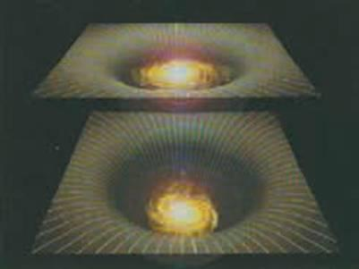    
    <figcaption>Chúng ta sống trên một màng hay chúng ta chỉ là một ảnh đa chiều?</figcaption>
</figure>

Chuyến du hành khám phá của chúng ta trong tương lai sẽ tiếp tục như thế nào? Chúng ta sẽ thành công trong việc truy lùng một lý thuyết thống nhất hoàn toàn điều khiển vũ trụ này và mọi thứ trong đó hay không? Thực ra, như đã mô tả trong chương 2, chúng ta có thể đã đồng nhất Lý thuyết về tất cả (Theory of Everything - ToE) là lý thuyết-M. Lý thuyết này không có một mô tả đơn nhất, ít nhất là với hiểu biết của chúng ta hiện nay. Thay vào đó, chúng ta đã tìm thấy một mạng lưới các lý thuyết khác hẳn nhau. Tất cả các lý thuyết đó dường như là các lý thuyết gần đúng theo các giới hạn khác nhau của cùng một lý thuyết cơ bản đằng sau đó giống như lý thuyết hấp dẫn của Newton là một lý thuyết gần đúng của lý thuyết tương đối tổng quát của Einstein trong giới hạn trường hấp dẫn yếu. Thuyết-M giống như một trò chơi ghép hình: việc nhận dạng và xếp các mẩu ở rìa của tấm hình là dễ nhất. Rìa của tấm hình tương đương với các giới hạn của thuyết-M trong đó một số các đại lượng có giá trị nhỏ. Bây giờ chúng ta đã có một khái niệm tương đối tốt về các rìa này nhưng vẫn có một khoảng trống ở tâm của tấm hình thuyết-M, ở đó, chúng ta không biết điều gì đang xảy ra (hình 7.1). Chúng ta không thể nói là chúng ta đã tìm ra Lý thuyết về tất cả cho đến khi chúng ta lấp đầy cái hố này.

<figure markdown="span">
    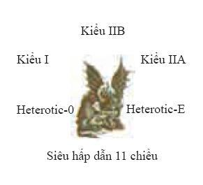\
    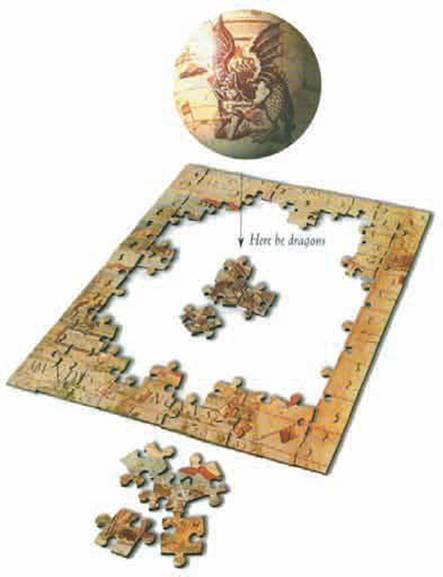
    <figcaption>(Hình 7.1) Thuyết-M giống như một tấm hình ghép. Ta có thể dễ dàng nhận ra và xếp các mẩu ở phần biên của nó nhưng chúng ta không biết nhiều về những gì xảy ra ở phần giữa, ở đó chúng ta không thể lấy gần đúng vì các đại lượng ở đó có giá trị rất nhỏ.</figcaption>
</figure>

Cái gì ở tâm của thuyết-M? Chúng ta sẽ tìm thấy một con rồng (hoặc một cái gì đó cũng kỳ lạ như thế) giống như trên các bản đồ cổ về các vùng đất chưa được khám phá? Kinh nghiệm của chúng ta trong quá khứ cho thấy có thể chúng ta tìm thấy các hiện tượng mới không như trông đợi khi chúng ta mở rộng tầm quan sát vào các nấc thang nhỏ hơn. Vào đầu thế kỷ hai mươi, chúng ta đã hiểu quá trình vận hành của tự nhiên trên nấc thang vật lý cổ điển, nó đúng đắn từ khoảng cách giữa các thiên cầu cho đến khoảng một phần trăm mili mét. Vật lý cổ điển giả thiết rằng vật chất là một môi trường liên tục với các tính chất như là độ dẻo và độ nhớt, nhưng các bằng chứng bắt đầu xuất hiện cho thấy rằng vật chất không liên tục mà gián đoạn: chúng được tạo thành từ những đơn vị nhỏ ly ti được gọi là nguyên tử. Từ nguyên tử bắt nguồn từ tiếng Hy Lạp và có nghĩa là không thể phân chia, nhưng ngay sau đó người ta thấy rằng các nguyên tử bao gồm các điện tử quay xung quanh hạt nhân được tạo thành từ proton và neutron (hình 7.2).

<figure markdown="span">
    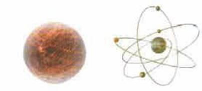    
    <figcaption>(Hình 7.2)</figcaption>
</figure>

- _Hình thứ nhất bên phải: Mô hình nguyên tử vô hình cổ điển_\
- _Hình thứ hai bên phải: Nguyên tử với các điện tử quay xung quanh hạt nhân được tạo thành từ các neutron và proton._

Nghiên cứu về vật lý nguyên tử trong ba mươi năm đầu của thế kỷ trước cho chúng ta hiểu biết đến độ dài một phần triệu mili mét. Sau đó chúng ta phát hiện ra rằng proton và neutron được tạo thành từ các hạt còn nhỏ hơn được gọi là quark (hình 7.3).

<figure markdown="span">
    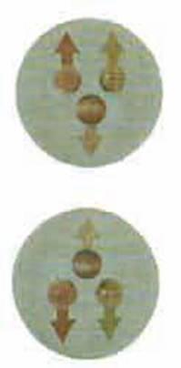    
    <figcaption>(Hình 7.3)</figcaption>
</figure>

- _Trên: Một proton gồm có hai quark thuận (mỗi một quark có điện tích bằng hai phần ba) và một quark nghịch (mỗi một quark có điện tích bằng âm một phần ba)._
- _Dưới: Một neutron gồm hai quark nghịch (mỗi một quark có điện tích bằng âm một phần ba) và một quark thuận (mỗi một quark có điện tích bằng hai phần ba)._

Các nghiên cứu gần đây của chúng ta về vật lý hạt nhân và vật lý năng lượng cao đã dẫn chúng ta tới các nấc thang còn nhỏ hơn một phần tỷ mili mét. Dường như chúng ta có thể tiếp tục mãi mãi, phát hiện ra các cấu trúc trên các nấc thang nhỏ hơn và nhỏ hơn. Tuy nhiên, có một giới hạn cho cái chuỗi này giống như có một giới hạn cho các con búp bê lồng trong nhau của người Nga (hình 7.4).

<figure markdown="span">
    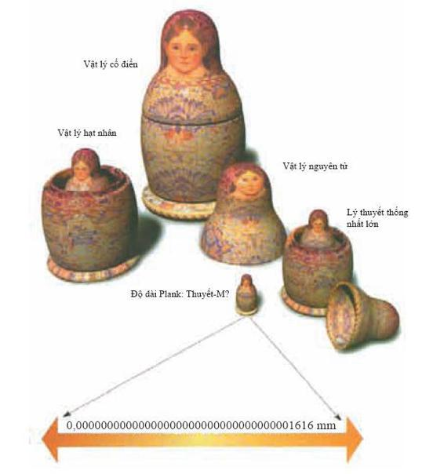    
    <figcaption>(Hình 7.4) Mỗi con búp bê đại diện cho một mô hình lý thuyết về tự nhiên cho đến một giới hạn nhất định. Mỗi một con lại gồm một con khác nhỏ hơn tương ứng với một lý thuyết mô tả tự nhiên tại các khoảng cách ngắn hơn. Nhưng trong vật lý, có một độ dài cơ bản nhỏ nhất, đó là độ dài Plank, tại các khoảng cách đó, tự nhiên có thể được biểu diễn bằng thuyết-M.</figcaption>
</figure>

Cuối cùng, khi ta cầm đến con búp bê nhỏ nhất, nó không được tạo thành từ con nào khác nữa. Trong vật lý, con búp bê nhỏ nhất đó được gọi là độ dài Plank. Việc dò đến các khoảng cách ngắn hơn đòi hỏi các hạt có năng lượng cao giống các hạt trong các hố đen. Chúng ta không biết chính xác độ dài Plank cơ bản trong thuyết-M, nhưng có thể nó chỉ bé bằng một mili mét được chia thành một trăm ngàn tỷ tỷ tỷ lần. Chúng ta sẽ không có ý định xây các máy gia tốc hạt có thể dò đến các độ dài nhỏ như thế. Chúng phải lớn hơn hệ mặt trời và chắc chắn là chúng không được thông qua trong bối cảnh tài chính hiện nay (hình 7.5).

<figure markdown="span">
    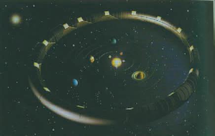    
    <figcaption>(Hình 7.5) Kích thước của một máy gia tốc để có thể thăm dò các khoảng cách nhỏ như độ dài Plank có thể lớn hơn đường kính của hệ mặt trời.</figcaption>
</figure>

Tuy nhiên, đã có một bước phát triển mới rất thú vị cho phép chúng ta có thể khám phá một cách dễ dàng hơn (và rẻ hơn) ít nhất một vài con rồng của thuyết-M. Như đã giải thích trong chương 2 và 3, trong mạng lưới các mô hình toán học của thuyết-M, không thời gian có mười hoặc mười một chiều. Cho đến gần đây người ta vần nghĩ là sáu hoặc bảy chiều bố sung bị cuộn lại rất nhỏ. Nó giống như sợi tóc của con người (hình 7.6).

<figure markdown="span">
    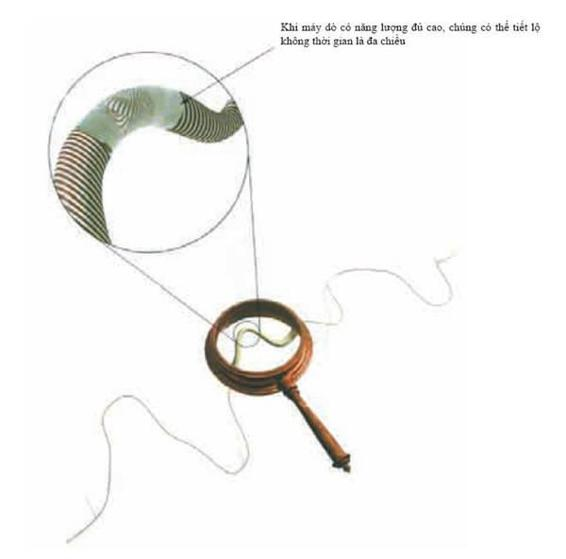    
    <figcaption>(Hình 7.6) Dưới mắt thường thì một sợi tóc giống như một đường với một chiều. Tương tự như thế, với chúng ta, không thời gian có vẻ như là bốn chiều nhưng chúng sẽ là mười hay mười một chiều khi dò bằng các hạt năng lượng rất cao.</figcaption>
</figure>

Nếu bạn nhìn vào một sợi tóc dưới một cái kính lúp, bạn có thể thấy nó có một độ dày, nhưng dưới mắt thường, nó giống như một đường chỉ có độ dài mà không có các chiều khác. Không thời gian có thể tương tự như thế: trên nấc thang kích thước con người, nguyên tử hoặc thậm chí hạt nhân, không thời gian giống như là có bốn chiều và gần như phẳng. Mặt khác nếu chúng ta dò tới các khoảng cách rất ngắn sử dụng các hạt năng lượng cực cao, chúng ta có thể thấy không thời gian là mười hoặc mười một chiều.

Nếu các chiều bổ sung này rất nhỏ thì rất khó có thể quan sát được chúng. Tuy vậy, gần đây có gợi ý rằng có một hoặc nhiều hơn một chiều có thể khá lớn hoặc thậm chí là vô hạn. Ý tưởng này là một lợi thế rất lớn (chí ít là đối với một người theo chủ nghĩa thực chứng như tôi) là nó có thể được kiểm nghiệm bằng thế hệ tiếp theo của các máy gia tốc hạt hoặc bằng các phép đo lực hấp dẫn tầm ngắn rất nhạy. Các phép đo như vậy có thể thỏa mãn cả lý thuyết hoặc là khẳng định bằng thực nghiệm sự tồn tại của các chiều khác.

Các chiều bố sung lớn là một bước phát triển mới thú vị trong nghiên cứu của chúng ta về mô hình hay lý thuyết cuối cùng. Các chiều đó ngụ ý rằng chúng ta đang sống trong một màng vũ trụ (brane world), một mặt phẳng hay một màng bốn chiều trong một không thời gian có số chiều nhiều hơn thế.

Vật chất và các lực phi hấp dẫn như là lực điện từ bị giới hạn trên màng này. Do đó, tất cả ngoại trừ hấp dẫn hành xử như là chúng ở trong bốn chiều. Đặc biệt là lực điện giữa hạt nhân của nguyên tử và điện tử quay xung quanh nó sẽ giảm nhanh theo khoảng cách với một tốc độ vừa phải để các nguyên tử ổn định không cho điện tử rơi vào hạt nhân (hình 7.7).

<figure markdown="span">
    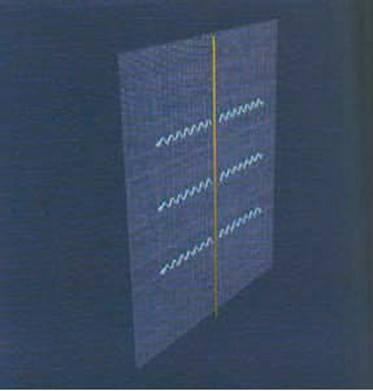    
    <figcaption>(Hình 7.7) THẾ GIỚI MÀNG</figcaption>
    <figcaption>Lực điện bị giới hạn trên màng và nó sẽ suy giảm với một tốc độ vừa phải để các điện tử có các quỹ đạo ổn định xung quanh hạt nhân của các nguyên tử.</figcaption>
</figure>

Điều này phù hợp với nguyên lý vị nhân là vũ trụ cần phải phù hợp cho sinh vật có trí tuệ: nếu nguyên tử không ổn định thì chúng ta không thể ở đây để quan sát vũ trụ và hỏi tại sao nó lại thể hiện bốn chiều.

Mặt khác, hấp dẫn trong hình dạng không thời gian cong sẽ thấm vào toàn bộ không thời gian với nhiều chiều hơn. Điều này có nghĩa là hấp dẫn sẽ hành xử khác hẳn với các lực khác mà chúng ta đã trải nghiệm: vì hấp dẫn có thể lan truyền theo các chiều bổ sung nên nó sẽ suy giảm theo khoảng cách nhanh hơn là ta trông đợi (hình 7.8).

<figure markdown="span">
    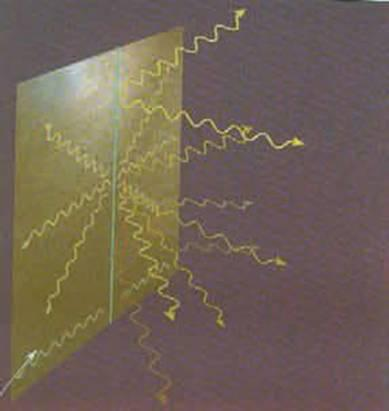    
    <figcaption>(Hình 7.8) Hấp dẫn trải rộng theo các chiều bổ sung và có tác động dọc trên màng và sẽ suy giảm theo khoảng cách nhanh hơn là sự suy giảm khi hấp dẫn ở trong không thời gian có bốn chiều.</figcaption>
</figure>

Nếu sự suy giảm nhanh của lực hấp dẫn mở rộng đến khoảng cách vũ trụ thì chúng ta sẽ thấy các hiệu ứng của nó trên quỹ đạo của các hành tinh. Thực ra các quỹ đạo đó sẽ không bền và như đã nhận xét ở chương 3: các hành tinh hoặc là sẽ rơi vào mặt trời hoặc là sẽ thoát vào khoảng không tối tăm lạnh lẽo giữa các vì sao (hình 7.9).

<figure markdown="span">
    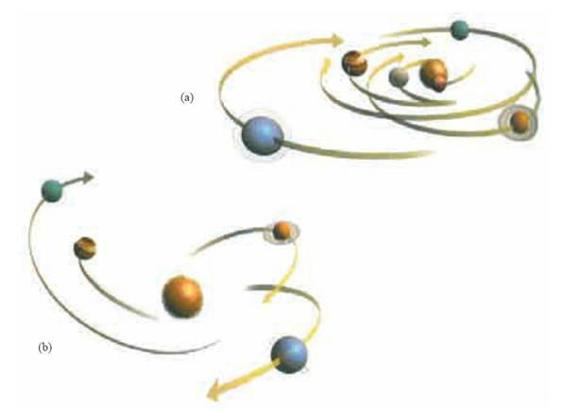    
    <figcaption>(Hình 7.9) Lực hấp dẫn suy giảm theo khoảng cách nhanh hơn thì quĩ đạo của các hành tinh sẽ bất ổn định. Các hành tinh hoặc là sẽ rơi vào mặt trời (a) hoặc là sẽ thoát khỏi sức hút của mặt trời (b).</figcaption>
</figure>

Tuy nhiên điều này sẽ không xảy ra nếu các chiều bổ sung kết thúc trên một màng khác không quá xa màng mà chúng ta đang sống. Thế thì với các khoảng cách lớn hơn khoảng cách giữa các màng thì hấp dẫn không thể lan truyền một cách tự do mà thực sự bị giới hạn vào mặt phẳng đó giống như lực điện và suy giảm với một tốc độ vừa phải để các hành tinh quay quanh mặt trời (hình 7.10).

<figure markdown="span">
    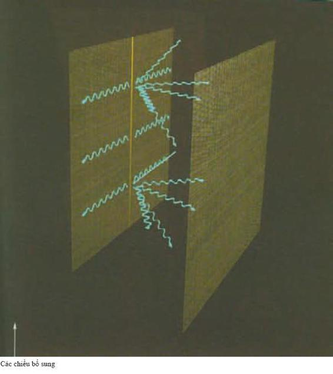
    <figcaption>(Hình 7.10) Một màng thứ hai gần thế giới màng sẽ làm cho lực hấp dẫn không lan xa theo các chiều bổ sung, điều đó có nghĩa là tại các khoảng cách lớn hơn khoảng các màng, lực hấp dẫn sẽ suy giảm với một tốc độ mà ta mong đợi cho trường hợp bốn chiều.</figcaption>
</figure>

Mặt khác, đối với các khoảng cách nhỏ hơn khoảng cách giữa các màng, hấp dẫn suy giảm nhanh hơn rất nhiều. Lực hấp dẫn rất nhỏ giữa các vật nặng đã được đo một cách chính xác trong phòng thí nghiệm nhưng cho đến nay các thực nghiệm vẫn chưa quan sát được các hiệu ứng của các màng phân cách nhau một khoảng nhỏ hơn một vài mili mét (hình 7.11).

<figure markdown="span">
    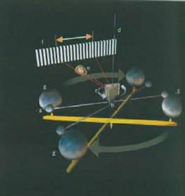    
    <figcaption>(Hình 7.11) THÍ NGHIỆM CAVENDISH</figcaption>
</figure>

- _Một chùm laser (e) xác định bất kỳ sự xoắn của cánh tay đòn (b) vì nó được chiếu lên màn hình đo (f). Hai quả cầu chì nhỏ (a) gắn vào hai bên cánh tay đòn (b). Trên cánh tay đòn có một cái gương nhỏ (c) và cánh tay đòn được treo tự do bằng một sợi dây xoắn (d)._
- _Hai quả cầu chì lớn (g) gắn với nhau bằng một thanh cân bằng có thể quay được và chúng được đặt gần hai quả cầu chì nhỏ. Khi hai quả cầu chì lớn quay tới vị trí đối diện thì cánh tay đòn (b) sẽ thiết lập một vị trí mới._

Trong các màng vũ trụ này, chúng ta đang sống trên một màng nhưng có lẽ là có một màng “bóng” (shadow) khác gần màng của chúng ta. Vì ánh sáng bị giới hạn trên các màng và không thể lan truyền xuyên qua khoảng cách giữa chúng nên chúng ta không thể nhìn thấy vũ trụ bóng đó. Nhưng chúng ta có thể cảm thấy ảnh hưởng hấp dẫn của vật chất lên màng bóng. Trong màng của chúng ta, ta thấy các lực hấp dẫn như thế được tạo ra bởi các nguồn thực sự “tối” mà chỉ có một cách duy nhất biết được nó là thông qua hấp dẫn của chúng (hình 7.12). Thực ra để giải thích tốc độ quay của các vì sao xung quanh tâm của dải ngân hà thì xem ra cần phải có một lượng vật chất nhiều hơn vật chất mà chúng ta quan sát thấy.

<figure markdown="span">
    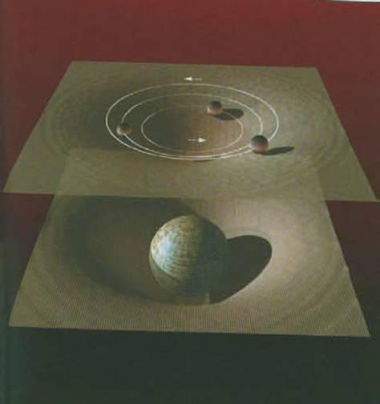    
    <figcaption>(Hình 7.12) Trong kịch bản thế giới màng, các hành tinh có thể quay xung quanh một khối lượng tối trên màng bóng vì lực hấp dẫn lan theo các chiều bổ sung.</figcaption>
</figure>

Khối lượng thiếu hụt có thể là do có một số loại hạt kỳ lạ trong thế giới của chúng ta như là các hạt nặng tương tác yếu (weakly interacting massive particles - WIMP) hoặc là các hạt axion (một loại hạt cơ bản rất nhẹ). Nhưng khối lượng thiếu hụt này có thể là bằng chứng về sự tồn tại của vũ trụ bóng với vật chất trong đó. Có thể trong vũ trụ đó có loài người cạn nghĩ băn khoăn về khối lượng dường như bị thiếu hụt trong vũ trụ của họ để giải thích quỹ đạo của các ngôi sao bóng xung quanh tâm của thiên hà bóng (hình 7.13).

<figure markdown="span">
    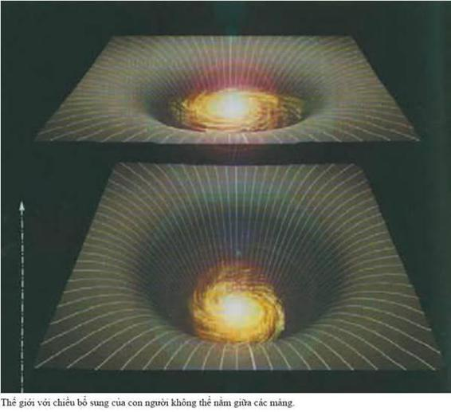    
    <figcaption>(Hình 7.13) Có thể chúng ta không nhìn thấy thiên hà bóng trên một màng bóng vì ánh sáng không thể truyền theo các chiều bổ sung. Nhưng lực hấp dẫn thì có thể lan theo các chiều đó, do đó, quá trình quay của thiên hà chúng ta có thể bị ảnh hưởng bởi vật chất tối mà ta không nhìn thấy được.</figcaption>
</figure>

<figure markdown="span">
    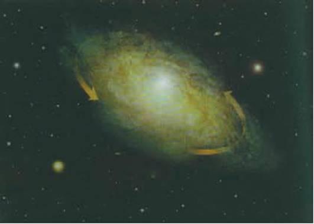    
    <figcaption>THIÊN HÀ XOÁY ỐC NGC 3198</figcaption>
</figure>

<figure markdown="span">
    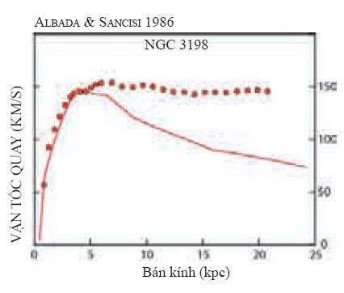    
    <figcaption>BẰNG CHỨNG VỀ VẬT CHẤT TỐI</figcaption>
</figure>

_Rất nhiều các quan sát vũ trụ khác nhau gợi ý rằng, trong thiên hà của chúng ta và trong các thiên hà khác, vật chất nhiều hơn chúng ta nhìn thấy rất nhiều. Quan sát thuyết phục nhất là các ngôi sao ở ngoài rìa các thiên hà xoáy ốc như Ngân hà của chúng ta quay quá nhanh, nếu chỉ những ngôi sao mà chúng ta nhìn thấy thì không thể giữ chúng trên các quĩ đạo được (xem hình trên)._

_Từ những năm 1970, chúng ta đã thấy có một sự chênh lệch giữa vận tốc quay của các ngôi sao ở vùng rìa của các thiên hà hình xoáy ốc (biểu diễn bằng các đường chấm trên giản đồ) và vận tốc quay theo các định luật chuyển động của Newton với sự phân bố của các ngôi sao khả kiến trong thiên hà (đường cong liền nét trên giản đồ). Sự chênh lệch này cho thấy cần phải có nhiều vật chất hơn ở các vùng biên của các thiên hà xoáy ốc._

<figure markdown="span">
    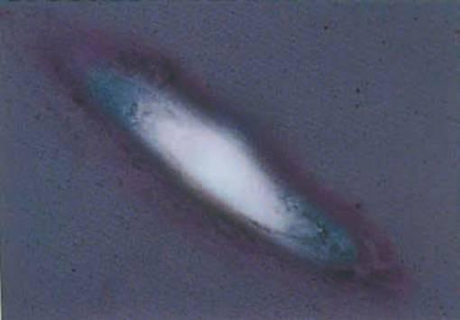    
    <figcaption>BẢN CHẤT CỦA VẬT CHẤT TỐI</figcaption>
</figure>

_Ngày nay, các nhà vũ trụ học tin rằng phần tâm của các thiên hà xoáy ốc chủ yếu gồm vật chất thường, nhưng ở phần biên của chúng lại chủ yếu gồm vật chất tối mà chúng ta không thể nhìn chúng một cách trực tiếp. Nhưng một trong những vấn đề quan trọng nhất là tìm ra bản chất của vật chất tối thống trị vùng biên của các thiên hà. Trước những năm 1980, người ta cho rằng vật chất tối này cũng là vật chất thường tạo thành từ proton, neutron và điện tử nhưng ở dạng không thể quan sát được: có thể là các đám mây khí, hoặc các vật thể cô đặc nặng không phát sáng MACHO (massive compact halo object) như là các sao lùn trắng, sao neutron, hoặc thậm chí là các hố đen._

_Tuy nhiên, các nghiên cứu gần đây về sự hình thành các thiên hà đã làm cho các nhà vũ trụ học tin rằng một phần đáng kể của vật chất tối cần phải ở dạng khác vật chất thường. Có thể xuất hiện từ khối lượng của các hạt rất nhẹ như là các hạt axion hoặc neutrino. Chúng còn có thể gồm các thực thể kỳ lạ hơn như là các hạt nặng tương tác yếu WIMP (weakly interacting massive particle) - tiên đoán từ các lý thuyết hạt cơ bản hiện đại, nhưng ta vẫn chưa thu được từ thực nghiệm._

Thay cho việc các chiều bổ sung kết thúc trên một màng thứ hai, một khả năng khác là các chiều đó là vô hạn nhưng bị uốn rất cong như một cái yên ngựa (hình 7.14). Lisa Randall và Raman Sundrum chứng minh rằng kiểu độ cong thế này sẽ hoạt động khá giống một màng thứ hai: ảnh hưởng hấp dẫn của một vật thể trên màng bị giới hạn trong một lân cận nhỏ của màng và không lan truyền đến vô tận theo các chiều bổ sung. Trong mô hình màng bóng, trường hấp dẫn suy giảm theo khoảng khá cách lớn để giải thích quỹ đạo của các hành tinh và các thí nghiệm lực hấp dẫn trong phòng thí nghiệm, nhưng lực hấp dẫn lại thay đổi nhanh hơn tại các khoảng cách ngắn.

<figure markdown="span">
    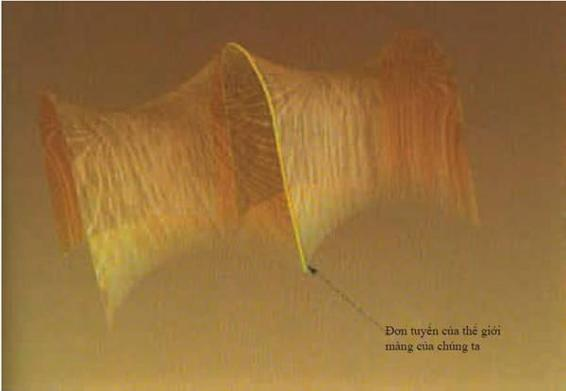    
    <figcaption>(Hình 7.14) Trong mô hình Randall-Sundrum, chỉ có một màng (thể hiện trong hình chỉ với một chiều). Các chiều bổ sung mở rộng đến vô hạn nhưng chúng bị uốn cong như một chiếc yên ngựa. Độ cong này làm cho trường hấp dẫn của vật chất trên màng không lan xa theo các chiều bổ sung.</figcaption>
</figure>

Tuy nhiên, có một sự khác biệt quan trọng giữa mô hình `Randall-Sundrum` và mô hình màng bóng. Các vật thể chuyển động dưới ảnh hưởng của lực hấp dẫn sẽ tạo ra một sóng hấp dẫn, những gợn sóng của độ cong lan truyền trong không thời gian với tốc độ ánh sáng. Giống như sóng điện từ ánh sáng, sóng hấp dẫn cũng mang năng lượng, một tiên đoán đã được khẳng định bằng các quan sát từ chòm pulsar đôi `PRS1913+16`.

<figure markdown="span">
    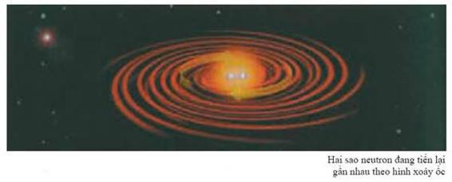\
    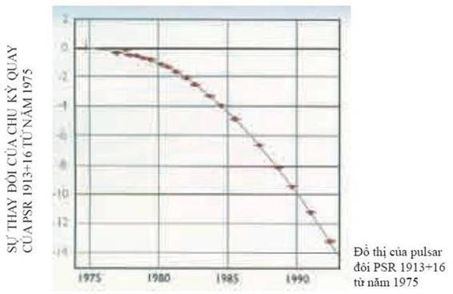    
    <figcaption>CHÙM SAO PULSAR ĐÔI</figcaption>
</figure>

_Thuyết tương đối rộng tiên đoán rằng các vật thể nặng chuyển động dưới ảnh hưởng của trường hấp dẫn sẽ phát ra các sóng hấp dẫn. Giống như sóng ánh sáng, các sóng hấp dẫn cũng mang năng lượng khỏi vật thể phát ra chúng. Nhưng tốc độ mất năng lượng rất yếu và rất khó quan sát. Ví dụ, việc phát ra sóng hấp dẫn sẽ làm cho trái đất dần dần rơi vào mặt trời theo hình xoáy ốc, nhưng quá trình đó phải mất đến 1027 năm._

_Nhưng vào năm 1975, Russell Hulse và Joseph Taylor đã phát hiện ra chùm sao pulsar đôi PSR1913+16. Đây là một hệ gồm hai ngôi sao neutron quay xung quanh nhau với khoảng cách giữa chúng chỉ bằng đường kính của mặt trời. Theo thuyết tương đối rộng, chuyển động nhanh có nghĩa là chu kỳ quay của hệ này sẽ giảm nhanh hơn rất nhiều vì phải phát ra sóng hấp dẫn rất mạnh. Sự thay đổi tiên đoán từ thuyết tương đối rộng phù hợp tuyệt vời với các quan sát rất cẩn thận của Hulse và Taylor về các thông số chuyển động. Các thông số này cho thấy từ năm 1975 chu kỳ quay đã giảm đi 10 giây. Năm 1993, họ đạt giải Nobel vật lý về việc khẳng định thuyết tương đối._

Nếu thực sự chúng ta đang sống trên một màng trong một không gian có các chiều bổ sung thì các sóng hấp dẫn được tạo bởi các vật thể chuyển động trên màng sẽ truyền sang các chiều khác. Nếu có một màng bóng thứ hai thì các sóng hấp dẫn có thể bị phản xạ trở lại và bị bẫy giữa hai màng. Mặt khác nếu chỉ có một màng đơn nhất và các chiều bổ sung trải dài mãi mãi như trong mô hình Randall-Sundrum thì sóng hấp dẫn có thể cùng thoát đi và mang năng lượng đi khỏi màng vũ trụ của chúng ta (hình 7.15).

<figure markdown="span">
    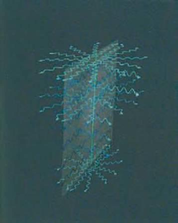    
    <figcaption>(Hình 7.15) Trong mô hình Randall-Sundrum, các sóng hấp dẫn bước sóng ngắn có thể mang năng lượng ra khỏi nguồn phát nằm ở trên màng làm cho định luật bảo toàn năng lượng bị vi phạm.</figcaption>
</figure>

Điều này có vẻ vi phạm một trong những nguyên lý căn bản của vật lý: định luật bảo toàn năng lượng. Tổng năng lượng luôn luôn không đổi. Tuy nhiên sự vi phạm đó chỉ xuất hiện vì tầm nhìn của chúng ta về cái đang xảy ra bị giới hạn vào màng. Một thiên thần có thể nhìn thấy các chiều bổ sung và có thể biết năng lượng vẫn không đổi mà chỉ lan truyền đi ra xa mà thôi. Các sóng hấp dẫn tạo bởi hai ngôi sao quay quanh nhau có bước sóng dài hơn rất nhiều đường kính của độ cong hình yên ngựa trong các chiều bổ sung. Điều này có nghĩa là các sóng hấp dẫn có chiều hướng bị giam trong một lân cận nhỏ của màng - giống lực hấp dẫn - và không thể lan truyền ra xa vào các chiều bổ sung hoặc không thể mang năng lượng ra khỏi màng. Mặt khác, các sóng hấp dẫn có bước sóng ngắn hơn độ lớn mà các chiều bổ sung bị cuộn lại sẽ dễ dàng thoát ra khỏi lân cận của màng.

Nguồn duy nhất có thể phát ra một lượng đáng kể các sóng hấp dẫn có bước sóng ngắn có thể là các hố đen. Một hố đen trên màng sẽ kéo dài đến một hố đen theo các chiều khác. Nếu hố đen đó nhỏ thì nó gần như có hình tròn; tức là nó vươn tới những khoảng cách trong các chiều bổ sung bằng kích thước của nó trên màng. Mặt khác, một hố đen lớn trên màng sẽ kéo dài thành một chiếc “bánh dẹt”, tức là nó bị giới hạn trong một lân cận của màng và chiều dày (theo các chiều bổ sung) nhỏ hơn rất nhiều so với chiều rộng (trên màng). (hình 7.16)

<figure markdown="span">
    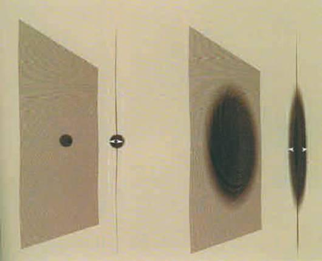    
    <figcaption>(Hình 7.16) Một hố đen trong vũ trụ của chúng ta nằm trên màng sẽ mở rộng theo các chiều bổ sung. Nếu hố đen nhỏ thì nó gần như có dạng hình tròn, nhưng hố đen lớn hơn trên màng sẽ nở ra thành một hố đen có hình chiếc bánh trong các chiều bổ sung.</figcaption>
</figure>

Như đã giải thích trong chương 4, thuyết lượng tử nói rằng các hố đen không phải là hoàn toàn đen: chúng sẽ phát ra tất cả các loại hạt và bức xạ giống như các vật nóng. Các hạt các ánh sáng kiểu bức xạ (radiation-like light) sẽ được phát ra dọc theo màng vì vật chất và các lực phi hấp dẫn như là lực điện từ sẽ bị giới hạn trong màng. Tuy nhiên, các hố đen còn phát ra sóng hấp dẫn. Các sóng này không bị giới hạn trong màng mà còn có thể lan truyền theo các chiều bổ sung nữa. Nếu hố đen mà lớn và có dạng chiếc bánh dẹt, các sóng hấp dẫn sẽ ở gần màng. Điều này có nghĩa là các hố đen sẽ mất năng lượng (và do đó mất cả khối lượng do phương trình $E={mc}^{2}$) với một tốc độ cần thiết trong không thời gian bốn chiều. Vậy nên các hố đen sẽ bay hơi chậm chạp và giảm kích thước cho đến khi nhỏ hơn bán kính của độ cong của các chiều bổ sung hình yên ngựa. Tại thời điểm này các sóng hấp dẫn thoát ra từ hố đen đó bắt đầu tự do thoát vào các chiều bổ sung. Đối với một người trên màng thì các hố đen hay là các ngôi sao tối như Michell đã gọi (xem chương 4) sẽ phát ra các bức xạ tối, các bức xạ này không thể quan sát trực tiếp từ màng nhưng sự tồn tại của nó có thể được suy ra từ việc các hố đen mất đi khối lượng.

Điều đó có nghĩa là sự bùng phát bức xạ cuối cùng từ các hố đen đang bay hơi sẽ kém mạnh mẽ. Điều này có thể giải thích tại sao chúng ta không quan sát thấy các đợt bùng phát của các tia gamma mà có thể mô tả các hố đen đang chết mặc dù các một lời giải thích khác dễ hiểu hơn là không có nhiều các hố đen với khối lượng đủ thấp để bay hơi hết trong một thời gian bằng tuổi của vũ trụ cho đến giờ.

Bức xạ từ các hố đen trên màng vũ trụ xuất phát từ các thăng giáng lượng tử của các hạt nằm trên và không phải nằm trên một màng mà nhiều màng, giống như tất cả các thứ khác trong vũ trụ đều phải chịu các thăng giáng lượng tử. Điều này có thể làm cho các màng xuất hiện và biến mất một cách tự phát. Sự hình thành lượng tử của các màng hơi giống sự hình thành các bọt khí trong nước sôi. Nước dạng lỏng bao gồm hàng tỷ tỷ phân tử $H_{2}O$ bị gói lại với nhau bằng các tương tác giữa các phân tử gần nhau nhất. Khi nước bị đun nóng, các phân tử chuyển động nhanh hơn và bị đâm vào nhau. Thường thì các va chạm này làm cho các phân tử có vận tốc cao đến mức một nhóm các phân tử có thể thoát khỏi lực liên kết giữa chúng và hình thành các bọt khí trong nước. Các bọt này sẽ to lên hay nhỏ đi một cách ngẫu nhiên khi có thêm các phân tử chất lỏng tham gia vào bọt khí hoặc ngược lại. Phần lớn các bọt khí nhỏ sẽ bị phá vỡ vào chất lỏng nhưng một số bọt khí phát triển tới một kích thước tới hạn nhất định mà nếu lớn hơn nó thì bọt khí sẽ tiếp tục lớn lên. Đó chính là các bọt khí mà ta thấy trong nước đang sôi (hình 7.17).

<figure markdown="span">
    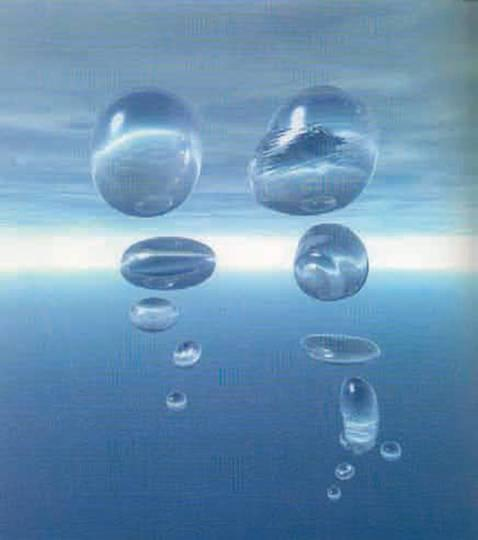    
    <figcaption>(Hình 7.17) Sự hình thành thế giới màng có thể giống như sự hình thành các bọt khí trong nước sôi.</figcaption>
</figure>

Các màng vũ trụ cũng tương tự như vậy. Nguyên lý bất định cho phép các màng vũ trụ xuất hiện từ chân không giống như các bọt khí, bề mặt của bọt khí tương tự như màng và trong lòng bọt khí tương tự như các chiều bậc cao hơn. Các màng rất nhỏ có xu hướng bị biến mất, nhưng một màng mà nhờ các thăng giáng lượng tử phát triển lớn hơn một kích thước tới hạn nhất định sẽ tiếp tục phát triển. Những người giống như chúng ta sống ở trên màng - trên bề mặt của bọt khí, sẽ nghĩ rằng vũ trụ đang giãn nở. Nó giống như việc vẽ các thiên hà lên bề mặt một quả bóng và thổi nó lên. Các thiên hà sẽ chuyển động ra xa nhau nhưng không một thiên hà nào được chọn là trung tâm của sự giãn nở. Chúng ta hy vọng rằng sẽ không có ai dùng một cái kim vũ trụ để chọc vào bọt khí đó!

<figure markdown="span">
    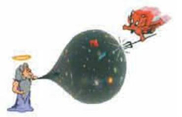    
    <figcaption></figcaption>
</figure>

Theo giả thuyết không biên như đã mô tả trong chương 3, thì sự hình thành tự phát của màng vũ trụ có một lịch sử trong thời gian ảo giống như một vỏ hạt: tức là nó là một hình cầu bốn chiều, giống bề mặt trái đất nhưng có thêm hai chiều nữa. Sự khác nhau quan trọng đó là vỏ hạt được mô tả trong chương 3, về cơ bản là trống rỗng: hình cầu bốn chiều không là bề mặt của cái gì khác cả và sáu hoặc bảy chiều của không thời gian bổ sung mà thuyết-M tiên đoán bị cuộn lại còn nhỏ hơn cái vỏ hạt. Tuy vậy, trên bức tranh về màng vũ trụ mới thì cái vỏ hạt lại bị lấp đầy: lịch sử trong thời gian ảo của màng mà trên đó chúng ta sống sẽ là một hình cầu bốn chiều, hình cầu bốn chiều này là biên của bọt khí năm chiều với năm hoặc sáu chiều còn lại bị cuộn lại rất nhỏ (hình 7.18).

<figure markdown="span">
    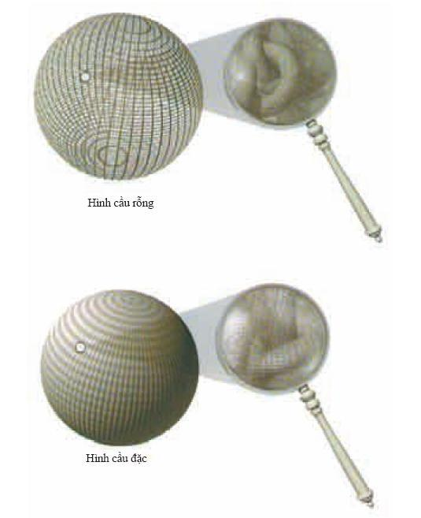    
    <figcaption>(Hình 7.18) Bức tranh thế giới màng của nguồn gốc vũ trụ khác với bức tranh trong chương 3, bởi vì, hình cầu hay vỏ hạt bốn chiều hơi bị dẹt không còn trống rỗng nữa mà bị lấp đầy bởi một chiều thứ năm.</figcaption>
</figure>

Lịch sử của màng trong thời gian ảo sẽ xác định lịch sử của nó trong thời gian thực. Trong thời gian thực, màng giãn nở theo cách lạm phát tăng dần như mô tả trong chương 3. Một vỏ hạt trơn và tròn hoàn hảo sẽ là lịch sử khả dĩ nhất của bọt khí trong thời gian ảo. Tuy nhiên, nó tương ứng với một màng giản nở mãi mãi theo cách lạm phát trong thời gian thực. Các thiên hà sẽ không được hình thành trên các màng như thế và do đó các cuộc sống trí tuệ cũng không thể phát triển. Mặt khác, các lịch sử trong thời gian ảo không trơn và tròn một cách hoàn hảo có xác xuất thấp hơn nhưng lại tương ứng với các tính chất trong thời gian thực mà trong đó, ban đầu màng có các giai đoạn giãn nở lạm phát tăng dần nhưng sau đó chậm dần. Trong quá trình chậm dần này, các thiên hà giãn nở có thể được hình thành và các sinh vật có trí tuệ phát triển. Do đó, theo nguyên lý vị nhân mô tả trong chương 3, chỉ có các vỏ hạt hơi sần sùi mới được các sinh vật có trí tuệ - đang băn khoăn về nguồn gốc của vũ trụ tại sao lại không trơn tru hoàn hảo - nhìn thấy mà thôi.

Vì màng đang giãn nở nên thể tích của không gian của các chiều cao hơn bên trong tăng lên. Thậm chí có thể có một bọt khí khổng lồ bên cạnh màng mà chúng ta đang sống. Nhưng có thật chúng ta đang sống trên một màng hay không? Dựa trên ý tưởng về ảnh đa chiều mô tả trong chương 2, thông tin về những sự kiện đang xảy ra trong một vùng không thời gian có thể được mã hóa trên biên của nó. Do đó, chúng ta có thể nghĩ rằng chúng ta đang sống trên một thế giới bốn chiều vì chúng ta là cái bóng in lên màng nhờ những sự kiện đang xảy ra trong lòng một bọt khí. Tuy nhiên, trên quan điểm thực chứng, ta không thể hỏi: thực tại là gì, là màng hay bọt khí? Cả hai khái niệm đó chỉ là các mô hình toán học mô tả những điều mà chúng ta quan sát. Chúng ta hoàn toàn tự do sử dụng mô hình tiện lợi nhất. Cái gì bên ngoài màng? Có một vài khả năng có thể xảy ra: (hình 7.19)

1. Có thể chẳng có gì bên ngoài cả. Mặc dù bọt khí có nước xung quanh, nhưng đó chỉ là một sự mường tượng giúp chúng ta hình dung về nguồn gốc của vũ trụ. Ta có thể tưởng tượng một mô hình toán học chỉ có một cái màng và một khoảng không gian nhiều chiều hơn bên trong nhưng hoàn toàn không có gì bên ngoài nó cả, ngay cả chân không. Ta có thể tính được những điều mà mô hình toán học đó tiên đoán mà không cần phải ám chỉ đến những thứ bên ngoài.
2. Ta cũng có thể có một mô hình toán học mà bên ngoài của bọt khí có rất nhiều bọt khí tương tự. Mô hình này thực sự tương đương về mặt toán học với khả năng về chẳng có gì ngoài bọt khí được thảo luận trong phần trên nhưng có một sự khác nhau về tâm lý: con người cảm thấy hạnh phúc hơn khi thấy mình là trung tâm của không thời gian hơn là ở trên rìa của nó; nhưng đối với một nhà thực chứng thì khả năng 1 và 2 là tương đương.
3. Bọt khí có thể giản nở vào không gian, mà không gian này không phải là một hình ảnh thứ yếu của các sự kiện bên trong bọt khí. Khả năng này khác hai khả năng trên và nó giống trường hợp nước sôi hơn. Các bọt khác có thể được hình thành và giãn nở. Nếu chúng va chạm và kết hợp với bọt khí mà chúng ta đang sống thì kết quả rất thê thảm. Có giả thuyết nói rằng bản thân vụ nổ lớn có thể được tạo ra khi các màng va chạm với nhau.

<figure markdown="span">
    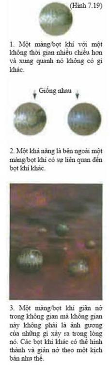\
    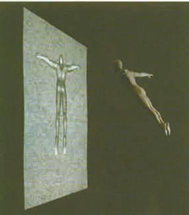
    <figcaption>ẢNH ĐA CHIỀU</figcaption>
</figure>

_Ảnh đa chiều giải mã thông tin trong một vùng không gian lên một bề mặt mà bề mặt này có ít hơn vùng không gian đó một chiều. Đây dường như là một tính chất của lực hấp dẫn vì diện tích của chân trời sự kiện đo số các trạng thái nội của hố đen. Trong mô hình thế giới màng, ảnh đa chiều có thể là một sự tương ứng một-một giữa các trạng thái trong một thế giới bốn chiều và các trạng thái trong một thế giới có nhiều chiều hơn. Trên quan điểm thực chứng, ta không phân biệt được mô hình nào cơ bản hơn._

Mô hình màng vũ trụ như thế đang là các điểm nóng trong nghiên cứu. Chúng mang tính tư biện rất cao nhưng chúng lại đòi hỏi các loại tính chất mới cần được kiểm tra bằng thực nghiệm. Chúng có thể giải thích tại sao hấp dẫn có vẻ yếu đến thế. Hấp dẫn có thể khá mạnh trong lý thuyết cơ bản nhưng sự lan truyền của lực hấp dẫn ra các chiều bổ sung, có nghĩa là nó sẽ yếu tại các khoảng cách lớn trên màng mà chúng ta đang sống.

<figure markdown="span">
    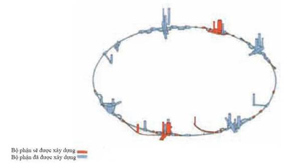    
    <figcaption>(Hình 7.20) Sơ đồ đường ống LEP cho thấy hạ tầng đang có và cấu trúc tương lai của Máy va chạm lớn ở Geneva, Thụy Sỹ.</figcaption>
</figure>

Một hệ quả của điều này chính là độ dài Plank, khoảng cách nhỏ nhất mà chúng ta có thể dò được mà không cần tạo ra một hố đen, lớn hơn khá nhiều giá trị mà nó cần có từ độ yếu của hấp dẫn trong màng bốn chiều của chúng ta. Con búp bê Nga nhỏ nhất này rốt cuộc sẽ không quá nhỏ và có thể nằm trong tầm với của các máy gia tốc hạt trong tương lai. Trên thực tế, chúng ta đã phát hiện ra con búp bê nhỏ nhất rồi, độ dài Plank cơ bản, nếu Hoa Kỳ không chịu một đợt suy thoái năm 1994 và hủy bỏ SSC (máy siêu va chạm siêu dẫn - Superconducting Super Collider) mặc dù nó đã được xây một nửa rồi. Các máy gia tốc hạt khác như là LHC (máy va chạm hadron lớn - Large Hadron Collider) tại Geneva đang được xây dựng (hình 7.20). Với các máy này cùng với các quan sát khác như là bức xạ phông vi sóng, chúng ta có thể xác định là chúng ta đang sống trên một cái màng hay không. Nếu đúng là chúng ta đang sống trên một màng thì có lẽ nguyên lý vị nhân đã chọn các mô hình màng từ một vườn bách thú gồm vô vàn các vũ trụ có thể xảy ra trong thuyết-M. Chúng ta có thể diễn tả cho Miranda trong vở _The Tempest_ của Shakespeare:

!!! note "Note"
    - __“O Brane new world, That has such creatures in’t.”__
    - _“Ôi một màng vũ trụ mới Sao có nhiều sinh vật như thế đến vậy”_

    _(Nguyên văn tác giả nhại lại câu nói của Miranda)_

    - __“O brave new world That has such people in’t.”__
    - _“Ôi một thế giới mới dũng cảm Sao có nhiều người như thế đến vậy.”_

<figure markdown="span">
    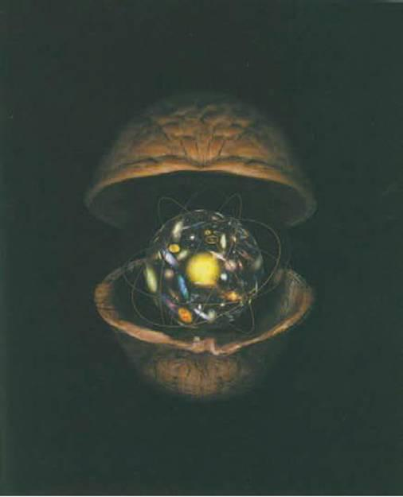    
    <figcaption>Đó chính là vũ trụ trong một vỏ hạt.</figcaption>
</figure>